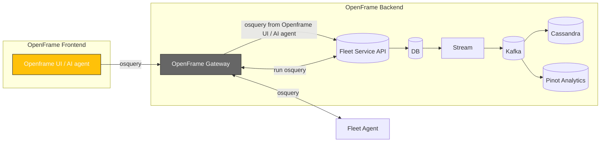

<div align="center">
  <picture>
    <!-- Dark theme -->
    <source media="(prefers-color-scheme: dark)" srcset="https://github.com/flamingo-stack/openframe-oss-tenant/blob/d82f21ba18735dac29eb0f3be5d3edf661bb0060/docs/assets/logo-openframe-full-dark-bg.png">
    <!-- Light theme -->
    <source media="(prefers-color-scheme: light)" srcset="https://github.com/flamingo-stack/openframe-oss-tenant/blob/d82f21ba18735dac29eb0f3be5d3edf661bb0060/docs/assets/logo-openframe-full-light-bg.png">
    <!-- Default / fallback -->
    
  </picture>

  <h1>Osquery</h1>

  <p><b>Cross-platform endpoint visibility and telemetry engine, integrated with OpenFrame — SQL-powered queries for Windows, macOS, and Linux.</b></p>

  <p>
    <a href="LICENSE.md">
      
    </a>
    <a href="https://www.flamingo.run/knowledge-base">
      
    </a>
    <a href="https://www.openmsp.ai/">
      
    </a>
  </p>
</div>

---

## Quick Links
- [Overview](#overview)  
- [Quick Start](#quick-start)  
- [Architecture](#architecture)  
- [Security](#security)  
- [Contributing](#contributing)

---

## Overview

**Osquery** is an open-source endpoint visibility and monitoring tool created by Facebook (Meta). It allows you to query operating system information using SQL queries, making it powerful for security monitoring, incident response, compliance, and infrastructure inventory.

With Osquery, you can:
- Query system details like processes, users, network connections, file systems, and registry keys
- Monitor system changes in real-time
- Detect security threats and anomalies
- Ensure compliance with security policies
- Perform forensic investigations

In OpenFrame, Osquery is integrated with the **Fleet agent**, providing centralized management and query execution across all your endpoints from a single interface.

**Official Documentation:** [osquery.io/docs](https://osquery.io/docs)  
**GitHub Repository:** [github.com/osquery/osquery](https://github.com/osquery/osquery)

---

## Highlights

- Unified endpoint visibility across Windows, macOS, Linux  
- Query the system state using SQL (processes, users, network, registry, etc.)  
- Lightweight daemon with minimal performance overhead  
- Extensible with custom tables and plugins  
- Integrates with OpenFrame Gateway, Stream (Kafka), and Analytics (Pinot)  
- Useful for inventory, compliance, incident response, and threat hunting  
- **Automatic installation** with Fleet agent - no separate setup required

---

## Architecture

Osquery runs as an agent on endpoints, collecting data and exposing it via SQL. Integrated with OpenFrame, results flow into Gateway → Stream → Analytics.



---

## Quick Start

### Prerequisites

**No additional installation required!** Osquery is automatically installed and configured when you deploy the Fleet agent on your endpoints.

Requirements:
- OpenFrame instance running with Fleet service enabled
- Access to OpenFrame UI
- Supported operating system on target endpoints:
  - **Linux:** Ubuntu, Debian, CentOS, RHEL, Amazon Linux
  - **macOS:** 10.14+ (Mojave and later)
  - **Windows:** Windows 10, Windows Server 2016+

### Installation

1. **Log in to OpenFrame UI**

2. **Navigate to the Devices tab**
   - Click on **"Devices"** in the left sidebar
   - Click **"Add Device"** or **"Enroll New Device"** button

3. **Get the installation link**
   - OpenFrame will generate a unique enrollment link/script for your device
   - This link contains:
     - Fleet agent installer
     - Osquery binaries (automatically bundled)
     - Your OpenFrame server configuration
     - Enrollment secrets for secure authentication

4. **Run the installation on your endpoint**
   
   **For Linux/macOS:**
   ```bash
   # The UI will provide a command similar to:
   curl -sSL https://your-openframe-instance.com/api/v1/fleet/enroll?token=xxx | sudo bash
   ```

   **For Windows (PowerShell as Administrator):**
   ```powershell
   # The UI will provide a command similar to:
   Invoke-WebRequest -Uri "https://your-openframe-instance.com/api/v1/fleet/enroll?token=xxx" -UseBasicParsing | Invoke-Expression
   ```

5. **Verify installation**
   - Return to the **Devices** tab in OpenFrame UI
   - Your newly enrolled device should appear within 30-60 seconds
   - Status should show as **"Online"**
   - Osquery will be ready to accept queries immediately

### Running Your First Query

Once your device is enrolled:

1. **Navigate to your device** in the OpenFrame UI
2. **Go to the "Query" tab** or use the **AI Agent** interface
3. **Try a simple query:**
   ```sql
   SELECT * FROM system_info;
   ```
4. **View real-time results** directly in the UI

For more query examples and table schemas, visit the [Osquery Schema Documentation](https://osquery.io/schema/).

---

## Security

- TLS 1.2 enforced for all communication  
- JWT / enrollment secrets via OpenFrame Gateway  
- Minimal privileges required on endpoints

Found a vulnerability? Email **security@flamingo.run** instead of opening a public issue.  

---

## Contributing

We welcome PRs! Please follow these guidelines:  
- Use branching strategy: `feature/...`, `bugfix/...`  
- Add descriptions to the **CHANGELOG**  
- Run `make test` before submitting  
- Keep documentation updated in `docs/`  

---

## License

This project is licensed under the **Flamingo Unified License v1.0** ([LICENSE.md](LICENSE.md)).

---

<div align="center">
  <table border="0" cellspacing="0" cellpadding="0">
    <tr>
      <td align="center">
        Built with 💛 by the <a href="https://www.flamingo.run/about"><b>Flamingo</b></a> team
      </td>
      <td align="center">
        <a href="https://www.flamingo.run">Website</a> • 
        <a href="https://www.flamingo.run/knowledge-base">Knowledge Base</a> • 
        <a href="https://www.linkedin.com/showcase/openframemsp/about/">LinkedIn</a> • 
        <a href="https://www.openmsp.ai/">Community</a>
      </td>
    </tr>
  </table>
</div>
