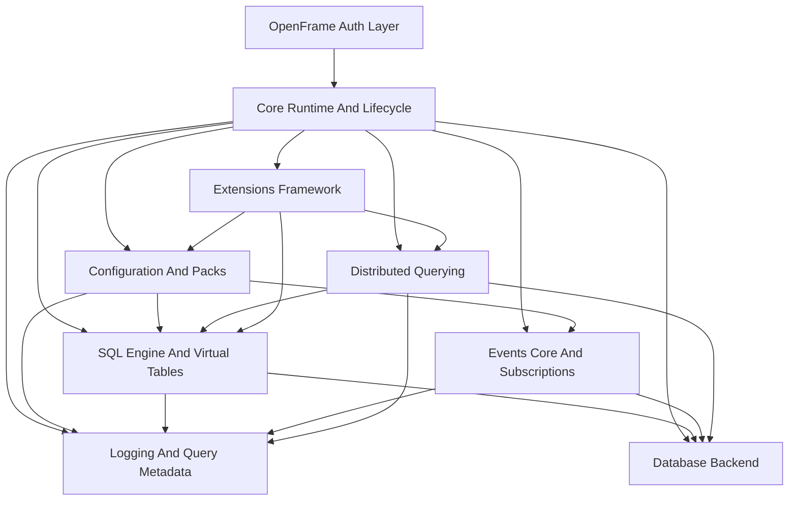

<div align="center">
  <picture>
    <source media="(prefers-color-scheme: dark)" srcset="https://shdrojejslhgnojzkzak.supabase.co/storage/v1/object/public/public/doc-orchestrator/logos/b8bdd6f0-ae91-46e8-9c4e-bca279875ef1/dark.png">
    <source media="(prefers-color-scheme: light)" srcset="https://shdrojejslhgnojzkzak.supabase.co/storage/v1/object/public/public/doc-orchestrator/logos/49885d70-2d19-4457-97b3-be14f08fef3c/light.png">
    
  </picture>
</div>

<p align="center">
  <a href="LICENSE.md"></a>
</p>

# osquery — OpenFrame-Enhanced Distribution

**osquery** is a cross-platform operating system instrumentation framework that exposes system state as relational data using **SQL**. This distribution extends the upstream osquery project with **OpenFrame**-specific authentication, token management, and AES-256-GCM encryption services — part of the [Flamingo](https://flamingo.run) / [OpenFrame](https://openframe.ai) platform for intelligent MSP automation.

Instead of parsing log files or writing custom scripts, you query the operating system like a database:

```sql
SELECT name, pid, path FROM processes WHERE on_disk = 0;
```

```sql
SELECT address, mac FROM interface_addresses;
```

```sql
SELECT * FROM users WHERE uid = 0;
```

---

## Watch: Introduction to osquery

[](https://www.youtube.com/watch?v=bRd3JCJZ1vc)

---

## Features

- **SQL-based OS querying** — Interact with 300+ virtual tables covering processes, files, users, network, and kernel state
- **Cross-platform** — Runs on Linux, macOS, and Windows with a unified SQL interface
- **Scheduled query packs** — Define queries that run on configurable schedules
- **Event-driven tables** — Subscribe to OS events: file changes, process launches, network connections
- **Distributed querying** — Push queries to an entire fleet from a central control plane over TLS
- **Plugin extensions** — Add custom tables, loggers, and config sources via Thrift IPC without modifying the binary
- **OpenFrame integration** — Secure bearer-token authentication with the OpenFrame/Flamingo platform
- **AES-256-GCM encryption** — Built-in encrypted token storage and retrieval at rest
- **Differential logging** — Only changed rows (added/removed) are logged by default, drastically reducing output volume
- **Watchdog supervision** — Watcher/worker process separation for resilient daemon operation
- **Pluggable persistence** — RocksDB for durability or in-memory ephemeral backend for lightweight use

---

## System Architecture


```mermaid
flowchart TD
    OpenFrame["OpenFrame Auth Layer"] --> Core["Core Runtime And Lifecycle"]
    Core --> Config["Configuration And Packs"]
    Core --> SQL["SQL Engine And Virtual Tables"]
    Core --> DB["Database Backend"]
    Core --> Logging["Logging And Query Metadata"]
    Core --> Events["Events Core And Subscriptions"]
    Core --> Extensions["Extensions Framework"]
    Core --> Distributed["Distributed Querying"]

    Config --> SQL
    Config --> Events
    Config --> Logging

    SQL --> Logging
    SQL --> DB

    Events --> DB
    Events --> Logging

    Distributed --> SQL
    Distributed --> DB
    Distributed --> Logging

    Extensions --> SQL
    Extensions --> Config
    Extensions --> Distributed
```

### Architectural Layers

| Layer | Responsibility |
|-------|---------------|
| **Core Runtime** | Bootstrapping, flags, lifecycle, watchdog, shutdown |
| **SQL Engine** | Embedded SQLite, virtual table layer, query planning (300+ tables) |
| **Configuration** | Packs, scheduling, discovery, dynamic updates |
| **Database Backend** | Persistent RocksDB and ephemeral in-memory key–value storage |
| **Logging** | Differential result serialization and logger plugin emission |
| **Events** | Real-time OS event ingestion exposed as SQL tables |
| **Distributed** | Pull-based remote query retrieval and TLS result submission |
| **Extensions** | Thrift IPC for external plugin injection |
| **OpenFrame Auth** | Token lifecycle, AES-256-GCM encryption, background refresh |

---

## Technology Stack

| Layer | Technology |
|-------|-----------|
| **Language** | C++17 |
| **Build System** | CMake ≥ 3.21 |
| **SQL Engine** | SQLite (embedded) |
| **Persistent Database** | RocksDB |
| **IPC / Extensions** | Apache Thrift |
| **Networking** | Boost.Asio + Boost.Beast |
| **Encryption** | OpenSSL (AES-256-GCM) |
| **Logging** | Google glog |
| **Testing** | Google Test (gtest) |
| **Flags** | Google gflags |

---

## Hardware Requirements

| Component | Minimum | Recommended |
|-----------|---------|-------------|
| **RAM** | 24 GB | 32 GB |
| **CPU Cores** | 6 cores | 12 cores |
| **Disk Space** | 50 GB | 100 GB |

---

## Quick Start

### Prerequisites

- CMake ≥ 3.21
- Clang ≥ 13 or GCC ≥ 10 (C++17 required)
- Python 3 ≥ 3.6
- OpenSSL ≥ 1.1.1 (for OpenFrame encryption)
- Git

Verify your environment:

```bash
cmake --version
clang --version
python3 --version
openssl version
```

### Build from Source

```bash
# 1. Clone the repository
git clone https://github.com/flamingo-stack/osquery.git
cd osquery

# 2. Create the build directory
mkdir build && cd build

# 3. Configure with CMake
cmake .. \
  -DCMAKE_C_COMPILER=clang \
  -DCMAKE_CXX_COMPILER=clang++ \
  -DCMAKE_BUILD_TYPE=Release

# 4. Build (uses all available CPU cores)
cmake --build . --parallel $(nproc)

# 5. Run the interactive shell
./osquery/osqueryi
```

### Windows (AMD64)

1. Download: [openframe-cli_windows_amd64.zip](https://github.com/flamingo-stack/openframe-cli/releases/latest/download/openframe-cli_windows_amd64.zip)
2. Extract the archive
3. Run the installer following the same steps as other operating systems

### Your First Query

```bash
./osquery/osqueryi
```

```sql
-- List running processes
SELECT pid, name, path FROM processes LIMIT 10;

-- Check listening network ports
SELECT pid, port, protocol, address FROM listening_ports;

-- List all available tables
.tables

-- Exit
.exit
```

### Run the Daemon (Continuous Monitoring)

```bash
./osquery/osqueryd --config_path=/etc/osquery/osquery.conf
```

---

## OpenFrame Extensions

This distribution adds the following components on top of upstream osquery:

| Component | Description |
|-----------|-------------|
| `OpenframeAuthorizationManager` | Singleton manager for securely storing and serving the OpenFrame bearer token |
| `OpenframeEncryptionService` | AES-256-GCM encryption/decryption service that secures tokens at rest |
| `OpenframeTokenExtractor` | Reads and decrypts authentication tokens from an encrypted token file on disk |
| `OpenframeTokenRefresher` | Background thread that periodically re-extracts and refreshes the authentication token |

---

## Two Execution Modes

| Mode | Binary | Description |
|------|--------|-------------|
| **Interactive Shell** | `osqueryi` | Ad-hoc SQL queries against the local system |
| **Daemon** | `osqueryd` | Continuous scheduled query execution |

---

## Documentation

📚 See the [Documentation](./docs/README.md) for comprehensive guides, architecture references, and development workflows.

- [Introduction](./docs/getting-started/introduction.md) — What is osquery and how does it work
- [Prerequisites](./docs/getting-started/prerequisites.md) — System requirements and build tool setup
- [Quick Start](./docs/getting-started/quick-start.md) — Build and run in minutes
- [First Steps](./docs/getting-started/first-steps.md) — Explore tables, security queries, and OpenFrame integration

---

## Community & Support

This project is managed through the **OpenMSP Slack community** — GitHub Issues and Discussions are not used.

- **Slack**: [Join OpenMSP](https://join.slack.com/t/openmsp/shared_invite/zt-36bl7mx0h-3~U2nFH6nqHqoTPXMaHEHA)
- **OpenMSP Platform**: [https://www.openmsp.ai/](https://www.openmsp.ai/)
- **Flamingo**: [https://flamingo.run](https://flamingo.run)
- **OpenFrame**: [https://openframe.ai](https://openframe.ai)

---

<div align="center">
  Built with 💛 by the <a href="https://www.flamingo.run/about"><b>Flamingo</b></a> team
</div>
