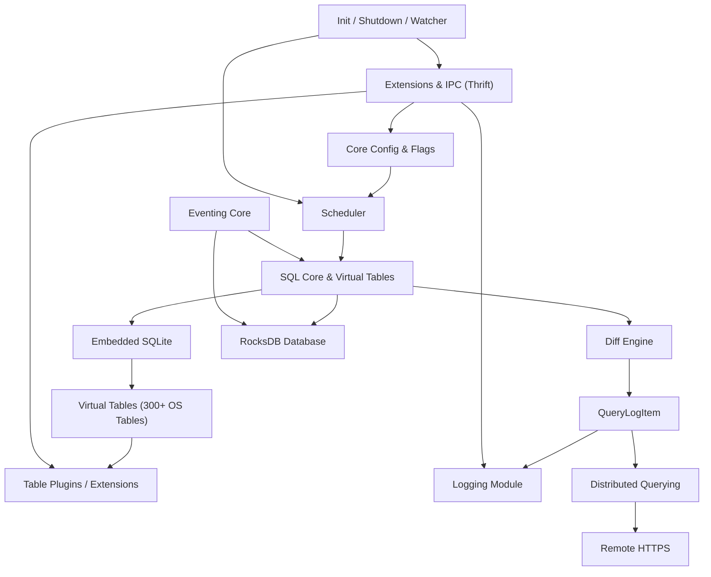

<div align="center">
  <picture>
    <source media="(prefers-color-scheme: dark)" srcset="https://shdrojejslhgnojzkzak.supabase.co/storage/v1/object/public/public/doc-orchestrator/logos/1771371901777-lc3cse-logo-openframe-full-dark-bg.png">
    <source media="(prefers-color-scheme: light)" srcset="https://shdrojejslhgnojzkzak.supabase.co/storage/v1/object/public/public/doc-orchestrator/logos/1771372526604-k3y1w-logo-openframe-full-light-bg.png">
    
  </picture>
</div>

<p align="center">
  <a href="LICENSE.md"></a>
</p>

# osquery — SQL-Powered System Telemetry Engine

**osquery** is a high-performance, cross-platform system instrumentation framework that exposes operating system state as a relational database. It allows operators to query any aspect of a running system — processes, users, files, network sockets, hardware, events — using standard SQL, without parsing logs or writing brittle shell scripts.

> **Part of the Flamingo / OpenFrame ecosystem:** This fork of osquery is maintained by [Flamingo](https://flamingo.run) as a core telemetry engine inside the [OpenFrame platform](https://openframe.ai), providing MSPs with AI-enhanced, SQL-driven endpoint visibility across their entire client fleet.

```sql
-- Which processes are listening on port 443?
SELECT pid, name FROM processes
WHERE pid IN (SELECT pid FROM listening_ports WHERE port = 443);

-- Which users have an SSH authorized_keys entry?
SELECT username, key FROM users JOIN authorized_keys USING (uid);
```

---

## Features

- **SQL interface** — Full SQLite syntax over 300+ virtual OS tables
- **Cross-platform** — Linux, macOS, and Windows with a unified API
- **Scheduled queries** — Cron-like query scheduling with differential results (only log changes)
- **Real-time eventing** — Publisher–subscriber model for file, process, socket, and kernel events
- **Distributed querying** — Central orchestration of SQL across a fleet over TLS
- **Extensions & IPC** — Thrift-based cross-process plugin framework for custom tables and plugins
- **Pluggable logging** — Filesystem, TLS, Kafka, AWS Kinesis/Firehose, and custom backends
- **Pluggable config** — Filesystem, TLS, and extension-provided configuration sources
- **Watchdog supervision** — CPU/memory-aware worker supervision with automatic restart
- **RocksDB persistence** — Durable local state for events, query results, and metrics
- **Cryptographic hashing** — Streaming SHA-256, SHA-1, and MD5 for file integrity
- **Secure by default** — SQLite opcode allowlisting, PRAGMA restrictions, and process isolation

---

## Architecture


```mermaid
flowchart TD
    Config["Core Config & Flags"] --> Scheduler["Scheduler"]
    Scheduler --> SQLCore["SQL Core & Virtual Tables"]

    SQLCore --> SQLite["Embedded SQLite"]
    SQLite --> VTables["Virtual Tables (300+ OS Tables)"]
    VTables --> TablePlugins["Table Plugins / Extensions"]

    SQLCore --> DiffEngine["Diff Engine"]
    DiffEngine --> LogItem["QueryLogItem"]

    LogItem --> Logging["Logging Module"]
    LogItem --> Distributed["Distributed Querying"]

    Distributed --> RemoteHTTP["Remote HTTPS"]

    SQLCore --> Database["RocksDB Database"]

    Eventing["Eventing Core"] --> Database
    Eventing --> SQLCore

    Extensions["Extensions & IPC (Thrift)"] --> TablePlugins
    Extensions --> Config
    Extensions --> Logging

    Watcher["Init / Shutdown / Watcher"] --> Scheduler
    Watcher --> Extensions
```

### Core Layers

| Layer | Modules | Role |
|---|---|---|
| **Runtime Control** | Init/Shutdown/Watcher, Config & Flags | Process lifecycle, scheduling, dynamic reconfiguration |
| **SQL Engine** | SQL Core & Virtual Tables | SQLite embedding, virtual table framework, diff engine |
| **Eventing** | Eventing Core | Publisher–subscriber OS event collection |
| **Persistence** | Database | RocksDB / ephemeral key-value store |
| **Output** | Logging | Pluggable result and status emission |
| **Fleet** | Distributed Querying, Remote HTTP | Central SQL orchestration over TLS |
| **Extensibility** | Extensions & IPC | Thrift-based cross-process plugin support |
| **Utilities** | Filesystem & Fileops, Hashing | Cross-platform file abstraction and cryptographic digests |

---

## Hardware Requirements

| Tier | RAM | CPU Cores | Disk |
|---|---|---|---|
| **Minimum** | 24 GB | 6 cores | 50 GB |
| **Recommended** | 32 GB | 12 cores | 100 GB |

> The build process compiles a large number of bundled libraries (RocksDB, Thrift, Boost, OpenSSL, etc.) in parallel. Insufficient RAM or CPU will significantly increase build times.

---

## Quick Start

### Prerequisites

Ensure you have the following installed:

- **CMake** 3.21+
- **Git** 2.x
- **Python** 3.6+
- **Clang/LLVM** 11+ (Linux/macOS) or **MSVC** VS 2019+ (Windows)
- **Ninja** 1.10+ (recommended)

**Linux (Ubuntu/Debian):**

```bash
sudo apt-get update && sudo apt-get install -y \
  build-essential cmake git python3 python3-pip \
  clang llvm ninja-build libstdc++-dev zlib1g-dev libssl-dev
```

**macOS:**

```bash
xcode-select --install
brew install cmake ninja python3 llvm
```

**Windows (AMD64):** Download and run the OpenFrame CLI installer:

```text
https://github.com/flamingo-stack/openframe-cli/releases/latest/download/openframe-cli_windows_amd64.zip
```

### Build and Run

```bash
# 1. Clone the repository
git clone https://github.com/flamingo-stack/osquery.git
cd osquery

# 2. Configure the build (Linux / macOS)
cmake -B build -S . -G Ninja \
  -DCMAKE_BUILD_TYPE=RelWithDebInfo

# 3. Build osqueryi (interactive shell)
cmake --build build --target osqueryi -j$(nproc)

# 4. Run the interactive shell
./build/osquery/osqueryi
```

**Windows (PowerShell):**

```bash
cmake -B build -S . -G "Visual Studio 17 2022" -A x64
cmake --build build --config RelWithDebInfo --target osqueryi
.\build\osquery\RelWithDebInfo\osqueryi.exe
```

### Your First Queries

```sql
-- What OS is this system running?
SELECT * FROM os_version;

-- What processes are currently running?
SELECT pid, name, path FROM processes LIMIT 10;

-- What network ports are listening?
SELECT pid, port, protocol FROM listening_ports;

-- What users exist on this system?
SELECT uid, username, shell FROM users;

-- Recent file changes (requires osqueryd with eventing)
SELECT time, action, category, path FROM file_events ORDER BY time DESC LIMIT 20;
```

### Run the Daemon

```bash
cat > /tmp/osquery.conf << 'EOF'
{
  "options": {
    "logger_path": "/tmp/osquery_logs",
    "disable_logging": false
  },
  "schedule": {
    "os_version": {
      "query": "SELECT * FROM os_version;",
      "interval": 60
    },
    "listening_ports": {
      "query": "SELECT pid, port, protocol FROM listening_ports;",
      "interval": 30
    }
  }
}
EOF

./build/osquery/osqueryd \
  --flagfile /tmp/osquery.conf \
  --verbose
```

---

## Technology Stack

| Component | Technology |
|---|---|
| **SQL Engine** | Embedded SQLite |
| **Persistence** | RocksDB |
| **IPC / Extensions** | Apache Thrift |
| **Networking** | Boost.Asio + Boost.Beast |
| **TLS** | OpenSSL |
| **Build System** | CMake + Ninja |
| **Primary Language** | C++17 |
| **Event Backends** | inotify, BPF/eBPF, FSEvents, ETW, auditd |

---

## Binaries

| Binary | Purpose |
|---|---|
| `osqueryi` | Interactive SQL shell for ad-hoc investigation |
| `osqueryd` | Long-running daemon for scheduled queries and fleet enrollment |

---

## Platform Support

| Platform | Architecture | Status |
|---|---|---|
| Linux (Ubuntu 20.04+, Fedora, CentOS 8+) | x86_64, aarch64 | ✅ Fully supported |
| macOS 11+ | x86_64, Apple Silicon | ✅ Fully supported |
| Windows 10 / Server 2016+ | x86_64, aarch64 | ✅ Fully supported |

---

## Documentation

📚 See the [Documentation](./docs/README.md) for comprehensive guides covering:

- [Getting Started](./docs/getting-started/introduction.md) — Introduction, prerequisites, quick start, and first steps
- [Development Guides](./docs/development/setup/local-development.md) — Local build setup, architecture, testing, and security
- [Reference Architecture](./docs/reference/architecture/README.md) — Detailed module documentation for all subsystems

---

## Community

All collaboration happens on the **OpenMSP Slack community** — not GitHub Issues or Discussions.

- 💬 **Join Slack:** [OpenMSP Community](https://join.slack.com/t/openmsp/shared_invite/zt-36bl7mx0h-3~U2nFH6nqHqoTPXMaHEHA)
- 🌐 **OpenMSP:** [https://www.openmsp.ai/](https://www.openmsp.ai/)
- 🦩 **Flamingo:** [https://flamingo.run](https://flamingo.run)
- 🖥️ **OpenFrame:** [https://openframe.ai](https://openframe.ai)

---

## Contributing

See [CONTRIBUTING.md](./CONTRIBUTING.md) for code style, branching, commit message format, and the pull request process.

---

<div align="center">
  Built with 💛 by the <a href="https://www.flamingo.run/about"><b>Flamingo</b></a> team
</div>
