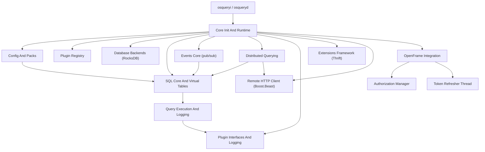

<div align="center">
  <picture>
    <source media="(prefers-color-scheme: dark)" srcset="https://shdrojejslhgnojzkzak.supabase.co/storage/v1/object/public/public/doc-orchestrator/logos/b8bdd6f0-ae91-46e8-9c4e-bca279875ef1/dark.png">
    <source media="(prefers-color-scheme: light)" srcset="https://shdrojejslhgnojzkzak.supabase.co/storage/v1/object/public/public/doc-orchestrator/logos/49885d70-2d19-4457-97b3-be14f08fef3c/light.png">
    
  </picture>
</div>

<p align="center">
  <a href="LICENSE.md"></a>
</p>

# osquery — OpenFrame Edition

**osquery** is a cross-platform operating system instrumentation framework that exposes system state as relational tables and allows it to be queried using SQL. This repository includes the **OpenFrame integration** — enabling authenticated, token-managed runtime identity for [OpenFrame](https://openframe.ai)-connected deployments on the [Flamingo](https://flamingo.run) MSP platform.

Instead of writing platform-specific scripts to inspect processes, files, users, network state, or kernel events, osquery gives you a unified SQL interface to your entire fleet.

```sql
-- Find all listening TCP ports and the processes behind them
SELECT p.name, p.pid, lp.port, lp.protocol
FROM listening_ports lp
JOIN processes p ON lp.pid = p.pid
WHERE lp.protocol = 6;
```

---

## ▶️ Watch: osquery Overview

[](https://www.youtube.com/watch?v=KbGH9IBELWA)

---

## ✨ Features

| Feature | Description |
|---------|-------------|
| **SQL Interface** | Query OS state with standard SQL across all platforms |
| **Virtual Tables** | 300+ built-in tables covering processes, network, files, users, and more |
| **Event-Driven Monitoring** | Real-time capture of file changes, process activity, and network events |
| **Scheduled Queries** | Continuously run queries and log differential results |
| **Distributed Querying** | Push ad-hoc queries to remote nodes from a control plane |
| **Extensible Plugin System** | Add custom tables, loggers, and config sources via extensions |
| **Cross-Platform** | Linux, macOS, and Windows support |
| **OpenFrame Integration** | Secure token-based authentication for MSP fleet management |

---

## 🏗️ Architecture

osquery is a layered, plugin-driven C++ application. At its core is an embedded SQLite engine that exposes OS state through virtual tables. An event framework captures real-time activity, a distributed query system handles remote work, and the OpenFrame integration provides authenticated connectivity to the Flamingo MSP platform.


```mermaid
flowchart TD
    CLI["osqueryi / osqueryd"] --> Core["Core Init And Runtime"]
    Core --> Config["Config And Packs"]
    Core --> Registry["Plugin Registry"]
    Core --> Database["Database Backends (RocksDB)"]
    Core --> SQL["SQL Core And Virtual Tables"]
    Core --> Events["Events Core (pub/sub)"]
    Core --> Distributed["Distributed Querying"]
    Core --> Logger["Plugin Interfaces And Logging"]
    Core --> Extensions["Extensions Framework (Thrift)"]
    Core --> HTTP["Remote HTTP Client (Boost.Beast)"]
    Core --> OpenFrame["OpenFrame Integration"]
    Config --> SQL
    SQL --> QueryExec["Query Execution And Logging"]
    QueryExec --> Logger
    Events --> SQL
    Distributed --> SQL
    Distributed --> HTTP
    OpenFrame --> AuthMgr["Authorization Manager"]
    OpenFrame --> Refresher["Token Refresher Thread"]
```

### Execution Modes

- **Daemon mode (`osqueryd`)** — scheduled and distributed queries running continuously
- **Interactive shell (`osqueryi`)** — ad-hoc SQL exploration
- **Extension processes** — dynamically inject custom plugins at runtime
- **Watcher/Worker model** — supervised execution for stability

---

## 🛠️ Technology Stack

| Layer | Technology |
|-------|-----------|
| **Language** | C++17 |
| **Build System** | CMake 3.21+ |
| **SQL Engine** | Embedded SQLite with virtual table extensions |
| **IPC / Extensions** | Apache Thrift over UNIX domain sockets / Windows named pipes |
| **Networking** | Boost.Asio + Boost.Beast + OpenSSL |
| **Storage** | RocksDB (persistent) / In-memory ephemeral backend |
| **Event Publishers** | BPF / inotify (Linux), EndpointSecurity (macOS), ETW (Windows) |
| **OpenFrame Auth** | Custom token extractor + refresher with Boost threading |

---

## 🔧 Hardware Requirements

| Tier | RAM | CPU Cores | Disk Space |
|------|-----|-----------|------------|
| **Minimum** | 24 GB | 6 cores | 50 GB |
| **Recommended** | 32 GB | 12 cores | 100 GB |

---

## 🚀 Quick Start

### 1. Clone the Repository

```bash
git clone https://github.com/flamingo-stack/osquery.git
cd osquery
```

### 2. Configure the Build

```bash
cmake -S . -B build \
  -DCMAKE_BUILD_TYPE=Release \
  -DOSQUERY_BUILD_TESTS=OFF
```

### 3. Build

```bash
# Linux
cmake --build build --target osqueryi -j$(nproc)

# macOS
cmake --build build --target osqueryi -j$(sysctl -n hw.logicalcpu)
```

### 4. Run Your First Query

```bash
./build/osqueryi "SELECT name, pid, user_time FROM processes LIMIT 5;"
```

Or launch the interactive shell:

```bash
./build/osqueryi
```

```text
Using a virtual database. Need help, type '.help'
osquery>
```

### Windows Quick Start

Download the Windows AMD64 CLI installer:

- [openframe-cli_windows_amd64.zip](https://github.com/flamingo-stack/openframe-cli/releases/latest/download/openframe-cli_windows_amd64.zip)

Extract and run the installer the same way as other platforms.

---

## ⚡ Enable OpenFrame Mode

If you have an OpenFrame token, enable the integration at startup:

```bash
./build/osqueryd \
  --openframe_mode=true \
  --openframe_token_path=/etc/osquery/openframe_token \
  --config_path=/etc/osquery/osquery.conf
```

The token refresher starts automatically in the background, keeping credentials fresh and authentication seamless.

---

## 🗂️ Project Layout

```text
osquery/
├── osquery/           # Core library modules
│   ├── core/          # Runtime initialization, flags, shutdown
│   ├── sql/           # SQLite engine and virtual table integration
│   ├── events/        # Publish/subscribe event framework
│   ├── config/        # Configuration loading and packs
│   ├── database/      # RocksDB and ephemeral storage backends
│   ├── distributed/   # Distributed query engine
│   ├── extensions/    # Apache Thrift-based extension framework
│   ├── remote/        # HTTP client (Boost.Beast + OpenSSL)
│   ├── hashing/       # MD5, SHA1, SHA256 utilities
│   └── filesystem/    # Cross-platform file operations
├── openframe/         # OpenFrame authentication integration
├── plugins/           # Config, logger, database, distributed plugins
├── tables/            # Virtual table implementations (300+ tables)
├── libraries/         # Vendored third-party libraries (CMake-managed)
├── tools/             # Code generation, CI scripts, formatting tools
├── tests/             # Integration and unit tests
└── external/          # Extension SDK examples
```

---

## 📚 Documentation

See the [Documentation](./docs/README.md) for comprehensive guides covering architecture, development setup, testing, security, and API reference.

---

## 💬 Community & Support

All discussion, questions, and contributions are managed via the **OpenMSP Slack** community. We do not use GitHub Issues or GitHub Discussions.

- **Slack:** [Join OpenMSP](https://join.slack.com/t/openmsp/shared_invite/zt-36bl7mx0h-3~U2nFH6nqHqoTPXMaHEHA)
- **Community:** [openmsp.ai](https://www.openmsp.ai/)
- **Platform:** [flamingo.run](https://flamingo.run) | [OpenFrame](https://openframe.ai)

---

<div align="center">
  Built with 💛 by the <a href="https://www.flamingo.run/about"><b>Flamingo</b></a> team
</div>
