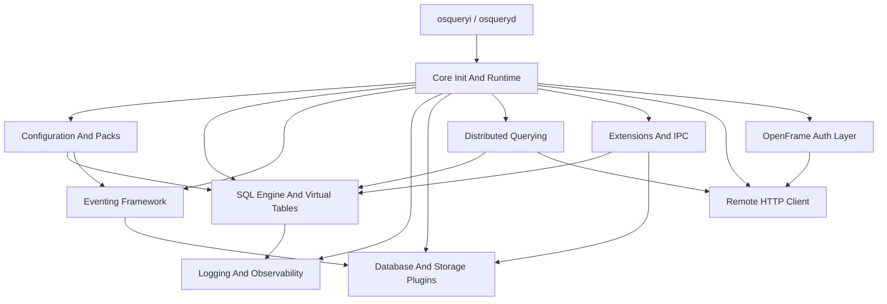

<div align="center">
  <picture>
    <source media="(prefers-color-scheme: dark)" srcset="https://shdrojejslhgnojzkzak.supabase.co/storage/v1/object/public/public/doc-orchestrator/logos/b8bdd6f0-ae91-46e8-9c4e-bca279875ef1/dark.png">
    <source media="(prefers-color-scheme: light)" srcset="https://shdrojejslhgnojzkzak.supabase.co/storage/v1/object/public/public/doc-orchestrator/logos/49885d70-2d19-4457-97b3-be14f08fef3c/light.png">
    
  </picture>
</div>

<p align="center">
  <a href="LICENSE.md"></a>
</p>

# osquery — OpenFrame Edition

**osquery** is a cross-platform operating system instrumentation framework that exposes live system state and activity as relational data — enabling you to query your operating system using SQL.

Built and extended by the [Flamingo / OpenFrame](https://openframe.ai) platform, this distribution integrates osquery's powerful SQL telemetry engine with OpenFrame's AI-driven MSP automation infrastructure. Every host becomes a **SQL-queryable telemetry node** — no proprietary log parsers, no fragile scripts, just standard SQL.

```sql
-- Which processes are listening on ports?
SELECT pid, name, port, protocol FROM listening_ports JOIN processes USING (pid);

-- What Chrome extensions are installed?
SELECT u.username, e.name, e.version, e.permissions
FROM users u, chrome_extensions e
WHERE e.uid = u.uid;
```

## Features

- **SQL Querying** — Query live OS data with standard SQL via an embedded, hardened SQLite engine
- **300+ Virtual Tables** — Platform-specific tables across Linux, macOS, and Windows covering processes, sockets, packages, users, registry, hardware, and more
- **Event Monitoring** — inotify, BPF, FSEvents, ETW, and OpenBSM events exposed as queryable tables
- **Scheduled Query Packs** — Configuration-driven query scheduling with differential result tracking (only changed rows are logged)
- **Distributed Fleet Queries** — Remote SQL orchestration across entire fleets via TLS
- **Extension System** — Runtime plugin model via Apache Thrift IPC — add custom tables, loggers, and config plugins as external processes
- **OpenFrame Auth Layer** — AES-256-GCM encrypted JWT token management (`OpenframeAuthorizationManager`, `OpenframeEncryptionService`, `OpenframeTokenRefresher`) for seamless integration with the Flamingo/OpenFrame MSP platform
- **Cross-Platform** — Linux (x86\_64, aarch64), macOS (Intel + Apple Silicon), and Windows x86\_64
- **Security-First** — SQLite authorizer allowlists only safe opcodes, Watcher/Worker process isolation, peer-verified TLS everywhere

---

## Architecture


```mermaid
graph TD
    CLI["osqueryi / osqueryd"] --> Core["Core Init And Runtime"]
    Core --> Config["Configuration And Packs"]
    Core --> SQL["SQL Engine And Virtual Tables"]
    Core --> Events["Eventing Framework"]
    Core --> Logging["Logging And Observability"]
    Core --> DB["Database And Storage Plugins"]
    Core --> Dist["Distributed Querying"]
    Core --> Ext["Extensions And IPC"]
    Core --> HTTP["Remote HTTP Client"]
    Core --> OF["OpenFrame Auth Layer"]
    Config --> SQL
    Config --> Events
    SQL --> Logging
    Events --> DB
    Dist --> SQL
    Dist --> HTTP
    Ext --> SQL
    Ext --> DB
    OF --> HTTP
```

| Module | Location | Responsibility |
|---|---|---|
| Core Init And Runtime | `osquery/core/` | Process lifecycle, flags, watcher/worker model |
| SQL Engine And Virtual Tables | `osquery/sql/` | SQLite engine, authorizer, virtual table binding |
| Configuration And Packs | `osquery/config/` | Scheduled queries, packs, decorators |
| Eventing Framework | `osquery/events/` | Publisher/subscriber event system |
| Logging And Observability | `osquery/logger/` | Differential logging, JSON serialization |
| Database And Storage Plugins | `osquery/database/` | RocksDB persistent + ephemeral in-memory stores |
| Distributed Querying | `osquery/distributed/` | Remote fleet orchestration |
| Extensions And IPC | `osquery/extensions/` | Apache Thrift-based runtime extensions |
| Remote HTTP Client | `osquery/remote/` | Boost.Asio/Beast HTTPS with strict TLS |
| OpenFrame Auth Layer | `openframe/` | JWT token management + AES-256-GCM encryption |

---

## Technology Stack

| Layer | Technology |
|---|---|
| Language | C++17 |
| Build System | CMake 3.21+ with Ninja |
| SQL Engine | SQLite (embedded, in-memory) |
| IPC | Apache Thrift (UNIX sockets / named pipes) |
| Encryption | OpenSSL (AES-256-GCM) |
| Networking | Boost.Asio + Boost.Beast |
| Event Systems | inotify, BPF, FSEvents, ETW, OpenBSM |
| Database | RocksDB (persistent), ephemeral in-memory |
| Testing | Google Test + Google Mock |

---

## Hardware Requirements

| Tier | RAM | CPU Cores | Disk |
|---|---|---|---|
| **Minimum** | 24 GB | 6 cores | 50 GB |
| **Recommended** | 32 GB | 12 cores | 100 GB |

> Building from source is resource-intensive. The recommended configuration significantly reduces build times and prevents out-of-memory failures during compilation.

---

## Supported Platforms

| Platform | Architecture | Notes |
|---|---|---|
| Linux | x86\_64, aarch64 | Ubuntu 20.04+, RHEL 8+, Debian 11+ |
| macOS | x86\_64, aarch64 | macOS 12+ (Intel + Apple Silicon) |
| Windows | x86\_64 | Windows 10/11, Server 2019+ |

---

## Quick Start

### 1. Install Prerequisites

**Linux (Debian/Ubuntu):**

```bash
sudo apt-get update
sudo apt-get install -y \
  build-essential cmake ninja-build python3 python3-pip \
  git openssl libssl-dev clang-format ccache
```

**macOS:**

```bash
xcode-select --install
brew install cmake ninja python3 openssl git ccache
```

**Windows:**

1. Install [Visual Studio 2022](https://visualstudio.microsoft.com/) with the **Desktop development with C++** workload
2. Install [CMake 3.21+](https://cmake.org/download/), [Git](https://git-scm.com/download/win), [Python 3.8+](https://www.python.org/downloads/windows/)
3. Download the CLI binary directly: [openframe-cli\_windows\_amd64.zip](https://github.com/flamingo-stack/openframe-cli/releases/latest/download/openframe-cli_windows_amd64.zip)

### 2. Clone and Build

```bash
# Clone
git clone https://github.com/flamingo-stack/osquery.git
cd osquery

# Configure (Linux/macOS)
cmake -S . -B build -DCMAKE_BUILD_TYPE=RelWithDebInfo -G Ninja

# Configure (Windows)
cmake -S . -B build -DCMAKE_BUILD_TYPE=RelWithDebInfo -G "Visual Studio 17 2022"

# Build — uses all available CPU cores
cmake --build build --parallel $(nproc)
```

### 3. Run Your First Query

```bash
./build/osquery/osqueryi
```

```text
Using a virtual database. Need help, type '.help'
osquery>
```

```sql
osquery> SELECT hostname, cpu_brand, physical_memory FROM system_info;
osquery> SELECT pid, name, port, protocol FROM listening_ports LIMIT 10;
osquery> SELECT uid, username, shell FROM users;
osquery> .tables
```

### 4. Run as a Daemon

```bash
sudo mkdir -p /etc/osquery
sudo tee /etc/osquery/osquery.conf <<'EOF'
{
  "options": {
    "logger_plugin": "filesystem",
    "schedule_splay_percent": 10
  },
  "schedule": {
    "system_info": {
      "query": "SELECT hostname, cpu_brand, physical_memory FROM system_info;",
      "interval": 3600
    }
  }
}
EOF

sudo ./build/osquery/osqueryd --config_path=/etc/osquery/osquery.conf
```

---

## OpenFrame Integration

This distribution extends osquery with a secure authentication and encryption layer for the [OpenFrame platform](https://www.flamingo.run/openframe):

| Component | Description |
|---|---|
| `OpenframeAuthorizationManager` | Lifecycle-controlled JWT token singleton (non-copyable) |
| `OpenframeAuthorizationManagerProvider` | Sole factory and owner of the token manager |
| `OpenframeEncryptionService` | AES-256-GCM symmetric encryption via OpenSSL |
| `OpenframeTokenExtractor` | Token acquisition from OpenFrame services |
| `OpenframeTokenRefresher` | Background thread for seamless token renewal |

Obtain your OpenFrame credentials from your platform administrator. Token lifecycle is fully automated once configured. Refer to your environment configuration for connection details.

---

## Documentation

📚 See the [Documentation](./docs/README.md) for comprehensive guides.

- [Introduction](./docs/getting-started/introduction.md) — What is osquery + OpenFrame?
- [Prerequisites](./docs/getting-started/prerequisites.md) — System and software requirements
- [Quick Start](./docs/getting-started/quick-start.md) — Clone, build, and run
- [First Steps](./docs/getting-started/first-steps.md) — Explore tables, packs, FIM, extensions
- [Architecture Overview](./docs/development/architecture/README.md) — Module deep-dives
- [Local Development](./docs/development/setup/local-development.md) — Build configurations and debugging
- [Contributing Guidelines](./docs/development/contributing/guidelines.md) — Code style and PR process

---

## Community and Support

> We do **not** use GitHub Issues or GitHub Discussions. All support and collaboration happens on the **OpenMSP Slack community**.

| Resource | Link |
|---|---|
| 💬 OpenMSP Community Slack | [Join here](https://join.slack.com/t/openmsp/shared_invite/zt-36bl7mx0h-3~U2nFH6nqHqoTPXMaHEHA) |
| 🌐 OpenMSP Website | [https://www.openmsp.ai/](https://www.openmsp.ai/) |
| 🚀 OpenFrame Platform | [https://openframe.ai](https://openframe.ai) |
| 🦩 Flamingo | [https://flamingo.run](https://flamingo.run) |

---

<div align="center">
  Built with 💛 by the <a href="https://www.flamingo.run/about"><b>Flamingo</b></a> team
</div>
