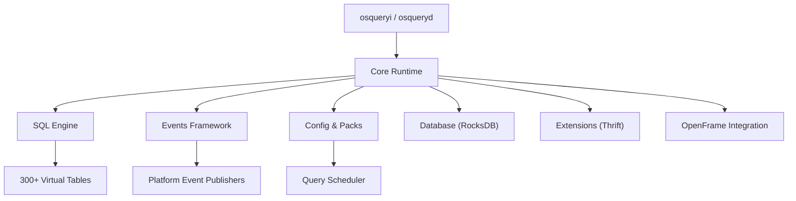

# Development Documentation

Welcome to the osquery (with OpenFrame integration) development documentation. This section covers everything you need to contribute to, build upon, and understand the internals of the project.

---

## Overview

osquery is a C++ application built with CMake. The codebase spans cross-platform OS instrumentation, an embedded SQLite engine, a plugin registry, an event pub/sub framework, and the OpenFrame integration layer. Understanding the architecture before diving into code will save you significant time.

---

## Documentation Index

| Document | Description |
|----------|-------------|
| [Environment Setup](setup/environment.md) | IDE recommendations, tools, and editor extensions |
| [Local Development](setup/local-development.md) | Clone, build, run, and debug locally |
| [Architecture Overview](architecture/README.md) | System design, components, and data flows |
| [Security Guidelines](security/README.md) | Auth patterns, secrets management, and secure coding |
| [Testing Guide](testing/README.md) | Test structure, running tests, and writing new tests |
| [Contributing Guidelines](contributing/guidelines.md) | Code style, PRs, commits, and review process |

---

## Technology Stack

| Layer | Technology |
|-------|-----------|
| **Language** | C++17 |
| **Build System** | CMake 3.21+ |
| **SQL Engine** | Embedded SQLite with virtual table extensions |
| **IPC / Extensions** | Apache Thrift over UNIX domain sockets / Windows named pipes |
| **Networking** | Boost.Asio + Boost.Beast + OpenSSL |
| **Storage** | RocksDB (persistent) / In-memory ephemeral backend |
| **Event Publishers** | Platform-specific: BPF (Linux), inotify, EndpointSecurity (macOS), ETW (Windows) |
| **OpenFrame Auth** | Custom token extractor + refresher with Boost threading |

---

## Project Layout

```text
osquery/
├── osquery/           # Core library modules
│   ├── core/          # Runtime initialization, flags, shutdown
│   ├── sql/           # SQLite engine and virtual table integration
│   ├── events/        # Publish/subscribe event framework
│   ├── config/        # Configuration loading and packs
│   ├── database/      # RocksDB and ephemeral storage backends
│   ├── distributed/   # Distributed query engine
│   ├── extensions/    # Apache Thrift-based extension framework
│   ├── remote/        # HTTP client (Boost.Beast + OpenSSL)
│   ├── hashing/       # MD5, SHA1, SHA256 utilities
│   └── filesystem/    # Cross-platform file operations
├── openframe/         # OpenFrame authentication integration
│   ├── openframe_authorization_manager.*
│   ├── openframe_encryption_service.*
│   ├── openframe_token_extractor.*
│   └── openframe_token_refresher.*
├── plugins/           # Config, logger, database, distributed plugins
├── tables/            # Virtual table implementations (300+ tables)
├── libraries/         # Vendored third-party libraries (CMake-managed)
├── tools/             # Code generation, CI scripts, formatting tools
├── tests/             # Integration and unit tests
└── external/          # Extension SDK examples
```

---

## Quick Developer Commands

```bash
# Configure build (Debug mode with tests)
cmake -S . -B build -DCMAKE_BUILD_TYPE=Debug -DOSQUERY_BUILD_TESTS=ON

# Build everything
cmake --build build -j$(nproc)

# Build specific target
cmake --build build --target osqueryi -j$(nproc)

# Run tests
cd build && ctest --output-on-failure

# Format code
cmake --build build --target clang-format
```

---

## Architecture Quick Reference



---

## Community

All discussion, questions, and collaboration happen on the **OpenMSP Slack**:

- [Join OpenMSP Slack](https://join.slack.com/t/openmsp/shared_invite/zt-36bl7mx0h-3~U2nFH6nqHqoTPXMaHEHA)
- Community website: [openmsp.ai](https://www.openmsp.ai/)
