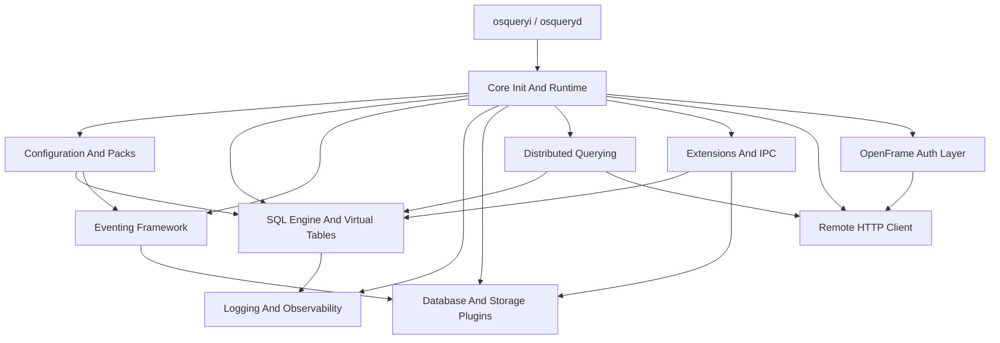
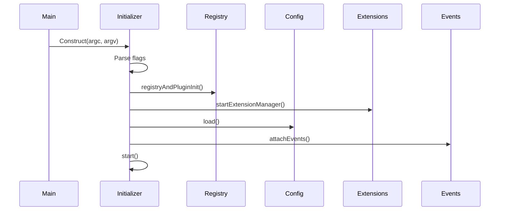
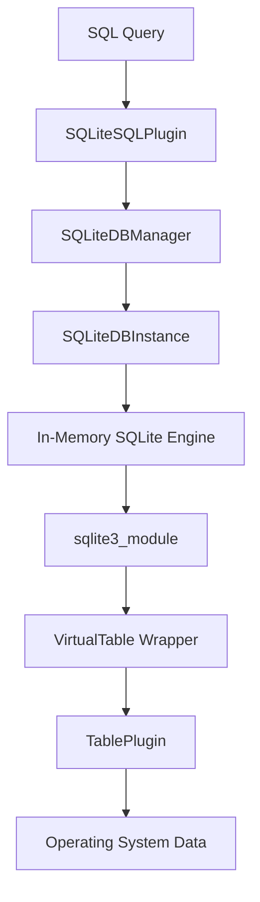
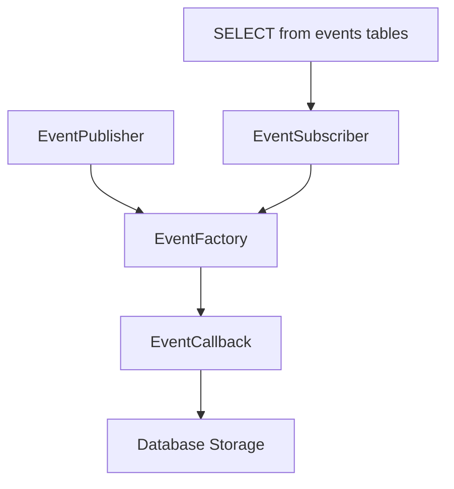
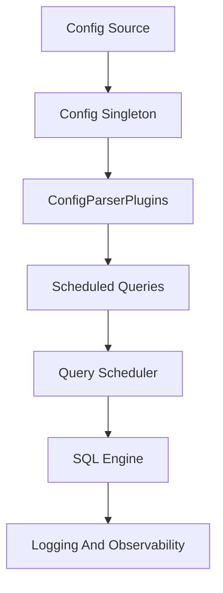
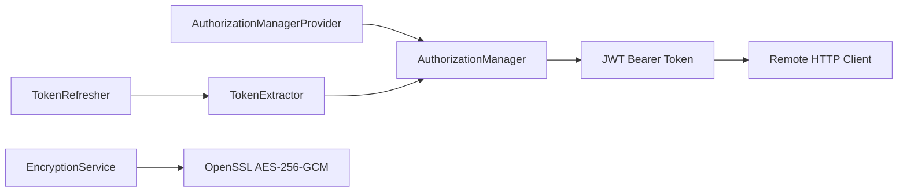
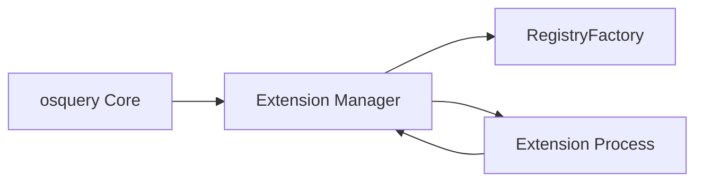
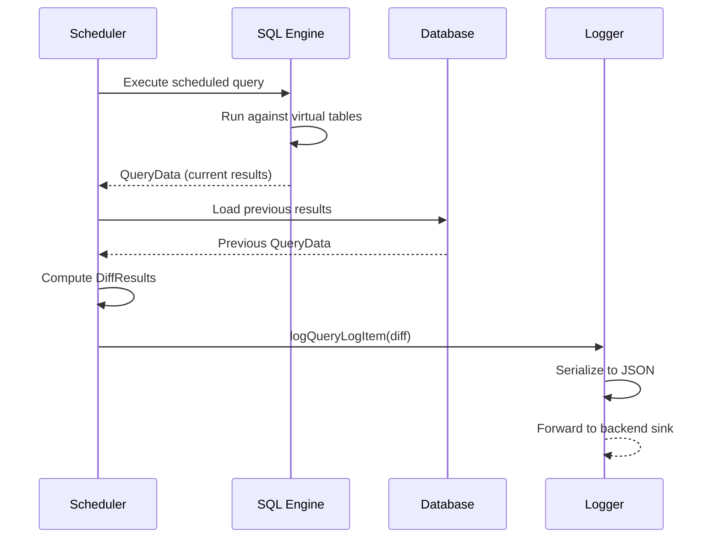

# Architecture Overview

osquery is built as a modular, plugin-driven system. Each subsystem is independently composable, testable, and extensible. The codebase is written in C++17 and targets Linux, macOS, and Windows.

---

## High-Level Architecture

---

## Core Components

| Module | Location | Description |
|---|---|---|
| **Core Init And Runtime** | `osquery/core/` | Process bootstrap, flags, watchdog, shutdown |
| **SQL Engine And Virtual Tables** | `osquery/sql/` | SQLite engine, authorizer, virtual table binding |
| **Configuration And Packs** | `osquery/config/` | Config loading, packs, parsers, scheduled queries |
| **Eventing Framework** | `osquery/events/` | Pub/sub system for OS events (inotify, BPF, ETW) |
| **Logging And Observability** | `osquery/logger/` | Differential logging, JSON serialization, logger plugins |
| **Database And Storage Plugins** | `osquery/database/` | Key-value storage (RocksDB, ephemeral) |
| **Distributed Querying** | `osquery/distributed/` | Remote SQL orchestration across fleets |
| **Extensions And IPC** | `osquery/extensions/` | Apache Thrift-based extension framework |
| **Remote HTTP Client** | `osquery/remote/` | Boost.Asio/Beast HTTPS client with TLS |
| **OpenFrame Auth Layer** | `openframe/` | JWT token management, AES-256-GCM encryption |
| **Virtual Tables** | `osquery/tables/` | 300+ OS-specific table implementations |

---

## Runtime Lifecycle

osquery can operate in four runtime modes:

| Mode | Binary | Description |
|---|---|---|
| **Interactive Shell** | `osqueryi` | REPL for ad-hoc SQL queries |
| **Daemon** | `osqueryd` | Background daemon with scheduled queries |
| **Watcher** | Internal | Supervisor process that monitors the worker |
| **Extension** | External | External plugin process communicating via Thrift |

---

## SQL Engine and Virtual Tables

The heart of osquery is its SQL engine — an in-memory SQLite instance hardened with a strict authorizer.

**Key properties:**
- All queries run against an in-memory SQLite database
- A strict authorizer allowlists only safe SQL opcodes
- Virtual tables are attached dynamically from the registry
- Constraint pushdown and projection optimization reduce OS calls

---

## Eventing Framework

Event-driven monitoring is handled by a publish/subscribe system:

| Platform | Event Technology |
|---|---|
| Linux | inotify, BPF, Audit netlink |
| macOS | FSEvents, EndpointSecurity, OpenBSM |
| Windows | ETW, USN Journal, Windows Event Log |

---

## Configuration and Scheduling

Configuration sources:
- **FilesystemConfigPlugin** — local JSON file with `.d/` fragment support
- **TLS Config Plugin** — remote configuration over HTTPS
- **Extension Config Plugin** — configuration provided by an extension process

---

## OpenFrame Authentication Layer

The `openframe/` directory contains the Flamingo/OpenFrame integration:

| Component | Responsibility |
|---|---|
| `OpenframeAuthorizationManager` | Singleton token store with provider-controlled lifecycle |
| `OpenframeAuthorizationManagerProvider` | Sole factory for the token manager |
| `OpenframeEncryptionService` | AES-256-GCM decryption via OpenSSL |
| `OpenframeTokenExtractor` | Fetches tokens from OpenFrame services |
| `OpenframeTokenRefresher` | Background thread for token renewal |

---

## Extension System

Extensions communicate with osquery core via Apache Thrift over UNIX domain sockets (Linux/macOS) or named pipes (Windows):

Extensions can provide:
- Custom virtual tables
- Logger plugins
- Config plugins
- Distributed plugins

---

## Data Flow: Query Execution to Log

---

## Key Design Decisions

| Decision | Rationale |
|---|---|
| **In-memory SQLite** | Zero persistent SQL state; each query is a fresh execution |
| **Plugin/Registry pattern** | All major subsystems (loggers, config, tables) are hot-swappable |
| **Watcher/Worker isolation** | Worker crashes don't bring down the watchdog supervisor |
| **Thrift for extensions** | Language-agnostic, versioned, cross-platform RPC |
| **Differential logging** | Only changed rows are logged, dramatically reducing volume |
| **AES-256-GCM encryption** | OpenFrame credentials protected with authenticated encryption |

---

## Reference Documentation

For deep dives into each module, see the reference architecture docs:

- [Core Init And Runtime](./reference/architecture/core-init-and-runtime/core-init-and-runtime.md)
- [SQL Engine And Virtual Tables](./reference/architecture/sql-engine-and-virtual-tables/sql-engine-and-virtual-tables.md)
- [Configuration And Packs](./reference/architecture/configuration-and-packs/configuration-and-packs.md)
- [Eventing Framework And Subscriptions](./reference/architecture/eventing-framework-and-subscriptions/eventing-framework-and-subscriptions.md)
- [Extensions And IPC](./reference/architecture/extensions-and-ipc/extensions-and-ipc.md)
- [Distributed Querying](./reference/architecture/distributed-querying/distributed-querying.md)
- [Remote HTTP Client](./reference/architecture/remote-http-client/remote-http-client.md)
- [Logging And Query Observability](./reference/architecture/logging-and-query-observability/logging-and-query-observability.md)
- [Database And Storage Plugins](./reference/architecture/database-and-storage-plugins/database-and-storage-plugins.md)
- [Filesystem And Path Utilities](./reference/architecture/filesystem-and-path-utilities/filesystem-and-path-utilities.md)
