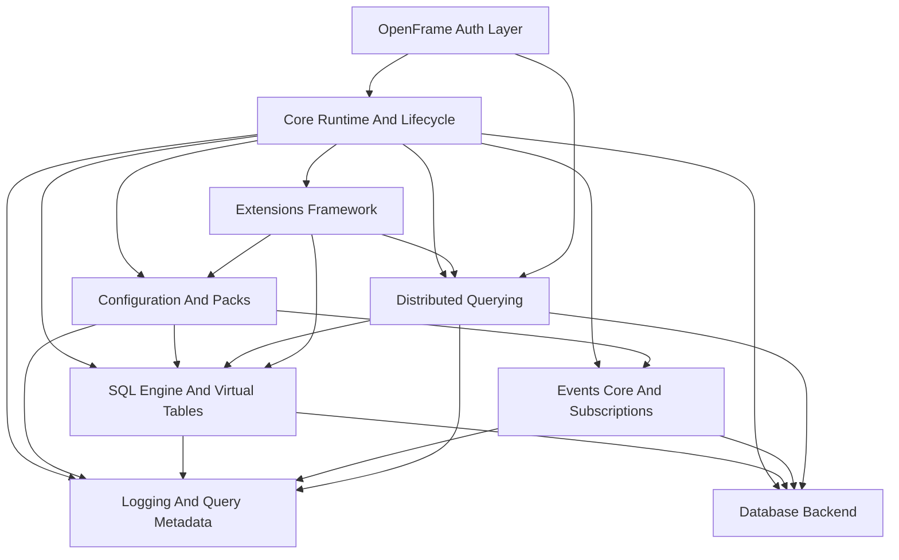
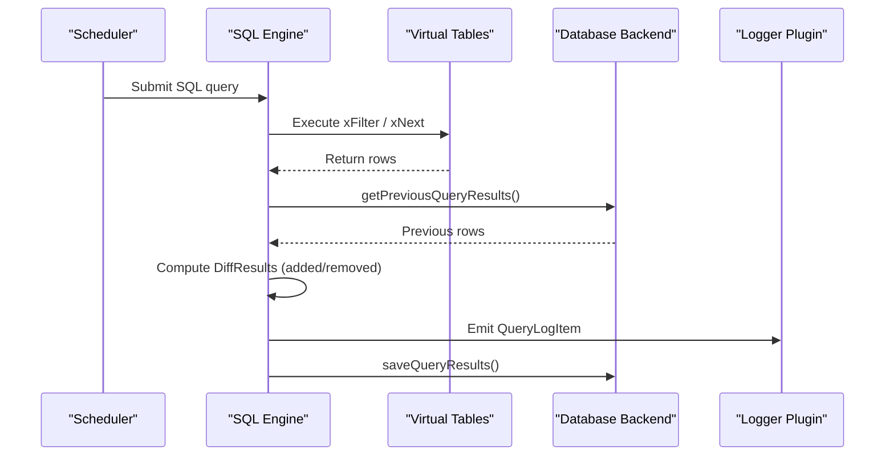
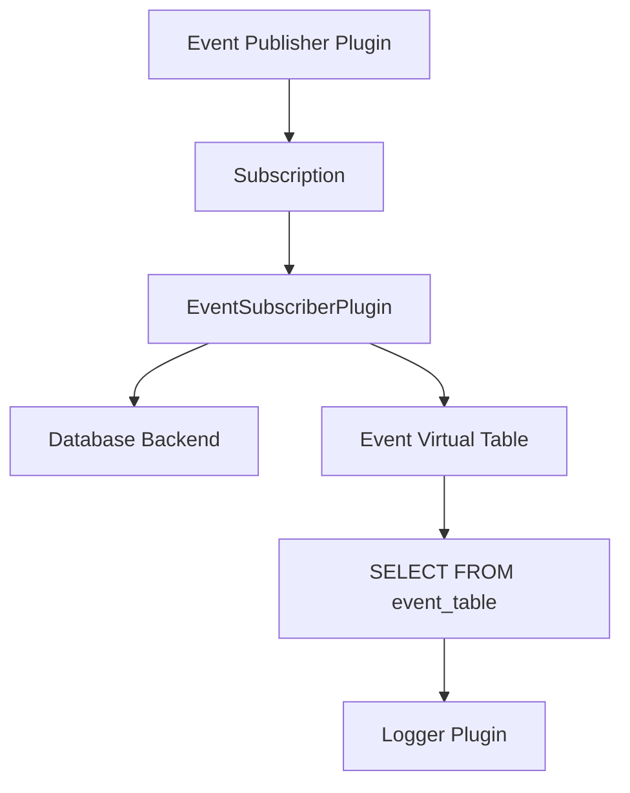
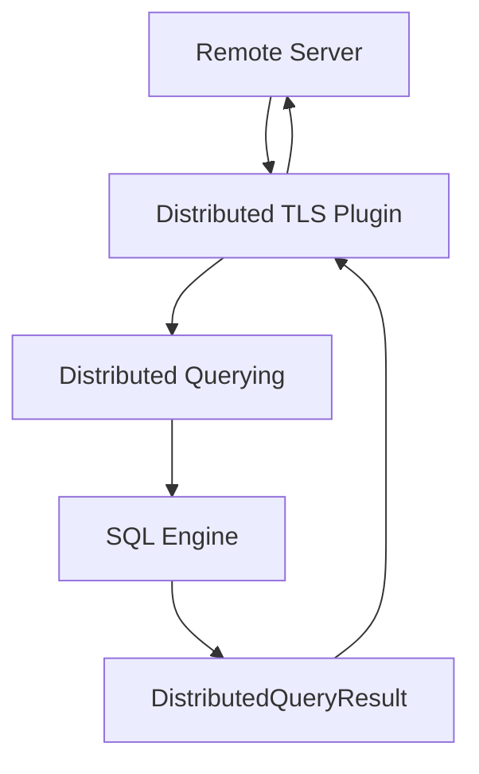
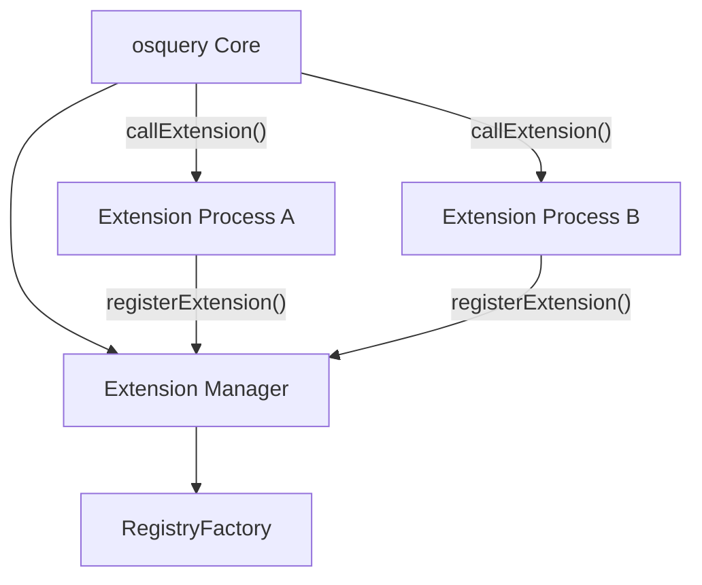
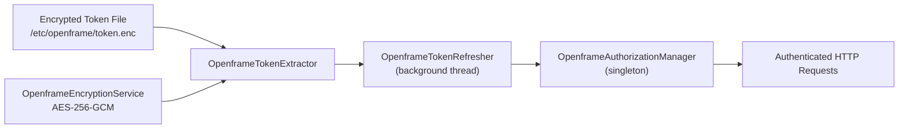
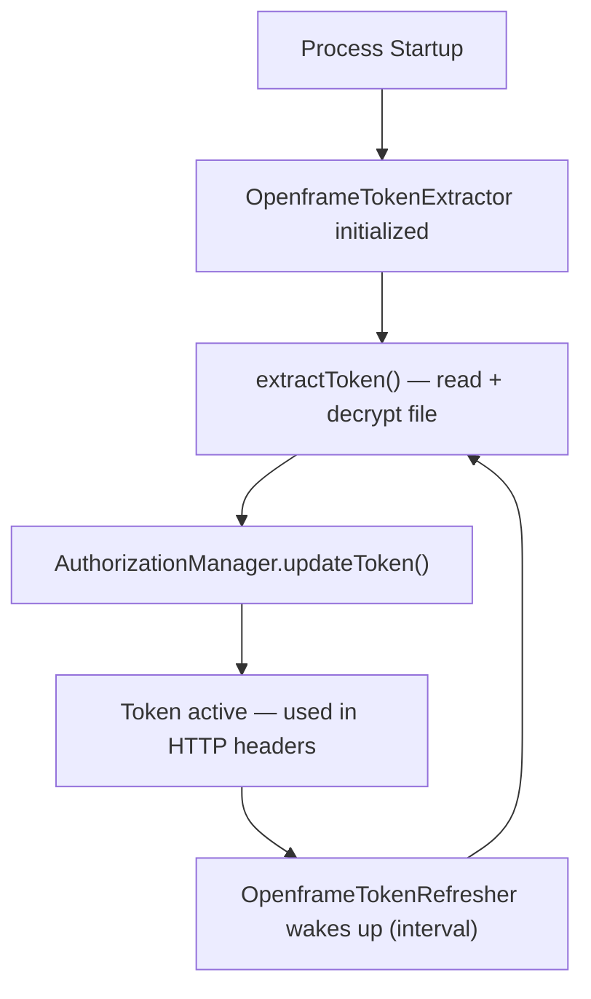

# Architecture Overview

This document describes the high-level architecture of osquery (OpenFrame-enhanced), including core components, data flow, and the OpenFrame authentication layer.

---

## System Architecture

osquery is structured as a modular, plugin-driven runtime. All major subsystems communicate through a **Registry** — a pluggable dispatch mechanism. The **Core Runtime** bootstraps every subsystem in a defined order and coordinates their lifecycle.

---

## Core Components

| Module | Path | Responsibility |
|--------|------|---------------|
| **Core Runtime** | `osquery/core/` | Bootstrapping, flags, watchdog, lifecycle, signal handling |
| **SQL Engine** | `osquery/sql/` | Embedded SQLite, virtual table layer, query planning |
| **Configuration** | `osquery/config/` | Query packs, scheduling, discovery, denylisting |
| **Database Backend** | `osquery/database/` | RocksDB persistence and ephemeral in-memory storage |
| **Logging** | `osquery/logger/` | Result diffing, QueryLogItem, serialization, logger plugins |
| **Events** | `osquery/events/` | Publisher/subscriber system, event persistence |
| **Extensions** | `osquery/extensions/` | Thrift IPC, extension registration, health monitoring |
| **Distributed** | `osquery/distributed/` | Remote query pull, execution, result submission |
| **Remote HTTP** | `osquery/remote/` | Boost.Asio/Beast HTTP client for TLS endpoints |
| **OpenFrame Auth** | `openframe/` | Token management, AES-256-GCM encryption, background refresh |

---

## Query Execution Flow

---

## Event Pipeline

Event-based tables (file events, process events, network events) use a publish/subscribe model:

### Event Model Key Facts

- Publishers run in dedicated threads, collecting OS-level events
- Subscribers transform events into rows and persist them to the database
- SQL queries retrieve time-bounded results via `generateRows()`
- Event expiration windows are schedule-aware

---

## Distributed Query Flow

Pull-based model — osquery polls the server for pending queries, executes them locally, and submits results back over TLS.

---

## Extensions Framework

Extensions allow third-party processes to register new tables, config providers, and loggers without modifying the osquery binary:

Communication uses **Apache Thrift** over UNIX domain sockets (Linux/macOS) or named pipes (Windows).

---

## OpenFrame Authentication Layer

The OpenFrame extensions add a secure authentication pipeline:

| Component | Responsibility |
|-----------|---------------|
| `OpenframeEncryptionService` | AES-256-GCM decryption with OpenSSL, Base64 decode |
| `OpenframeTokenExtractor` | Reads encrypted token file, returns plaintext token |
| `OpenframeTokenRefresher` | Background thread that periodically calls `extractToken()` |
| `OpenframeAuthorizationManager` | Singleton that stores and serves the current bearer token |
| `OpenframeAuthorizationManagerProvider` | Only class permitted to construct the manager (friend pattern) |

### Token Lifecycle

---

## Database Domains

The Database Backend organizes all persistent state into well-known domains:

| Domain | Used By |
|--------|---------|
| `configurations` | Configuration And Packs |
| `queries` | Query state diffing |
| `events` | Events Core |
| `logs` | Logger plugins |
| `carves` | File carver |
| `distributed` | Distributed Querying |
| `query_performance` | Performance tracking |

---

## Process Modes

osquery runs in several distinct modes:

| Mode | Binary | Description |
|------|--------|-------------|
| **Shell** | `osqueryi` | Interactive SQL shell for ad-hoc queries |
| **Daemon** | `osqueryd` | Scheduled query execution in background |
| **Watcher** | (internal) | Supervises worker process and restarts on failure |
| **Worker** | (internal) | Actual query execution, spawned by watcher |
| **Extension** | custom binary | External process registering new capabilities |

---

## Key Design Decisions

1. **Registry-based plugins** — All major subsystems (SQL, config, logger, database, distributed) are pluggable via the Registry pattern, enabling replacement without core changes.

2. **Virtual table layer** — OS data is never stored unless queried; virtual tables are instantiated on demand, keeping memory usage low.

3. **Differential logging** — Only changed rows (added/removed) are logged by default, reducing output volume significantly.

4. **Out-of-process extensions** — Thrift IPC isolates extension crashes from the core process.

5. **Watchdog supervision** — Watcher/worker separation ensures daemon resilience; a crashing worker is restarted automatically.

6. **OpenFrame auth separation** — The authentication layer is implemented as a separate C++ module under `openframe/`, keeping it isolated from the core osquery codebase.

---

## Reference Documentation

For detailed per-module documentation, see the auto-generated reference architecture docs:

- [Core Runtime And Lifecycle](./reference/architecture/core-runtime-and-lifecycle/core-runtime-and-lifecycle.md)
- [SQL Engine And Virtual Tables](./reference/architecture/sql-engine-and-virtual-tables/sql-engine-and-virtual-tables.md)
- [Configuration And Packs](./reference/architecture/configuration-and-packs/configuration-and-packs.md)
- [Database Backend](./reference/architecture/database-backend/database-backend.md)
- [Events Core And Subscriptions](./reference/architecture/events-core-and-subscriptions/events-core-and-subscriptions.md)
- [Extensions Framework](./reference/architecture/extensions-framework/extensions-framework.md)
- [Distributed Querying](./reference/architecture/distributed-querying/distributed-querying.md)
- [Logging And Query Metadata](./reference/architecture/logging-and-query-metadata/logging-and-query-metadata.md)
- [Remote HTTP Client](./reference/architecture/remote-http-client/remote-http-client.md)
