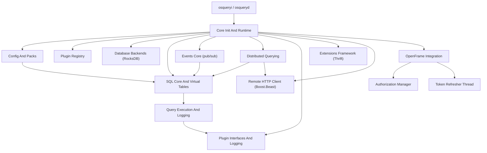
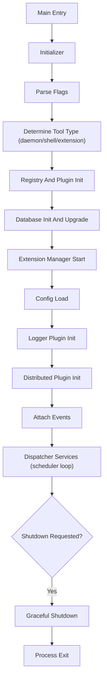
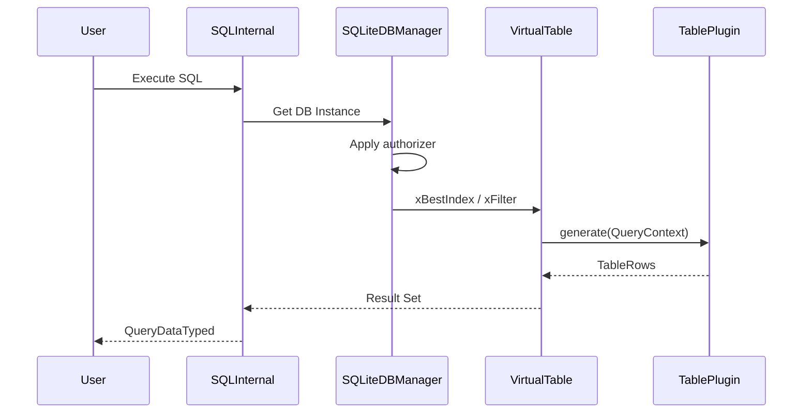
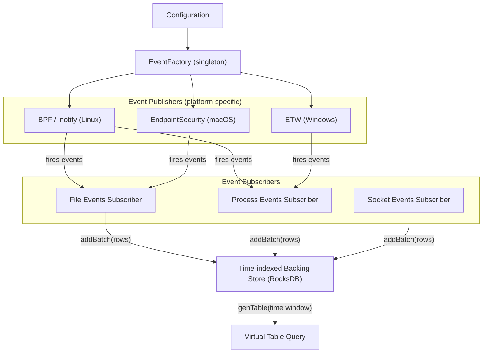
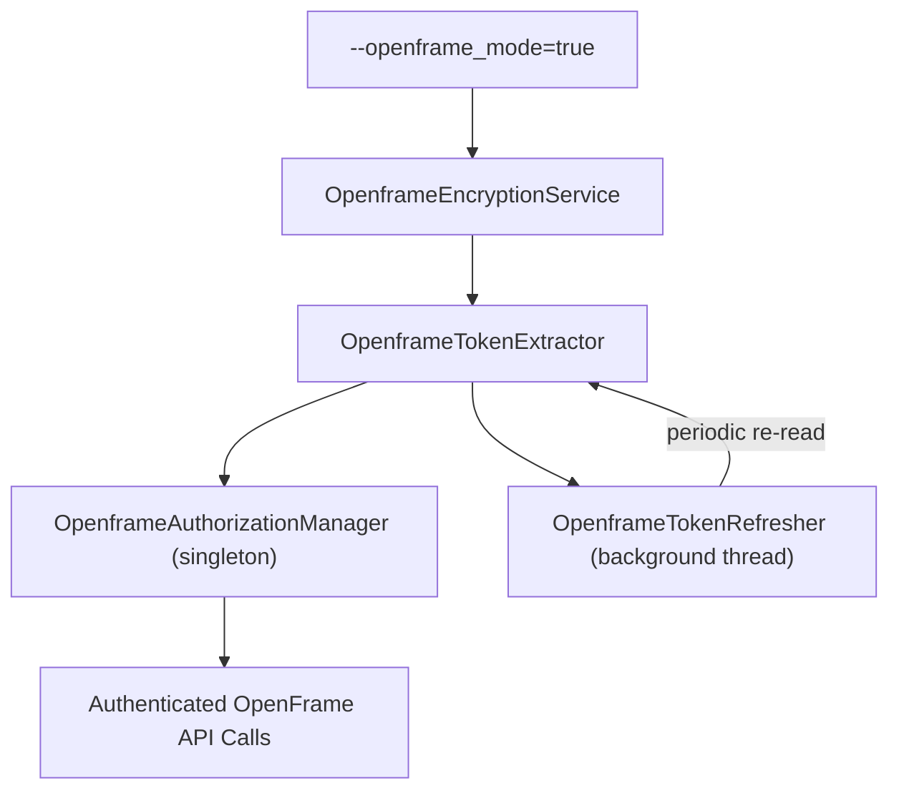
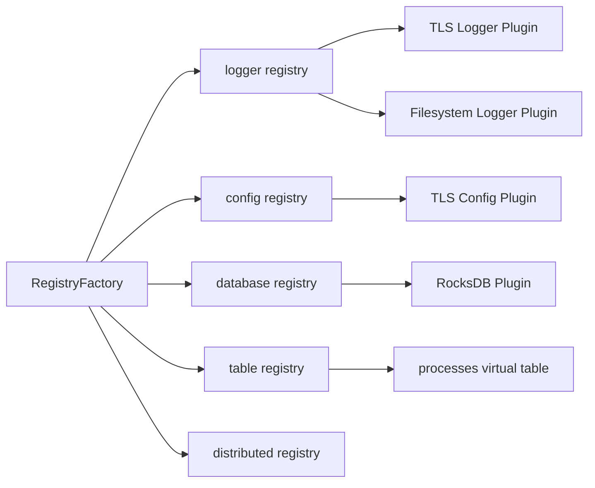
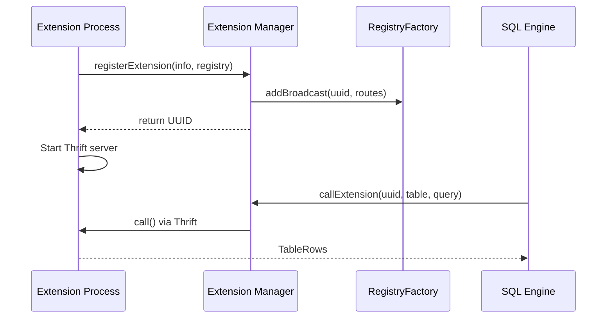

# Architecture Overview

This document describes the high-level architecture of osquery with the OpenFrame integration. For deep-dive reference documentation, see the individual module docs in `docs/reference/architecture/`.

---

## System Architecture

osquery is a layered, plugin-driven C++ application. At its core is an embedded SQLite engine that exposes OS state through virtual tables. An event framework captures real-time activity, a distributed query system handles remote work, and the OpenFrame integration provides authenticated connectivity to the Flamingo MSP platform.

### High-Level Architecture Diagram

---

## Core Components

| Module | Location | Responsibility |
|--------|----------|---------------|
| **Core Init And Runtime** | `osquery/core/` | Bootstrapping, flag parsing, lifecycle |
| **SQL Core And Virtual Tables** | `osquery/sql/` | SQLite engine, virtual table integration, constraint pushdown |
| **Events Core** | `osquery/events/` | Publish/subscribe framework for real-time OS events |
| **Config And Packs** | `osquery/config/` | Configuration loading, query scheduling, pack management |
| **Database Backends** | `osquery/database/` | RocksDB (persistent) and ephemeral key-value storage |
| **Distributed Querying** | `osquery/distributed/` | Pull-execute-push model for remote query orchestration |
| **Extensions Framework** | `osquery/extensions/` | Apache Thrift-based runtime plugin injection |
| **Remote HTTP Client** | `osquery/remote/` | Boost.Asio + Boost.Beast HTTP/HTTPS with TLS |
| **Hashing** | `osquery/hashing/` | MD5, SHA1, SHA256 for integrity verification |
| **Filesystem And Fileops** | `osquery/filesystem/` | Cross-platform file access primitives |
| **Plugin Interfaces And Logging** | `osquery/core/plugins/` | Logger plugin interface, status log routing |
| **OpenFrame Integration** | `openframe/` | Token lifecycle, encryption, and auth management |

---

## Runtime Boot Flow

The `Initializer` class in Core Init And Runtime orchestrates the entire startup sequence:

---

## SQL Execution Data Flow

Every SQL query follows this path from user input to result rows:

The key security feature here is the SQLite **authorizer** — it enforces an allowlist of permitted SQL actions and PRAGMA statements. Any non-allowlisted operation is denied at prepare time.

---

## Event Framework Architecture

The Events Core implements a publish/subscribe pattern with persistent backing storage:

---

## OpenFrame Integration Architecture

The OpenFrame integration is an authentication layer that runs alongside the core runtime when `openframe_mode` is enabled:

The `OpenframeAuthorizationManager` is a singleton that uses the **provider pattern** — only `OpenframeAuthorizationManagerProvider` can construct or destroy it, separating token lifecycle from token access.

---

## Plugin Registry

The plugin registry (`osquery/registry/`) is the dependency injection backbone of the entire system. Every major subsystem — loggers, config sources, databases, SQL engines, distributed plugins — is registered and resolved through it.

---

## Extensions Framework

Extensions allow external processes to add virtual tables, loggers, and config sources at runtime:

---

## Key Design Decisions

| Decision | Rationale |
|----------|-----------|
| **Embedded SQLite** | No external database dependency; strict authorizer provides security |
| **Plugin Registry** | All major components are swappable; enables testing with stubs |
| **RocksDB for events** | High write throughput for real-time event ingestion |
| **Apache Thrift for extensions** | Language-agnostic IPC; extensions can be written in any language |
| **Boost.Beast for HTTP** | Production-grade async networking; TLS enforced by default |
| **Provider pattern for OpenFrame auth** | Strict access control to token lifecycle prevents accidental mutation |

---

## Reference Documentation

For detailed module-level documentation, see:

- [./reference/architecture/core-init-and-runtime/core-init-and-runtime.md](./reference/architecture/core-init-and-runtime/core-init-and-runtime.md)
- [./reference/architecture/sql-core-and-virtual-tables/sql-core-and-virtual-tables.md](./reference/architecture/sql-core-and-virtual-tables/sql-core-and-virtual-tables.md)
- [./reference/architecture/events-core/events-core.md](./reference/architecture/events-core/events-core.md)
- [./reference/architecture/config-and-packs/config-and-packs.md](./reference/architecture/config-and-packs/config-and-packs.md)
- [./reference/architecture/database-backends/database-backends.md](./reference/architecture/database-backends/database-backends.md)
- [./reference/architecture/distributed-querying/distributed-querying.md](./reference/architecture/distributed-querying/distributed-querying.md)
- [./reference/architecture/extensions-framework/extensions-framework.md](./reference/architecture/extensions-framework/extensions-framework.md)
- [./reference/architecture/remote-http-client/remote-http-client.md](./reference/architecture/remote-http-client/remote-http-client.md)
- [./reference/architecture/hashing/hashing.md](./reference/architecture/hashing/hashing.md)
