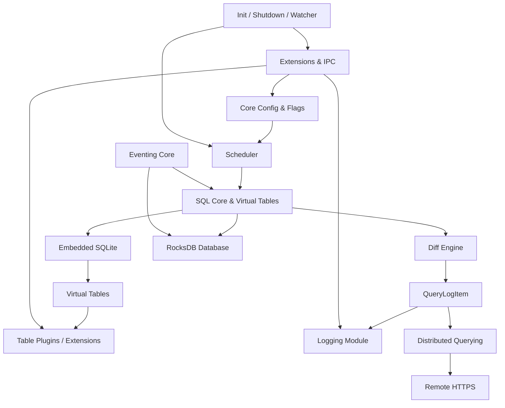
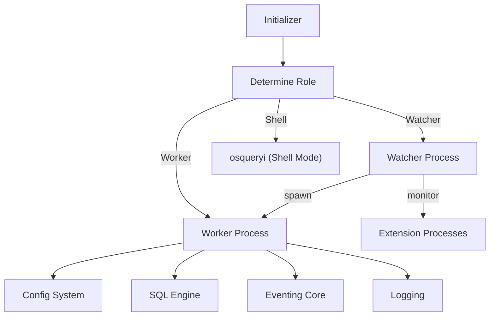
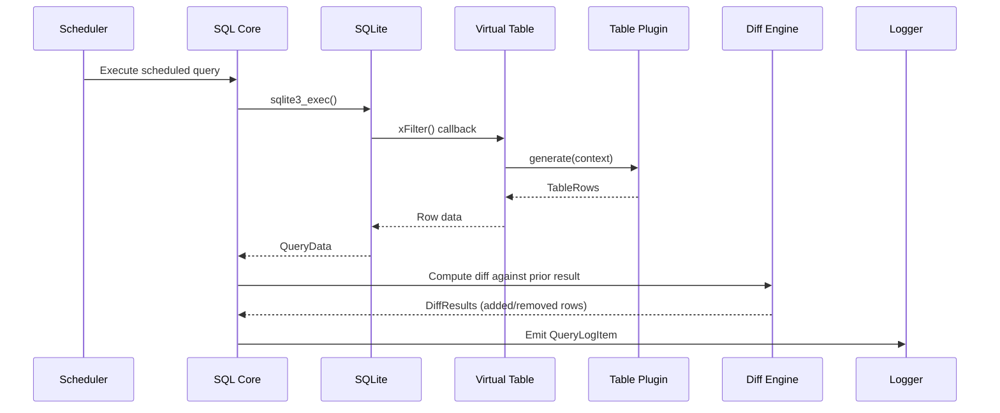
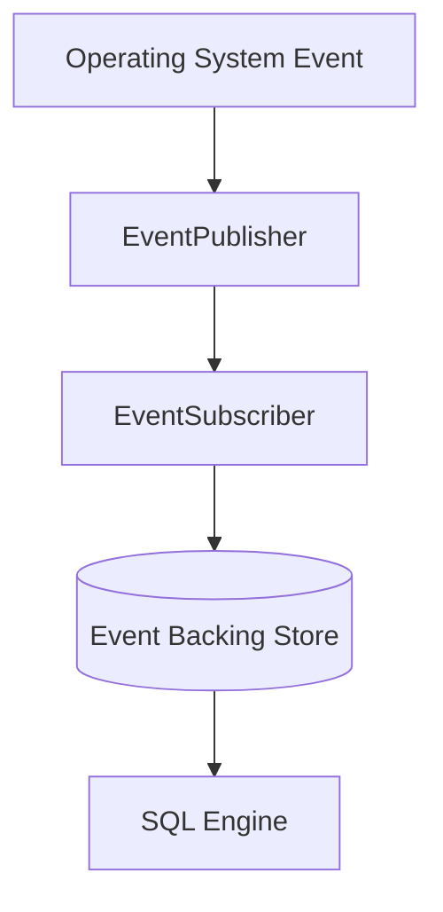
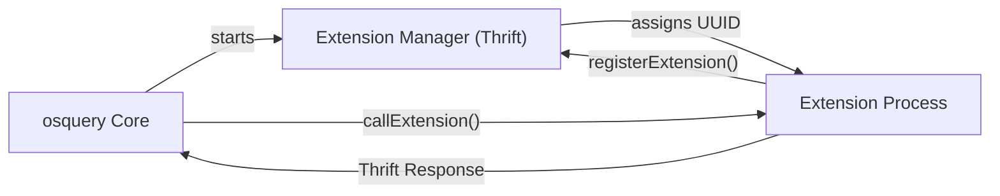
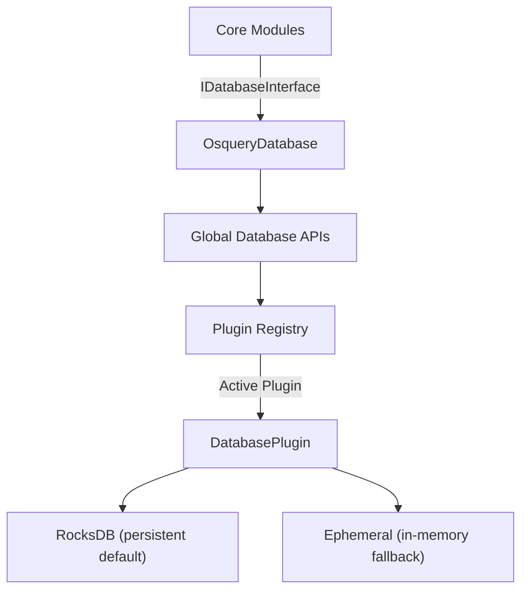
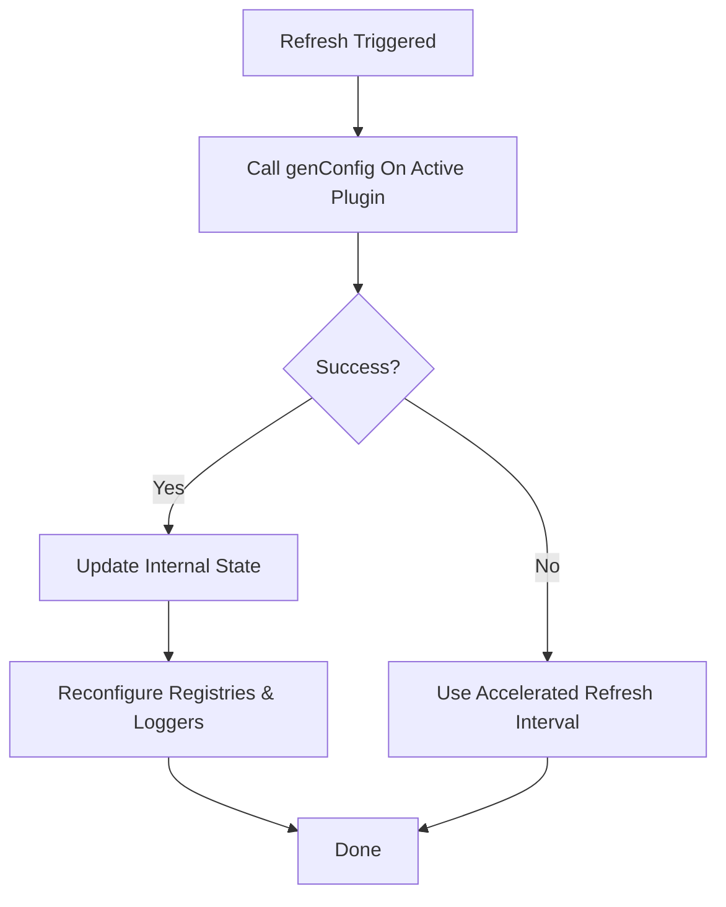
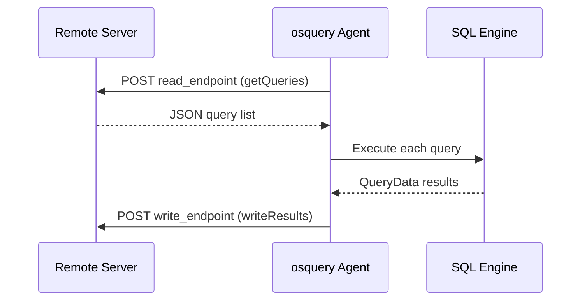

# Architecture Overview

osquery is a modular, layered system built around a SQL execution engine that treats the operating system as a relational database. This document provides a high-level architectural overview, describes each core component, and illustrates key data flows.

---

## High-Level Architecture

---

## Core Components

| Module | Location | Responsibility |
|---|---|---|
| **Core Init/Shutdown/Watcher** | `osquery/core/` | Process lifecycle, multi-process supervision |
| **Core Config & Flags** | `osquery/config/` | Configuration loading, scheduling, flag management |
| **SQL Core & Virtual Tables** | `osquery/sql/` | SQLite embedding, virtual table framework, query execution |
| **Eventing Core** | `osquery/events/` | Publisher–subscriber OS event collection |
| **Database** | `osquery/database/` | RocksDB/ephemeral key-value persistence |
| **Logging** | `osquery/logger/` | Pluggable log emission (filesystem, TLS, Kafka, etc.) |
| **Distributed Querying** | `osquery/distributed/` | Remote SQL orchestration over TLS |
| **Extensions & IPC** | `osquery/extensions/` | Thrift-based cross-process plugin framework |
| **Filesystem & Fileops** | `osquery/filesystem/` | Cross-platform file abstraction |
| **Hashing** | `osquery/hashing/` | MD5/SHA1/SHA256 file and buffer digests |
| **Remote HTTP** | `osquery/remote/` | Boost.Asio/Beast HTTPS client for outbound connections |

---

## Process Model

osquery implements a **watcher/worker** supervision model:

- The **Watcher** (parent process) monitors the worker and all extension processes, enforcing CPU and memory limits.
- The **Worker** (child process) executes all scheduled queries and runs the event subsystem.
- If the worker exceeds resource limits or crashes, the watcher restarts it and may denylist the offending query.
- **Extensions** are separate processes communicating with the core over Thrift/IPC.

---

## SQL Query Lifecycle

This is the path taken by a single scheduled SQL query from configuration to log output:

### Key Security Enforcement Points

- **SQLite Authorizer** — Only allowlisted opcodes are permitted. ATTACH and dangerous PRAGMAs are denied.
- **Required constraints** — Tables with required columns (e.g., `file` requires `path`) are enforced at the virtual table layer.
- **Watchdog limits** — Queries consuming too much CPU or memory cause worker restart and query denylisting.

---

## Eventing System

osquery's event tables capture real-time OS activity via a publisher–subscriber model:

### Platform Publishers

| Platform | Publishers |
|---|---|
| **Linux** | inotify, BPF/eBPF, auditd netlink, udev, syslog |
| **macOS** | FSEvents, IOKit, OpenBSM, EndpointSecurity, SCNetwork |
| **Windows** | ETW (Event Tracing for Windows), WEL, NTFS journal, USN journal |

Event data is persisted in the database and exposed as SQL tables like `file_events`, `process_events`, `socket_events`, and `bpf_process_events`.

---

## Extension & IPC Architecture

osquery is designed to be extended without modifying the core binary:

Extensions communicate over:
- **UNIX domain sockets** (Linux/macOS)
- **Named pipes** (Windows)

Extensions can provide:
- Custom virtual tables
- Config plugins (alternative config sources)
- Logger plugins (alternative log destinations)
- Distributed plugins (alternative orchestration backends)

---

## Database Layer

Domains stored in the database:

| Domain | Contents |
|---|---|
| `queries` | Scheduled query result state (for diff computation) |
| `events` | Persisted event rows from subscribers |
| `distributed` | Distributed query request tracking |
| `distributed_running` | Active distributed execution state |
| `configurations` | Cached config data |
| `query_performance` | Execution time and resource metrics |
| `carves` | File carving session state |

---

## Configuration Lifecycle

Config sources are pluggable:
- **Filesystem** (`--config_path`) — JSON file(s) on disk
- **TLS** (`tls` config plugin) — Remote server via HTTPS
- **Extension** — Any custom plugin registered via the extension framework

---

## Distributed Querying

Queries are denylisted (via SHA-256 hash) if they crash the worker or consume excessive resources.

---

## Key Design Decisions

1. **Single embedded SQLite instance** — Managed by `SQLiteDBManager` as a singleton with transient connection support for concurrency.
2. **Plugin registry pattern** — All extensible components (tables, loggers, config sources, databases) are registered as plugins, enabling runtime composition.
3. **Process isolation** — The watcher/worker model isolates query execution failures from the supervision layer.
4. **Allowlist-only SQL** — The SQLite authorizer denies all dangerous opcodes by default, preventing SQL-injection-style attacks on the agent itself.
5. **Differential results** — Scheduled queries only log changes (added/removed rows), dramatically reducing log volume.

---

## Reference Documentation

For deeper dives into each module, see the reference architecture docs:

- [SQL Core & Virtual Tables](../../reference/architecture/sql-core-and-virtual-tables/sql-core-and-virtual-tables.md)
- [Eventing Core](../../reference/architecture/eventing-core/eventing-core.md)
- [Core Init/Shutdown/Watcher](../../reference/architecture/core-init-shutdown-and-watcher/core-init-shutdown-and-watcher.md)
- [Core Config & Flags](../../reference/architecture/core-config-and-flags/core-config-and-flags.md)
- [Database](../../reference/architecture/database/database.md)
- [Logging](../../reference/architecture/logging/logging.md)
- [Distributed Querying](../../reference/architecture/distributed-querying/distributed-querying.md)
- [Extensions & IPC](../../reference/architecture/extensions-and-ipc/extensions-and-ipc.md)
- [Filesystem & Fileops](../../reference/architecture/filesystem-and-fileops/filesystem-and-fileops.md)
- [Hashing](../../reference/architecture/hashing/hashing.md)
- [Remote HTTP](../../reference/architecture/remote-http/remote-http.md)
