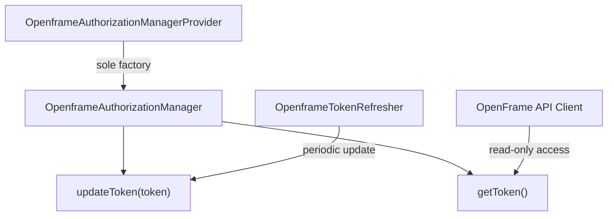
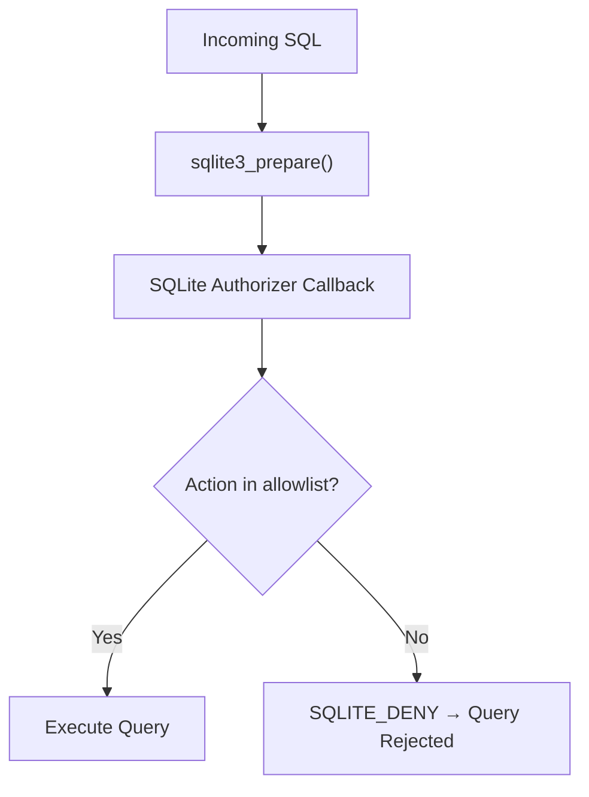

# Security Guidelines

This document covers security best practices for developing, deploying, and extending osquery with the OpenFrame integration.

---

## Authentication and Authorization

### OpenFrame Token Lifecycle

The OpenFrame integration uses a **provider pattern** to enforce strict access control over authentication tokens:



**Key rules:**
- `OpenframeAuthorizationManager` is **non-copyable** (inherits `boost::noncopyable`)
- Constructor and destructor are `private` — only `OpenframeAuthorizationManagerProvider` can create or destroy instances
- Token access is thread-safe via internal synchronization
- Tokens are refreshed by a dedicated background thread; never cached in calling code

### SQLite Authorizer

The embedded SQLite engine enforces a strict **allowlist** of permitted operations. Any SQL action or PRAGMA not on the allowlist is rejected at prepare time:



**Never bypass the authorizer** in custom table implementations. All `generate()` methods receive a sanitized `QueryContext` — do not execute raw SQLite calls outside the virtual table framework.

---

## Secrets and Environment Variables Management

### Token Storage

OpenFrame tokens are read from a file path configured at startup:

```bash
./build/osqueryd \
  --openframe_mode=true \
  --openframe_token_path=/etc/osquery/openframe_token
```

**Best practices for token files:**

```bash
# Set restrictive permissions — only the osquery service user should read this
sudo chown osquery:osquery /etc/osquery/openframe_token
sudo chmod 600 /etc/osquery/openframe_token

# Verify permissions
ls -la /etc/osquery/openframe_token
# Expected: -rw------- 1 osquery osquery
```

### Never Commit Secrets

Add token files and credential stores to `.gitignore`:

```text
# .gitignore — secrets and runtime state
/etc/osquery/openframe_token
*.token
*.pem
*.key
osquery.db/
osquery-db/
/var/osquery/
/tmp/osquery*/
```

### Environment Variables vs. Flag Files

Prefer **flag files** over environment variables for osquery configuration to avoid token exposure in `ps` output or shell history:

```bash
# Create a flagfile (not visible in process arguments)
cat > /etc/osquery/osquery.flags << 'EOF'
--openframe_mode=true
--openframe_token_path=/etc/osquery/openframe_token
--config_path=/etc/osquery/osquery.conf
--logger_path=/var/log/osquery
EOF

# Run with flagfile
sudo ./build/osqueryd --flagfile=/etc/osquery/osquery.flags
```

---

## TLS and Network Security

### Remote HTTP Client Security Defaults

The `Remote HTTP Client` module (`osquery/remote/`) enforces strong TLS by default:

| Security Control | Default |
|-----------------|---------|
| SSLv2 / SSLv3 | **Disabled** |
| MD5 cipher suites | **Disabled** |
| Deprecated OpenSSL APIs | **Disabled** |
| Peer certificate verification | Configurable (verify by default in production) |

**Always enable peer verification for TLS endpoints:**

```bash
# In your osquery config or flagfile
--tls_server_certs=/etc/ssl/certs/ca-certificates.crt
--verify_peer=true
```

### TLS Configuration for Distributed Queries

```json
{
  "options": {
    "tls_server_certs": "/etc/ssl/certs/ca-bundle.crt",
    "tls_client_cert": "/etc/osquery/certs/client.pem",
    "tls_client_key": "/etc/osquery/certs/client.key",
    "verify_peer": true
  }
}
```

---

## Input Validation and Sanitization

### Query Denylisting

The Config And Packs module automatically denylists queries that cause watchdog failures:

- Denylisted queries are persisted in the database
- They are skipped until the denylist entry expires
- This prevents runaway queries from destabilizing the agent

**In custom table implementations**, validate and sanitize all inputs from `QueryContext`:

```cpp
// GOOD: validate constraint before use
if (context.constraints.count("path") > 0) {
  auto paths = context.constraints.at("path").getAll(EQUALS);
  for (const auto& path : paths) {
    // Validate the path before opening
    if (path.empty() || path.find('\0') != std::string::npos) {
      continue; // Skip invalid paths
    }
    // ... process path
  }
}
```

### Config Size and Depth Limits

The configuration parser enforces:

| Limit | Value | Purpose |
|-------|-------|---------|
| Maximum JSON depth | `kMaxConfigDepth` | Prevent stack overflow |
| Maximum config size | `kMaxConfigSize` | Prevent memory exhaustion |

Do not accept configuration from untrusted sources without these limits in place.

---

## Common Vulnerabilities and Mitigations

| Vulnerability | Mitigation in osquery |
|--------------|----------------------|
| SQL injection via virtual tables | SQLite authorizer + constraint-only query context |
| Path traversal in file tables | Validate paths from `QueryContext` before filesystem access |
| Privilege escalation | Run `osqueryd` as a dedicated low-privilege service user |
| Token leakage in logs | `OpenframeAuthorizationManager` never logs token values |
| Unsafe config from TLS server | JSON depth and size limits enforced before parsing |
| Extension process hijacking | UUID validation + SDK version check at registration |
| Memory exhaustion from events | `getEventsExpiry()` and `removeOverflowingEventBatches()` enforce limits |

---

## Least Privilege — Running osquery Safely

### Linux — Dedicated Service User

```bash
# Create a dedicated system user
sudo useradd --system --no-create-home --shell /usr/sbin/nologin osquery

# Set ownership of config and data directories
sudo chown -R osquery:osquery /etc/osquery /var/osquery /var/log/osquery
sudo chmod 750 /etc/osquery /var/osquery /var/log/osquery

# Run as service user (example with systemd)
# In /etc/systemd/system/osqueryd.service:
# User=osquery
# Group=osquery
```

### macOS — LaunchDaemon

```xml
<!-- /Library/LaunchDaemons/io.osquery.agent.plist -->
<key>UserName</key>
<string>_osquery</string>
```

---

## Security Testing and Code Review

### Pre-Commit Checklist

Before submitting a pull request, verify:

- [ ] No secrets, tokens, or API keys in source code or test fixtures
- [ ] New virtual tables sanitize all `QueryContext` constraints before use
- [ ] New network-facing code uses the `Remote HTTP Client` module (not raw sockets)
- [ ] All file paths received from queries are validated
- [ ] New config parameters have documented size/depth limits if they accept user data
- [ ] Thread-shared state uses appropriate synchronization primitives

### Static Analysis

```bash
# Run clang-tidy on changed files
git diff --name-only HEAD~1 | grep -E '\.(cpp|h)$' | \
  xargs clang-tidy -p build --checks='cert-*,clang-analyzer-security.*'

# Run AddressSanitizer build
cmake -S . -B build-asan \
  -DCMAKE_BUILD_TYPE=Debug \
  -DCMAKE_CXX_FLAGS="-fsanitize=address"
cmake --build build-asan --target osqueryi -j$(nproc)
./build-asan/osqueryi "SELECT * FROM processes;"
```

---

## Reporting Security Issues

Do **not** open GitHub Issues for security vulnerabilities.

Report security concerns via the **OpenMSP Slack** community:

- [Join OpenMSP Slack](https://join.slack.com/t/openmsp/shared_invite/zt-36bl7mx0h-3~U2nFH6nqHqoTPXMaHEHA)
- Community site: [openmsp.ai](https://www.openmsp.ai/)
