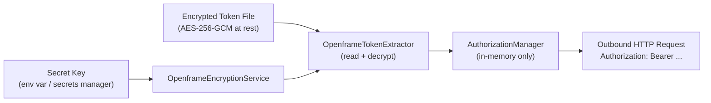

# Security Best Practices

This document covers authentication patterns, encryption, secrets management, input validation, and security testing guidelines for osquery (OpenFrame-enhanced).

---

## Authentication and Authorization

### OpenFrame Token Authentication

The OpenFrame authentication system uses a **bearer token** model secured by AES-256-GCM encryption at rest.

**Key principles:**

- Tokens are never stored in plaintext on disk.
- The encrypted token file is read by `OpenframeTokenExtractor`, which decrypts it using a secret key passed at construction time.
- The plaintext token is held only in memory via the `OpenframeAuthorizationManager` singleton.
- A background thread (`OpenframeTokenRefresher`) rotates the in-memory token periodically, limiting exposure if the in-memory token is somehow leaked.



### Security Rules for Token Handling

- **Do NOT** log the token value at any severity level.
- **Do NOT** print the secret key or token in error messages.
- **Do NOT** store decrypted tokens in configuration files or environment variable dumps.
- **ALWAYS** use `OpenframeAuthorizationManagerProvider` to access the manager — direct construction is private by design.
- **ALWAYS** call `stop()` on `OpenframeTokenRefresher` before destroying it to avoid dangling threads.

---

## Encryption

### AES-256-GCM (OpenframeEncryptionService)

The `OpenframeEncryptionService` provides:

| Parameter | Value |
|-----------|-------|
| Algorithm | AES-256-GCM |
| Key size | 256 bits (32 bytes) |
| IV size | 96 bits (12 bytes) |
| Auth tag | 128 bits (16 bytes) |
| Encoding | Base64 |

**Authentication tag verification** is enforced by AES-GCM — any tampered ciphertext will cause decryption to fail with a `std::runtime_error`. This provides both **confidentiality and integrity**.

#### Correct Usage

```cpp
// Initialize with a 256-bit (32-byte) secret key
OpenframeEncryptionService enc_service("your-32-byte-secret-key-here!!");

try {
    std::string plaintext = enc_service.decrypt(encrypted_payload_base64);
    // Use plaintext; do NOT log it
} catch (const std::runtime_error& e) {
    LOG(ERROR) << "Token decryption failed: " << e.what();
    // Do NOT include the ciphertext or key in the log message
}
```

#### Security Prohibitions

```cpp
// ❌ NEVER do this — logs the plaintext token
LOG(INFO) << "Token: " << plaintext;

// ❌ NEVER do this — hardcodes the secret key in source code
OpenframeEncryptionService enc("hardcoded-secret-key-bad!!!!!");

// ✅ Correct — inject from a secure source
std::string secret = getFromSecretsManager();
OpenframeEncryptionService enc(secret);
```

---

## Secrets Management

### Rules

1. **Never hardcode secrets** — Secret keys, API tokens, and encryption keys must never appear in source code, configuration files, or commit history.

2. **Use environment variables or a secrets manager** — Provide the OpenFrame secret key via:
   - A secrets manager (HashiCorp Vault, AWS Secrets Manager, etc.)
   - A secure environment variable injected at process start time
   - A protected file with `chmod 600` ownership-restricted to the osquery process user

3. **Restrict file permissions** on token files:

```bash
# Token file must be readable only by the osquery service user
sudo chown osquery:osquery /etc/openframe/token.enc
sudo chmod 600 /etc/openframe/token.enc
```

4. **Rotate tokens regularly** — The `OpenframeTokenRefresher` background thread handles periodic rotation of the in-memory token. Ensure your token files are also rotated at the platform level.

5. **Audit secret access** — Log access to the token file path (not its content) to detect unauthorized access attempts.

---

## Input Validation and Sanitization

### SQL Injection Prevention

osquery's SQL engine uses an **authorizer** (`sqliteAuthorizer`) that enforces a strict allowlist of SQL operations:

| Allowed | Denied |
|---------|--------|
| `SELECT`, `READ` | `ATTACH DATABASE` |
| `INSERT`, `UPDATE`, `DELETE` | Unauthorized `PRAGMA` calls |
| `CREATE/DROP TABLE`, `CREATE/DROP VIEW` | File write operations |
| `FUNCTION` calls | Anything not on the allowlist |

When writing extension tables or custom plugins, follow these guidelines:

```cpp
// ✅ Validate all column constraint values before use
if (context.constraints["pid"].existsAndMatches("1")) {
    // safe to process
}

// ✅ Use parameterized operations, not string concatenation
// ❌ NEVER build SQL strings from user input
```

### Extension Plugin Input Validation

When implementing a `TablePlugin`:

- Validate all incoming `QueryContext` constraints before acting on them.
- Reject negative or out-of-range integer constraints.
- Sanitize filesystem paths to prevent path traversal.
- Limit result set sizes to prevent memory exhaustion.

---

## Network Security (TLS Configuration)

The Remote HTTP Client (`osquery/remote/`) supports comprehensive TLS options:

| Option | Recommendation |
|--------|---------------|
| `always_verify_peer` | Set to `true` in production |
| Custom CA path | Pin to your organization's CA bundle |
| TLS version | Use TLS 1.2 or higher |
| Client certificate | Use mutual TLS (mTLS) for sensitive endpoints |

**Never** disable peer verification in production:

```bash
# ❌ Insecure — never use in production
osqueryd --tls_server_certs="" --disable_ciphers="..."

# ✅ Secure — pin to your CA bundle
osqueryd --tls_server_certs=/etc/ssl/openframe-ca.pem
```

---

## Common Vulnerabilities and Mitigations

| Vulnerability | Mitigation |
|--------------|------------|
| Token plaintext logged | Never log token values; review all log calls in auth code |
| Hardcoded secrets in source | Use secrets manager / environment injection; enforce in code review |
| Path traversal in token file path | Validate and sanitize all file paths before opening |
| Memory exposure of decrypted token | Minimize lifetime of plaintext token; zero memory on deallocation where possible |
| TOCTOU on token file | Read file atomically; hold exclusive lock during decrypt |
| SQL injection via distributed queries | Rely on the SQLite authorizer; never execute raw user input without validation |
| Extension process spoofing | Validate extension SDK version and UUID at registration |

---

## Security Testing Guidelines

### Unit Tests for Security-Sensitive Code

When writing or modifying `openframe/` components:

```cpp
// Test that decryption fails on tampered ciphertext
TEST(EncryptionServiceTest, TamperedCiphertextThrows) {
    OpenframeEncryptionService svc("your-32-byte-secret-key-here!!");
    EXPECT_THROW(svc.decrypt("tampered_base64_payload"), std::runtime_error);
}

// Test that empty token file path throws
TEST(TokenExtractorTest, EmptyPathThrows) {
    auto enc = std::make_shared<OpenframeEncryptionService>("key...");
    OpenframeTokenExtractor extractor(enc, "");
    EXPECT_THROW(extractor.extractToken(), std::runtime_error);
}
```

### Code Review Checklist for Security PRs

Before merging any PR touching `openframe/`, `osquery/remote/`, or authentication logic:

- [ ] No secrets or tokens appear in log output.
- [ ] Secret keys are not hardcoded in source or tests.
- [ ] Encryption errors throw exceptions and do NOT silently return empty strings.
- [ ] All file paths are validated before use.
- [ ] Background threads are properly joined on shutdown.
- [ ] No new unsafe SQL execution paths are introduced.
- [ ] TLS peer verification is not disabled.

---

## Environment Variables and Secrets at Runtime

| Variable | Handling |
|----------|---------|
| OpenFrame secret key | Inject via secrets manager; do NOT put in shell history |
| Token file path | Configure in osquery flags; restrict file permissions to `600` |
| TLS certificate paths | Store in `/etc/osquery/` with `640` permissions, `osquery` group |

> **Reminder:** This project uses the [OpenMSP Slack community](https://join.slack.com/t/openmsp/shared_invite/zt-36bl7mx0h-3~U2nFH6nqHqoTPXMaHEHA) for security discussions. For responsible disclosure, reach out there directly.
