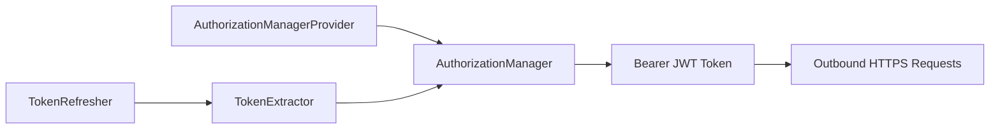
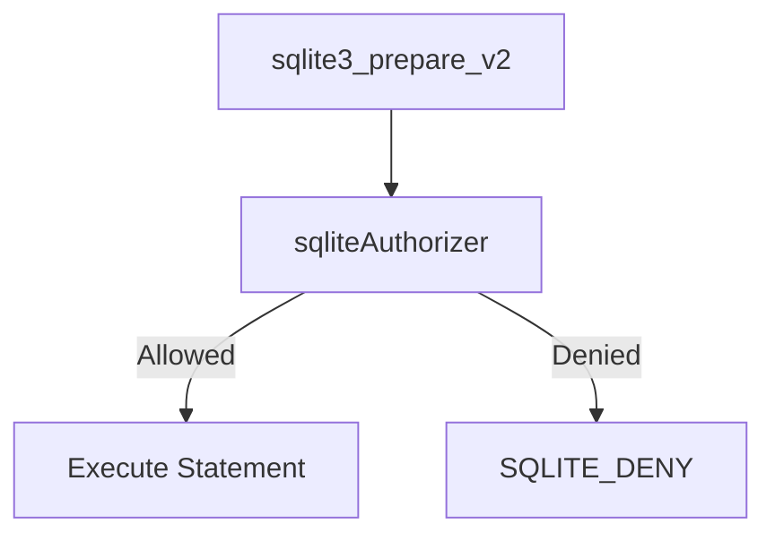

# Security Best Practices

This guide covers security patterns used in osquery with OpenFrame, including authentication, encryption, secrets management, input validation, and common vulnerability mitigations.

---

## Authentication and Authorization

### OpenFrame JWT Token Management

The OpenFrame layer uses a provider-controlled singleton pattern to manage JWT authentication tokens:



**Key principles:**

- `OpenframeAuthorizationManager` is **non-copyable** (`boost::noncopyable`) — tokens cannot be accidentally duplicated
- Only `OpenframeAuthorizationManagerProvider` can construct or destroy the manager (private constructor/destructor)
- The `OpenframeTokenRefresher` runs in a dedicated background thread using `std::atomic<bool>` for lock-free lifecycle control
- Token updates and reads are centralized through `updateToken()` and `getToken()`

**Never:**
- Store JWT tokens in plain text files or environment variables without appropriate OS-level access controls
- Log token values, even at debug level
- Pass tokens as command-line arguments

---

## Encryption

### AES-256-GCM via OpenSSL

The `OpenframeEncryptionService` provides symmetric encryption using AES-256-GCM — an authenticated encryption scheme:

```cpp
// Initialize with a 256-bit secret key
OpenframeEncryptionService enc("my-32-byte-secret-key-goes-here!");

// Decrypt a Base64-encoded AES-256-GCM ciphertext
std::string plaintext = enc.decrypt(ciphertext_base64);
```

**Encryption properties:**

| Property | Value |
|---|---|
| Algorithm | AES-256-GCM |
| Key size | 32 bytes (256-bit) |
| IV (nonce) size | 12 bytes (96-bit) |
| Authentication tag | 16 bytes (128-bit) |
| Encoding | Base64 |

**Security rules:**
- The symmetric key must be exactly 32 bytes
- GCM authentication tag is verified on every decryption — tampered ciphertext throws `std::runtime_error`
- Never reuse nonces for the same key
- Store keys using OS keystore mechanisms or secret management systems, not in source code

---

## SQL Security — The Authorizer

osquery's embedded SQLite engine includes a strict **authorizer** (`sqliteAuthorizer`) that allowlists only safe SQL operations:



**Explicitly allowlisted:**
- `SELECT`, `READ` operations
- Controlled `INSERT`, `UPDATE`, `DELETE` (virtual tables only)
- Virtual table creation and drop
- Limited `PRAGMA` commands

**Explicitly denied:**
- `SQLITE_ATTACH` — cannot attach external database files
- Any non-allowlisted opcode

This prevents osquery from being abused to read arbitrary files via SQLite's `ATTACH` mechanism or execute unsafe operations.

---

## Input Validation

### SQL Query Validation

All SQL submitted through the distributed querying or config channels is:
1. Parsed by the SQLite authorizer before execution
2. Validated against the virtual table schema
3. Size-limited by configuration constraints

### Configuration Validation

The `Config` singleton enforces:
- JSON max depth limits
- JSON max document size limits
- Comment stripping (non-standard JSON is rejected)
- Hash-based change detection to prevent replay attacks

### Extension Registration

Extension processes are validated during registration:
- SDK version compatibility is enforced
- Duplicate extension names are rejected
- Route UUIDs are generated server-side (not client-controlled)

---

## Secrets Management

### Environment-Level Secrets

Never embed secrets in:
- Source code
- CMake configuration
- Build scripts
- Log output

Use OS-level secrets management:

| Platform | Recommended Tool |
|---|---|
| Linux | systemd credentials, HashiCorp Vault, AWS Secrets Manager |
| macOS | Keychain, AWS Secrets Manager |
| Windows | Windows Credential Manager, Azure Key Vault |

### osquery Flag Files

Sensitive flags (TLS certificates, enrollment secrets) should be stored in a flagfile with restricted permissions:

```bash
# Create flagfile with restricted permissions
sudo touch /etc/osquery/osquery.secret.flags
sudo chmod 600 /etc/osquery/osquery.secret.flags
sudo chown root:root /etc/osquery/osquery.secret.flags

# Write sensitive flags
echo "--tls_server_certs=/etc/osquery/server.pem" | sudo tee -a /etc/osquery/osquery.secret.flags
echo "--enroll_secret_path=/etc/osquery/enroll.secret" | sudo tee -a /etc/osquery/osquery.secret.flags
```

Reference the flagfile:

```bash
sudo ./osqueryd --flagfile=/etc/osquery/osquery.secret.flags
```

---

## TLS / HTTPS Communication

### Remote HTTP Client Security

The `Remote HTTP Client` module (`osquery/remote/`) enforces:
- TLS by default for all remote communication
- Peer certificate verification
- Configurable cipher suites
- Custom CA certificate paths
- Timeout enforcement (no hanging connections)

```text
Client::Options options;
options.ssl_connection(true)
       .verify_peer(true)
       .ca_verify_path("/etc/ssl/certs/ca-certificates.crt")
       .timeout(30);
```

**Never disable peer verification in production.** The `verify_peer` flag should only be `false` in isolated development environments.

---

## Common Vulnerabilities and Mitigations

| Vulnerability | Mitigation in osquery |
|---|---|
| **SQL Injection** | Authorizer blocks unsafe opcodes; only allowlisted operations execute |
| **Credential Theft** | JWT tokens non-copyable, stored in singleton with restricted access |
| **Ciphertext Tampering** | AES-256-GCM authentication tag verified on every decrypt |
| **Privilege Escalation** | Watcher/Worker model isolates query execution from the supervisor |
| **External DB Injection** | `SQLITE_ATTACH` explicitly denied by authorizer |
| **Token Replay** | `OpenframeTokenRefresher` rotates tokens on a schedule |
| **Extension Impersonation** | SDK version check and UUID server-assignment prevent spoofing |
| **Resource Exhaustion** | Watchdog enforces CPU/memory limits and respawns workers |
| **Config Tampering** | Hash-based change detection and JSON size/depth limits |

---

## Security Testing

### Running Security-Relevant Tests

```bash
# Build with tests enabled
cmake -S . -B build -G Ninja -DCMAKE_BUILD_TYPE=Debug -DOSQUERY_BUILD_TESTS=ON
cmake --build build --parallel $(nproc)

# Run all tests
cd build && ctest --output-on-failure

# Run specific security-related tests
cd build && ctest -R "tls" --output-on-failure
cd build && ctest -R "config" --output-on-failure
cd build && ctest -R "sql" --output-on-failure
```

### Code Review Checklist for Security

Before submitting any PR that touches security-sensitive code:

- [ ] No secrets or credentials hardcoded
- [ ] All SQL inputs pass through the authorizer
- [ ] AES-GCM nonces are generated freshly (not reused)
- [ ] TLS peer verification is not disabled
- [ ] Error paths do not leak sensitive information in logs
- [ ] New extension APIs validate input size and type
- [ ] Thread-shared state uses proper synchronization primitives
- [ ] New config keys have size/depth validation

---

## Reporting Security Issues

Security vulnerabilities should be reported directly to the Flamingo team through the **OpenMSP Slack community**:

- 💬 [Join OpenMSP Slack](https://join.slack.com/t/openmsp/shared_invite/zt-36bl7mx0h-3~U2nFH6nqHqoTPXMaHEHA)
- 🌐 [https://www.openmsp.ai/](https://www.openmsp.ai/)

> Do not open public GitHub Issues for security vulnerabilities.
