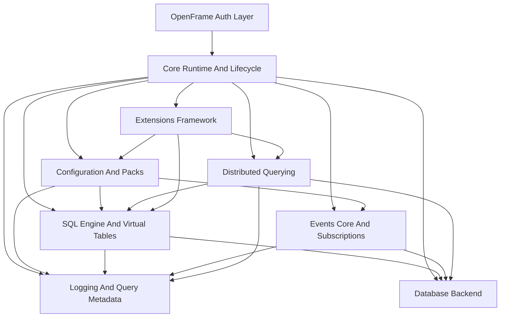
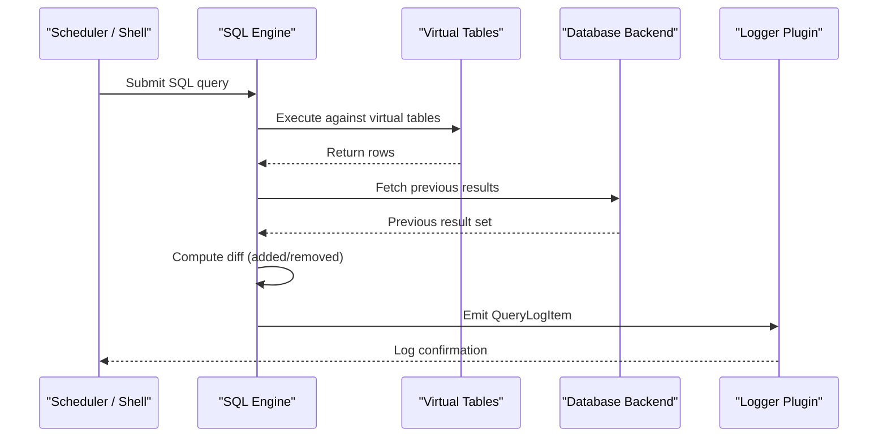

# Introduction to osquery

> **osquery** is a cross-platform operating system instrumentation framework that exposes system state as relational data using SQL. Part of the [Flamingo](https://flamingo.run) / [OpenFrame](https://openframe.ai) platform, this distribution extends the upstream osquery project with OpenFrame-specific authentication, token management, and encryption services.

[](https://www.youtube.com/watch?v=bRd3JCJZ1vc)

---

## What Is osquery?

osquery lets operators, security teams, and infrastructure engineers **query the operating system as if it were a database**. Instead of parsing log files or writing custom scripts, you write standard SQL:

```sql
SELECT name, pid, path FROM processes WHERE on_disk = 0;
```

```sql
SELECT address, mac FROM interface_addresses;
```

```sql
SELECT * FROM users WHERE uid = 0;
```

Under the hood, osquery embeds **SQLite** and implements a virtual table layer that maps OS primitives — processes, files, users, network sockets, kernel state, and more — into relational tables queryable in real time.

---

## Key Features

| Feature | Description |
|---------|-------------|
| **SQL-based OS querying** | Interact with 300+ virtual tables covering every aspect of the OS |
| **Cross-platform** | Runs on Linux, macOS, and Windows with a unified interface |
| **Scheduled queries** | Define query packs that run on a configurable schedule |
| **Event-driven tables** | Subscribe to OS events (file changes, process launches, network connections) |
| **Distributed querying** | Push queries to an entire fleet from a central control plane |
| **Plugin extensions** | Add custom tables, loggers, and config sources without modifying the binary |
| **OpenFrame integration** | Secure token-based authentication with the OpenFrame/Flamingo platform |
| **AES-256-GCM encryption** | Built-in encrypted token storage and retrieval |

---

## OpenFrame Extensions

This distribution adds the following components on top of upstream osquery:

- **`OpenframeAuthorizationManager`** — Singleton manager for securely storing and retrieving the OpenFrame bearer token used to authenticate with OpenFrame services.
- **`OpenframeEncryptionService`** — AES-256-GCM encryption/decryption service that secures tokens at rest.
- **`OpenframeTokenExtractor`** — Reads and decrypts authentication tokens from an encrypted token file on disk.
- **`OpenframeTokenRefresher`** — Background thread that periodically re-extracts and refreshes the authentication token.

---

## Target Audience

osquery is designed for:

- **Security engineers** building endpoint detection and response (EDR) capabilities
- **Infrastructure operators** requiring real-time system observability
- **MSP technicians** using the Flamingo/OpenFrame platform for managed IT operations
- **Developers** extending osquery with custom tables and plugins

---

## System Architecture Overview



### Architectural Layers

| Layer | Responsibility |
|-------|---------------|
| **Core Runtime** | Bootstrapping, flags, lifecycle, watchdog, shutdown |
| **SQL Engine** | Query parsing, execution, virtual tables (300+ tables) |
| **Configuration** | Packs, scheduling, dynamic updates |
| **Database Backend** | Persistent RocksDB and ephemeral key–value storage |
| **Logging** | Structured result serialization and emission |
| **Events** | Real-time event ingestion and exposure as tables |
| **Distributed** | Remote query retrieval and result submission |
| **Extensions** | External plugin injection via Thrift IPC |
| **OpenFrame Auth** | Token lifecycle, AES-256-GCM encryption, background refresh |

---

## Query Execution Flow



---

## Two Execution Modes

**`osqueryi`** — Interactive shell for ad-hoc queries:

```bash
osqueryi
osquery> SELECT name, version FROM os_version;
```

**`osqueryd`** — Daemon for continuous scheduled execution:

```bash
osqueryd --config_path=/etc/osquery/osquery.conf
```

---

## Getting Started

- Review the [Prerequisites](prerequisites.md) guide to ensure your environment is ready.
- Follow the [Quick Start](quick-start.md) to get osquery running in minutes.
- Complete [First Steps](first-steps.md) to explore key features and initial configuration.

---

## Community & Support

Join the open MSP community for questions, discussions, and contributions:

- **Slack**: [OpenMSP Community](https://join.slack.com/t/openmsp/shared_invite/zt-36bl7mx0h-3~U2nFH6nqHqoTPXMaHEHA)
- **Platform**: [https://www.openmsp.ai/](https://www.openmsp.ai/)
- **Flamingo**: [https://flamingo.run](https://flamingo.run)
- **OpenFrame**: [https://openframe.ai](https://openframe.ai)
