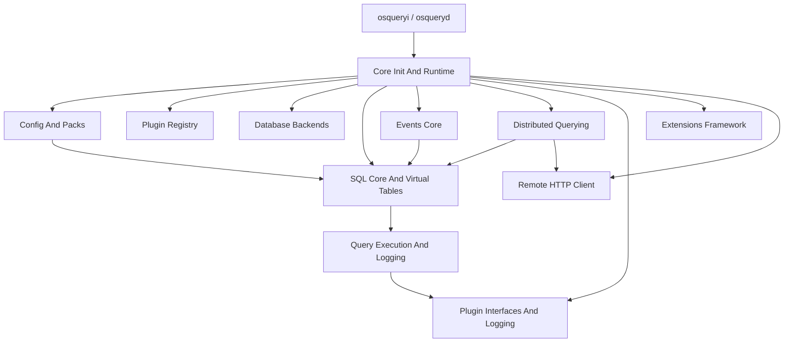
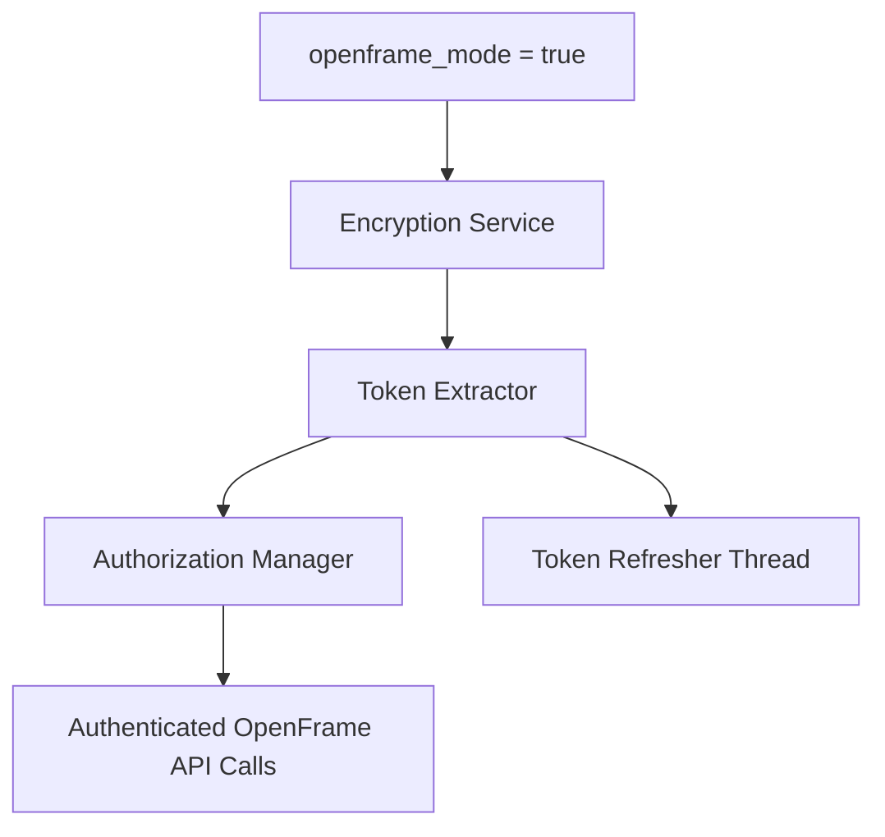

# Introduction to osquery with OpenFrame

**osquery** is a cross-platform operating system instrumentation framework that exposes system state as relational tables and allows it to be queried using SQL. Instead of writing platform-specific scripts to inspect processes, files, users, network state, or kernel events, osquery gives you a unified SQL interface to your entire fleet.

> **Part of the OpenFrame Platform:** This repository includes the **OpenFrame integration** for osquery — enabling authentication, token management, and secure runtime identity for OpenFrame-connected deployments on the [Flamingo](https://flamingo.run) MSP platform.

---

## What Is osquery?

osquery turns your operating system into a queryable relational database. Want to know which processes are listening on which ports? Just write a SQL query. Want to monitor file integrity changes across thousands of endpoints? Schedule a query pack.

```sql
-- Find all listening TCP ports and the processes behind them
SELECT p.name, p.pid, lp.port, lp.protocol
FROM listening_ports lp
JOIN processes p ON lp.pid = p.pid
WHERE lp.protocol = 6;
```

osquery handles the complexity of OS APIs so you never have to.

---

## Key Features

| Feature | Description |
|---------|-------------|
| **SQL Interface** | Query OS state with standard SQL across all platforms |
| **Virtual Tables** | 300+ built-in tables covering processes, network, files, users, and more |
| **Event-Driven Monitoring** | Real-time capture of file changes, process activity, network events |
| **Scheduled Queries** | Continuously run queries and log differential results |
| **Distributed Querying** | Push ad-hoc queries to remote nodes from a control plane |
| **Extensible Plugin System** | Add custom tables, loggers, and config sources via extensions |
| **Cross-Platform** | Linux, macOS, and Windows support |
| **OpenFrame Integration** | Secure token-based authentication for MSP fleet management |

---

## Target Audience

osquery is designed for:

- **Security Engineers** building endpoint detection and response (EDR) workflows
- **SREs and DevOps Teams** monitoring fleet health and configuration drift
- **MSP Technicians** using Flamingo/OpenFrame for unified IT operations
- **Platform Engineers** extending osquery with custom tables and plugins

---

## Architecture Overview

At a high level, osquery is a layered system with a SQL execution engine at its core, an event framework for real-time monitoring, and a distributed querying system for fleet-wide operations.



### Execution Modes

- **Daemon mode (`osqueryd`)** — scheduled and distributed queries running continuously
- **Interactive shell (`osqueryi`)** — ad-hoc SQL exploration
- **Extension processes** — dynamically inject custom plugins at runtime
- **Watcher/Worker model** — supervised execution for stability

---

## OpenFrame Integration

This fork of osquery includes the **OpenFrame** integration layer (`openframe/` directory), which provides:

- **Encryption Service** — secure token storage and retrieval
- **Token Extractor** — reads authentication tokens from configured paths
- **Authorization Manager** — thread-safe token lifecycle management
- **Token Refresher** — background thread keeping credentials fresh

When `openframe_mode` is enabled at startup, osquery seamlessly integrates with the [OpenFrame](https://openframe.ai) unified MSP platform.



---

## YouTube — osquery Overview

[](https://www.youtube.com/watch?v=KbGH9IBELWA)

---

## Getting Started

| Next Step | Description |
|-----------|-------------|
| [Prerequisites](prerequisites.md) | Required tools, hardware, and environment setup |
| [Quick Start](quick-start.md) | Build and run osquery in 5 minutes |
| [First Steps](first-steps.md) | Explore key features after your first successful run |

---

## Community and Support

- **Slack:** [OpenMSP Community](https://join.slack.com/t/openmsp/shared_invite/zt-36bl7mx0h-3~U2nFH6nqHqoTPXMaHEHA) — `https://www.openmsp.ai/`
- **Platform:** [Flamingo](https://flamingo.run) | [OpenFrame](https://openframe.ai)
