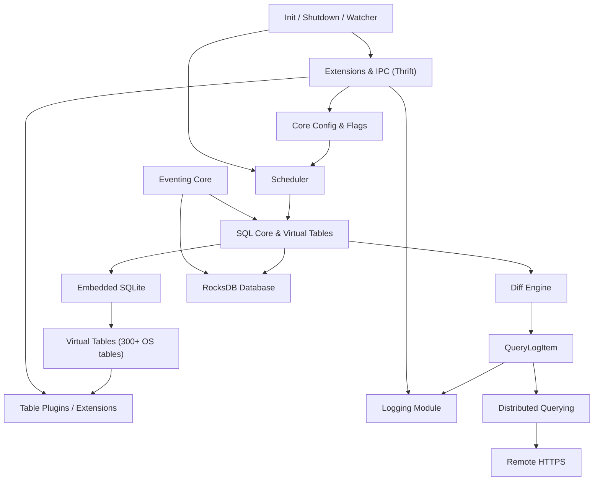

# Introduction to osquery

**osquery** is a high-performance, cross-platform system instrumentation framework that exposes operating system state as a relational database. Rather than parsing logs, running proprietary agents, or writing brittle shell scripts, osquery lets operators query any aspect of a running system — processes, users, files, network sockets, hardware, events — using standard SQL.

> **Part of the Flamingo / OpenFrame ecosystem:** This fork of osquery is maintained by [Flamingo](https://flamingo.run) as a core telemetry engine inside the [OpenFrame platform](https://openframe.ai), providing MSPs with AI-enhanced, SQL-driven endpoint visibility across their entire client fleet.

---

## What Is osquery?

osquery transforms operating-system internals into a **queryable, structured database**. Every piece of information the OS exposes — running processes, loaded kernel modules, installed packages, network connections, file system events — is represented as a virtual SQL table.

```bash
# Which processes are listening on port 443?
SELECT pid, name FROM processes
WHERE pid IN (
  SELECT pid FROM listening_ports WHERE port = 443
);

# Which users have an SSH authorized_keys entry?
SELECT username, key FROM users
JOIN authorized_keys USING (uid);
```

Any SQL-capable operator can immediately interrogate endpoints without learning proprietary query languages.

---

## Key Features

| Feature | Description |
|---|---|
| **SQL interface** | Full SQLite syntax over 300+ virtual OS tables |
| **Cross-platform** | Linux, macOS, and Windows with a unified API |
| **Scheduled queries** | Cron-like query scheduling with differential results |
| **Real-time eventing** | Publisher–subscriber model for file, process, socket, and kernel events |
| **Distributed querying** | Central orchestration of SQL across a fleet over TLS |
| **Extensions** | Thrift-based IPC for adding custom tables and plugins |
| **Pluggable logging** | Filesystem, TLS, Kafka, AWS Kinesis/Firehose, and more |
| **Pluggable config** | Filesystem, TLS, and extension-provided configuration sources |
| **Watchdog supervision** | CPU/memory-aware worker supervision and auto-restart |
| **RocksDB persistence** | Durable local state for events, query results, and metrics |

---

## Target Audience

osquery is designed for:

- **Security engineers** who need continuous, SQL-based host visibility and threat-hunting capability.
- **Platform / SRE teams** who need structured telemetry from thousands of endpoints.
- **MSP operators** using Flamingo / OpenFrame who want AI-assisted, SQL-driven IT automation.
- **Extension developers** who want to add custom tables or integrate proprietary data sources.

---

## Architecture at a Glance



### Core Layers

| Layer | Modules | Role |
|---|---|---|
| **Runtime Control** | Init/Shutdown/Watcher, Config & Flags | Process lifecycle, scheduling, dynamic reconfiguration |
| **SQL Engine** | SQL Core & Virtual Tables | SQLite embedding, virtual table framework, diff engine |
| **Eventing** | Eventing Core | Publisher–subscriber OS event collection |
| **Persistence** | Database | RocksDB / ephemeral key-value store |
| **Output** | Logging | Pluggable result and status emission |
| **Fleet** | Distributed Querying, Remote HTTP | Central SQL orchestration over TLS |
| **Extensibility** | Extensions & IPC | Thrift-based cross-process plugin support |

---

## How Data Flows

1. The **Config** module loads scheduled queries from a file or remote endpoint.
2. The **Scheduler** triggers queries on their configured intervals.
3. **SQL Core** executes each query against the embedded SQLite engine.
4. SQLite calls back into **Virtual Tables**, which invoke the appropriate **Table Plugin**.
5. Results are compared against prior runs by the **Diff Engine**.
6. Changed rows are forwarded to the **Logging** module and optionally the **Distributed** pipeline.
7. Meanwhile, the **Eventing Core** continuously collects OS events (inotify, BPF, ETW, etc.) into the **Database**, making them queryable as event tables.

---

## osquery Binaries

| Binary | Purpose |
|---|---|
| `osqueryi` | Interactive SQL shell for ad-hoc investigation |
| `osqueryd` | Long-running daemon for scheduled query execution and fleet enrollment |

---

## Getting Started

Continue with the following guides:

- [Prerequisites](prerequisites.md) — Software, hardware, and account requirements
- [Quick Start](quick-start.md) — Get osquery running in minutes
- [First Steps](first-steps.md) — Your first five actions after installation
