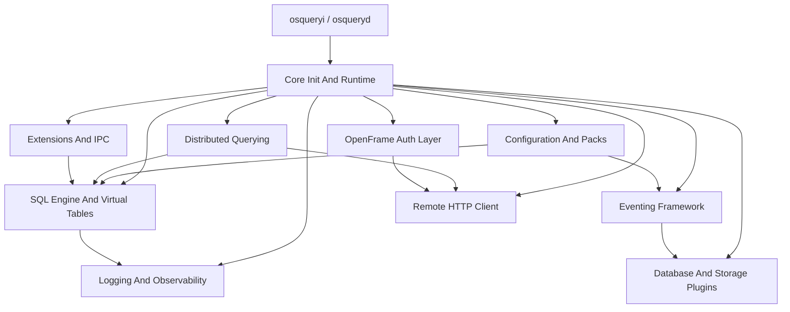

# Introduction to osquery with OpenFrame

**osquery** is a cross-platform operating system instrumentation framework that exposes live system state and activity as relational data — enabling you to query your operating system using SQL.

Built and extended by the [Flamingo / OpenFrame](https://openframe.ai) platform, this distribution integrates osquery's powerful SQL telemetry engine with OpenFrame's AI-driven MSP automation infrastructure.

---

## What is osquery?

osquery transforms every host into a **SQL-queryable telemetry node**. Instead of parsing flat log files or calling proprietary APIs, you write standard SQL queries to explore:

- Running processes and open sockets
- Installed packages and browser extensions
- Kernel modules and hardware inventory
- Filesystem events and user activity
- Network interfaces and firewall rules
- Windows Registry, launchd, systemd units, and much more

```sql
-- Which processes are listening on ports?
SELECT pid, name, port, protocol FROM listening_ports JOIN processes USING (pid);

-- What Chrome extensions are installed?
SELECT u.username, e.name, e.version, e.permissions
FROM users u, chrome_extensions e
WHERE e.uid = u.uid;
```

---

## OpenFrame Integration

This repository extends osquery with the **OpenFrame** authentication and encryption layer:

- **`OpenframeAuthorizationManager`** — Secure, lifecycle-controlled JWT token management
- **`OpenframeEncryptionService`** — AES-256-GCM symmetric encryption via OpenSSL
- **`OpenframeTokenExtractor`** — Token acquisition from OpenFrame services
- **`OpenframeTokenRefresher`** — Background thread for seamless token renewal

These components are part of the [OpenFrame platform](https://www.flamingo.run/openframe) — the unified MSP interface that integrates IT tools under a single AI-driven experience.

---

## Key Features

| Feature | Description |
|---|---|
| **SQL Querying** | Query live OS data with standard SQL via embedded SQLite |
| **Virtual Tables** | 300+ platform-specific tables across Linux, macOS, and Windows |
| **Event Monitoring** | inotify, BPF, FSEvents, ETW, audit — all exposed as queryable tables |
| **Scheduled Queries** | Pack-based query scheduling with differential result tracking |
| **Distributed Queries** | Remote SQL orchestration across fleets via TLS |
| **Extension System** | Runtime plugin model with Apache Thrift IPC |
| **OpenFrame Auth** | AES-256-GCM encrypted JWT token management for OpenFrame services |
| **Cross-Platform** | Linux (x86_64, aarch64), macOS, and Windows support |

---

## Target Audience

osquery with OpenFrame is designed for:

- **IT Operations Teams** using Flamingo/OpenFrame for managed service delivery
- **Security Engineers** building detection and response workflows
- **Fleet Administrators** who need SQL-level visibility across endpoints
- **Developers** building extensions, plugins, or custom table providers
- **MSP Technicians** leveraging Mingo AI and Fae automation through the OpenFrame platform

---

## Architecture Overview



---

## Getting Started

- Review system and software prerequisites in the [Prerequisites Guide](prerequisites.md)
- Follow the [Quick Start Guide](quick-start.md) to build and run osquery in minutes
- Explore common workflows in [First Steps](first-steps.md)

---

## Community and Support

osquery with OpenFrame is part of the [Flamingo](https://flamingo.run) open-source ecosystem.

- 💬 **Community Slack**: [OpenMSP Community](https://join.slack.com/t/openmsp/shared_invite/zt-36bl7mx0h-3~U2nFH6nqHqoTPXMaHEHA)
- 🌐 **OpenMSP**: [https://www.openmsp.ai/](https://www.openmsp.ai/)
- 🚀 **OpenFrame Platform**: [https://openframe.ai](https://openframe.ai)
- 🦩 **Flamingo**: [https://flamingo.run](https://flamingo.run)
