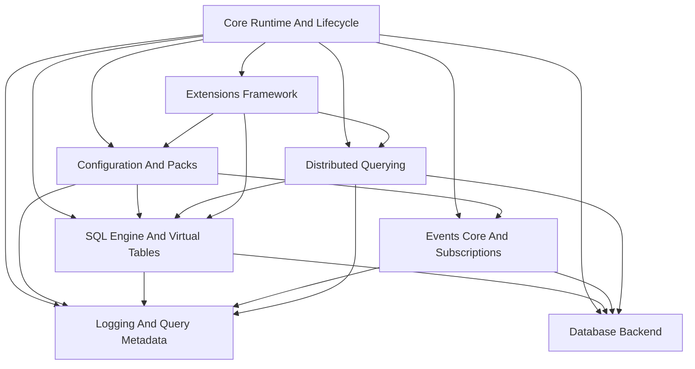
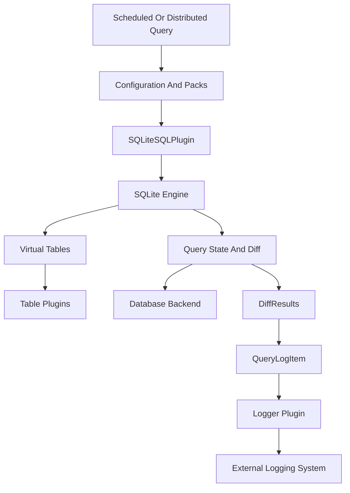
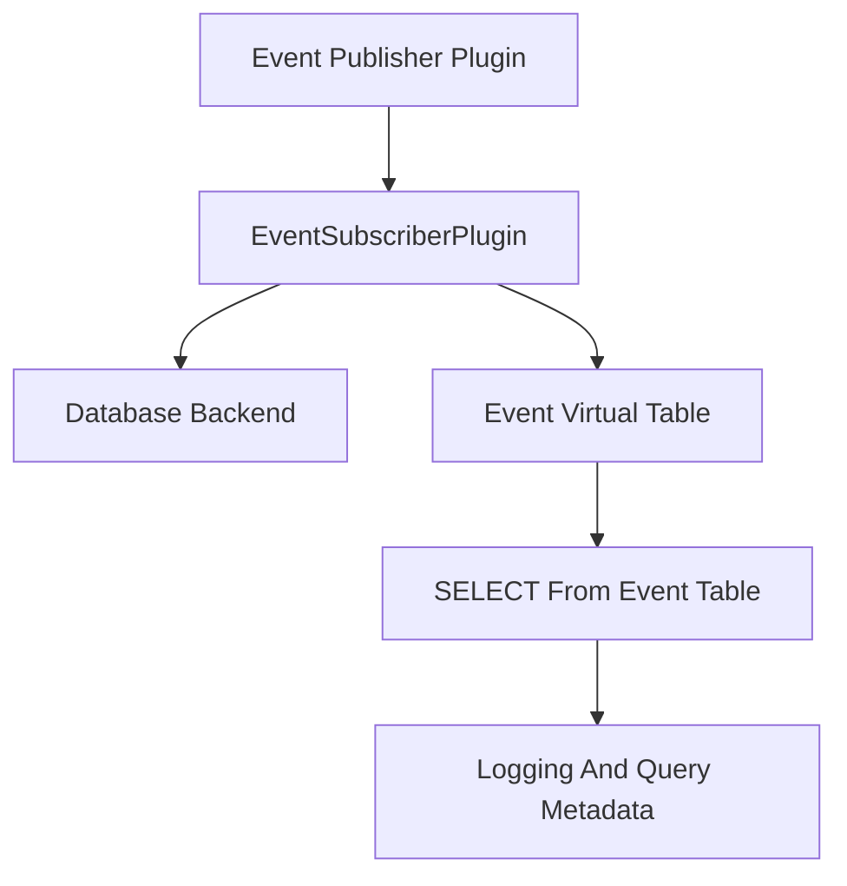
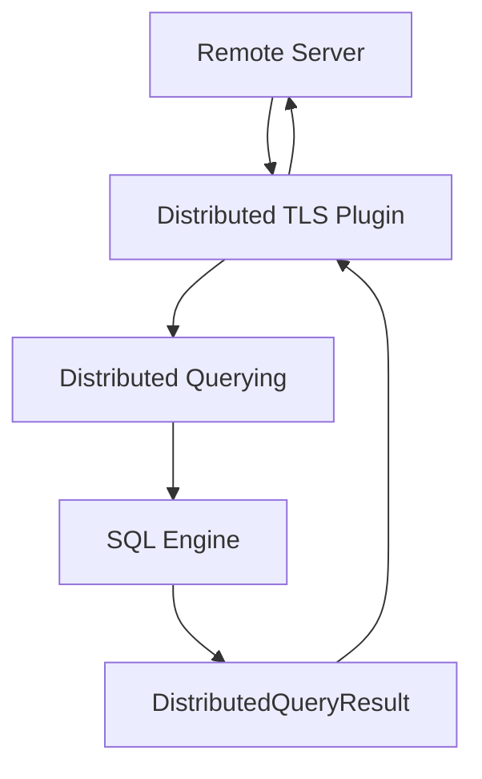

# osquery Repository Overview

## Purpose

**osquery** is a cross-platform operating system instrumentation framework that exposes system state as relational data using **SQL**. It allows operators, security teams, and infrastructure engineers to:

- Query system information (processes, files, users, network, kernel state)
- Schedule and log queries continuously
- Collect and persist system events
- Execute distributed queries from a central control plane
- Extend functionality dynamically through plugins and extensions

At its core, osquery embeds SQLite and implements a virtual table layer that maps operating system primitives into relational tables.

---

# End-to-End Architecture

osquery is structured as a modular runtime composed of subsystems that cooperate through registries, plugins, and well-defined interfaces.

## High-Level System Architecture

### Architectural Layers

| Layer | Responsibility |
|-------|----------------|
| Core Runtime | Bootstrapping, flags, lifecycle, watchdog, shutdown |
| SQL Engine | Query parsing, execution, virtual tables |
| Configuration | Packs, scheduling, dynamic updates |
| Database Backend | Persistent and ephemeral key–value storage |
| Logging | Structured result serialization and emission |
| Events | Real-time event ingestion and exposure as tables |
| Distributed | Remote query retrieval and result submission |
| Extensions | External plugin injection via Thrift IPC |

---

# Query Execution Flow

This diagram shows how a scheduled or distributed query travels through the system.

### Execution Steps

1. Query originates from:
   - Scheduled configuration pack
   - Distributed remote request
   - Interactive shell
2. SQLite engine executes against virtual tables.
3. Previous results are fetched from the database.
4. Differential results are computed.
5. Structured log artifact is built.
6. Results are serialized and emitted via logger plugins.

---

# Event Pipeline

Event-based tables follow a publisher/subscriber model.

### Event Model

- Publishers collect OS-level events (e.g., file, process, network).
- Subscribers transform events into rows.
- Rows are persisted and indexed.
- SQL queries retrieve time-bounded results.
- Expiration is schedule-aware.

---

# Distributed Query Flow

Distributed querying enables fleet-wide remote execution.

Key mechanisms:

- Pull-based query retrieval
- Discovery query filtering
- SHA-based denylisting
- Performance tracking
- Batched result flushing

---

# Core Modules Documentation

Below is a structured overview of the repository’s major modules and their documentation paths.

---

## 1. Core Runtime And Lifecycle  
**Path:** `osquery/core`

Responsible for:

- Process bootstrapping
- Flag management (`FlagDetail`, `FlagInfo`)
- Watchdog and worker supervision
- Plugin activation
- Signal handling and shutdown (`ShutdownData`)
- Forced termination guard (`AlarmRunnable`)

This module orchestrates startup, runtime state transitions, and graceful termination.

---

## 2. Configuration And Packs  
**Path:** `osquery/config`

Responsible for:

- Loading configuration via plugins
- Parsing JSON configs
- Managing scheduled query packs
- Discovery logic and sharding
- Denylisting unstable queries
- Hash-based change detection

Core components:

- `ConfigRefreshRunner`
- `PackStats`
- `Schedule`

Acts as the control plane for scheduled execution.

---

## 3. SQL Engine And Virtual Tables  
**Path:** `osquery/sql`

Implements:

- Embedded SQLite engine
- Virtual table integration (`sqlite3_module`)
- Query planning and type inference
- Constraint pushdown
- Security authorizer

Core components:

- `SQLiteSQLPlugin`
- `SQLiteDBManager`
- `VirtualTable`
- `BaseCursor`

This module turns OS data sources into relational tables.

---

## 4. Database Backend  
**Path:** `osquery/database`

Provides:

- Pluggable database interface
- Domain-based key–value storage
- Persistent RocksDB backend
- Ephemeral in-memory backend
- Schema migration framework

Core components:

- `OsqueryDatabase`
- `EphemeralDatabasePlugin`

Stores query state, performance metrics, configuration, events, and distributed state.

---

## 5. Logging And Query Metadata  
**Path:** `osquery/core`

Transforms execution results into structured logs:

- `QueryLogItem`
- `DiffResults`
- `QueryPerformance`
- `StatusLogLine`

Handles:

- Snapshot vs differential logging
- JSON serialization
- Logger plugin integration

---

## 6. Events Core And Subscriptions  
**Path:** `osquery/events`

Implements:

- Publisher/subscriber event framework
- Event persistence and indexing
- Schedule-aware expiration
- Subscriber context isolation

Core components:

- `Subscription`
- `GenerateRowsResult`
- `SubscriberExpirationDetails`

Enables real-time OS monitoring as SQL tables.

---

## 7. Extensions Framework  
**Path:** `osquery/extensions`

Provides:

- Thrift-based IPC
- Dynamic plugin injection
- RouteUUID-based routing
- Extension health monitoring
- Registry broadcast system

Core components:

- `ExtensionManagerHandler`
- `ImplExtensionClient`
- `UuidGenerator`
- `ExtensionManagerWatcher`

Allows external binaries to extend osquery safely.

---

## 8. Distributed Querying  
**Path:** `osquery/distributed`

Manages:

- Pull-based distributed queries
- Discovery gating
- Denylisting and expiration
- Result batching and flushing

Core components:

- `DistributedQueryRequest`
- `DistributedQueryResult`

Acts as the fleet execution engine.

---

## 9. Remote HTTP Client  
**Path:** `osquery/remote`

Implements:

- Boost.Asio + Boost.Beast HTTP client
- TLS configuration and validation
- Timeout handling
- Proxy support

Used by distributed and config TLS plugins.

---

## 10. Config Plugins  
**Path:** `plugins/config`

Includes:

- `FilesystemConfigPlugin`
- `OptionsConfigParserPlugin`
- `ViewsConfigParserPlugin`
- `DecoratorsConfigParserPlugin`

Transforms raw config into runtime state.

---

## 11. Distributed TLS Plugin  
**Path:** `plugins/distributed`

Implements secure HTTPS transport for distributed queries.

Core component:

- `TLSDistributedPlugin`

---

## 12. Filesystem And Fileops Core  
**Path:** `osquery/filesystem`

Provides:

- Cross-platform file abstraction
- Secure permission validation
- Globbing and recursive path expansion
- Portable `stat` implementation

Used across config, extensions, logging, and tables.

---

## 13. Osquery Shell Devtooling  
**Path:** `osquery/devtools`

Implements `osqueryi` interactive shell:

- SQL execution loop
- Meta commands
- Pretty-print formatting
- Remote extension execution
- CPU profiling (`rusage`)

Core components:

- `callback_data`
- `prettyprint_data`

---

# Architectural Characteristics

- ✅ SQLite-powered relational abstraction
- ✅ Strong plugin and registry model
- ✅ Pluggable persistence backend
- ✅ Differential logging for efficiency
- ✅ Schedule-aware event retention
- ✅ Extension-based modularity
- ✅ Secure TLS distributed execution
- ✅ Cross-platform filesystem abstraction

---

# Conclusion

The **osquery** repository implements a modular, extensible, SQL-based operating system instrumentation platform.

At runtime, it combines:

- A secure embedded SQL engine  
- A dynamic configuration and scheduling layer  
- A pluggable storage backend  
- A structured logging pipeline  
- A real-time event system  
- A distributed query execution engine  
- A Thrift-based extension framework  

Together, these subsystems transform low-level OS primitives into structured, queryable, and remotely orchestratable data — enabling observability, compliance, security monitoring, and fleet-wide introspection at scale.