# osquery Repository Overview

## 1. Purpose of the Repository

**osquery** is a cross-platform operating system instrumentation framework that exposes system state and activity as relational data. It embeds a hardened SQLite engine and represents operating system concepts (processes, files, sockets, users, registry keys, etc.) as **virtual tables**, enabling users to query live system data using SQL.

The repository implements:

- A secure in-memory SQL engine
- A virtual table plugin framework
- Configuration-driven scheduled querying
- Differential result logging and observability
- Distributed query orchestration
- Event-driven monitoring infrastructure
- Persistent and ephemeral storage backends
- Remote HTTP/TLS communication
- Extension-based runtime plugin model

At a high level, osquery transforms a host into a **SQL-queryable telemetry node** with local and distributed control capabilities.

---

# 2. End-to-End Architecture

The system is modular and plugin-driven. Below is the full end-to-end architecture across core subsystems.

## 2.1 System-Level Architecture

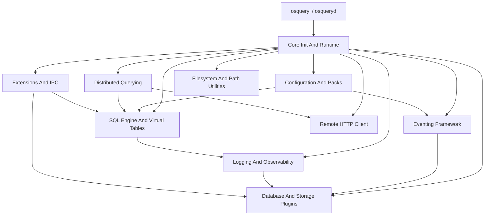

---

# 3. Runtime Execution Model

osquery operates in several runtime modes:

- **Daemon (`osqueryd`)**
- **Interactive shell (`osqueryi`)**
- **Watcher / Worker model**
- **Extension process**

## Runtime Lifecycle

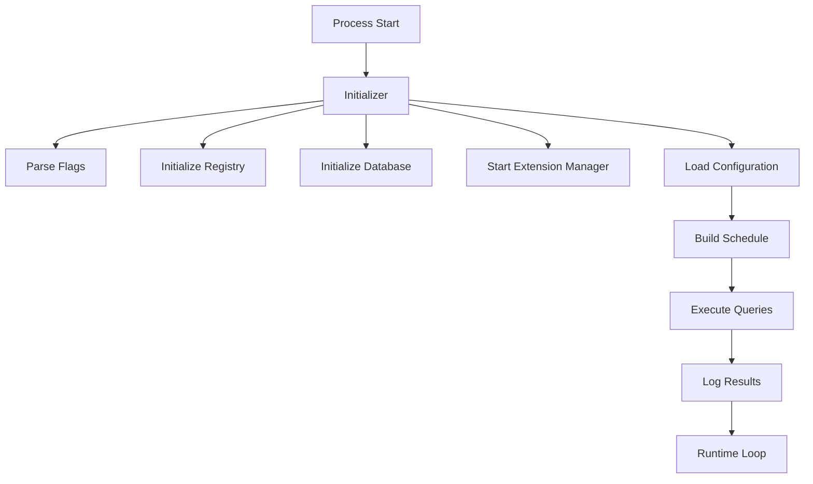

The **Core Init And Runtime** module governs this lifecycle and ensures safe startup, resource enforcement (watchdog), and graceful shutdown.

📘 Reference:  
`osquery/core` → *Core Init And Runtime*

---

# 4. SQL Engine and Virtual Table Layer

The SQL engine is built around an in-memory SQLite instance hardened with a strict authorizer. All system data is exposed via dynamically attached **virtual tables** backed by registry plugins.

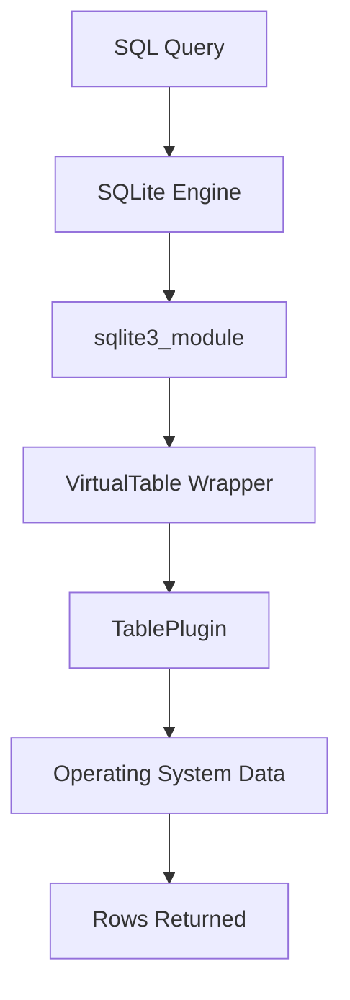

Key characteristics:

- In-memory execution
- Strict opcode allowlisting
- Constraint pushdown
- Projection optimization
- Extension-backed writable tables

📘 Reference:  
`osquery/sql` → *Sql Engine And Virtual Tables*

---

# 5. Configuration and Packs

Configuration defines:

- Scheduled queries
- Packs (query groups)
- Decorators
- File monitoring rules
- Event subscriptions
- Logger configuration
- Runtime options

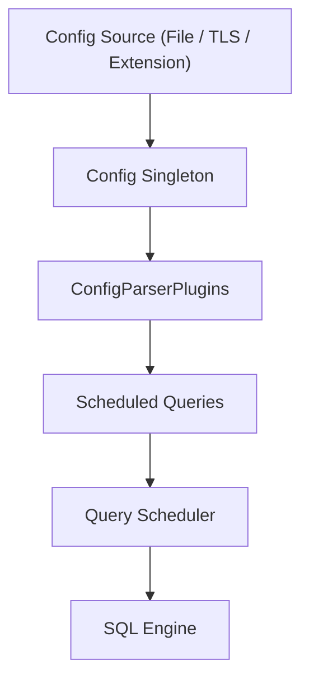

Supports:

- Hash-based change detection
- Background refresh runner
- Query denylisting
- Dynamic registry reconfiguration

📘 Reference:  
`osquery/config` → *Configuration And Packs*

---

# 6. Eventing Framework

The eventing subsystem provides a publish/subscribe model for event-driven monitoring.

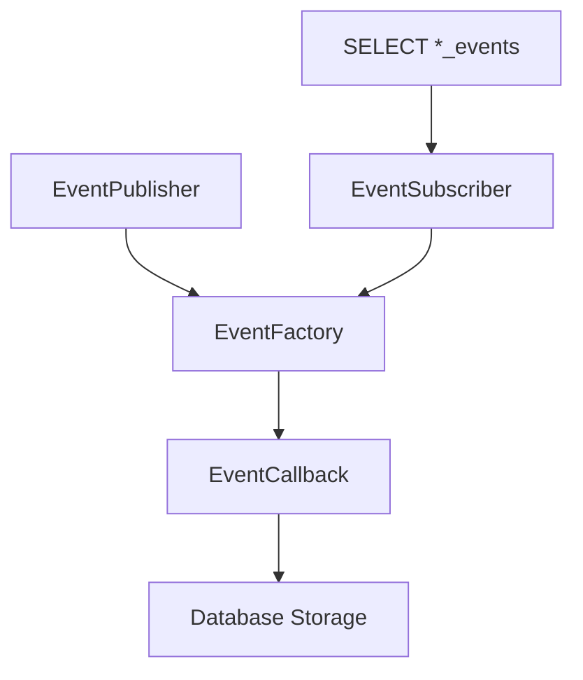

Capabilities:

- Thread-isolated publishers
- Time-window indexing
- Config-driven retention
- Persistent event buffering
- Optimized incremental queries

📘 Reference:  
`osquery/events` → *Eventing Framework And Subscriptions*

---

# 7. Logging and Query Observability

osquery converts query executions into structured log artifacts.

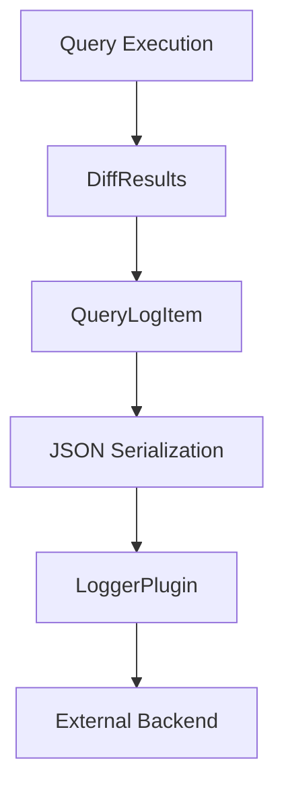

Features:

- Differential result tracking
- Snapshot support
- Structured JSON output
- Performance telemetry
- Pluggable logging backends

📘 Reference:  
`osquery/core` → *Logging And Query Observability*

---

# 8. Database and Storage Plugins

All persistent state is stored through a pluggable key-value interface.

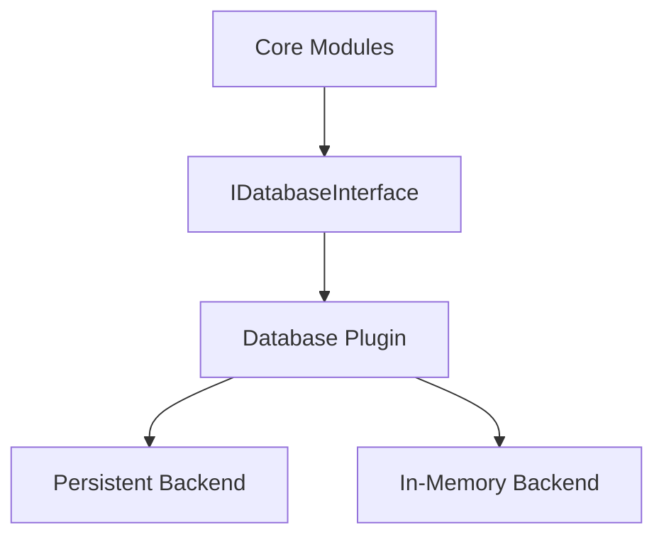

Used for:

- Query state
- Event buffers
- Distributed query tracking
- Configuration backup
- Performance metrics

📘 Reference:  
`osquery/database` → *Database And Storage Plugins*

---

# 9. Distributed Querying

Enables centralized orchestration of SQL across fleets.

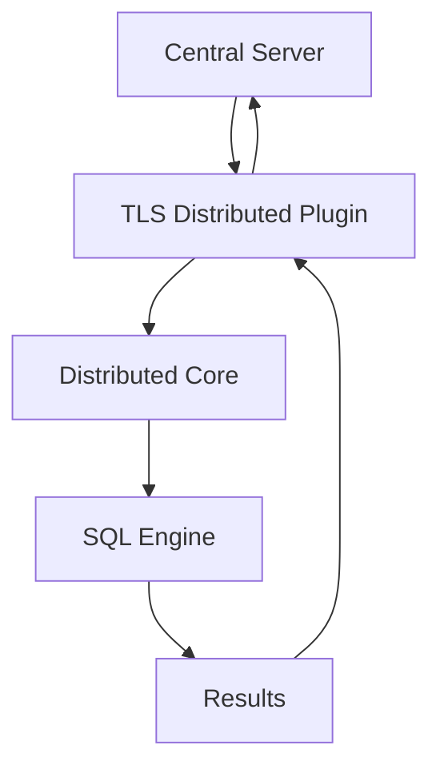

Includes:

- Discovery query gating
- SHA256-based denylisting
- Execution performance tracking
- Pluggable transport interface

📘 Reference:  
`osquery/distributed` → *Distributed Querying*

---

# 10. Extensions and IPC

osquery supports runtime plugin extensions via Apache Thrift IPC.

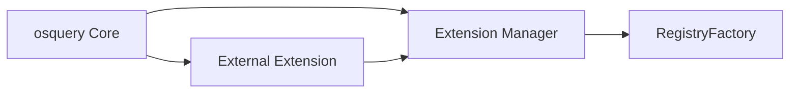

Capabilities:

- Dynamic table plugins
- Remote SQL execution
- UUID-based routing
- Health monitoring
- Secure socket validation

📘 Reference:  
`osquery/extensions` → *Extensions And IPC*

---

# 11. Remote HTTP Client

Provides secure HTTP/TLS transport used by:

- Distributed querying
- Remote logging
- Remote configuration plugins

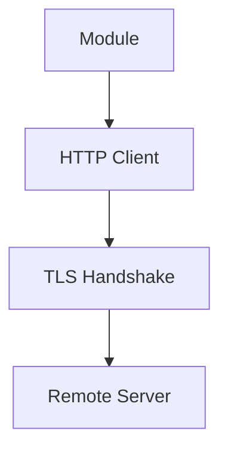

Built on Boost.Asio and Boost.Beast with strict TLS configuration.

📘 Reference:  
`osquery/remote` → *Remote Http Client*

---

# 12. Filesystem and Path Utilities

Cross-platform abstraction for:

- Safe file access
- Glob resolution
- Permission enforcement
- Linux `/proc` inspection
- Windows ACL and metadata handling

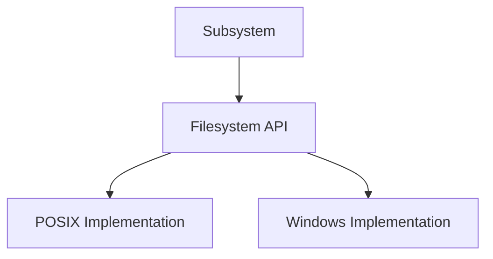

Security-first design ensures safe extension loading and configuration handling.

📘 Reference:  
`osquery/filesystem` → *Filesystem And Path Utilities*

---

# 13. Repository Structure Summary

| Module | Path | Responsibility |
|--------|------|----------------|
| Core Init And Runtime | `osquery/core` | Process lifecycle, flags, watchdog |
| Configuration And Packs | `osquery/config` | Scheduled queries, packs, decorators |
| SQL Engine And Virtual Tables | `osquery/sql` | SQLite engine, virtual table layer |
| Eventing Framework | `osquery/events` | Publisher/subscriber event system |
| Logging And Query Observability | `osquery/core` | Result diffing, structured logs |
| Database And Storage Plugins | `osquery/database` | Persistent state abstraction |
| Distributed Querying | `osquery/distributed` | Remote fleet orchestration |
| Extensions And IPC | `osquery/extensions` | Thrift-based runtime extensions |
| Remote HTTP Client | `osquery/remote` | Secure HTTP/TLS transport |
| Filesystem And Path Utilities | `osquery/filesystem` | Cross-platform file abstraction |

---

# 14. Architectural Principles

1. **SQL as a Universal Interface**
2. **Plugin-Driven Extensibility**
3. **Security-First Execution (SQLite authorizer + permission checks)**
4. **In-Memory Analytical Core**
5. **Config-Driven Behavior**
6. **Differential Logging Efficiency**
7. **Distributed Fleet Control**
8. **Cross-Platform Abstraction Layer**

---

# 15. Conclusion

The `osquery` repository implements a secure, extensible, SQL-based operating system telemetry platform.  

It combines:

- A hardened SQLite execution engine  
- A virtual table plugin architecture  
- Event-driven monitoring  
- Differential logging  
- Distributed query orchestration  
- Runtime extension via IPC  
- Secure remote communication  

Together, these modules form a scalable, production-grade system observability framework capable of operating both locally and as part of a centrally managed fleet.