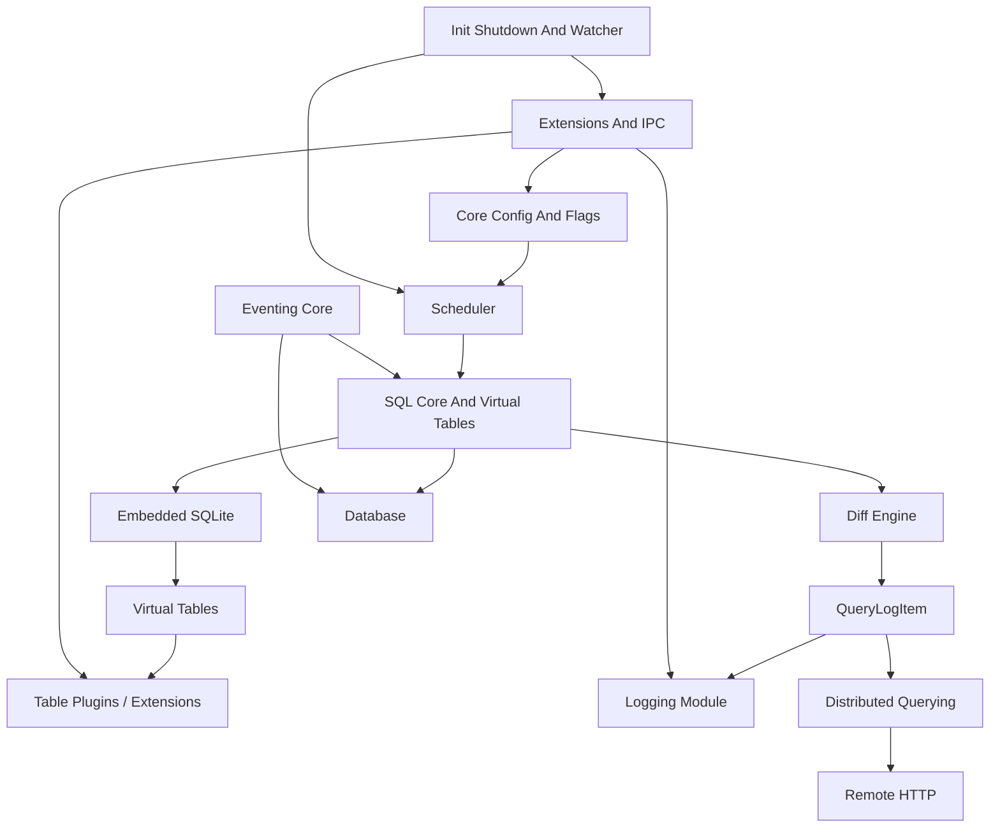
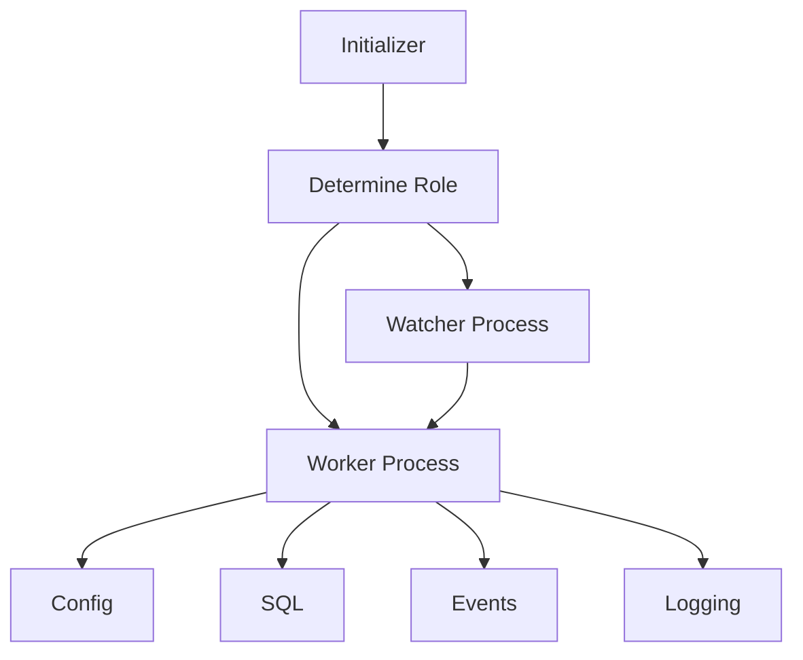
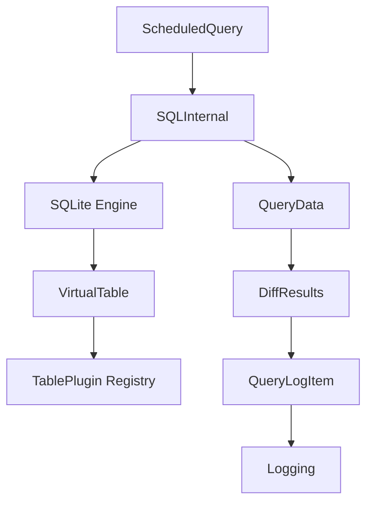
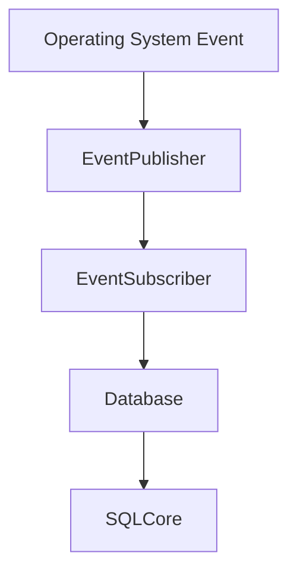
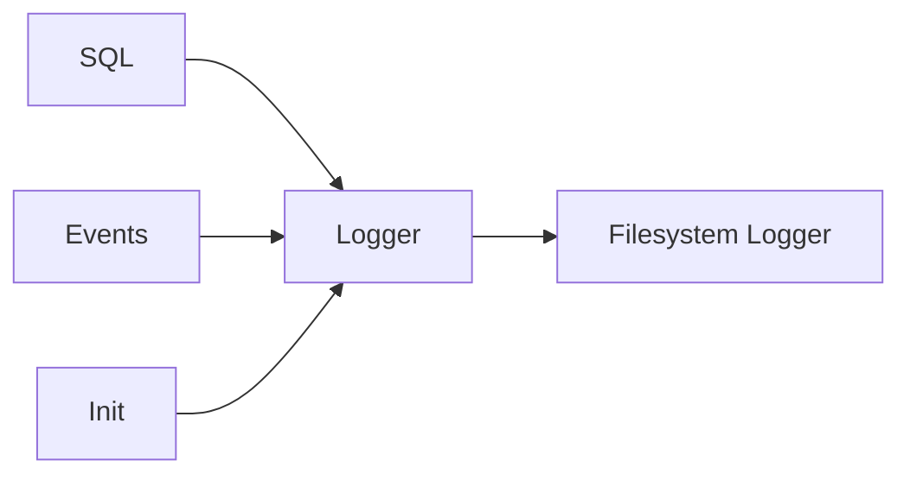
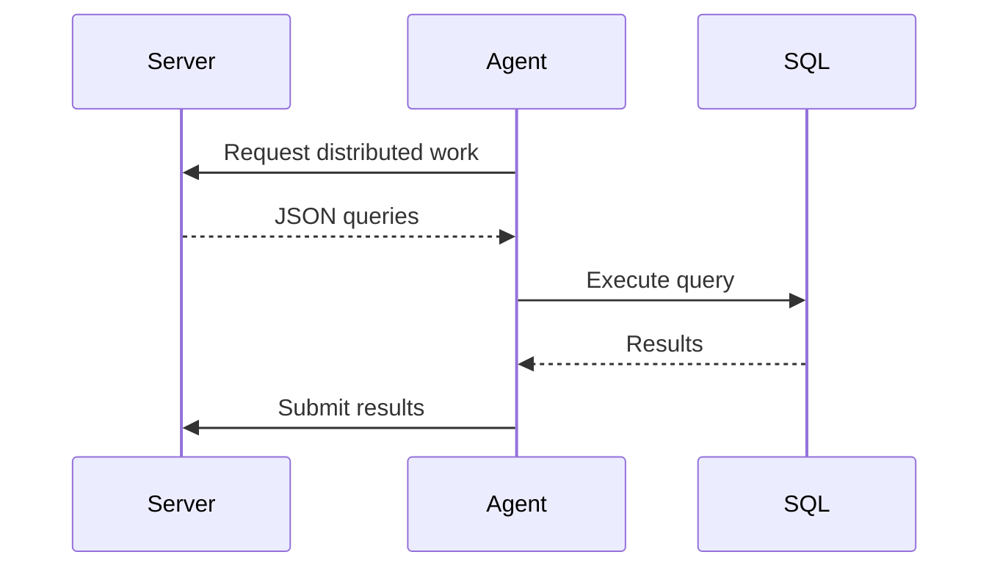
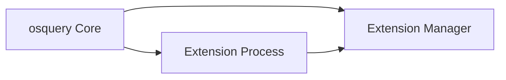
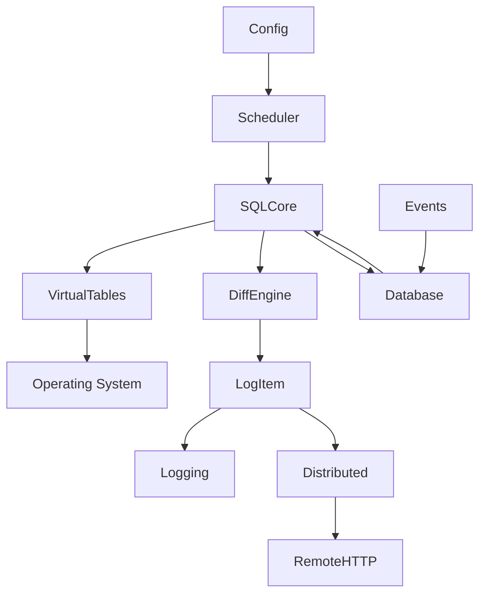

# osquery – Repository Overview

**Repository:** https://github.com/flamingo-stack/osquery  
**Project Type:** Cross-platform system instrumentation and SQL-based telemetry engine  

---

## Purpose of the Repository

`osquery` is a high-performance, cross-platform system instrumentation framework that exposes operating system state as a relational database. It allows operators to query system information using SQL, transforming low-level OS data (processes, files, users, sockets, events, etc.) into structured, queryable tables.

The repository implements:

- A secure embedded SQLite execution engine
- A virtual table framework for system data
- A pluggable configuration and logging system
- A distributed query execution model
- A publisher–subscriber eventing subsystem
- A robust extension and IPC framework
- A cross-platform filesystem abstraction layer
- A pluggable persistent database layer

Together, these modules form a telemetry agent capable of operating in standalone, scheduled, or centrally orchestrated modes.

---

# End-to-End Architecture

The osquery architecture is modular and layered. Below is the complete high-level flow from configuration to data output.



---

# Core Architectural Layers

## 1. Runtime Control Plane

**Modules:**
- Core Init Shutdown And Watcher
- Core Config And Flags

Responsibilities:
- Process lifecycle management
- Worker/watchdog supervision
- Dynamic configuration loading
- Scheduled query orchestration
- Flag and runtime option management

### Process Model



The watcher enforces CPU/memory limits and restarts workers if necessary.

---

## 2. SQL Execution Engine

**Module:**
- SQL Core And Virtual Tables

Responsibilities:
- Embed and control SQLite
- Register osquery tables as SQLite virtual tables
- Execute ad-hoc and scheduled queries
- Compute differential results
- Produce structured logs

### SQL Query Lifecycle



This layer enforces:
- SQLite opcode allowlisting
- PRAGMA restrictions
- Required constraint enforcement
- Controlled virtual table attachment

---

## 3. Eventing System

**Module:**
- Eventing Core

Implements a publisher–subscriber model where:

- **Event Publishers** monitor system activity
- **Event Subscribers** persist events and expose them as tables
- Scheduled queries determine expiration windows



This allows real-time OS activity to be queried via SQL.

---

## 4. Persistent State Layer

**Module:**
- Database

Provides:
- Domain-scoped key–value storage
- RocksDB persistent backend
- Ephemeral in-memory fallback
- Schema versioning and migrations
- Thread-safe reset protection

Used for:
- Scheduled query state
- Event indexes
- Distributed execution tracking
- Performance metrics
- Configuration caching

---

## 5. Logging Pipeline

**Module:**
- Logging

Provides pluggable logging backends via `LoggerPlugin`.

Data sources:
- Scheduled query results
- Distributed query results
- Event tables
- Internal status logs



---

## 6. Distributed Querying

**Module:**
- Distributed Querying

Enables central orchestration of SQL execution across nodes.



Features:
- TLS-based transport plugin
- SHA-256 query hashing
- Denylisting of unstable queries
- Performance recording
- Result serialization

---

## 7. Extensions and IPC

**Module:**
- Extensions And IPC

Provides:
- Thrift-based RPC layer
- Extension Manager
- Registry broadcasting
- External table implementations
- Cross-process plugin support



Extensions can implement:
- Tables
- Config plugins
- Logger plugins
- Distributed plugins

---

## 8. Filesystem and File Operations

**Module:**
- Filesystem And Fileops

Provides:
- Cross-platform file abstraction
- Permission enforcement
- Safe executable validation
- Globbing and traversal
- Read size limits
- Windows ACL parity with POSIX modes

This module underpins:
- Logging
- Database storage
- Extension loading
- File-backed virtual tables

---

## 9. Remote HTTP Transport

**Module:**
- Remote Http

Implements:
- HTTP/HTTPS client
- TLS handling
- Certificate verification
- Proxy support
- Timeout enforcement

Used by:
- Distributed querying
- TLS logging plugins
- Remote configuration retrieval

---

## 10. Hashing Utilities

**Module:**
- Hashing

Provides:
- Streaming SHA256, SHA1, MD5
- Multi-algorithm hashing in single pass
- File and memory buffer hashing

Used by:
- File integrity tables
- Distributed validation
- Logging workflows

---

# Repository Structure

Top-level module directories:

```text
osquery/core
osquery/config
osquery/sql
osquery/database
osquery/events
osquery/extensions
osquery/distributed
osquery/filesystem
osquery/hashing
osquery/remote
plugins/
```

Each directory corresponds to one of the major architectural subsystems described above.

---

# Core Module Documentation References

Below are the primary internal module documentation entry points:

| Module | Documentation |
|--------|---------------|
| Core Config And Flags | `osquery/core`, `osquery/config`, `plugins/config` |
| Core Init Shutdown And Watcher | `osquery/core` |
| SQL Core And Virtual Tables | `osquery/core/sql`, `osquery/sql` |
| Database | `osquery/database` |
| Logging | `osquery/core/plugins`, `plugins/logger` |
| Eventing Core | `osquery/events` |
| Extensions And IPC | `osquery/extensions` |
| Distributed Querying | `osquery/distributed`, `plugins/distributed` |
| Filesystem And Fileops | `osquery/filesystem` |
| Hashing | `osquery/hashing` |
| Remote HTTP | `osquery/remote` |

---

# End-to-End Execution Summary

Complete data flow:



**In short:**

1. Configuration defines scheduled or distributed queries.
2. The scheduler invokes the SQL engine.
3. Virtual tables collect system data.
4. Results are diffed against historical state.
5. Structured logs are generated.
6. Logs are written locally or sent remotely.
7. Persistent state is stored in the database.
8. The watchdog enforces runtime safety.

---

# Conclusion

The `flamingo-stack/osquery` repository implements a production-grade, modular telemetry engine built around:

- Secure embedded SQL execution
- Virtualized system tables
- Pluggable architecture (config, logging, distributed, extensions)
- Real-time event ingestion
- Distributed orchestration
- Strong process isolation and watchdog enforcement

Its architecture cleanly separates:

- Control plane (init, config, scheduler)
- Execution engine (SQL + virtual tables)
- Data plane (events, database)
- Transport layer (logging, distributed, HTTP)
- Extensibility layer (extensions and IPC)

This modular design makes osquery adaptable to standalone, enterprise, and distributed fleet deployments while maintaining strong safety and performance guarantees.