# osquery Repository Overview

## Purpose

**osquery** is a cross-platform operating system instrumentation framework that exposes system state as relational tables and allows it to be queried using SQL.

Instead of writing platform-specific scripts to inspect processes, files, users, network state, or kernel events, osquery provides:

- A secure embedded SQLite engine  
- Virtual tables backed by OS-specific data collectors  
- A scheduler for continuous monitoring  
- A distributed querying system  
- A plugin-based architecture for extensibility  
- Event-driven data collection with persistence  

At its core, osquery turns the operating system into a structured, queryable database.

---

# End-to-End Architecture

At runtime, osquery operates as a layered system composed of orchestration, execution, storage, plugin, networking, and event subsystems.

## High-Level System Architecture

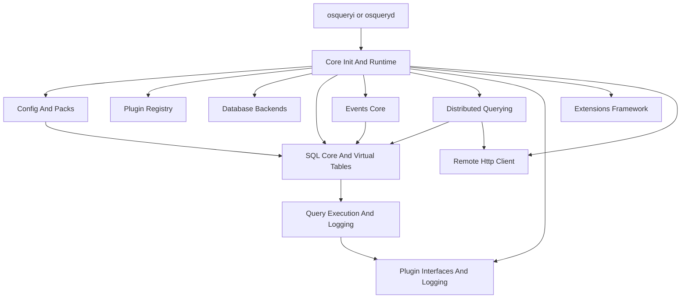

### Execution Modes

- **Daemon mode (`osqueryd`)** – scheduled and distributed queries  
- **Interactive shell (`osqueryi`)** – ad-hoc SQL execution  
- **Extension processes** – dynamic plugin injection  
- **Watcher/worker model** – supervised execution  

---

# Core Runtime Spine

## 1. Core Init And Runtime (`osquery/core`)

This is the orchestration engine that:

- Parses flags (`FlagDetail`, `FlagInfo`)
- Determines process mode
- Initializes plugins and registries
- Initializes database backends
- Loads configuration
- Starts event loops
- Supervises workers and extensions
- Coordinates graceful shutdown (`ShutdownData`, `AlarmRunnable`)

### Runtime Boot Flow

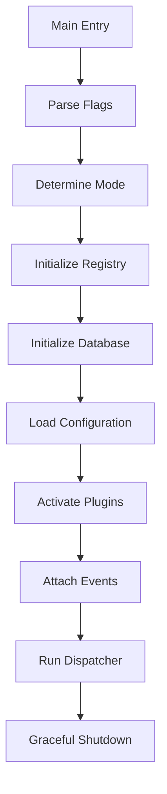

This module defines the lifecycle contract for the entire system.

---

# SQL Execution Layer

## 2. SQL Core And Virtual Tables (`osquery/sql`)

Implements:

- Embedded SQLite engine
- Virtual table integration (`sqlite3_module`)
- Constraint pushdown (`Constraint`, `ConstraintList`)
- Query context (`QueryContext`)
- Diffing (`DiffResults`)
- Scheduled query metadata (`ScheduledQuery`)
- Performance tracking (`QueryPerformance`)

### SQL Execution Flow

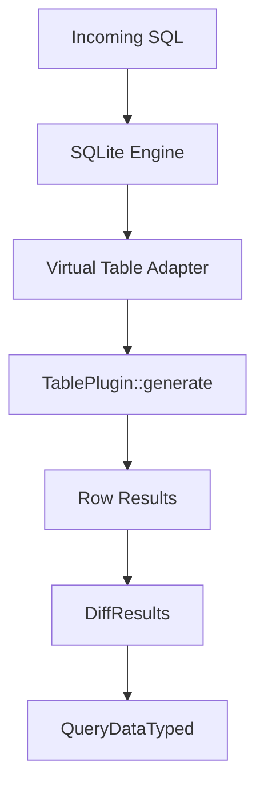

Security is enforced via SQLite authorizers and PRAGMA allowlists.

---

# Query State and Logging

## 3. Query Execution And Logging (`osquery/core`)

Bridges SQL execution with persistence and logging.

Key components:

- `QueryLogItem`
- `Query` (stateful diff engine)
- Epoch and counter management
- Snapshot vs differential logging

### Differential Logging Model

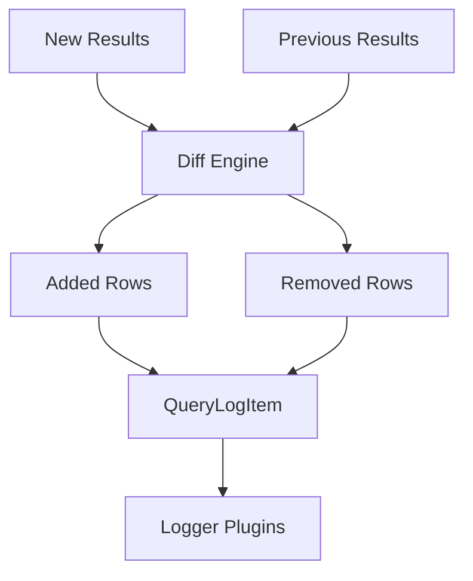

Ensures efficient change tracking and structured log emission.

---

# Configuration Control Plane

## 4. Config And Packs (`osquery/config`)

Transforms JSON configuration into runtime behavior:

- Scheduled queries
- Packs
- Discovery queries
- Denylisting
- Performance persistence

Core components:

- `ConfigRefreshRunner`
- `Schedule::Step`
- `PackStats`

### Config Lifecycle

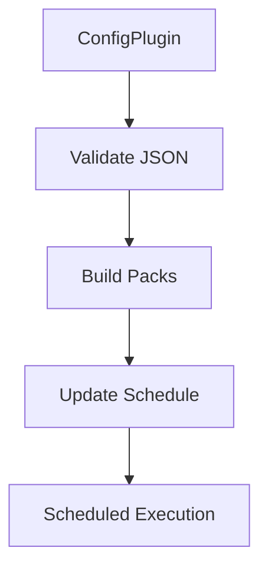

Provides deterministic and safe configuration refresh.

---

# Plugin System

## 5. Plugin Interfaces And Logging (`osquery/core/plugins`)

Defines `LoggerPlugin` and `StatusLogLine`.

Supports:

- Structured status logs
- Snapshot and diff results
- Event forwarding
- Feature negotiation (`usesLogStatus`, `usesLogEvent`)

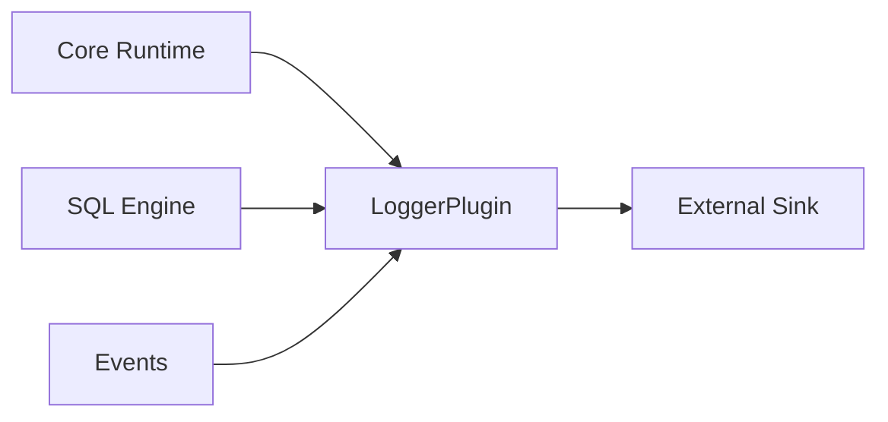

---

# Persistent Storage Layer

## 6. Database Backends (`osquery/database`)

Provides:

- Pluggable storage (RocksDB, Ephemeral)
- Domain-based keyspaces
- Migration support
- Thread-safe reset

Core components:

- `OsqueryDatabase`
- `EphemeralDatabasePlugin`

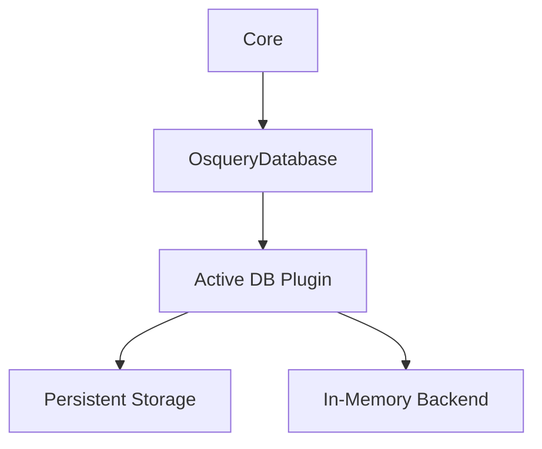

Used by configuration, events, distributed queries, and performance tracking.

---

# Event Framework

## 7. Events Core (`osquery/events`)

Implements a publish/subscribe system:

- `EventFactory`
- `EventPublisherPlugin`
- `EventSubscriberPlugin`
- `Subscription`

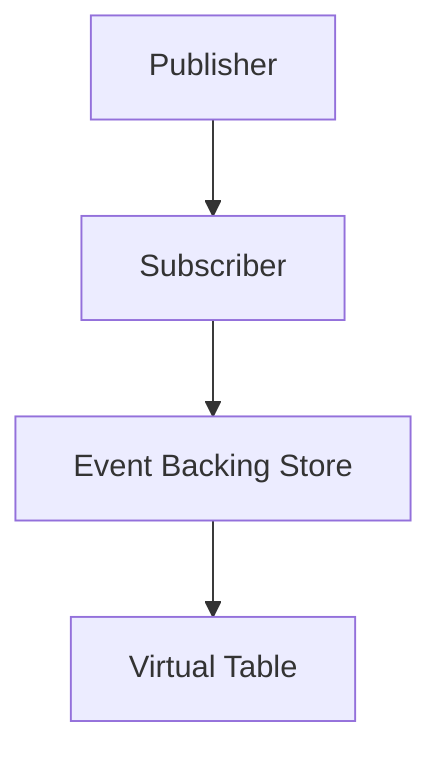

Aligns expiration with scheduled query intervals.

---

# Distributed Querying

## 8. Distributed Querying (`osquery/distributed`)

Enables remote orchestration.

Core structures:

- `DistributedQueryRequest`
- `DistributedQueryResult`
- `TLSDistributedPlugin`

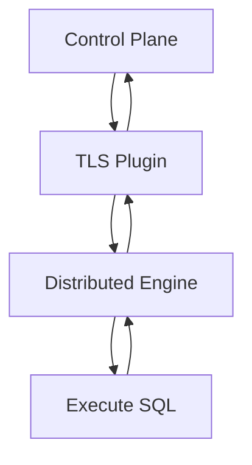

Includes denylisting, concurrency control, and performance tracking.

---

# Extensions Framework

## 9. Extensions Framework (`osquery/extensions`)

Enables runtime plugin injection via Thrift IPC.

Key components:

- `ExtensionInfo`
- `ExtensionManagerWatcher`
- `ImplExtensionClient`
- `ImplExtensionRunner`

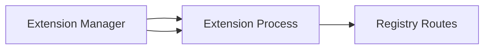

Supports dynamic virtual tables, loggers, config plugins, and distributed transports.

---

# Remote HTTP Layer

## 10. Remote Http Client (`osquery/remote`)

Implements:

- Boost.Asio networking
- TLS with OpenSSL
- Timeout handling
- Proxy support

Used by:

- Distributed querying
- TLS logging
- Remote configuration retrieval

---

# Filesystem, Hashing, and System Utilities

## Filesystem And Fileops (`osquery/filesystem`)
- Cross-platform file abstraction (`PlatformFile`)
- Stat normalization (`WINDOWS_STAT`)
- Globbing
- Socket lifecycle management

## Hashing (`osquery/hashing`)
- Streaming hash computation
- Multi-algorithm support (`MultiHashes`)
- File and buffer hashing

## Process And Profiler (`osquery/process`, `osquery/profiler`)
- Worker and extension spawning
- POSIX signal handling
- `CodeProfiler` using `getrusage`

## System Utilities (`osquery/utils`)
- `EnumClassHash`
- Time conversion utilities

---

# Complete System Data Flow

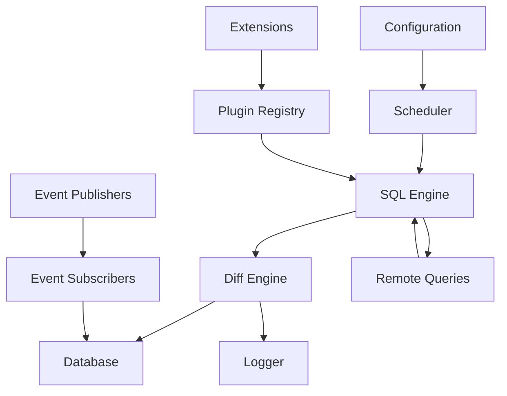

---

# Repository Core Module References

| Module | Path | Responsibility |
|--------|------|---------------|
| Core Init And Runtime | `osquery/core` | Lifecycle orchestration |
| Config And Packs | `osquery/config` | Config loading & scheduling |
| Plugin Interfaces And Logging | `osquery/core/plugins` | Logging abstraction |
| Database Backends | `osquery/database` | Persistent state |
| SQL Core And Virtual Tables | `osquery/sql` | Embedded SQL engine |
| Query Execution And Logging | `osquery/core` | Diff & log pipeline |
| Events Core | `osquery/events` | Publish/subscribe events |
| Extensions Framework | `osquery/extensions` | Runtime plugin injection |
| Distributed Querying | `osquery/distributed` | Remote query orchestration |
| Remote Http Client | `osquery/remote` | HTTP/TLS transport |
| Filesystem And Fileops | `osquery/filesystem` | Cross-platform FS layer |
| Hashing | `osquery/hashing` | Cryptographic hashing |
| Process And Profiler | `osquery/process` | Process isolation & profiling |
| System Utilities | `osquery/utils` | Enum hashing & time utilities |
| Config Plugins | `plugins/config` | Retrieval and parsing plugins |

---

# Summary

The **osquery repository** implements a secure, extensible, SQL-driven operating system instrumentation platform.

It provides:

- A hardened embedded SQLite execution engine  
- Virtual tables mapping OS state into relational form  
- Stateful diff-based logging  
- Persistent event storage  
- Distributed query orchestration  
- Pluggable configuration and logging  
- Runtime extension injection  
- Secure TLS networking  
- Process isolation and profiling  

Architecturally, osquery is built around a **plugin registry and lifecycle-managed runtime**, with SQL as the central abstraction layer and configuration as the control plane.

It is designed for:

- Security observability  
- Continuous monitoring  
- Fleet-wide distributed querying  
- Extensibility without recompilation  
- Safe, deterministic runtime behavior  

osquery transforms low-level OS primitives into a structured, distributed, SQL-powered telemetry system.