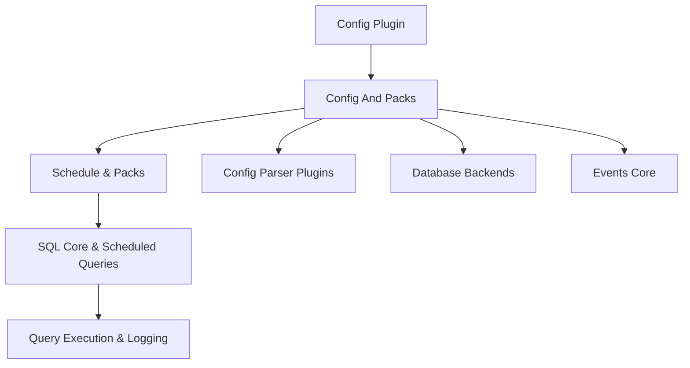
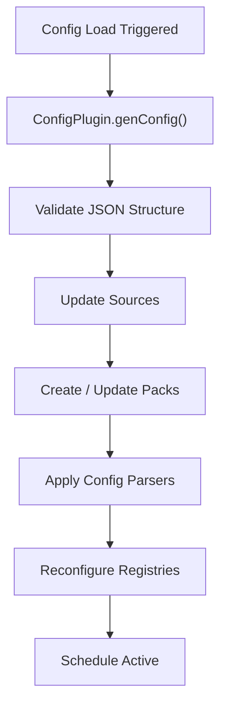
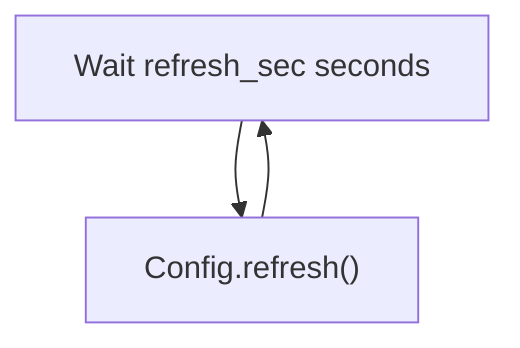
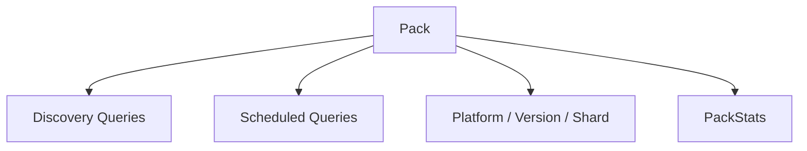
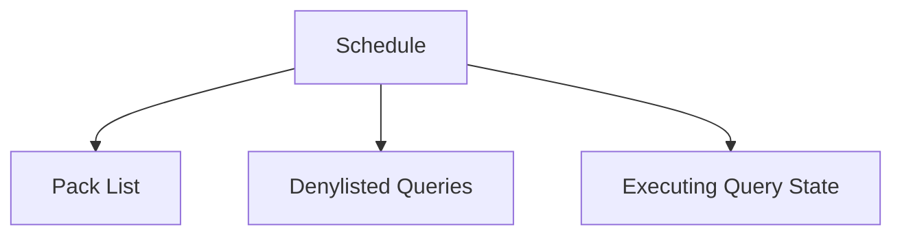
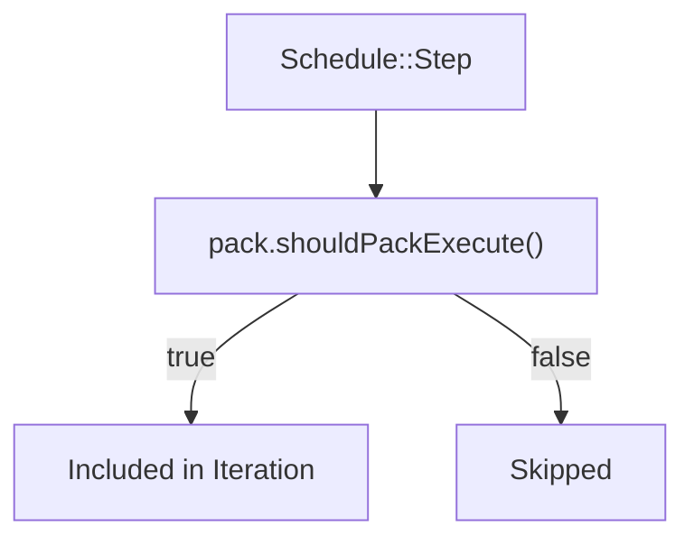
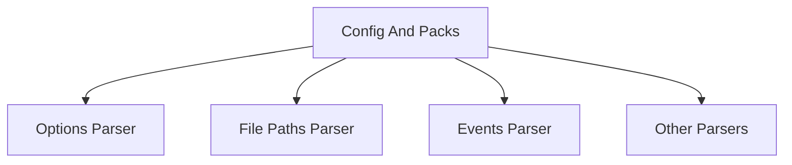
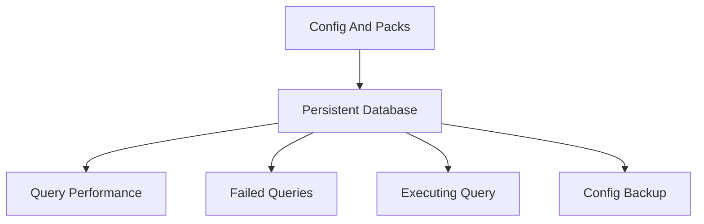
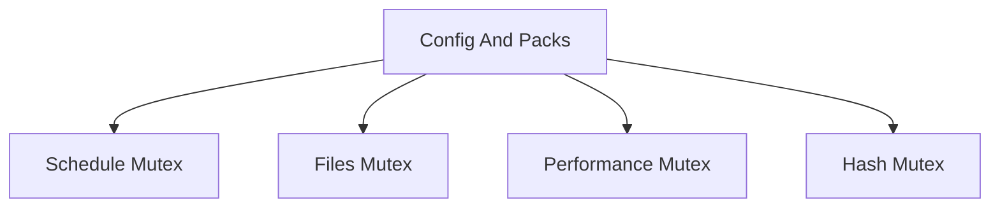

# Config And Packs

The **Config And Packs** module is responsible for loading, validating, parsing, refreshing, and operationalizing osquery configuration data. It transforms raw configuration sources (filesystem, TLS, or other config plugins) into:

- Scheduled queries
- Query packs
- File path monitors
- Event subscriptions
- Runtime options
- Performance tracking metadata

This module acts as the *control plane* for query scheduling and runtime behavior. It coordinates with plugins, the database layer, SQL execution, logging, and event systems to ensure configuration changes are safely and dynamically applied.

---

## 1. Architectural Overview

At a high level, Config And Packs sits between **configuration sources** and **runtime execution systems**.

### Key Responsibilities

1. Retrieve configuration via `ConfigPlugin`
2. Validate and parse JSON configuration safely
3. Build and manage `Pack` objects
4. Maintain a runtime `Schedule`
5. Track query performance and failures
6. Persist state in the database
7. Periodically refresh configuration

---

## 2. Core Components

This module is primarily implemented across:

- `ConfigRefreshRunner`
- `Schedule::Step`
- `PackStats`

Supporting classes include:

- `Config`
- `Schedule`
- `Pack`
- `ConfigPlugin`
- `ConfigParserPlugin`

---

## 3. Configuration Lifecycle

The configuration lifecycle follows a deterministic pipeline.

### 3.1 Loading

`Config::load()`:

- Ensures an active config plugin exists
- Sets refresh interval
- Starts `ConfigRefreshRunner` if periodic refresh is enabled
- Performs an initial `refresh()`

### 3.2 Refreshing

`ConfigRefreshRunner` runs in a background thread:

Behavioral details:

- Uses accelerated retry interval on failure
- Restores normal interval when config loads successfully
- Supports config backup restore on first failure

---

## 4. JSON Validation & Safety Controls

To prevent resource exhaustion and malformed configuration:

- Maximum JSON depth enforced (`kMaxConfigDepth`)
- Maximum size enforced (`kMaxConfigSize`)
- Comment stripping before parsing
- Iterative parsing mode
- Structured validation via `validateConfig()`

This ensures hostile or malformed config cannot destabilize the system.

---

## 5. Packs and Scheduling

### 5.1 Pack

A **Pack** represents a group of scheduled queries and execution constraints.

Each Pack contains:

- Discovery queries
- Scheduled queries
- Platform constraints
- Version constraints
- Shard constraints
- Execution state
- Discovery statistics (`PackStats`)

### 5.2 Discovery Logic

A Pack executes only if:

- Platform matches
- Version matches
- Shard matches
- Discovery queries succeed

Discovery results are cached to avoid excessive execution.

### 5.3 PackStats

`PackStats` tracks discovery efficiency:

- `total` – total discovery attempts
- `hits` – successful discovery validations
- `misses` – failed discovery attempts

This supports introspection and debugging of conditional pack activation.

---

## 6. Schedule Management

The `Schedule` class maintains active packs.

It:

- Stores Pack instances
- Filters active packs via `Step`
- Maintains denylisted queries
- Tracks previously executing queries

### 6.1 Denylisting

If a query causes a watchdog failure:

- It is added to a denylist
- Persisted in the database
- Skipped until expiration

Denylist entries may expire based on time or configuration override.

### 6.2 Iteration via Step

`Schedule::Step` determines if a pack should execute:

This ensures inactive packs never contribute scheduled queries.

---

## 7. Query Performance Tracking

The module tracks execution metrics per scheduled query:

- Wall time
- CPU user/system time
- Memory usage
- Output size
- Execution count
- Last execution timestamp

Metrics are persisted in the database and updated via:

- `recordQueryStart()`
- `recordQueryPerformance()`

When a query definition changes, performance stats are cleared to avoid mixing incompatible metrics.

---

## 8. Parser Plugin System

Config parser plugins extend configuration behavior.

Examples of responsibilities:

- Parse options
- Parse file paths
- Parse event configuration
- Parse decorators
- Parse views

Parsers:

- Receive filtered JSON sections
- Maintain internal state
- May trigger registry reconfiguration
- Are reset during `Config::reset()`

The options parser is always applied first since other parsers may depend on flag values.

---

## 9. Database Interaction

The module heavily interacts with persistent storage for:

- Query performance stats
- Denylist entries
- Executing query tracking
- Cached splay intervals
- Config backups
- Result expiration

### 9.1 Backup & Restore

If `config_enable_backup` is enabled:

- Each config update is persisted
- On failure, backup can be restored
- Only triggered on first failed refresh

---

## 10. Hashing and Change Detection

Each config source is hashed (SHA1).

If the content hash is unchanged:

- The update is skipped
- No reconfiguration occurs

A global configuration hash can be generated by combining per-source hashes.

This prevents unnecessary reconfiguration cascades.

---

## 11. Purge and Expiration Logic

`Config::purge()` ensures stale data does not accumulate.

It:

- Removes result sets for deleted queries
- Expires results older than one week
- Cleans corrupted timestamps

This keeps persistent storage bounded and consistent.

---

## 12. Extension-Aware Behavior

When running inside extensions:

- Config updates are proxied to core
- External processes do not restore schedule state
- Updates are synchronized through the registry system

This ensures a single authoritative configuration instance.

---

## 13. Concurrency and Thread Safety

The module uses:

- `Mutex`
- `RecursiveMutex`
- `WriteLock`
- `std::atomic`

Protected areas include:

- Schedule mutation
- Performance stats
- Config hashing
- Backup operations

This prevents race conditions between:

- Refresh thread
- Query execution threads
- Extension updates
- Event subscribers

---

## 14. Integration with Other Modules

Config And Packs coordinates with:

- SQL scheduling and execution (scheduled queries)
- Database backends (state persistence)
- Event system (event publisher reconfiguration)
- Logger plugins (reconfiguration after update)
- Distributed querying (through config-delivered queries)

It is the authoritative runtime configuration authority.

---

# Summary

The **Config And Packs** module transforms raw configuration data into a structured, validated, dynamic execution plan.

It ensures:

- Safe parsing
- Deterministic scheduling
- Runtime adaptability
- Performance visibility
- Fault isolation via denylisting
- Efficient change detection

By bridging configuration sources with scheduling, persistence, and runtime systems, Config And Packs acts as the central orchestration layer of osquery’s operational behavior.