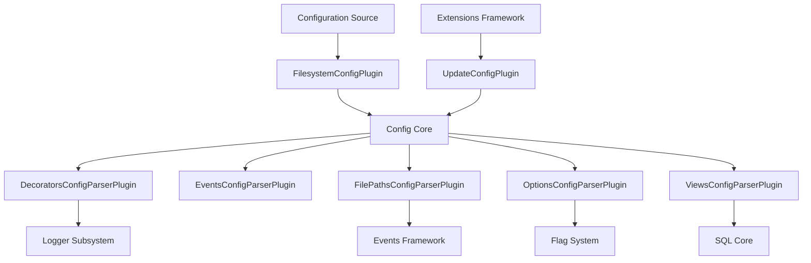
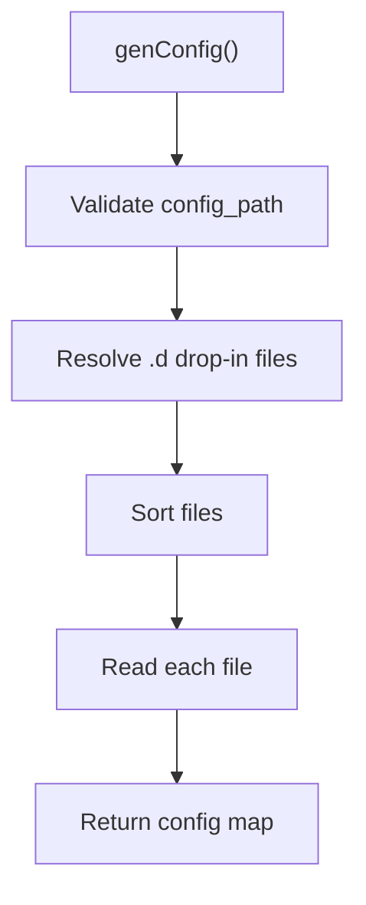
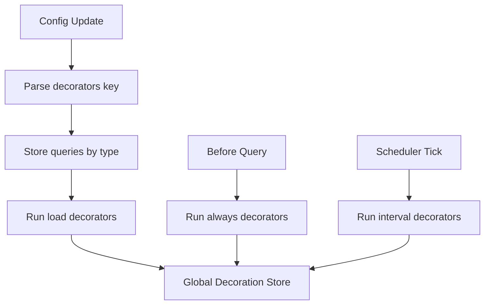
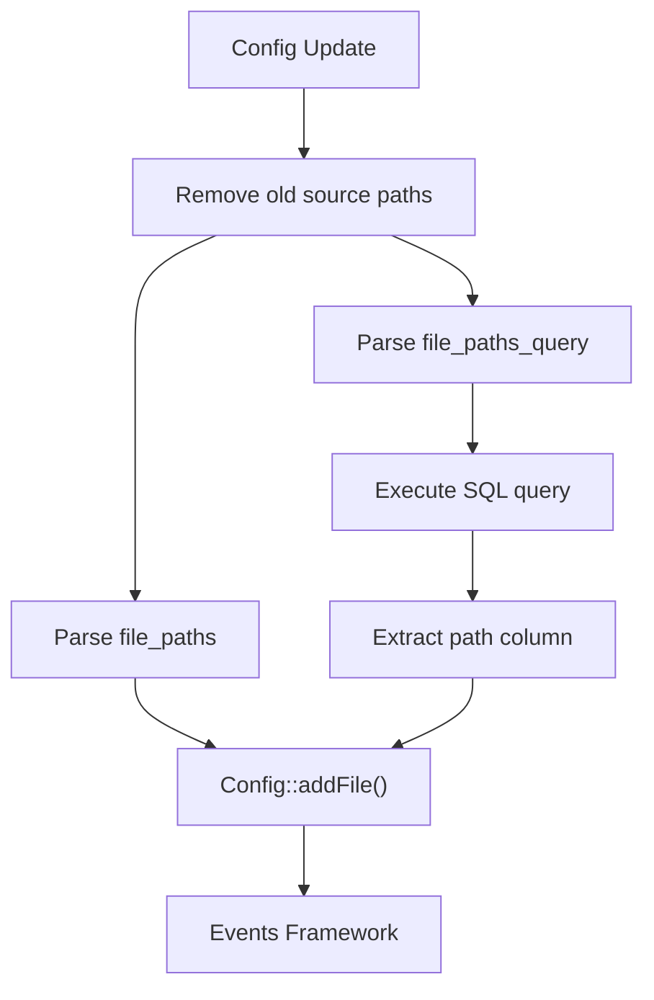
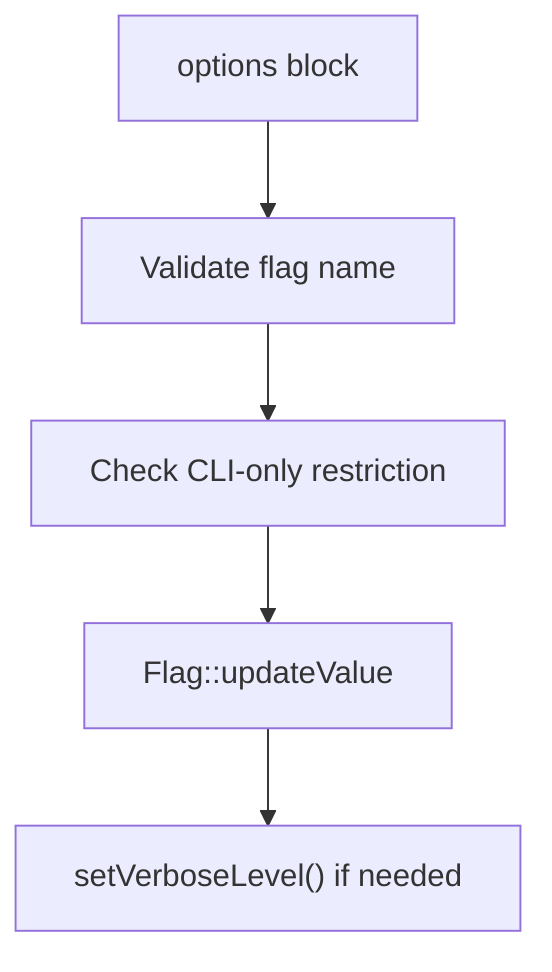
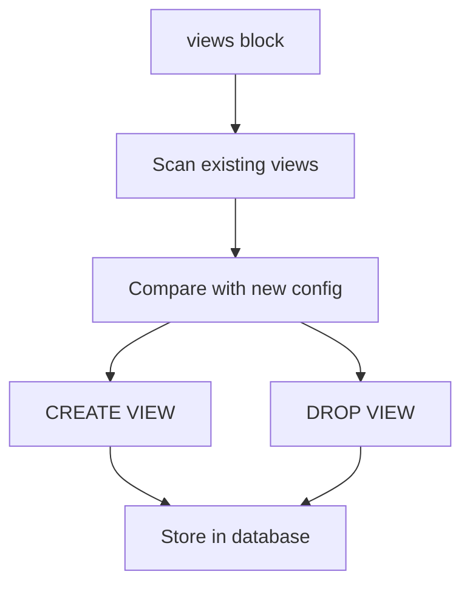
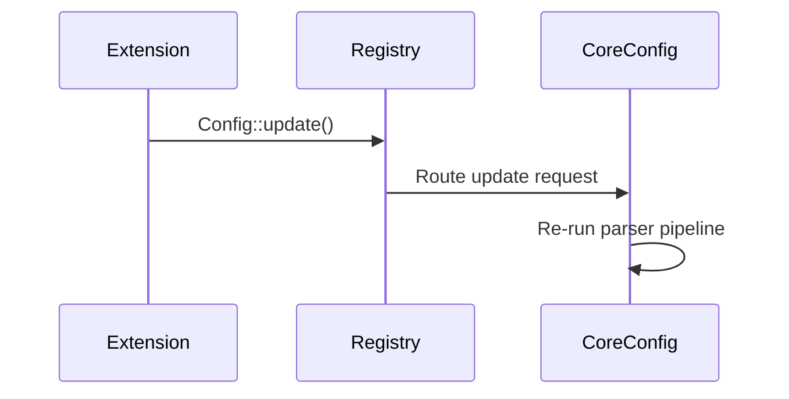
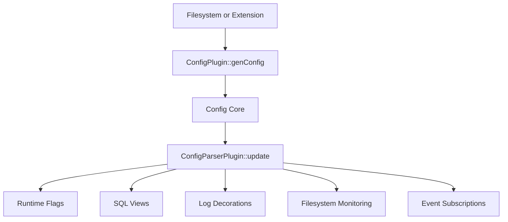

# Config Plugins

The **Config Plugins** module is responsible for retrieving, parsing, transforming, and applying configuration data to the osquery runtime. It acts as the bridge between raw configuration sources (such as files) and the internal runtime subsystems (scheduler, SQL engine, logger, database, events framework, and extensions).

This module implements:

- Configuration retrieval via `ConfigPlugin` implementations
- Structured parsing via `ConfigParserPlugin` implementations
- Runtime mutation of flags and options
- View and decorator execution
- File path monitoring configuration
- Controlled config updates from extensions

It integrates closely with:

- Core configuration framework (`Config`, `ConfigPlugin`, `ConfigParserPlugin`)
- SQL engine and virtual tables
- Logger subsystem
- Database backends
- Events framework
- Extensions framework

---

## Architecture Overview

The Config Plugins module follows a two-phase pipeline:

1. **Configuration Retrieval** — A `ConfigPlugin` fetches raw configuration content.
2. **Configuration Parsing** — Multiple `ConfigParserPlugin` implementations interpret specific keys and mutate runtime state.



### Design Principles

- **Plugin-driven**: Configuration retrieval and parsing are both registry-driven.
- **Key-based parsing**: Each parser owns specific top-level JSON keys.
- **Incremental updates**: Config updates replace only affected sections.
- **Thread-safe decorators and state**: Mutex-protected shared structures.
- **Runtime mutability**: Certain options and views can be modified without restart.

---

# Configuration Retrieval

## FilesystemConfigPlugin

**Component:** `osquery.plugins.config.filesystem_config.FilesystemConfigPlugin`

The Filesystem Config Plugin loads configuration from disk using the `--config_path` flag.

### Behavior

- Validates that the primary config file exists
- Loads additional drop-in configuration files from:

```
<config_path>.d/*.conf
```

- Sorts drop-in files for deterministic ordering
- Supports pack expansion via `genPack`
- Supports multi-pack loading using wildcard patterns

### Multi-Pack Assembly

If the requested pack name is `*`, the plugin:

1. Resolves a filesystem glob pattern
2. Reads each JSON file
3. Strips comments
4. Merges each pack into a property tree
5. Emits a synthesized JSON pack



### Responsibilities

- Provide raw configuration payloads
- Support modular configuration layouts
- Provide pack materialization

---

# Config Parser Plugins

Each parser is registered in the `config_parser` registry and declares ownership of one or more top-level configuration keys.

## DecoratorsConfigParserPlugin

**Component:** `osquery.plugins.config.parsers.decorators.DecoratorsConfigParserPlugin`

Handles the `decorators` key.

### Purpose

Decorators append additional columns to:

- Query results
- Snapshots
- Status logs

### Decorator Types

- `load` — Run once at config load
- `always` — Run before every query
- `interval` — Run at configured intervals

### Execution Model

Decorators are SQL queries. Only the first row is used. Multiple rows or duplicate column names result in undefined behavior.



### Thread Safety

- Uses mutex-protected global store
- Separates configuration data lock from runtime decoration lock

### Integration

- Uses SQL engine to execute decorator queries
- Injects key-value pairs into log items

---

## EventsConfigParserPlugin

**Component:** `osquery.plugins.config.parsers.events_parser.EventsConfigParserPlugin`

Handles the `events` key.

### Purpose

- Copies event-related configuration into internal JSON storage
- Makes event configuration accessible to the events subsystem

### Characteristics

- Minimal transformation
- Purely structural
- Delegates behavior to the events framework

---

## FilePathsConfigParserPlugin

**Component:** `osquery.plugins.config.parsers.file_paths.FilePathsConfigParserPlugin`

Handles:

- `file_paths`
- `file_paths_query`
- `file_accesses`
- `exclude_paths`

### Responsibilities

1. Register filesystem patterns for monitoring
2. Execute SQL queries that dynamically produce paths
3. Track categories of file access monitoring
4. Merge exclusion patterns



### Key Features

- Glob wildcard normalization
- SQL-driven dynamic path resolution
- Category-based access control
- Persistent merging of exclusion rules

### Integration Points

- SQL subsystem
- Events framework
- Filesystem utilities

---

## OptionsConfigParserPlugin

**Component:** `osquery.plugins.config.parsers.options.OptionsConfigParserPlugin`

Handles the `options` key.

### Purpose

Applies runtime flag updates from configuration.

### Processing Steps

1. Merge previous and new `options` blocks
2. Validate flag existence
3. Prevent CLI-only flags from being overridden
4. Convert JSON values to string representation
5. Update flags via `Flag::updateValue`
6. Adjust logger verbosity if required



### Safety Controls

- Rejects unknown flags
- Rejects CLI-only flags
- Supports custom flags with `custom_` prefix

---

## ViewsConfigParserPlugin

**Component:** `osquery.plugins.config.parsers.views.ViewsConfigParserPlugin`

Handles the `views` key.

### Purpose

Dynamically creates and deletes SQL views based on configuration.

### Behavior

- Drops outdated views
- Creates new views using SQL
- Stores view definitions in the database
- Avoids redundant recreation except on first load



### Integration

- SQL execution engine
- Persistent database backend

---

# UpdateConfigPlugin

**Component:** `osquery.plugins.config.update.UpdateConfigPlugin`

This is a special-purpose `ConfigPlugin` named `update`.

### Purpose

Allows extension plugins to trigger configuration updates in the core process.

### Behavior

- Does not generate configuration
- Serves as a routing mechanism for extension-driven updates
- Enables asynchronous config mutation



### Importance

This enables distributed and extension-based configuration control without embedding update logic directly into the core.

---

# End-to-End Configuration Flow



---

# Key Responsibilities Summary

| Area | Plugin | Runtime Impact |
|------|--------|---------------|
| Retrieval | FilesystemConfigPlugin | Loads JSON configuration |
| Decoration | DecoratorsConfigParserPlugin | Augments logs and results |
| Events | EventsConfigParserPlugin | Supplies event configuration |
| File Monitoring | FilePathsConfigParserPlugin | Registers file paths and exclusions |
| Runtime Flags | OptionsConfigParserPlugin | Updates flags and logging |
| SQL Views | ViewsConfigParserPlugin | Creates/drops SQL views |
| Extension Updates | UpdateConfigPlugin | Enables async config mutation |

---

# Operational Characteristics

- Fully registry-based plugin model
- Supports dynamic reconfiguration
- Maintains thread safety for shared decorator state
- Integrates deeply with SQL and logging subsystems
- Enables modular configuration layouts

The Config Plugins module is a central orchestration layer that translates configuration documents into concrete runtime behavior across the entire osquery system.