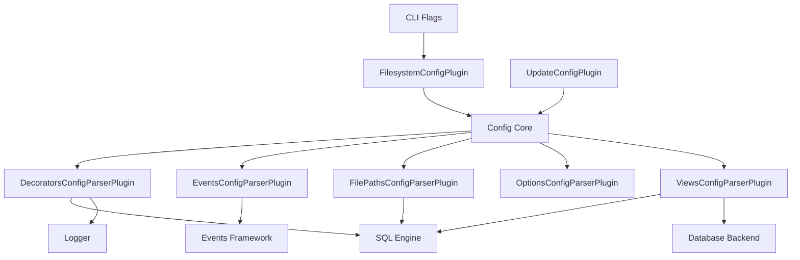
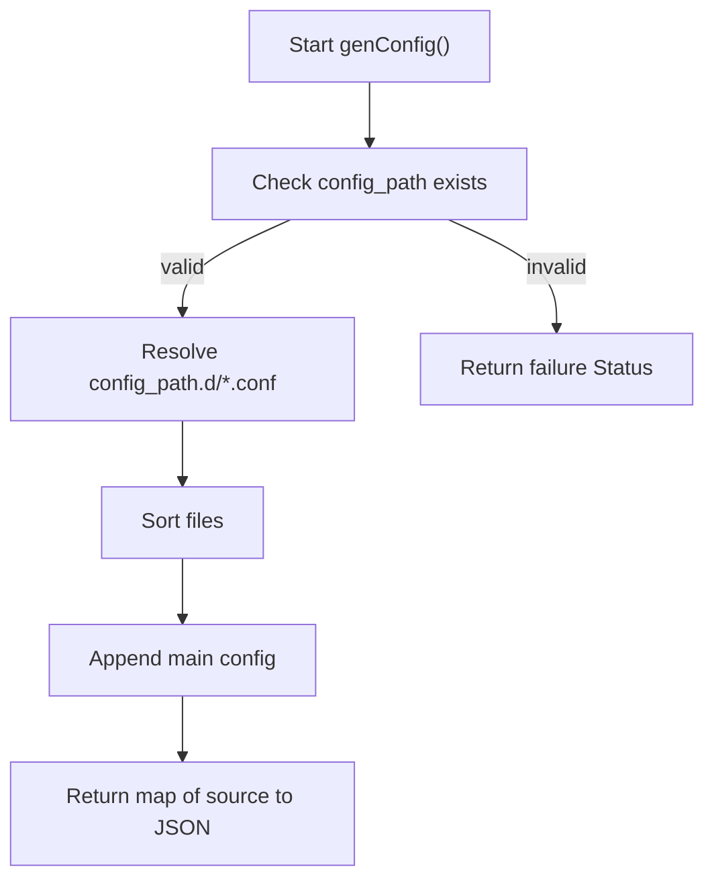
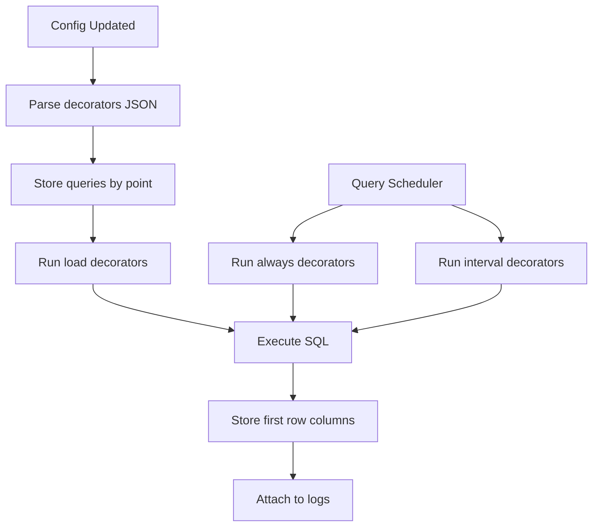
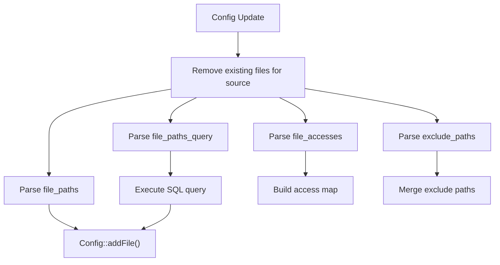
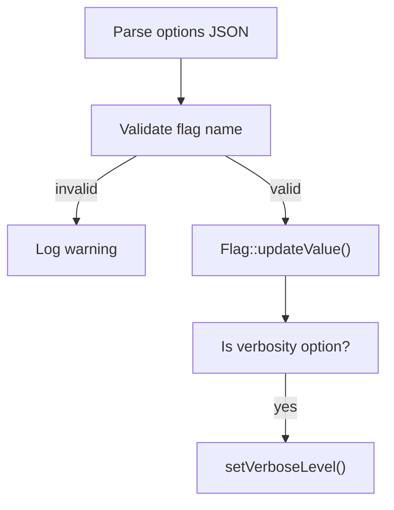
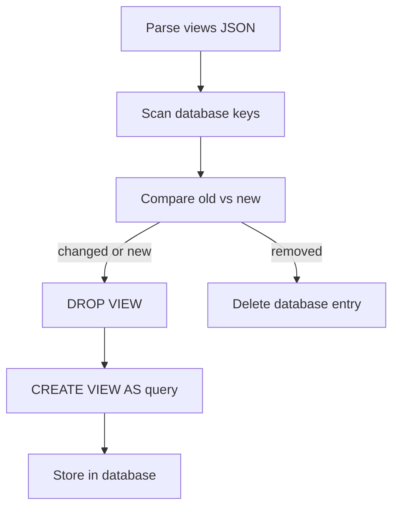
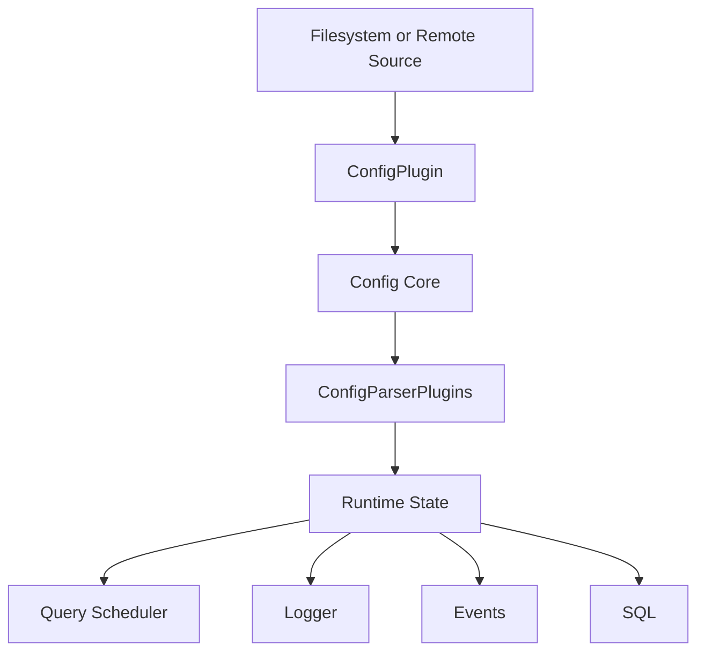

# Config Plugins

The **Config Plugins** module is responsible for sourcing, parsing, transforming, and dynamically updating osquery configuration data. It acts as the bridge between raw configuration inputs (files or remote sources) and the structured runtime state consumed by the core engine.

This module is tightly integrated with:

- [Configuration and Packs](../configuration-and-packs/configuration-and-packs.md) – orchestrates config refresh and pack scheduling
- [SQL Engine and Virtual Tables](../sql-engine-and-virtual-tables/sql-engine-and-virtual-tables.md) – executes decorator and file path queries
- [Database Backend](../database-backend/database-backend.md) – persists generated views and config state
- [Events Core and Subscriptions](../events-core-and-subscriptions/events-core-and-subscriptions.md) – consumes parsed event configuration
- [Logging and Query Metadata](../logging-and-query-metadata/logging-and-query-metadata.md) – enriched by decorators

The Config Plugins module is built around two extension points:

1. **ConfigPlugin** – produces raw configuration blobs (e.g., filesystem, remote, update routing).
2. **ConfigParserPlugin** – parses specific top-level configuration keys and updates runtime state.

---

## Architecture Overview

### Key Responsibilities

- Load configuration from local files or remote sources.
- Merge layered configuration files.
- Parse specific configuration sections.
- Update flags and runtime settings.
- Dynamically create SQL views.
- Register file paths and event subscriptions.
- Enrich logs with runtime decorations.

---

# ConfigPlugin Implementations

Config plugins generate configuration data for the core engine.

## FilesystemConfigPlugin

**Component:** `osquery.plugins.config.filesystem_config.FilesystemConfigPlugin`

The Filesystem Config Plugin loads configuration from disk.

### Responsibilities

- Read the primary config file defined by the `config_path` flag.
- Load layered configuration files from a `.d` directory.
- Support multi-pack generation using glob patterns.
- Validate file existence before parsing.

### Layered Config Resolution

### Multi-Pack Support

If a pack name is `*`, the plugin:

- Resolves a file pattern.
- Reads each JSON file.
- Builds a synthetic JSON object keyed by filename.
- Emits a merged pack blob.

This allows external pack directories to behave like embedded pack definitions.

---

## UpdateConfigPlugin

**Component:** `osquery.plugins.config.update.UpdateConfigPlugin`

The Update Config Plugin is a special routing plugin that enables:

- Extension-driven configuration updates.
- Asynchronous config refresh propagation.

It does not generate configuration directly. Instead, it provides a mechanism for extensions to call `Config::update`, allowing core osquery to refresh configuration state.

This enables safe plugin-to-core state mutation without violating registry boundaries.

---

# ConfigParserPlugin Implementations

Parser plugins operate on specific top-level configuration keys and update internal runtime structures.

---

## DecoratorsConfigParserPlugin

**Component:** `osquery.plugins.config.parsers.decorators.DecoratorsConfigParserPlugin`

Decorators allow SQL queries to append additional key-value pairs to:

- Query results
- Snapshot logs
- Status logs

### Supported Decoration Points

- `load` – executed when config is loaded.
- `always` – executed before every query.
- `interval` – executed on configured intervals.

### Decoration Execution Flow

### Key Design Considerations

- Only the first row of a decorator query is used.
- Duplicate column names cause undefined behavior.
- Interval decorators must be multiples of 60 seconds.
- Thread-safe access is enforced via mutexes.
- Can be disabled using the `disable_decorators` flag.

Decorations directly enrich data consumed by the [Logging and Query Metadata](../logging-and-query-metadata/logging-and-query-metadata.md) module.

---

## EventsConfigParserPlugin

**Component:** `osquery.plugins.config.parsers.events_parser.EventsConfigParserPlugin`

Parses the `events` configuration key and publishes structured event configuration into the shared config state.

### Responsibilities

- Copy `events` JSON subtree into parser data.
- Expose structured event configuration to the [Events Core and Subscriptions](../events-core-and-subscriptions/events-core-and-subscriptions.md) module.

This parser performs minimal transformation and acts primarily as a structured pass-through.

---

## FilePathsConfigParserPlugin

**Component:** `osquery.plugins.config.parsers.file_paths.FilePathsConfigParserPlugin`

Manages file-based monitoring configuration.

### Supported Keys

- `file_paths`
- `file_paths_query`
- `file_accesses`
- `exclude_paths`

### Processing Pipeline

### Notable Behaviors

- Glob wildcards are normalized before registration.
- SQL-driven path discovery must return a `path` column.
- Exclusions are merged across sources.
- File registrations are source-aware and can be removed on update.

This parser integrates closely with filesystem monitoring and the event subsystem.

---

## OptionsConfigParserPlugin

**Component:** `osquery.plugins.config.parsers.options.OptionsConfigParserPlugin`

Handles runtime flag configuration via the `options` key.

### Responsibilities

- Merge configuration options across sources.
- Validate flag existence.
- Ignore CLI-only flags.
- Update flag values dynamically.
- Trigger verbosity reconfiguration if needed.

### Flag Update Flow

### Important Constraints

- Unknown flags are rejected.
- CLI-only flags cannot be set via config.
- Custom flags must begin with `custom_`.

This parser directly affects behavior across the entire osquery runtime.

---

## ViewsConfigParserPlugin

**Component:** `osquery.plugins.config.parsers.views.ViewsConfigParserPlugin`

Creates and manages dynamic SQL views defined in configuration.

### Responsibilities

- Parse `views` dictionary.
- Create or update SQL views.
- Persist view definitions in the database.
- Drop views removed from configuration.

### View Lifecycle

### Integration Points

- Executes SQL using the [SQL Engine and Virtual Tables](../sql-engine-and-virtual-tables/sql-engine-and-virtual-tables.md).
- Persists metadata in the [Database Backend](../database-backend/database-backend.md).

The plugin ensures idempotency by skipping recreation when definitions have not changed, except during first initialization.

---

# End-to-End Configuration Flow

### Lifecycle Summary

1. A Config Plugin generates raw configuration blobs.
2. The Config Core merges and normalizes them.
3. Each Config Parser Plugin processes relevant keys.
4. Runtime state is updated atomically.
5. Dependent subsystems react (scheduler, logger, SQL engine, events).

---

# Design Characteristics

- **Registry-based extensibility** – Plugins register themselves dynamically.
- **Source-aware merging** – Each config source is tracked independently.
- **Thread-safe decoration handling** – Mutex-protected shared state.
- **Idempotent updates** – Avoid unnecessary re-creation of views or flags.
- **Loose coupling** – Parsers modify only their scoped domain.

---

# Relationship to Other Modules

| Concern | Module |
|----------|--------|
| Config refresh scheduling | [Configuration and Packs](../configuration-and-packs/configuration-and-packs.md) |
| Query execution | [SQL Engine and Virtual Tables](../sql-engine-and-virtual-tables/sql-engine-and-virtual-tables.md) |
| View persistence | [Database Backend](../database-backend/database-backend.md) |
| Log enrichment | [Logging and Query Metadata](../logging-and-query-metadata/logging-and-query-metadata.md) |
| Event subscription behavior | [Events Core and Subscriptions](../events-core-and-subscriptions/events-core-and-subscriptions.md) |

---

# Conclusion

The **Config Plugins** module forms the dynamic configuration backbone of osquery. It transforms static or remote JSON configuration into structured runtime behavior, enabling:

- Flexible deployment models
- Dynamic reconfiguration
- Cross-module feature activation
- Extension-driven updates

By cleanly separating configuration sourcing from configuration parsing, this module ensures extensibility, modularity, and safe runtime evolution of system behavior.