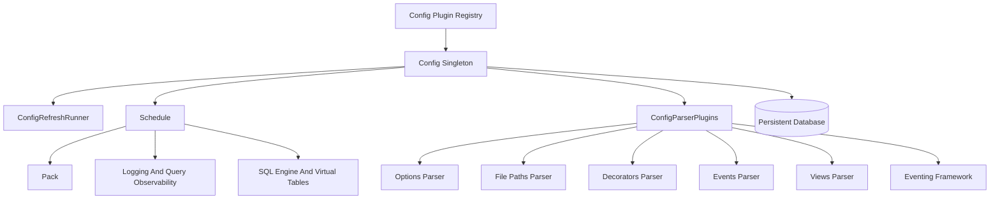
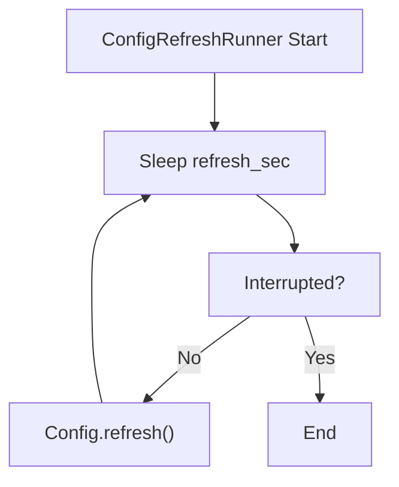
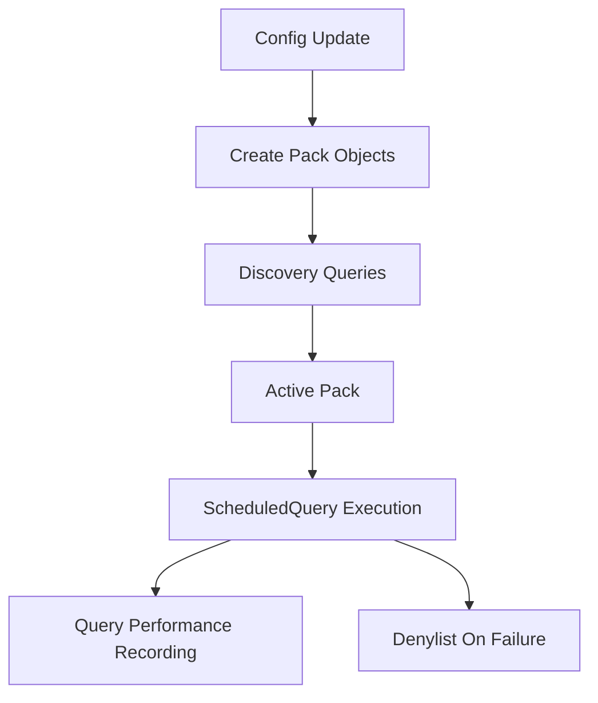
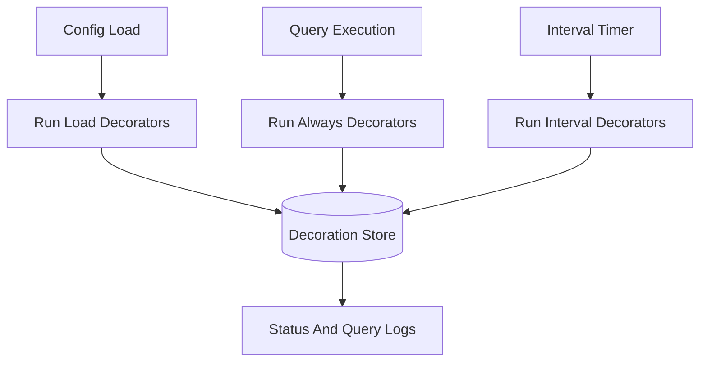
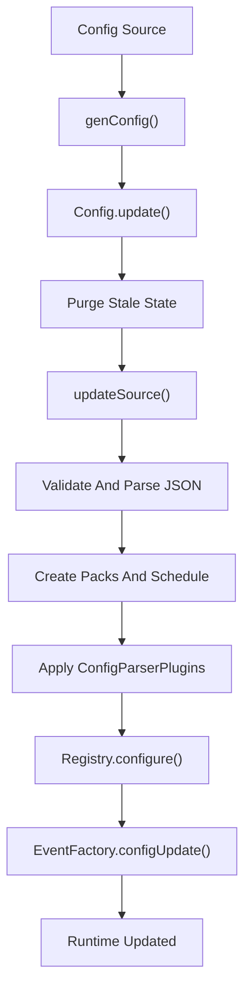

# Configuration And Packs

The **Configuration And Packs** module is responsible for loading, validating, parsing, distributing, and refreshing osquery configuration data. It transforms raw configuration sources (files, extensions, or remote plugins) into:

- Scheduled queries and packs
- File monitoring rules
- Event subscriptions
- Logger and runtime options
- SQL views
- Decorations and metadata

This module acts as the *control plane* for osquery runtime behavior. It connects configuration sources with the scheduler, SQL engine, eventing framework, logging pipeline, and database layer.

---

## Architecture Overview

At a high level, the module consists of:

- A **Config registry** for loading configuration sources
- A **ConfigRefreshRunner** background service
- A **Schedule** abstraction built from Packs
- Multiple **ConfigParserPlugin** implementations
- Backup, hashing, and validation logic

---

## Core Responsibilities

### 1. Configuration Loading

The module defines a `config` registry that supports pluggable configuration sources:

- `FilesystemConfigPlugin` (default)
- `UpdateConfigPlugin` (internal chaining for extensions)

Each plugin implements:

- `genConfig()` → produce configuration map
- `genPack()` → resolve pack references
- `update()` → apply configuration updates

The active plugin is selected via the `config_plugin` flag.

---

### 2. Config Singleton

The `Config` class is a process-wide singleton that:

- Loads configuration
- Maintains the active Schedule
- Applies parser plugins
- Tracks source hashes
- Backs up and restores configuration
- Coordinates plugin reconfiguration

Key behaviors:

- JSON validation (max depth and size constraints)
- Comment stripping
- Hash-based change detection
- Safe concurrent access using mutexes
- Performance tracking per scheduled query

---

### 3. Refresh Lifecycle

The `ConfigRefreshRunner` runs in the background when `config_refresh` is enabled.

Features:

- Normal refresh interval
- Accelerated retry interval on failure
- Optional backup restoration on first failure
- Dynamic reconfiguration of registries and loggers

---

## Packs and Scheduling

The Schedule is composed of `Pack` objects.

### Pack

A **Pack** represents a group of scheduled queries plus optional discovery logic.

Capabilities:

- Platform constraints
- Version constraints
- Shard percentage
- Discovery queries
- ScheduledQuery collection
- Execution eligibility (`shouldPackExecute()`)

### Schedule

The Schedule:

- Maintains active packs
- Filters packs via discovery checks
- Tracks denylisted queries
- Restores failed queries on restart
- Provides query iteration to the scheduler

### Denylist Logic

If a scheduled query:

- Causes watchdog termination
- Was executing during shutdown

It is denylisted temporarily and persisted in the database.

Expiration logic considers:

- Time-based expiry
- Event-based exemptions
- Explicit `denylist=false` option

---

## Config Parser Plugins

The module defines a `config_parser` registry. Each parser consumes specific top-level configuration keys.

Parsers are applied in this order:

1. Options parser (always first)
2. Remaining parsers in registry order

### FilesystemConfigPlugin

Loads configuration from:

- Primary JSON file
- Optional `.d` directory fragments
- Multi-pack glob patterns

Produces a map of `source → JSON content`.

---

### OptionsConfigParserPlugin

Handles the `options` key.

- Updates runtime flags
- Prevents modification of CLI-only flags
- Reconfigures logger verbosity dynamically
- Supports `custom_` prefixed flags

---

### FilePathsConfigParserPlugin

Handles:

- `file_paths`
- `file_paths_query`
- `file_accesses`
- `exclude_paths`

Responsibilities:

- Adds file monitoring rules to Config
- Executes SQL-based path discovery
- Normalizes wildcard globs
- Maintains access category mappings

This integrates directly with the **Filesystem And Path Utilities** and **Eventing Framework And Subscriptions** modules.

---

### DecoratorsConfigParserPlugin

Handles the `decorators` key.

Decorators:

- Execute SQL queries
- Extract first-row column values
- Attach results to logs

Supported execution points:

- `load`
- `always`
- `interval`

Thread safety is enforced with dedicated mutexes.

---

### EventsConfigParserPlugin

Consumes the `events` key and exposes configuration to event publishers and subscribers.

Acts as a bridge to the **Eventing Framework And Subscriptions** module.

---

### ViewsConfigParserPlugin

Handles the `views` key.

- Creates SQL views
- Drops outdated views
- Persists view definitions
- Ensures idempotent updates

This integrates with the **SQL Engine And Virtual Tables** module.

---

## Backup and Persistence

If `config_enable_backup` is enabled:

- Config sources are stored in the database
- Failed refresh attempts restore backup
- Backup keys are namespaced with `config_persistence.`

The module also persists:

- Query performance statistics
- Executing query markers
- Denylist entries
- Query result timestamps

Database interactions use the **Database And Storage Plugins** module.

---

## Hashing and Change Detection

Each configuration source is hashed (SHA1):

- Prevents unnecessary reconfiguration
- Enables selective updates
- Supports global config hash generation

If a source hash does not change:

- Packs are not rebuilt
- Parsers are not re-applied

---

## Interaction With Other Modules

### Logging And Query Observability

- Query performance stats recorded
- Decorations attached to logs
- Denylist logging

### SQL Engine And Virtual Tables

- Discovery queries
- Scheduled queries
- View creation

### Eventing Framework And Subscriptions

- Event configuration via `events`
- File path monitoring integration

### Database And Storage Plugins

- Config backup
- Query stats
- Denylist persistence
- Result expiration

### Extensions And IPC

- External extensions can call `Config::update()`
- UpdateConfigPlugin enables update chaining
- External registries propagate updates back to core

---

## Configuration Processing Flow

---

## Concurrency and Safety

The module uses:

- Recursive mutexes for schedule and files
- Dedicated mutexes for:
  - Hash map
  - Backup store
  - Performance stats
  - Decorations

Design goals:

- Safe asynchronous refresh
- Deterministic schedule rebuilds
- Minimal runtime disruption
- Atomic config transitions

---

## Summary

The **Configuration And Packs** module is the orchestration layer of osquery runtime behavior. It:

- Loads configuration from pluggable sources
- Builds and manages query packs
- Applies runtime options
- Coordinates parser plugins
- Manages refresh and backup logic
- Integrates deeply with scheduler, SQL engine, event system, logging, and database layers

Without this module, osquery would have no dynamic runtime control plane. It is the central authority that transforms static configuration data into active system behavior.
