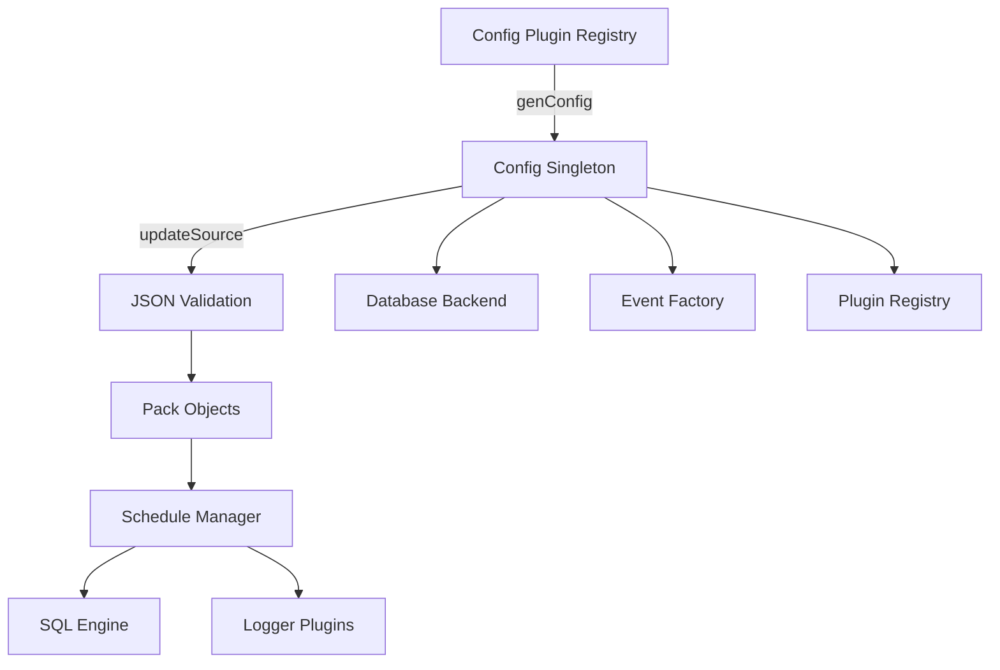
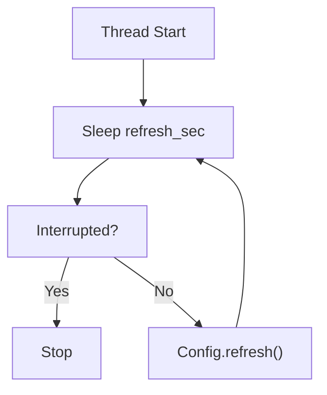
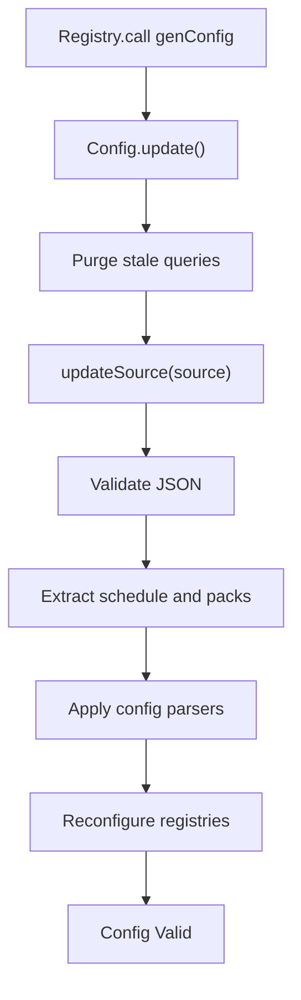
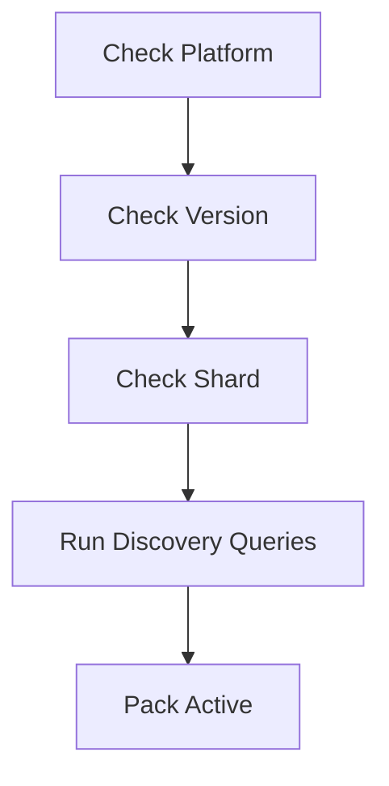
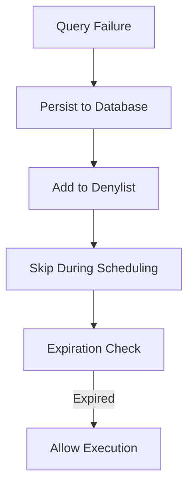
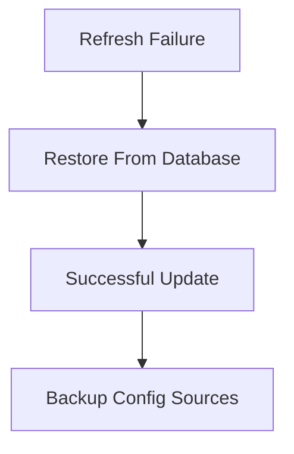
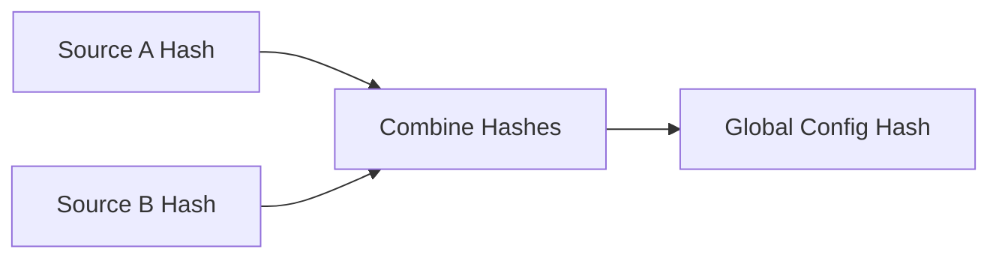

# Configuration And Packs

## Overview

The **Configuration And Packs** module is responsible for:

- Loading configuration data from pluggable configuration providers
- Parsing and validating JSON configuration documents
- Building and maintaining the scheduled query packs
- Managing discovery queries, sharding, and platform/version constraints
- Tracking query performance and denylisting unstable queries
- Coordinating reconfiguration across the system when configuration changes

This module acts as the **control plane** for scheduled execution. It translates raw configuration into executable query schedules and propagates changes to other subsystems such as:

- [SQL Engine And Virtual Tables](../sql-engine-and-virtual-tables/sql-engine-and-virtual-tables.md)
- [Logging And Query Metadata](../logging-and-query-metadata/logging-and-query-metadata.md)
- [Database Backend](../database-backend/database-backend.md)
- [Events Core And Subscriptions](../events-core-and-subscriptions/events-core-and-subscriptions.md)
- [Extensions Framework](../extensions-framework/extensions-framework.md)

---

## Architectural Overview

At a high level, configuration flows through the system as follows:

### Key Responsibilities

| Layer | Responsibility |
|--------|----------------|
| Config Plugin | Supplies raw configuration (filesystem, TLS, etc.) |
| Config | Validates, parses, hashes, and updates runtime state |
| Pack | Represents a logical bundle of scheduled queries |
| Schedule | Filters active packs and manages denylisting |
| Database | Persists performance stats, hashes, backups |
| Registry | Reconfigures plugins after config updates |

---

## Core Components

### 1. ConfigRefreshRunner

**Component:** `osquery.osquery.config.config.ConfigRefreshRunner`

This internal runnable is responsible for periodic configuration refresh.

#### Responsibilities

- Sleeps for `config_refresh` interval
- Calls `Config::refresh()`
- Accelerates retry interval when refresh fails
- Stops when shutdown is requested

#### Refresh Lifecycle

Refresh interval behavior:

- Normal interval: `config_refresh`
- Failure interval: `config_accelerated_refresh`
- Optional backup restore on first failure

---

### 2. Config

The `Config` class is a **singleton control center** for configuration state.

#### Primary Responsibilities

- Call active config plugin (`genConfig`)
- Validate JSON structure and depth
- Hash sources to detect changes
- Build and update packs
- Apply config parser plugins
- Purge stale query results
- Trigger registry reconfiguration
- Manage performance stats and denylisting

#### Configuration Update Flow

---

## Packs and Scheduling

### 3. Pack

**Component:** `osquery.osquery.config.packs.Pack`

A Pack represents a logical bundle of scheduled queries.

Each pack may contain:

- Discovery queries
- Scheduled queries
- Platform constraints
- Version constraints
- Shard percentage

#### Pack Execution Logic

A pack is considered active when:

1. Platform check passes
2. Version check passes
3. Shard requirement matches
4. Discovery queries return expected results

Pack state is cached to avoid repeatedly executing discovery queries unnecessarily.

---

### 4. Schedule

The `Schedule` class maintains all active packs.

It:

- Stores pack objects
- Filters packs using `shouldPackExecute()`
- Tracks failed queries
- Maintains denylist with expiration
- Restores denylist from persistent storage

#### Denylist Behavior

When a scheduled query crashes or exceeds watchdog limits:

- It is written to the database (`failed_queries`)
- Added to in-memory denylist
- Skipped during scheduling
- Automatically expires after a timeout

---

## Pack Statistics

### 5. PackStats

**Component:** `osquery.osquery.config.packs.PackStats`

Tracks discovery query effectiveness:

| Field | Meaning |
|-------|----------|
| total | Total discovery executions |
| hits | Successful discovery matches |
| misses | Discovery failures |

These metrics help determine whether packs are frequently inactive due to discovery logic.

---

## Configuration Parsers

The module defines a **config_parser registry**.

Parser plugins:

- Receive JSON fragments by key
- Update subsystem state
- Do not expose call actions
- Operate through structured property trees

Execution order:

1. `options` parser (always first)
2. Remaining parsers

This ensures flags and options are configured before dependent parsers execute.

---

## Backup and Restore

If `config_enable_backup` is enabled:

- Each config source is persisted with prefix `config_persistence.`
- On first refresh failure, backup is restored
- Old keys are pruned on update

---

## Query Performance Tracking

The module integrates tightly with [Logging And Query Metadata](../logging-and-query-metadata/logging-and-query-metadata.md).

### Recorded Metrics

- Wall time
- User time
- System time
- Memory usage delta
- Output size
- Execution count
- Last executed timestamp

Performance is stored in the database under `kQueryPerformance`.

When queries are modified or removed, performance data is cleared to avoid stale metrics.

---

## Purge and Expiration

During updates, the module:

- Scans persisted query result sets
- Removes entries for queries no longer in schedule
- Expires results older than one week

This prevents unbounded database growth and stale result accumulation.

---

## Hashing and Change Detection

Each configuration source is hashed using SHA1.

If the hash does not change:

- The source is skipped
- Reconfiguration is avoided

A global configuration hash can be generated by combining source hashes.

---

## Thread Safety

The module uses multiple mutexes:

- `config_hash_mutex_`
- `config_refresh_mutex_`
- `config_backup_mutex_`
- `config_schedule_mutex_`
- `config_files_mutex_`
- `config_performance_mutex_`

This ensures:

- Safe concurrent refresh
- Safe schedule iteration
- Consistent performance updates
- Atomic configuration transitions

---

## Integration with Other Modules

### Core Runtime And Lifecycle

- Refresh thread runs through dispatcher
- Shutdown interrupts refresh loop

### Database Backend

Used for:

- Denylist persistence
- Performance metrics
- Backup storage
- Query timestamp tracking

### Extensions Framework

- External processes may call `update`
- Updates are forwarded to core
- Extension configs propagate to main runtime

### Events Core And Subscriptions

After configuration changes:

- Event publishers and subscribers are reconfigured
- `EventFactory::configUpdate()` is triggered

---

## Summary

The **Configuration And Packs** module is the orchestration layer that:

- Converts configuration into executable schedules
- Controls pack activation and filtering
- Protects runtime stability through denylisting
- Maintains deterministic scheduling behavior
- Coordinates dynamic reconfiguration across subsystems

It is central to runtime adaptability, reliability, and consistency of scheduled query execution.

Without this module, the system would lack:

- Dynamic configuration refresh
- Safe scheduling guarantees
- Distributed pack management
- Query lifecycle observability

It forms the backbone of runtime query orchestration within the platform.