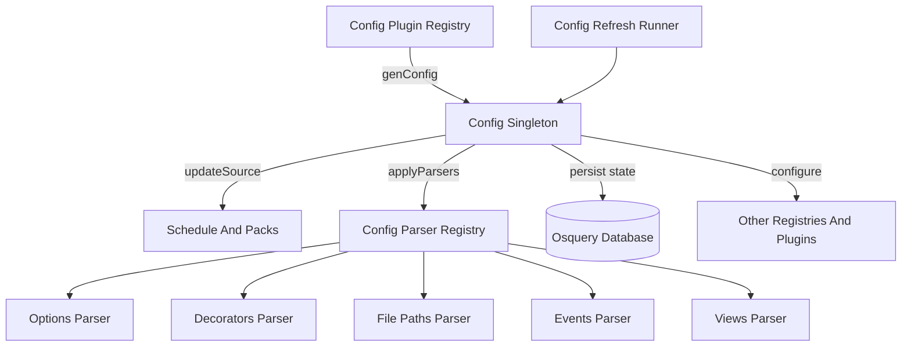
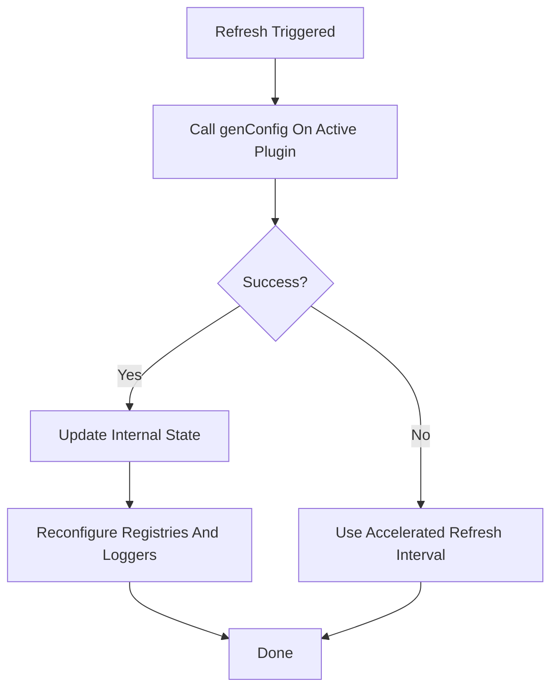
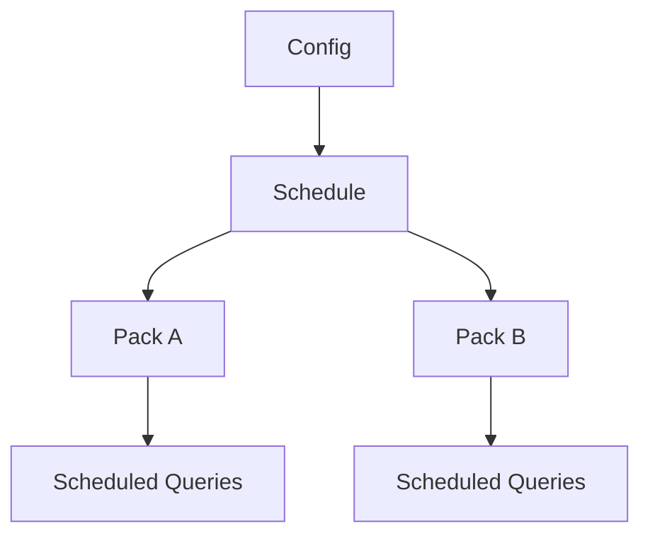
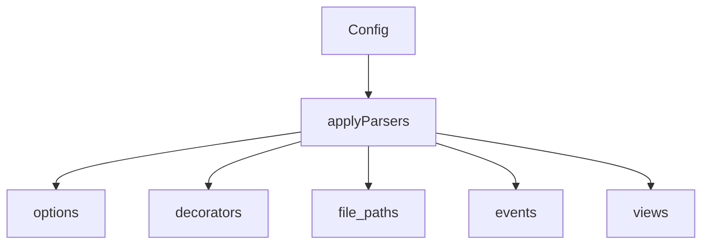
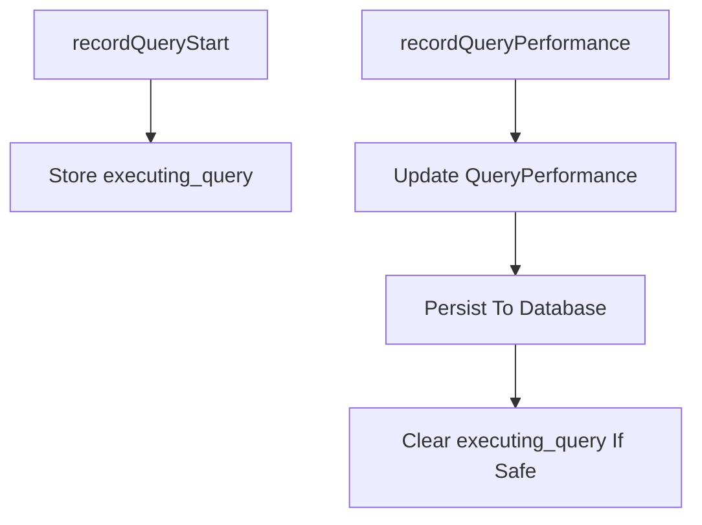

# Core Config And Flags

## Overview

The **Core Config And Flags** module is responsible for:

- Loading and refreshing osquery configuration from pluggable sources
- Parsing and applying configuration sections such as schedules, packs, options, views, file paths, and decorators
- Managing scheduled query lifecycle, denylisting, and performance statistics
- Defining and managing runtime flags and configuration options
- Coordinating dynamic reconfiguration across registries and plugins

This module acts as the control plane for osquery behavior. It connects configuration sources (filesystem, TLS, extensions) with runtime subsystems such as the scheduler, database, eventing, logging, and SQL engine.

---

## High-Level Architecture

### Core Responsibilities

1. **Configuration Retrieval** via `ConfigPlugin` implementations.
2. **Validation and Hashing** of configuration sources.
3. **Schedule and Pack Management**.
4. **Parser Dispatch** for top-level config keys.
5. **Flag Management** through the Flag abstraction.
6. **State Persistence** (denylist, performance, timestamps) in the database.
7. **Dynamic Reconfiguration** of registries and loggers.

---

## Configuration Lifecycle

### 1. Loading

The `Config::load()` method:

- Validates that an active config plugin exists.
- Sets the refresh interval (`config_refresh`).
- Starts the `ConfigRefreshRunner` thread if needed.
- Calls `Config::refresh()`.

### 2. Refreshing

- On failure, the refresh interval may switch to `config_accelerated_refresh`.
- Optional backup restoration (`config_enable_backup`) may occur.
- On success, configuration is parsed and applied.

### 3. Update Per Source

Each configuration source (e.g., file path) is processed independently:

- Content hashing prevents redundant updates.
- Comments are stripped.
- JSON is validated (depth and size limits enforced).
- `schedule` and `packs` sections are extracted.
- Config parsers are applied.
- Query performance stats are cleared for modified queries.

---

## Core Components

### Config

The `Config` singleton is the central coordinator.

Key responsibilities:

- Maintains:
  - Active `Schedule`
  - File monitoring map
  - Source hashes
  - Validity and load state
- Applies parser plugins
- Tracks scheduled query performance
- Persists and restores backup configuration
- Triggers reconfiguration of registries

It uses multiple mutexes for thread-safe access:

- Schedule mutex
- File mutex
- Hash mutex
- Refresh mutex
- Performance mutex

---

### ConfigRefreshRunner

`ConfigRefreshRunner` is a background service that:

- Sleeps for `refresh_sec_` seconds
- Calls `Config::refresh()`
- Supports interruption

This enables dynamic configuration reload without restarting osquery.

---

## Schedule And Packs

The schedule is composed of `Pack` objects.

### Pack

A `Pack` represents a group of scheduled queries and includes:

- Discovery queries
- Platform and version constraints
- Shard restrictions
- Query definitions (`ScheduledQuery`)
- Execution statistics (`PackStats`)

Execution gating:

- `checkPlatform()`
- `checkVersion()`
- `checkDiscovery()`
- Shard validation

Only valid and active packs are scheduled.

### Denylist Management

If a scheduled query:

- Crashes a worker
- Triggers a watchdog resource limit

It may be denylisted for a period (default 24 hours).

Denylist state is:

- Persisted in the database
- Restored on startup
- Automatically expired

---

## Config Plugin System

### ConfigPlugin

The `ConfigPlugin` registry defines pluggable configuration sources.

Supported actions:

- `genConfig`
- `genPack`
- `update`
- `option`

### FilesystemConfigPlugin

Provides file-based configuration.

Features:

- Reads main config file (`config_path` flag)
- Loads additional files from `config_path.d/`
- Supports multi-pack expansion using glob patterns

### UpdateConfigPlugin

A special plugin that allows extensions to update core configuration.

Used when:

- Config runs inside an extension process
- The update must be routed back to core

---

## Config Parser Plugins

Parser plugins handle specific top-level config keys.

### OptionsConfigParserPlugin

- Parses the `options` key
- Updates runtime flags using `Flag::updateValue`
- Prevents modification of CLI-only flags
- Triggers logger reconfiguration for verbosity changes

### DecoratorsConfigParserPlugin

- Parses the `decorators` key
- Supports three modes:
  - load
  - always
  - interval
- Executes SQL queries
- Injects returned columns into result logs

Decorators are stored in a shared, mutex-protected structure.

### FilePathsConfigParserPlugin

Handles:

- `file_paths`
- `file_paths_query`
- `file_accesses`
- `exclude_paths`

Capabilities:

- Expands glob patterns
- Executes SQL to dynamically generate file paths
- Registers file monitoring categories with `Config`

### EventsConfigParserPlugin

- Parses the `events` key
- Stores event configuration for use by the eventing subsystem

### ViewsConfigParserPlugin

- Parses the `views` key
- Creates and drops SQLite views dynamically
- Persists created views in the database
- Cleans up removed views on update

---

## Flag Management

### FlagDetail

Describes metadata about a flag:

- Description
- Shell-only
- Extension-only
- CLI-only
- Hidden

### FlagInfo

Represents a flag at runtime:

- Type
- Default value
- Current value
- Description
- Detail metadata

### Flag

A wrapper around gflags that provides:

- Centralized registry of flags
- Runtime updates from config
- Default value retrieval
- CLI-only enforcement
- Alias support

Flags can be set via:

- Command line
- Flag file
- Configuration `options` section (if not CLI-only)

---

## Query Performance Tracking

The configuration module tracks performance per scheduled query.

Metrics recorded:

- User time
- System time
- Wall time
- Memory usage
- Output size
- Execution count
- Last execution timestamp

If a query crashes during execution:

- The next startup detects the unfinished `executing_query`
- The query may be denylisted

---

## Configuration Integrity And Limits

To prevent abuse or corruption:

- Maximum JSON depth enforced
- Maximum config size enforced
- SHA1 hash maintained per source
- Combined hash generated for entire configuration

Hashing allows:

- Detecting source changes
- Avoiding unnecessary reconfiguration

---

## State Persistence

The database is used for:

- Denylisted queries
- Query performance stats
- Executing query tracking
- View definitions
- Splayed interval caching
- Backup configuration storage

This ensures:

- Crash resilience
- Deterministic scheduling
- Long-term statistics

---

## Interaction With Other Subsystems

The Core Config And Flags module integrates tightly with:

- SQL engine (scheduled queries and views)
- Database layer (state persistence)
- Logging subsystem (decorators and verbosity)
- Eventing subsystem (events parser)
- Dispatcher (refresh runner thread)
- Registry framework (plugins and reconfiguration)

It is foundational to osquery’s dynamic behavior and ensures that configuration changes propagate safely and consistently across the system.

---

## Summary

The **Core Config And Flags** module provides:

- Pluggable configuration retrieval
- Robust parsing and validation
- Scheduled query orchestration
- Runtime flag management
- Query performance tracking
- Safe dynamic reconfiguration

It acts as the central authority for osquery runtime behavior, bridging configuration data with execution, logging, eventing, and persistence layers.