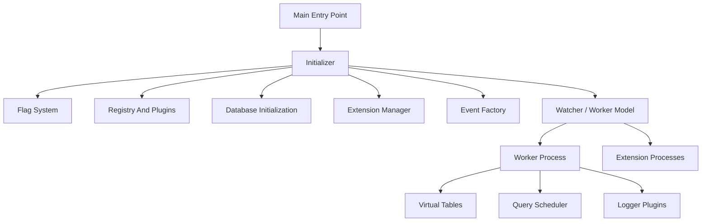
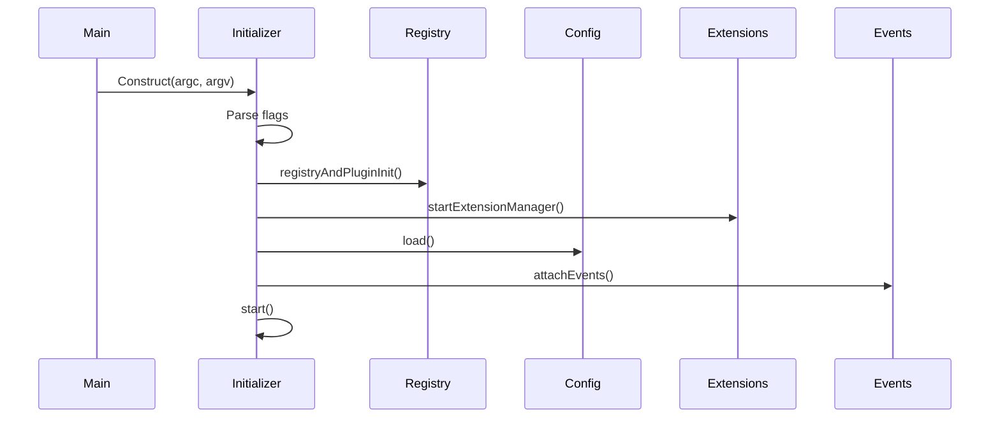
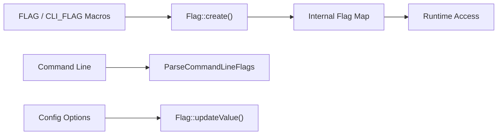
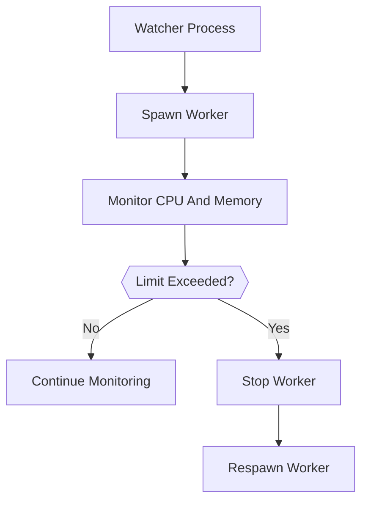
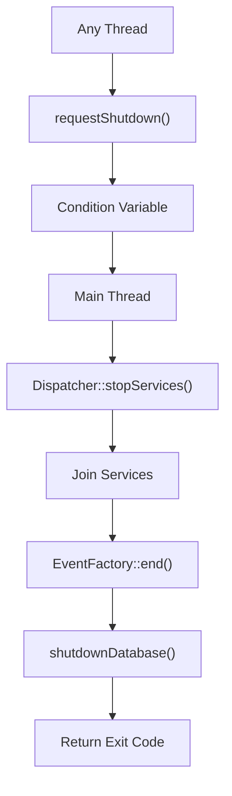
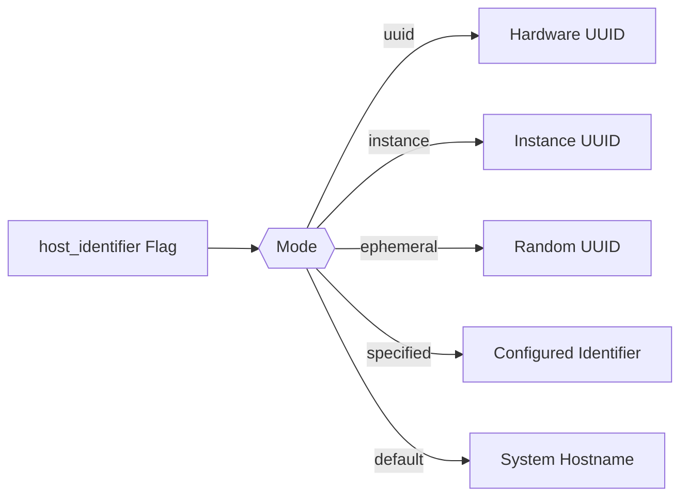
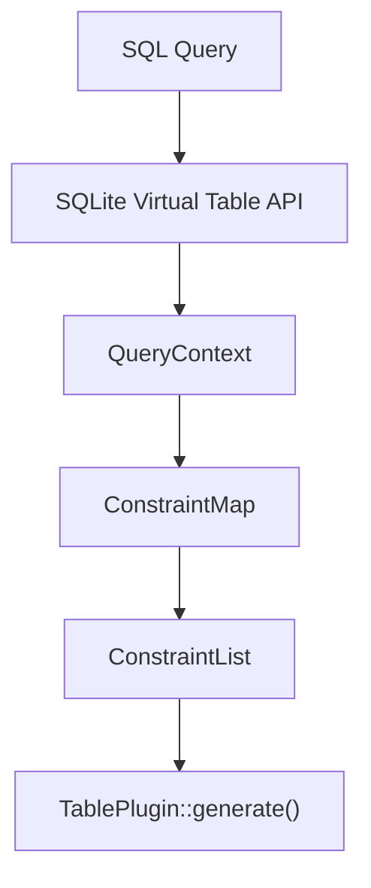
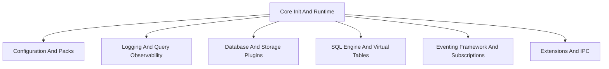

# Core Init And Runtime

The **Core Init And Runtime** module is the foundational execution layer of osquery. It is responsible for:

- Process initialization and bootstrap
- Command-line flag management
- Worker / watcher lifecycle orchestration
- Graceful and forced shutdown handling
- Platform and identity utilities (UUID, host identity, privilege control)
- Virtual table execution context and constraint handling
- Watchdog-based resource governance

This module defines the runtime contract that all higher-level subsystems rely on, including:

- [Configuration And Packs](../configuration-and-packs/configuration-and-packs.md)
- [Logging And Query Observability](../logging-and-query-observability/logging-and-query-observability.md)
- [Database And Storage Plugins](../database-and-storage-plugins/database-and-storage-plugins.md)
- [SQL Engine And Virtual Tables](../sql-engine-and-virtual-tables/sql-engine-and-virtual-tables.md)
- [Eventing Framework And Subscriptions](../eventing-framework-and-subscriptions/eventing-framework-and-subscriptions.md)
- [Extensions And IPC](../extensions-and-ipc/extensions-and-ipc.md)

---

## 1. Architectural Overview

At runtime, osquery can operate in multiple modes:

- **Daemon** (`osqueryd`)
- **Shell** (`osqueryi`)
- **Watcher (watchdog)**
- **Worker** (child process of watcher)
- **Extension process**

The Core Init And Runtime module orchestrates how these modes are selected, started, monitored, and shut down.

### High-Level Runtime Architecture

The **Initializer** class is the central orchestrator of this lifecycle.

---

## 2. Initialization Lifecycle

The `Initializer` class (defined in `system.h` and implemented in `init.cpp`) governs startup behavior.

### Core Responsibilities

- Parse CLI flags and flagfiles
- Determine tool type (daemon, shell, extension)
- Configure runtime defaults
- Initialize registries and plugins
- Start extension manager
- Load configuration
- Attach event publishers
- Activate logging and distributed plugins
- Launch watcher/worker model if enabled

### Startup Sequence

The `start()` method finalizes runtime activation after construction.

---

## 3. Flag System

Core Components:

- `FlagDetail`
- `FlagInfo`
- `Flag`

The flag system wraps **Google GFlags** to provide:

- Structured metadata (shell-only, CLI-only, hidden, extension-only)
- Default value tracking
- Runtime updates
- Custom flags from configuration

### Flag Architecture

Important behaviors:

- Flags can be set via CLI, flagfile, or config (unless CLI-only)
- `Flag::isDefault()` detects overridden values
- Aliases support backwards compatibility

Flags influence:

- Database activation
- Watchdog enablement
- Logging and distributed plugins
- OpenFrame mode

---

## 4. Worker and Watcher Model

Core Components:

- `LimitDefinition`
- `PerformanceChange`

The watcher/worker architecture isolates execution for reliability and resource control.

### Roles

| Role | Responsibility |
|------|----------------|
| Watcher | Monitors worker and extensions |
| Worker | Executes queries and plugins |
| Extension | External plugin process |

### Watchdog Control Flow

### Resource Limits

`LimitDefinition` defines profiles:

- Normal
- Restrictive
- Disabled

Enforced metrics:

- Memory footprint (MB)
- CPU utilization percentage
- Sustained latency duration
- Respawn frequency

`PerformanceChange` calculates CPU window utilization based on interval and CPU count.

If limits are exceeded:

- Worker is gracefully terminated
- Forced kill occurs if needed
- Restart logic applies exponential backoff

---

## 5. Shutdown Coordination

Core Component:

- `ShutdownData`

Shutdown is centralized and thread-safe.

### Shutdown Model

Key properties:

- Shutdown can only be requested once
- Exit code is stored atomically
- `AlarmRunnable` enforces maximum shutdown time
- `shutdownNow()` performs immediate `_Exit()`

This guarantees deterministic teardown even during deadlocks.

---

## 6. Platform and System Utilities

Core Components:

- `PrivateData`
- `stat`
- `tm`

### Host Identity

The module manages multiple UUID strategies:

- Hardware UUID
- Instance UUID (persistent)
- Ephemeral UUID
- Specified UUID
- Hostname fallback

Flow:

Persistent identifiers are stored via the database layer.

### Privilege Dropping (POSIX)

- Temporarily reduce effective UID/GID
- Restore original groups on destruction
- Used when interacting with filesystem-backed tables

### Thread Naming

Cross-platform thread naming for observability and debugging.

---

## 7. Virtual Table Execution Context

Core Components:

- `Constraint`
- `ConstraintList`
- `QueryContext`
- `VirtualTableContent`

This subsystem forms the bridge between:

- SQLite virtual table engine
- osquery table plugins

### Constraint Model

`ConstraintList` supports:

- Operator-aware filtering
- Affinity-aware matching (TEXT, INTEGER, BIGINT)
- Efficient pre-filter evaluation

`QueryContext` provides:

- Column usage tracking
- Constraint expansion
- Cache control flags

### VirtualTableContent

Stores:

- Column definitions
- Attributes (CACHEABLE, EVENT_BASED, etc.)
- Aliases
- Query-scoped caches

This metadata allows high-performance virtual table execution without repeated registry lookups.

---

## 8. Table Plugin Integration

Although fully described in [SQL Engine And Virtual Tables](../sql-engine-and-virtual-tables/sql-engine-and-virtual-tables.md), Core Init And Runtime provides:

- Context serialization
- Cache freshness checks
- Generator-based row streaming
- Extension table attachment

Caching model:

- Interval-based freshness
- Disabled when constraints are complex
- Serialized into backing database

---

## 9. Signal Handling

Signals handled:

- `SIGTERM`
- `SIGINT`
- `SIGUSR1`

Behavior:

- `SIGUSR1` → mark resource limit hit
- `SIGTERM` / `SIGINT` → request graceful shutdown
- Alarm timeout enforces upper bound on shutdown time

---

## 10. OpenFrame Mode Integration

Additional flags:

- `openframe_mode`
- `openframe_secret`
- `openframe_token_path`

When enabled:

- Initializes encryption service
- Extracts token
- Starts token refresher
- Updates authorization manager

This integrates osquery runtime with OpenFrame-managed authentication.

---

## 11. How This Module Fits the System

The Core Init And Runtime module:

- Bootstraps **all subsystems**
- Owns lifecycle and teardown guarantees
- Provides runtime isolation (watchdog model)
- Supplies identity and environment context
- Enables safe virtual table execution
- Enforces resource governance

Every other module depends on it either directly or indirectly.

### Dependency Positioning

Without this module:

- No flags would be parsed
- No plugins would activate
- No scheduler would run
- No graceful shutdown would occur

It is the execution spine of the osquery system.

---

## Summary

The **Core Init And Runtime** module is responsible for transforming a process invocation into a fully operational, resource-governed, plugin-enabled osquery runtime.

It provides:

- Deterministic initialization
- Mode-aware execution (daemon, shell, extension)
- Resource watchdog enforcement
- Safe shutdown semantics
- Host identity management
- Virtual table execution scaffolding

All higher-level capabilities build on top of this foundational runtime layer.