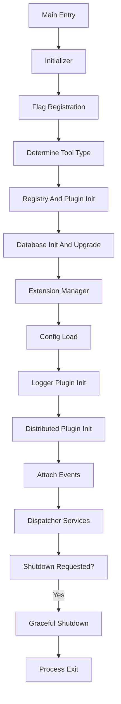
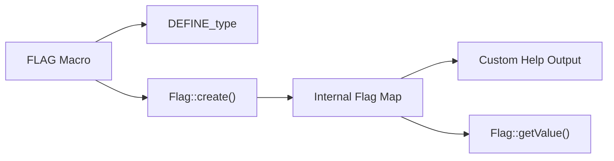
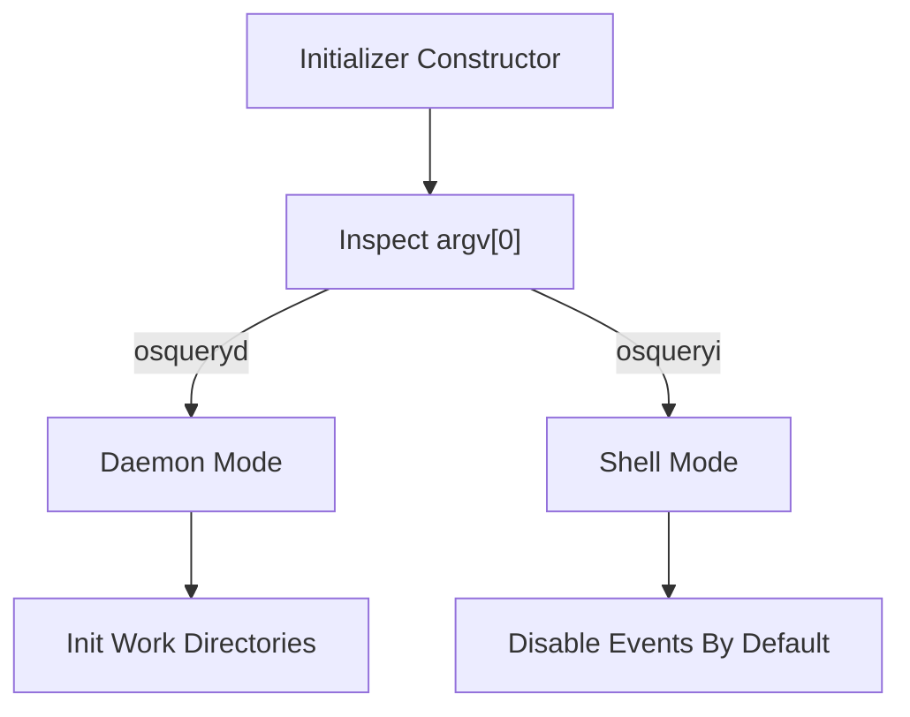
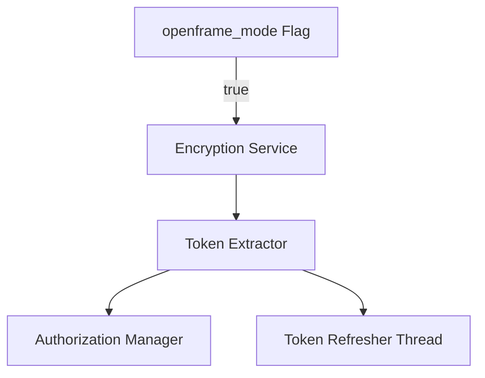
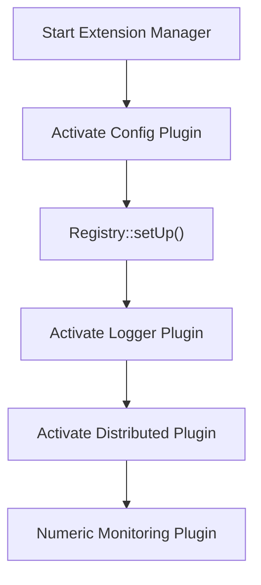
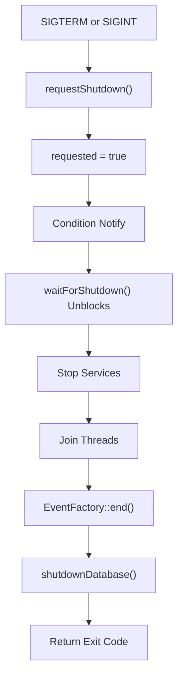
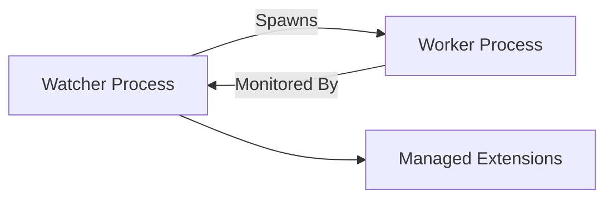

# Core Init And Runtime

The **Core Init And Runtime** module is responsible for bootstrapping, configuring, running, and gracefully shutting down the osquery process. It orchestrates flag parsing, plugin activation, database initialization, event lifecycle management, extension startup, and coordinated shutdown.

This module is the entry point for:

- Daemon mode (`osqueryd`)
- Interactive shell mode (`osqueryi`)
- Extension processes
- Watcher and worker subprocesses
- OpenFrame-integrated runtime (when enabled)

It provides the runtime spine that connects configuration, logging, database backends, SQL execution, distributed querying, events, and extensions.

---

## 1. Architectural Overview

At a high level, Core Init And Runtime performs the following sequence:

1. Parse and register flags
2. Determine tool mode (daemon, shell, extension)
3. Initialize registries and plugins
4. Initialize database and upgrade schema
5. Load configuration
6. Activate logger and distributed plugins
7. Start event loops and services
8. Block until shutdown request
9. Perform graceful teardown

### High-Level Runtime Flow

The Core Init And Runtime module interacts closely with:

- [Config And Packs](../config-and-packs/config-and-packs.md)
- [Plugin Interfaces And Logging](../plugin-interfaces-and-logging/plugin-interfaces-and-logging.md)
- [Database Backends](../database-backends/database-backends.md)
- [SQL Core And Virtual Tables](../sql-core-and-virtual-tables/sql-core-and-virtual-tables.md)
- [Extensions Framework](../extensions-framework/extensions-framework.md)
- [Events Core](../events-core/events-core.md)
- [Distributed Querying](../distributed-querying/distributed-querying.md)

This module does not implement business logic for these subsystems, but activates and coordinates them.

---

## 2. Core Components

The Core Init And Runtime module is primarily composed of:

- **FlagDetail** and **FlagInfo** – metadata for CLI and configuration flags
- **AlarmRunnable** – forced shutdown watchdog thread
- **ShutdownData** – global shutdown coordination state
- **Initializer** – the orchestration engine (defined across init and shutdown logic)

---

## 3. Flag System

**Core Components:**
- `osquery.osquery.core.flags.FlagDetail`
- `osquery.osquery.core.flags.FlagInfo`

The flag system wraps Google GFlags to provide osquery-specific metadata and lifecycle control.

### FlagDetail

Describes how a flag behaves:

- `description` – help text
- `shell` – available only in shell mode
- `external` – available only in extensions
- `cli` – CLI-only (cannot be set in config)
- `hidden` – omitted from help output

### FlagInfo

Represents a fully materialized flag:

- Type (string representation)
- Description
- Default value
- Current value
- Associated `FlagDetail`

### Flag Lifecycle

Flags are created using wrapper macros such as:

- `FLAG`
- `CLI_FLAG`
- `SHELL_FLAG`
- `EXTENSION_FLAG`
- `HIDDEN_FLAG`

Internally:

1. A GFlags variable is defined.
2. `Flag::create()` registers metadata.
3. Flags become discoverable through `Flag::flags()`.

### Flag System Architecture

This abstraction allows Core Init And Runtime to:

- Dynamically inspect defaults
- Override values programmatically
- Distinguish CLI-only vs config flags
- Generate structured help output

---

## 4. Initializer: Process Bootstrapping

The **Initializer** class is the central coordinator of runtime setup.

It determines the process role and activates subsystems accordingly.

### Tool Types

Initializer supports multiple execution contexts:

- Daemon (`osqueryd`)
- Shell (`osqueryi`)
- Extension
- Watcher (supervisor)
- Worker (child process)

### Mode Decision Flow

### Responsibilities

Initializer performs:

- Random seed initialization
- Start time registration
- File descriptor limits adjustment (POSIX)
- Default flagfile resolution
- GFlags parsing
- Registry and plugin initialization
- Signal handler installation
- Logger bootstrap
- OpenFrame initialization (if enabled)

---

## 5. OpenFrame Integration

When `openframe_mode` is enabled:

1. Encryption service is created
2. Token extractor reads token from configured path
3. Authorization manager is updated
4. Token refresher thread starts

This integration modifies authentication and runtime identity behavior without affecting core scheduling.

---

## 6. Plugin and Registry Activation

After flag parsing and base initialization:

1. Extension manager is started
2. Active config plugin is selected
3. Registry lazy setup is executed
4. Logger plugin is activated
5. Distributed plugin is activated
6. Numeric monitoring plugin (optional) is activated

This ties into:

- [Config And Packs](../config-and-packs/config-and-packs.md)
- [Plugin Interfaces And Logging](../plugin-interfaces-and-logging/plugin-interfaces-and-logging.md)
- [Distributed Querying](../distributed-querying/distributed-querying.md)

### Activation Flow

---

## 7. Database Initialization

Before configuration loading completes:

- Database plugin is initialized
- Schema upgrade is validated
- Persistent state becomes available

This integrates directly with:

- [Database Backends](../database-backends/database-backends.md)

If upgrade fails, shutdown is requested immediately.

---

## 8. Event and Service Runtime

Once configuration and plugins are ready:

- Event threads are attached
- Dispatcher services begin execution
- Watcher/worker orchestration begins
- Extension sockets are bound

Core Init And Runtime does not implement event logic directly; it activates the framework defined in:

- [Events Core](../events-core/events-core.md)

---

## 9. Graceful Shutdown Mechanism

**Core Component:**
- `osquery.osquery.core.shutdown.ShutdownData`

Shutdown is globally coordinated through a shared state structure.

### ShutdownData Fields

- `requested` – atomic flag indicating shutdown
- `retcode` – exit code
- `request_signal` – condition variable
- `request_mutex` – synchronization primitive

### Shutdown Lifecycle

### AlarmRunnable

**Core Component:**
- `osquery.osquery.core.init.AlarmRunnable`

This is a safety watchdog thread started during shutdown:

- Sleeps in 200 ms intervals
- Tracks elapsed time
- If shutdown exceeds `alarm_timeout`, calls `shutdownNow()`
- Forces immediate process termination

This prevents deadlocks during shutdown.

---

## 10. Watcher and Worker Model

Core Init And Runtime supports a supervised architecture:

- Watcher process supervises worker
- Worker runs queries and services
- Watcher restarts worker if needed

The watcher disables logging and persistent database access, acting purely as supervisor.

---

## 11. Signal Handling

Signals registered:

- `SIGTERM`
- `SIGINT`
- `SIGUSR1`

Behavior:

- `SIGTERM` / `SIGINT` → graceful shutdown
- `SIGUSR1` → mark resource limit hit

Signal handler always funnels into `Initializer::requestShutdown()`.

---

## 12. Interaction with Other Modules

Core Init And Runtime is not domain-specific; it is orchestration-centric.

| Subsystem | Role in Lifecycle |
|------------|-------------------|
| Config And Packs | Loads configuration after plugin activation |
| Database Backends | Persistent state and migrations |
| SQL Core And Virtual Tables | Query engine activated after registry setup |
| Plugin Interfaces And Logging | Status and result logging initialization |
| Extensions Framework | Extension manager startup and socket binding |
| Events Core | Event loop attachment and lifecycle |
| Distributed Querying | Distributed plugin activation |

Core Init And Runtime ensures correct ordering and isolation between these systems.

---

# Conclusion

The **Core Init And Runtime** module is the orchestration engine of osquery.

It provides:

- Structured flag management
- Deterministic initialization sequencing
- Multi-mode runtime (daemon, shell, extension)
- Watcher/worker supervision
- Plugin activation pipeline
- Coordinated graceful shutdown
- Forced termination safeguards

Without embedding business logic itself, it guarantees that every subsystem is initialized, monitored, and terminated safely and predictably.

It forms the foundational lifecycle contract upon which all other modules depend.
