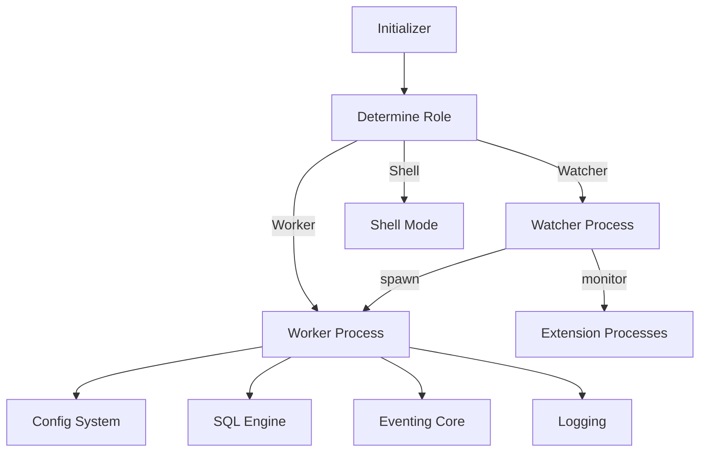
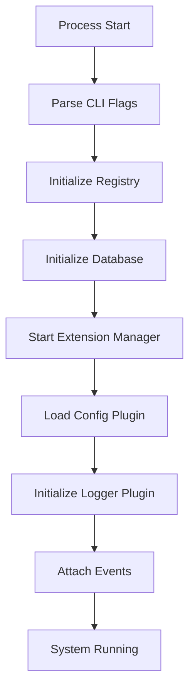
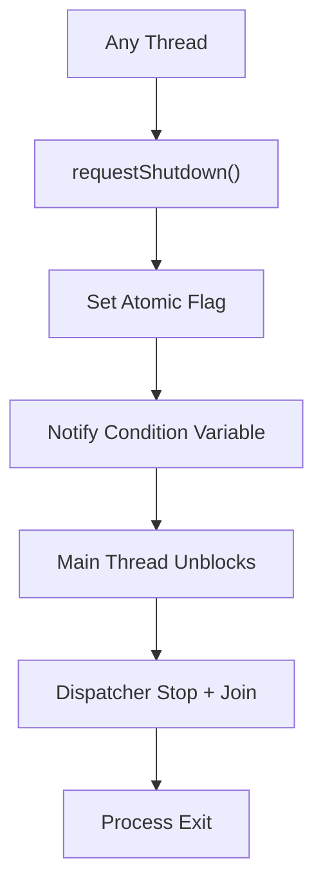
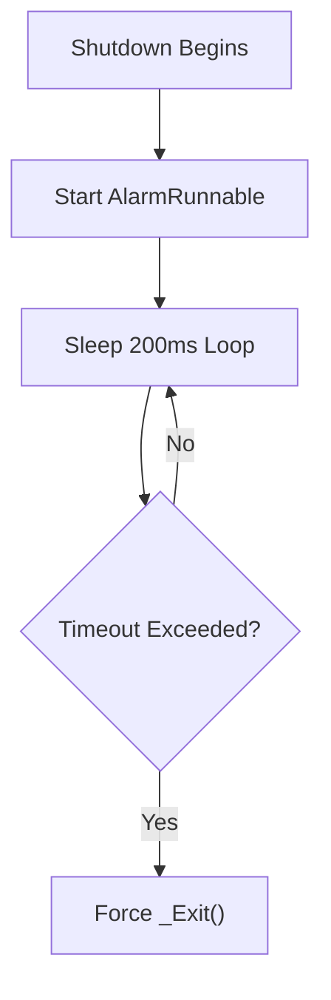
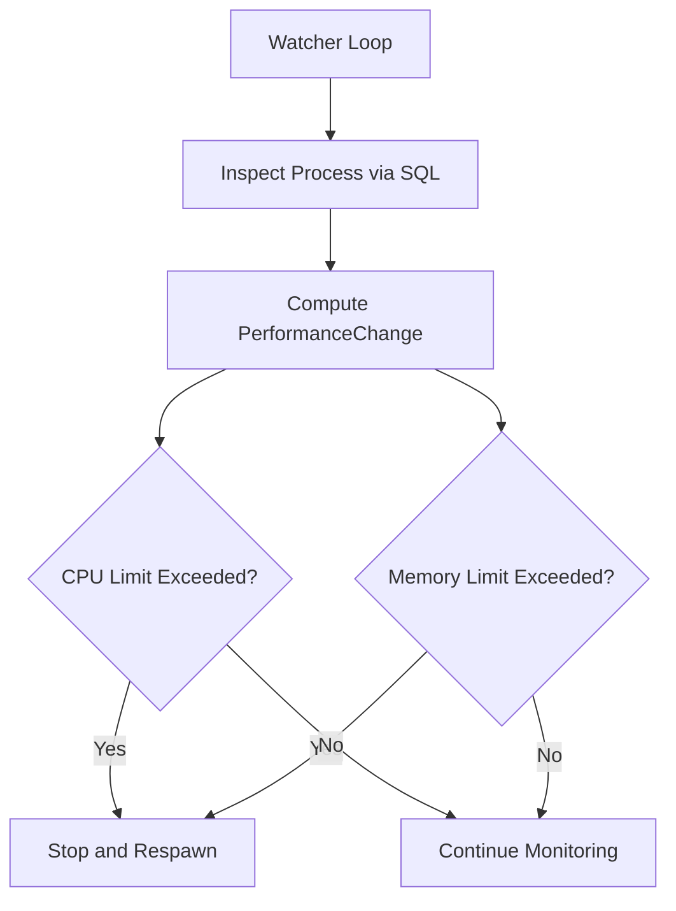
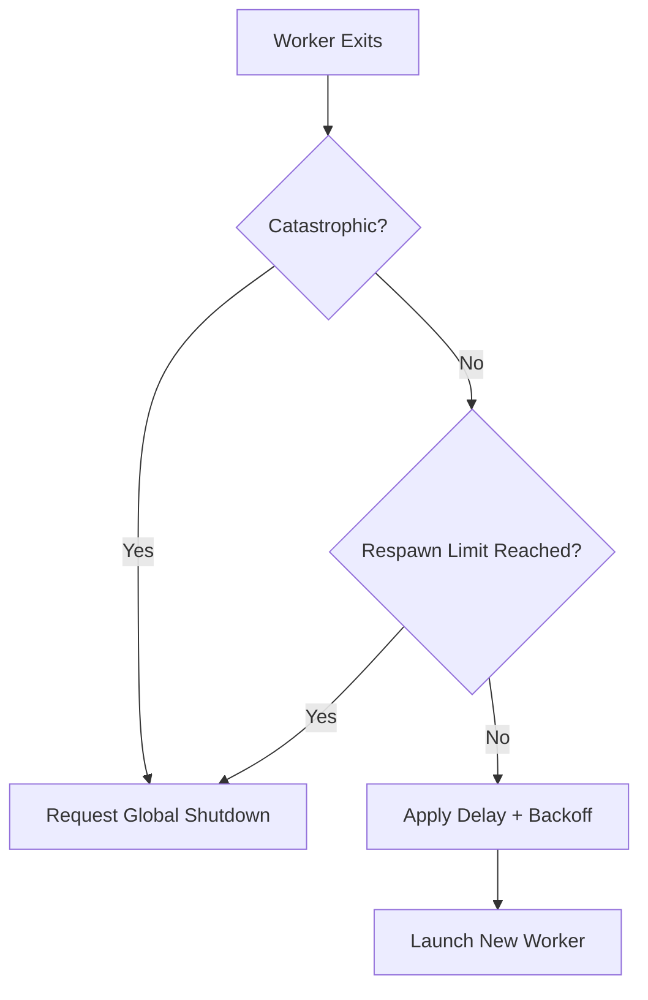

# Core Init Shutdown And Watcher

## Overview

The **Core Init Shutdown And Watcher** module is responsible for:

- Bootstrapping the osquery process lifecycle
- Managing daemon, shell, worker, and watcher roles
- Coordinating graceful and forced shutdown
- Enforcing runtime resource limits (CPU, memory, respawn behavior)
- Supervising worker and extension processes through a watchdog model

This module forms the backbone of process orchestration. It connects configuration, logging, database, extensions, SQL execution, and eventing into a coherent runtime.

Primary components:

- `osquery.osquery.core.init.AlarmRunnable`
- `osquery.osquery.core.shutdown.ShutdownData`
- `osquery.osquery.core.watcher.LimitDefinition`
- `osquery.osquery.core.watcher.PerformanceChange`

---

## High-Level Architecture

The module implements a **multi-process supervision model**:

- **Watcher (parent process)** – Supervises worker and extensions
- **Worker (child process)** – Runs core osquery logic (config, queries, events)
- **Extensions** – Optional plugin processes managed by the watcher

### Process Topology

The **Initializer** configures the runtime and determines whether the process acts as:

- A watcher (default daemon mode)
- A worker (spawned by watcher)
- A shell process
- An extension process

---

## Initialization Flow

Initialization is orchestrated by the `Initializer` class (defined in `init.cpp`). It performs:

1. Flag parsing and validation
2. Environment inspection (worker vs watcher)
3. Registry and plugin initialization
4. Database setup
5. Extension manager startup
6. Config plugin activation
7. Logger activation
8. Event attachment

### Initialization Sequence

### Role Detection

The process role is determined by:

- CLI flags (`--disable_watchdog`, `--daemonize`, etc.)
- Environment variable `OSQUERY_WORKER`
- Tool type (daemon, shell, extension)

If watchdog is enabled:

- The parent becomes the **watcher**
- The watcher spawns the **worker**
- The worker performs operational tasks

---

## Shutdown Coordination

Shutdown behavior is centralized in `shutdown.cpp` using `ShutdownData`.

### ShutdownData Responsibilities

`ShutdownData` provides:

- Atomic shutdown request tracking
- Exit code storage
- Condition variable for blocking wait
- Thread-safe signaling

### Shutdown Signaling Model

### Graceful Shutdown Flow

When `Initializer::shutdown()` is invoked:

1. An `AlarmRunnable` thread is started
2. All dispatcher services are stopped
3. Services are joined
4. Event loops are terminated
5. Database is shut down
6. Alarm is cancelled
7. Platform teardown occurs

If shutdown exceeds `alarm_timeout`, a forced exit is triggered.

---

## AlarmRunnable: Forced Termination Guard

`AlarmRunnable` is a minimal interruptible thread that:

- Sleeps in 200 ms intervals
- Tracks total shutdown wait time
- Forces `_Exit(EXIT_CATASTROPHIC)` if timeout is exceeded

### Purpose

This protects against:

- Deadlocks during shutdown
- Hung services
- Stuck event loops

### Timeout Logic

Minimum allowed `alarm_timeout` is 10 seconds (validated at flag level).

---

## Watcher and Resource Enforcement

The watcher enforces runtime limits through `LimitDefinition` and `PerformanceChange`.

### LimitDefinition

Defines three performance tiers:

- **normal**
- **restrictive**
- **disabled**

Each watchdog limit (memory, CPU, latency, respawn behavior) maps to a `LimitDefinition`.

### PerformanceChange

Tracks per-process metrics:

- CPU time deltas (user + system)
- Sustained latency count
- Memory footprint (resident/private memory)
- Check interval
- Parent PID validation

### Resource Monitoring Model

### CPU Limit Calculation

`PerformanceChange::cpuUtilizationTimeLimit()` computes allowed CPU time as:

- utilization_percent × interval × number_of_cpus

If sustained latency exceeds the configured latency window, the worker is restarted.

### Memory Limit Enforcement

Memory enforcement compares:

- Current footprint (resident size delta)
- Configured memory limit (MB)

If exceeded:

- Worker is gracefully stopped
- Forced kill is used if necessary

---

## Worker Respawn Strategy

The watcher protects system stability by controlling respawns:

- Tracks restart count
- Applies exponential backoff
- Enforces maximum respawn limits

### Respawn Logic

This prevents:

- Rapid crash loops
- CPU thrashing
- Log flooding

---

## Extension Supervision

The watcher can also supervise extension processes.

When `enable_extensions_watchdog` is enabled:

- Extensions are monitored like workers
- CPU and memory limits are enforced
- Unsafe permissions prevent execution
- Rapid respawn is detected

If an extension violates limits:

- It is gracefully stopped
- Restarted if allowed
- Or ignored if permanently invalid

---

## Signal Handling

The module installs signal handlers for:

- `SIGTERM`
- `SIGINT`
- `SIGUSR1`

Behavior:

- `SIGTERM` / `SIGINT` → graceful shutdown
- `SIGUSR1` → mark resource limit hit
- Unexpected signals → exit with `128 + signal_number`

---

## Interaction with Other Modules

This module orchestrates several core systems:

- **Configuration** → [Core Config And Flags](../core-config-and-flags/core-config-and-flags.md)
- **Logging** → [Logging](../logging/logging.md)
- **Database** → [Database](../database/database.md)
- **SQL Engine** → [SQL Core And Virtual Tables](../sql-core-and-virtual-tables/sql-core-and-virtual-tables.md)
- **Extensions IPC** → [Extensions And IPC](../extensions-and-ipc/extensions-and-ipc.md)
- **Event System** → [Eventing Core](../eventing-core/eventing-core.md)

It does not implement business logic itself. Instead, it:

- Ensures proper startup ordering
- Guarantees safe shutdown
- Enforces runtime safety limits
- Supervises process health

---

## Design Principles

### 1. Fail-Safe Shutdown

The alarm thread ensures the system cannot hang indefinitely.

### 2. Process Isolation

Worker logic is isolated from supervision logic to:

- Contain crashes
- Enforce limits externally
- Maintain control authority

### 3. Configurable Watchdog Levels

Three operational modes:

- Normal
- Restrictive
- Disabled

Overrides allow precise tuning for memory and CPU.

### 4. Cross-Platform Behavior

The module accounts for:

- Linux I/O priority
- macOS daemonization
- Windows service and process semantics

---

## Summary

The **Core Init Shutdown And Watcher** module is the runtime spine of osquery.

It provides:

- Deterministic initialization
- Structured plugin activation
- Centralized shutdown control
- Watchdog-based resource enforcement
- Worker and extension supervision

Without this module, the rest of the system would lack:

- Safe lifecycle control
- Crash containment
- Resource boundary enforcement
- Coordinated termination guarantees

It is foundational for stability, resilience, and secure process management across all supported platforms.
