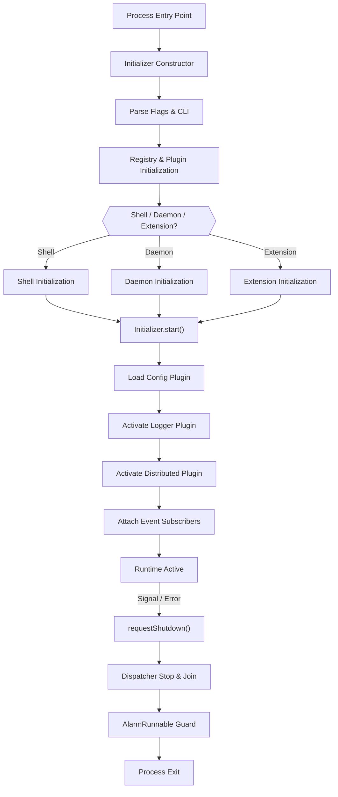
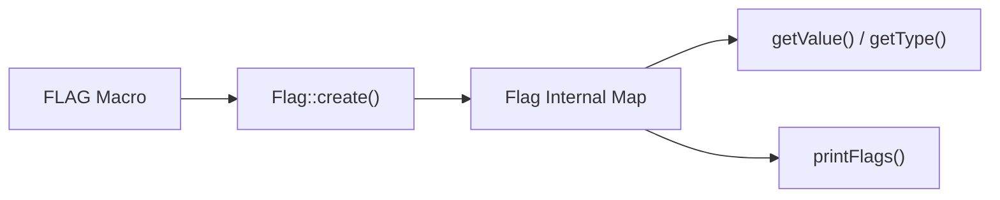
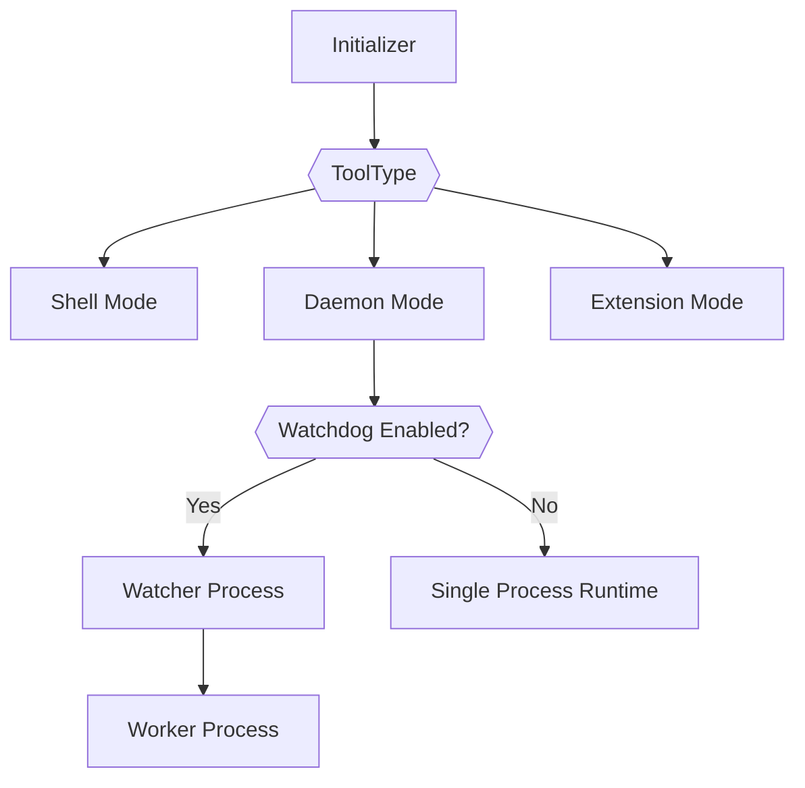
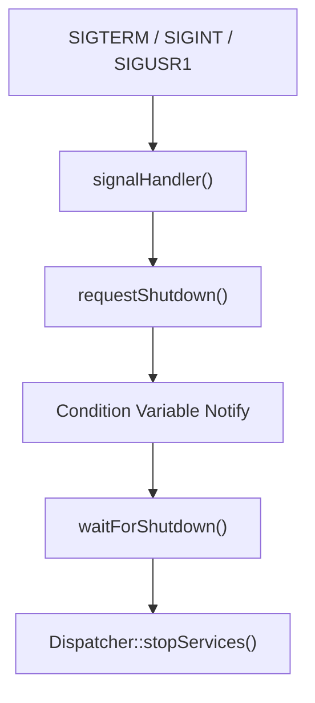
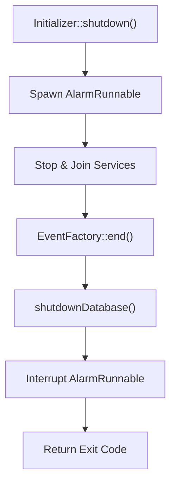

# Core Runtime And Lifecycle

The **Core Runtime And Lifecycle** module is responsible for bootstrapping, configuring, supervising, and gracefully shutting down the osquery process. It defines:

- The global flag system and runtime configuration surface
- Process initialization for daemon, shell, watcher, and worker modes
- Signal handling and shutdown coordination
- Resource limit enforcement and forced termination safeguards

This module acts as the orchestration layer that connects configuration, logging, extensions, database, distributed querying, and event subsystems into a coherent runtime.

---

## 1. Architectural Overview

At a high level, the runtime lifecycle follows this sequence:

### Key Responsibilities

| Area | Responsibility |
|------|----------------|
| Flags | Define and track runtime options |
| Initialization | Configure process mode and environment |
| Plugin Activation | Select and activate config, logger, distributed plugins |
| Watchdog Model | Supervise worker processes |
| Shutdown | Coordinate graceful or forced termination |

---

## 2. Flag System

**Core Components:**
- `osquery.osquery.core.flags.FlagDetail`
- `osquery.osquery.core.flags.FlagInfo`

The flag subsystem wraps Google GFlags and adds metadata tracking specific to osquery.

### 2.1 FlagDetail

Defines visibility and behavioral attributes:

- `description`
- `shell` (shell-only)
- `external` (extension-only)
- `cli` (CLI-only, not config-settable)
- `hidden`

### 2.2 FlagInfo

Provides runtime inspection data:

- Type
- Description
- Default value
- Current value
- Associated `FlagDetail`

### 2.3 Flag Registry

All flags are tracked centrally via the `Flag` singleton:

This allows:

- Runtime introspection
- Controlled updates via `updateValue()`
- Alias support
- Differentiation between CLI, shell, and extension flags

Flags directly influence:

- Plugin activation
- Watchdog behavior
- Database enablement
- Distributed querying
- OpenFrame mode activation

---

## 3. Process Initialization (Initializer)

**Core Component:**
- `osquery.osquery.core.init.AlarmRunnable`

The `Initializer` orchestrates runtime startup. It:

1. Detects tool type (shell, daemon, extension)
2. Parses flags
3. Initializes registries and plugins
4. Sets up database and configuration
5. Attaches event loops
6. Transitions to active runtime

### 3.1 Tool Modes

The runtime distinguishes between:

- **Shell** (`osqueryi`)
- **Daemon** (`osqueryd`)
- **Extension** process
- **Watcher** (watchdog supervisor)
- **Worker** (spawned by watcher)

### 3.2 Watchdog Model

If watchdog is enabled:

- A **Watcher** supervises a **Worker** process
- Worker executes core logic
- Watcher restarts worker on failure
- CPU and I/O priority adjustments are applied

This model improves resilience and resource isolation.

---

## 4. Plugin and Subsystem Activation

During `Initializer::start()`:

1. Database plugin is initialized
2. Extension manager starts
3. Config plugin is activated
4. Logger plugin is activated
5. Distributed plugin is activated
6. Event threads are attached

Relevant subsystems are documented separately:

- [Configuration And Packs](../configuration-and-packs/configuration-and-packs.md)
- [Logging And Query Metadata](../logging-and-query-metadata/logging-and-query-metadata.md)
- [SQL Engine And Virtual Tables](../sql-engine-and-virtual-tables/sql-engine-and-virtual-tables.md)
- [Database Backend](../database-backend/database-backend.md)
- [Extensions Framework](../extensions-framework/extensions-framework.md)
- [Events Core And Subscriptions](../events-core-and-subscriptions/events-core-and-subscriptions.md)
- [Distributed Querying](../distributed-querying/distributed-querying.md)

The Core Runtime And Lifecycle module does not implement these subsystems directly; it activates and coordinates them.

---

## 5. Signal Handling and Shutdown Coordination

**Core Component:**
- `osquery.osquery.core.shutdown.ShutdownData`

Shutdown is centralized and thread-safe.

### 5.1 ShutdownData

Encapsulates:

- `condition_variable` for coordination
- `mutex` for synchronization
- `atomic<bool>` for shutdown state
- Exit code storage

### 5.2 AlarmRunnable (Forced Shutdown Guard)

`AlarmRunnable` runs in a separate thread during shutdown:

- Waits in 200 ms intervals
- Monitors elapsed time
- If timeout exceeds `alarm_timeout`, calls `shutdownNow()`

This prevents indefinite hangs during teardown.

---

## 6. OpenFrame Integration

The module optionally enables OpenFrame mode using runtime flags:

- `openframe_mode`
- `openframe_secret`
- `openframe_token_path`

When enabled:

1. Encryption service is created
2. Token extractor retrieves initial token
3. Authorization manager is updated
4. Token refresher thread starts

OpenFrame is initialized during startup but remains decoupled from the core lifecycle logic.

---

## 7. Resource Limits and Safety

The initializer:

- Sets file descriptor limits (POSIX)
- Adjusts scheduling priority when watchdog is enabled
- Supports resource limit detection via `resourceLimitHit()`

If limits are exceeded, the shutdown mechanism can be triggered.

---

## 8. Lifecycle Summary

The Core Runtime And Lifecycle module provides:

- A structured startup pipeline
- Mode-aware runtime behavior
- Plugin activation sequencing
- Robust shutdown guarantees
- Watchdog-based resilience
- Centralized flag and configuration handling

It is the execution backbone of the system, ensuring that all higher-level modules operate within a controlled, observable, and recoverable runtime environment.

For subsystem-specific behavior, refer to the corresponding module documentation listed above.