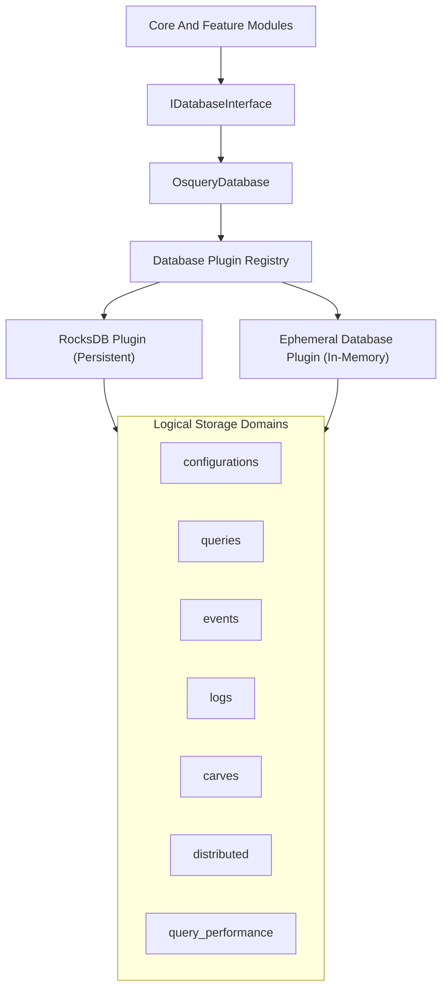
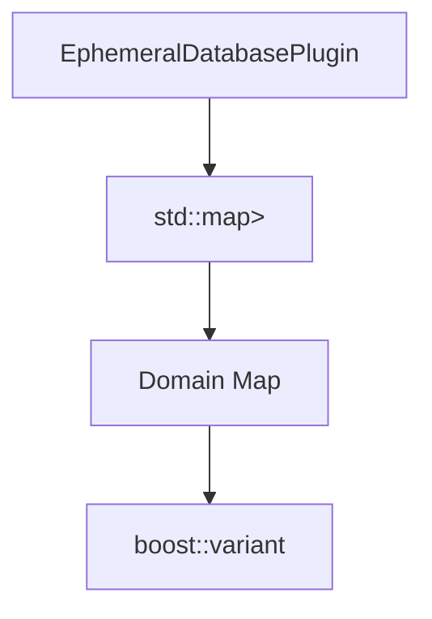
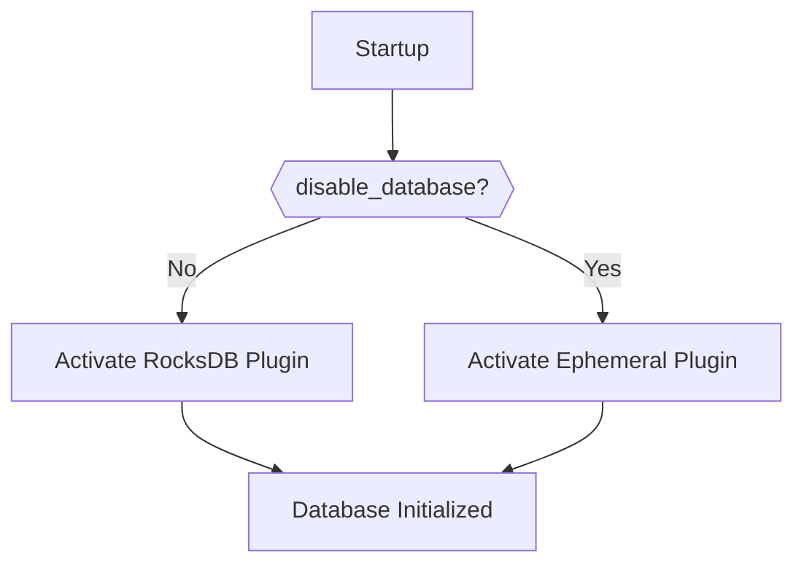
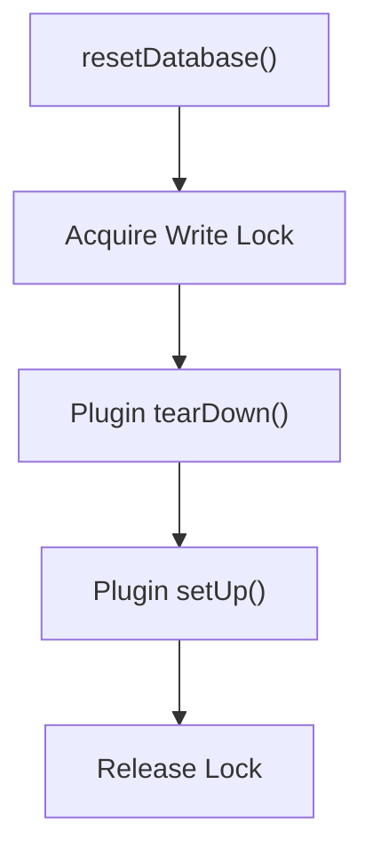
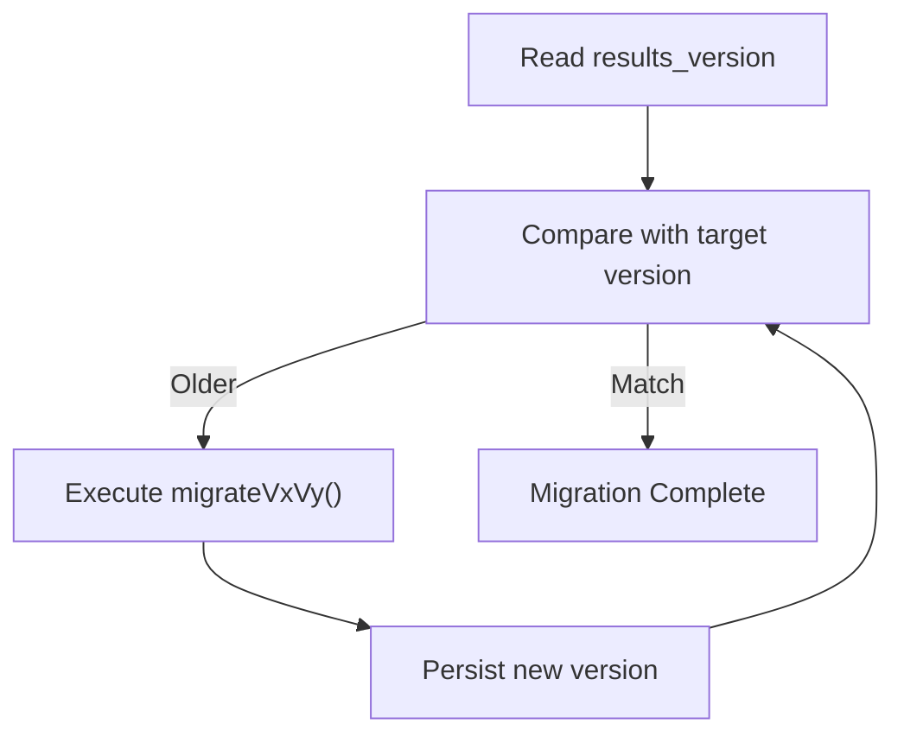

# Database And Storage Plugins

## Overview

The **Database And Storage Plugins** module provides the persistent and ephemeral key-value storage abstraction used by osquery core. It exposes a unified database interface that:

- Persists configuration state, scheduled query metadata, event buffers, logs, and distributed query state.
- Abstracts the underlying storage engine (e.g., RocksDB or in-memory ephemeral storage).
- Provides safe concurrent access with reset and migration support.
- Enables plugin-based database backends via the internal registry system.

At runtime, this module acts as the storage backbone for higher-level modules such as:

- [Configuration And Packs](../configuration-and-packs/configuration-and-packs.md)
- [Logging And Query Observability](../logging-and-query-observability/logging-and-query-observability.md)
- [Distributed Querying](../distributed-querying/distributed-querying.md)
- [Eventing Framework And Subscriptions](../eventing-framework-and-subscriptions/eventing-framework-and-subscriptions.md)
- [SQL Engine And Virtual Tables](../sql-engine-and-virtual-tables/sql-engine-and-virtual-tables.md)

It is implemented using a registry-driven plugin architecture, allowing the storage backend to be replaced or disabled.

---

## Architectural Overview

### High-Level Architecture



The module separates concerns into three layers:

1. **Public Database Interface** – Used by the rest of the system.
2. **Plugin Registry Layer** – Selects and manages the active database backend.
3. **Concrete Database Plugins** – Implement actual storage logic.

---

## Core Components

### OsqueryDatabase

**Component:** `osquery.osquery.database.database.OsqueryDatabase`

`OsqueryDatabase` implements the `IDatabaseInterface` and serves as the primary entry point for all database operations inside osquery.

It provides:

- `getDatabaseValue` (string and integer variants)
- `setDatabaseValue`
- `setDatabaseBatch`
- `deleteDatabaseValue`
- `deleteDatabaseRange`
- `scanDatabaseKeys`

Internally, it delegates all operations to free functions such as:

- `getDatabaseValue(...)`
- `setDatabaseValue(...)`
- `scanDatabaseKeys(...)`

These functions:

- Acquire read/write locks to protect against concurrent resets.
- Route calls through the database plugin registry.
- Support both internal and external (extension-based) registry execution.

This design ensures that the rest of the system depends only on the interface, not the concrete backend.

---

### EphemeralDatabasePlugin

**Component:** `osquery.osquery.database.ephemeral.EphemeralDatabasePlugin`

The `EphemeralDatabasePlugin` is an in-memory implementation of the `DatabasePlugin` interface.

It is:

- Registered internally as the `ephemeral` database plugin.
- Used when the `disable_database` flag is enabled.
- Used for testing and fallback scenarios.

#### Internal Data Structure



Storage model:

- Outer map: `domain → domain_map`
- Inner map: `key → boost::variant<int, std::string>`

Supported operations:

- `get`
- `put`
- `putBatch`
- `remove`
- `removeRange`
- `scan`

Since it is purely in-memory:

- No persistence across restarts.
- No disk I/O.
- Ideal for unit testing and ephemeral deployments.

---

## Database Domains

The module defines several logical domains used throughout osquery:

| Domain | Purpose |
|--------|----------|
| `configurations` | Persistent settings and metadata |
| `queries` | Scheduled query state and results metadata |
| `events` | Event framework buffers |
| `logs` | Buffered logging data |
| `carves` | File carving state |
| `distributed` | Distributed query tasks |
| `distributed_running` | Active distributed query tracking |
| `query_performance` | Performance metrics for queries |

Domains act as logical namespaces within a single database backend.

---

## Plugin Lifecycle and Initialization

### Initialization Flow



Key behaviors:

- If `disable_database` is false, the internal persistent plugin (RocksDB) is selected.
- If `disable_database` is true, the `ephemeral` plugin is activated.
- Initialization retries up to 25 times to handle file locks or shutdown races.
- `kDBInitialized` ensures safe access.

---

## Concurrency and Reset Safety

To protect database operations:

- A global mutex `kDatabaseReset` is used.
- Read locks guard standard operations.
- Write locks guard reset flows.

### Reset Flow



If reset fails:

- The registry falls back to the `ephemeral` backend.
- A warning is logged.

This prevents total system failure when persistent storage is corrupted.

---

## Database Migrations

The module supports schema/data migrations via version tracking.

- Version key: `results_version`
- Stored under domain: `configurations`

### Migration Flow



Examples of migrations:

- Converting legacy property-tree JSON to RapidJSON format.
- Renaming event publisher keys.

If migration fails:

- Error is logged.
- Database upgrade aborts.

---

## Interaction with Other Modules

### Configuration And Packs

Configuration refreshers persist:

- Pack execution counters.
- Schedule metadata.
- Decorator state.

All stored under structured domains using `setDatabaseValue` and `scanDatabaseKeys`.

---

### Logging And Query Observability

This module persists:

- Scheduled query state.
- Query performance metrics.
- Result differentials.

The `query_performance` domain ensures metrics survive restarts when persistent storage is enabled.

---

### Distributed Querying

The distributed module uses domains:

- `distributed`
- `distributed_running`

These track:

- Pending tasks.
- Active query execution state.

---

### Eventing Framework And Subscriptions

Event publishers and subscribers use the `events` domain to:

- Persist event cursors.
- Maintain audit or publisher state.

---

## Extension and External Registry Behavior

If osquery is running as an **extension process**:

- It does not directly access the database backend.
- Database requests are routed via `Registry::call("database", ...)`.
- The main daemon handles storage.

This enforces:

- Centralized persistence.
- No extension-level database corruption risk.

---

## Key Design Characteristics

### 1. Plugin-Based Storage

- Storage backend selected via registry.
- Easily replaceable or disabled.
- Uniform request interface (`get`, `put`, `scan`, etc.).

### 2. Domain Isolation

Logical partitioning prevents key collisions across features.

### 3. Migration Safety

- Explicit version tracking.
- Incremental migration steps.
- Failure-safe version commit.

### 4. Reset and Recovery Support

- Safe reset workflow.
- Automatic fallback to ephemeral storage.
- Multi-attempt initialization.

### 5. Thread Safety

- Reader/writer locking around reset flows.
- Atomic flags guarding initialization state.

---

## When to Use Each Backend

| Backend | Use Case |
|----------|----------|
| RocksDB (Persistent) | Production deployments requiring durable state |
| Ephemeral | Testing, debugging, or stateless environments |

Testing environments typically use:

```text
initDatabasePluginForTesting()
```

Which:

- Forces `disable_database = true`
- Activates ephemeral storage
- Resets the database

---

## Summary

The **Database And Storage Plugins** module provides the foundational storage abstraction for osquery. It:

- Decouples storage implementation from core logic.
- Enables plugin-based extensibility.
- Protects against corruption via reset and migration controls.
- Supports both persistent and in-memory storage.

Every major subsystem in osquery relies on this module for durable state, making it a critical backbone component of the overall architecture.