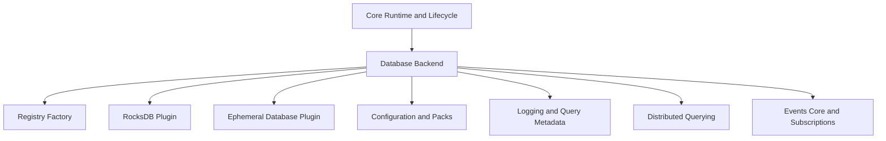
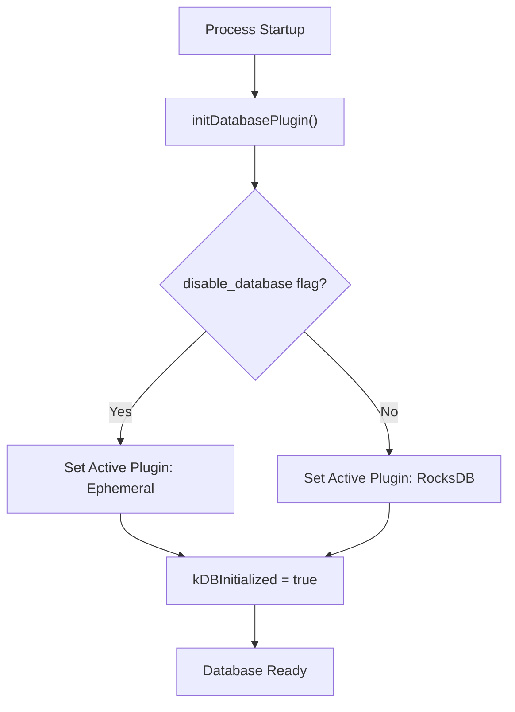
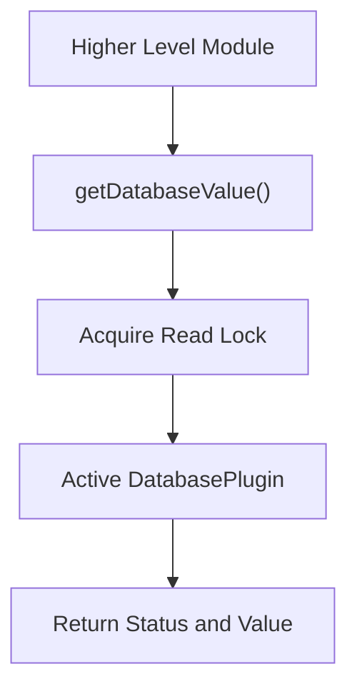
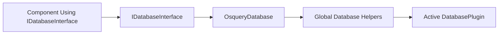
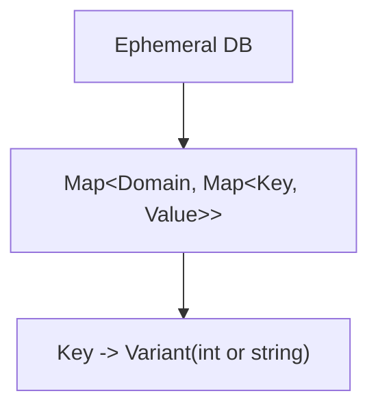
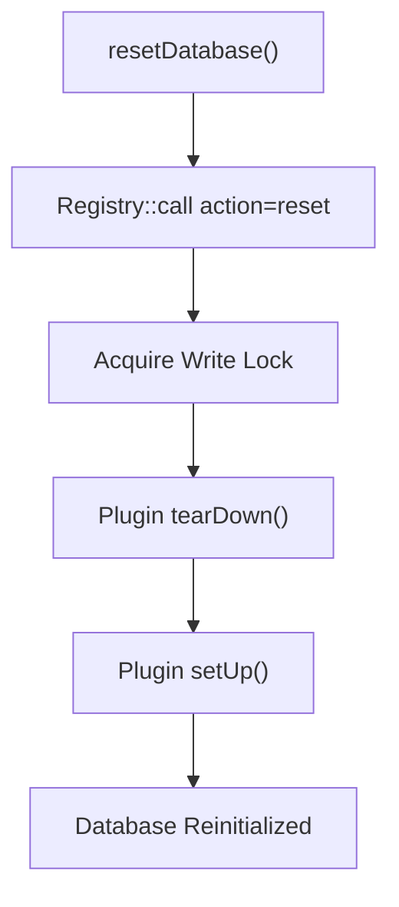
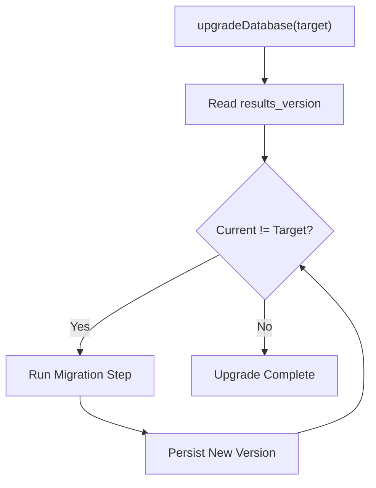

# Database Backend

The **Database Backend** module provides the persistent and ephemeral key–value storage layer for osquery. It abstracts the underlying storage engine behind a pluggable interface and exposes a uniform API used by configuration, logging, distributed querying, and event subsystems.

At runtime, the Database Backend is responsible for:

- Selecting and initializing the active database plugin (e.g., RocksDB or Ephemeral)
- Providing domain-scoped key–value operations (get, put, remove, scan)
- Handling database resets and migrations
- Coordinating safe access through locking and lifecycle guards
- Offering a stable `IDatabaseInterface` for higher-level components

---

## 1. Architectural Overview

The Database Backend sits at the core of osquery’s state management. Other modules such as Configuration and Packs, Logging and Query Metadata, Distributed Querying, and Events rely on it for durable or transient storage.

### High-Level Architecture

### Key Concepts

- **DatabasePlugin Registry**: A registry category named `database` allows pluggable storage engines.
- **Domains**: Logical namespaces (e.g., `queries`, `events`, `logs`) partition stored data.
- **Global Accessors**: Helper functions (e.g., `getDatabaseValue`, `setDatabaseValue`) provide thread-safe access.
- **Migration Framework**: Handles on-disk schema evolution between database versions.

---

## 2. Core Components

This module contains two primary components:

- `osquery.osquery.database.database.OsqueryDatabase`
- `osquery.osquery.database.ephemeral.EphemeralDatabasePlugin`

Together, they define the public database interface and a built-in in-memory implementation.

---

## 3. DatabasePlugin Abstraction Layer

The Database Backend uses a plugin-based architecture:

- A `DatabasePlugin` registry is created under the name `database`.
- The active plugin is selected at initialization time.
- By default, the internal RocksDB implementation is used unless disabled.
- The Ephemeral plugin acts as a fallback or test implementation.

### Initialization Flow

### Concurrency Controls

- `kDatabaseReset` (reader/writer mutex):
  - **Write lock** during reset operations
  - **Read lock** during normal get/put operations
- Atomic flags:
  - `kDBInitialized`
  - `kDBAllowOpen`
  - `kDBChecking`

This ensures safe access during plugin switching, resets, and shutdown.

---

## 4. Domains and Data Organization

The Database Backend organizes state into well-known domains:

- `configurations`
- `queries`
- `events`
- `logs`
- `carves`
- `distributed`
- `distributed_running`
- `query_performance`

These domains are used by:

- [Configuration and Packs](../configuration-and-packs/configuration-and-packs.md)
- [Logging and Query Metadata](../logging-and-query-metadata/logging-and-query-metadata.md)
- [Distributed Querying](../distributed-querying/distributed-querying.md)
- [Events Core and Subscriptions](../events-core-and-subscriptions/events-core-and-subscriptions.md)

Each domain is logically isolated but handled through the same plugin interface.

---

## 5. Public Database API

The Database Backend exposes global helper functions wrapping the active plugin:

- `getDatabaseValue(domain, key, value)`
- `setDatabaseValue(domain, key, value)`
- `setDatabaseBatch(domain, data)`
- `deleteDatabaseValue(domain, key)`
- `deleteDatabaseRange(domain, low, high)`
- `scanDatabaseKeys(domain, keys, prefix, max)`

### Internal Call Flow

If running inside an **extension context**, calls are routed through the registry instead of direct plugin access, since extensions do not host active database instances.

---

## 6. OsqueryDatabase (IDatabaseInterface Implementation)

`OsqueryDatabase` implements `IDatabaseInterface` and delegates all operations to the global helper functions.

### Responsibilities

- Provide a stable, dependency-injectable interface
- Abstract away registry and plugin details
- Support both string and integer value overloads

### Delegation Pattern

This ensures that higher-level components do not depend on specific plugin implementations.

---

## 7. Ephemeral Database Plugin

`EphemeralDatabasePlugin` is a built-in in-memory implementation of `DatabasePlugin`.

### Storage Model

### Characteristics

- Backed by nested `std::map` containers
- Supports both `int` and `std::string` values via `boost::variant`
- No persistence across restarts
- Used for:
  - Testing (`initDatabasePluginForTesting()`)
  - Fallback when persistent storage fails
  - Explicit `--disable_database` usage

### Supported Operations

- `get()` with type checking
- `put()` and `putBatch()`
- `remove()`
- `removeRange()` with lexicographic bounds
- `scan()` with prefix filtering and optional maximum

The Ephemeral plugin is registered internally under the name `ephemeral`.

---

## 8. Reset, Dump, and Lifecycle

### Reset Flow

If a reset fails, the system falls back to the Ephemeral plugin.

### Dumping Contents

When the `database_dump` flag is enabled, all domains are scanned and printed to stdout for debugging.

### Shutdown

`shutdownDatabase()` removes all registered database plugins from the registry, ensuring a clean termination.

---

## 9. Database Versioning and Migration

The Database Backend supports schema evolution via a version key stored in the `configurations` domain.

- Version key: `results_version`
- Migration path examples:
  - V0 → V1: Convert legacy property tree JSON to RapidJSON
  - V1 → V2: Rename specific event keys

### Migration Loop

Migration failures abort the upgrade and return an error status.

---

## 10. Interaction with Other Modules

The Database Backend underpins several subsystems:

- **Configuration and Packs**: Stores persistent configuration state and metadata.
- **Logging and Query Metadata**: Persists query results, scheduled query counters, and performance metrics.
- **Distributed Querying**: Tracks distributed query tasks and results.
- **Events Core and Subscriptions**: Maintains event buffers and publisher state.

It also integrates with:

- **Core Runtime and Lifecycle** for startup/shutdown orchestration.
- **Extensions Framework** for registry-based request forwarding in extension mode.

---

## 11. Design Strengths

- ✅ Pluggable storage engines
- ✅ Domain-based logical isolation
- ✅ Thread-safe reset and access model
- ✅ Backward-compatible migration framework
- ✅ Extension-aware routing logic

The Database Backend provides a stable foundation for osquery’s persistent and transient state, enabling modular growth while preserving strong encapsulation and operational safety.
