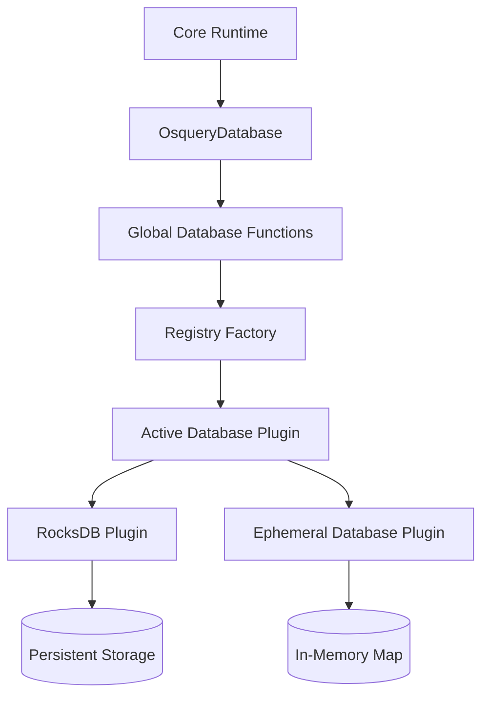
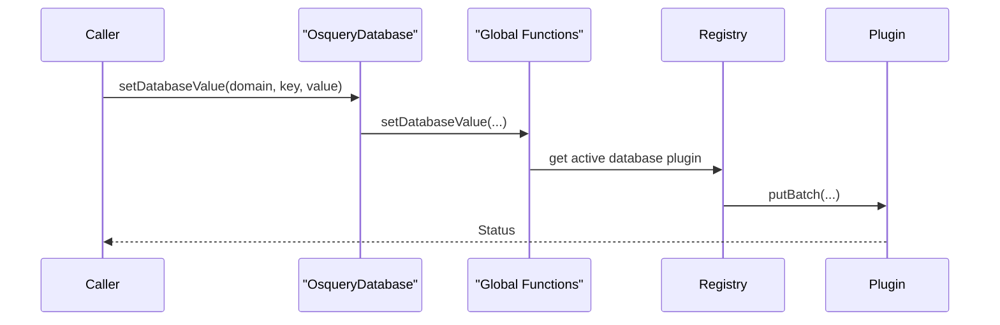
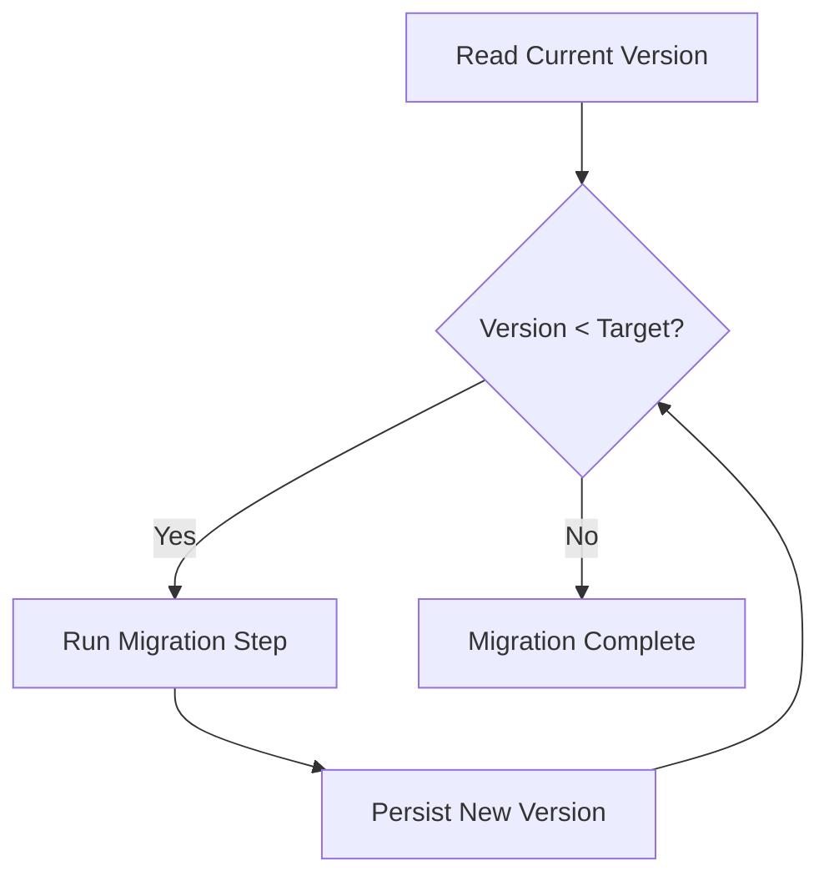

# Database Backends

The **Database Backends** module provides the persistent and ephemeral storage abstraction layer for osquery. It exposes a unified key–value interface used by higher-level subsystems such as scheduled queries, eventing, distributed querying, logging, and configuration management.

This module is responsible for:

- Abstracting database operations behind a plugin interface
- Managing database initialization and lifecycle
- Providing domain-based logical separation of stored data
- Handling database versioning and migrations
- Supporting both persistent (RocksDB) and in-memory (ephemeral) backends

The core components in this module are:

- `OsqueryDatabase` – High-level interface implementation used by the rest of the system
- `EphemeralDatabasePlugin` – In-memory database plugin implementation

---

## Architectural Overview

The Database Backends module sits between the osquery core runtime and concrete storage implementations.

### Key Concepts

1. **Plugin-based architecture** – Database backends are registered via the internal registry under the `database` registry namespace.
2. **Domain isolation** – Logical namespaces (domains) segment stored data.
3. **Thread-safe reset model** – A global read/write mutex protects reset and runtime operations.
4. **Versioned storage** – Migration logic upgrades stored data formats across versions.

---

## Logical Domains

Data stored in the database is organized into predefined domains:

- `configurations`
- `queries`
- `events`
- `logs`
- `carves`
- `distributed`
- `distributed_running`
- `query_performance`

Each domain acts as an isolated keyspace used by other modules such as:

- Scheduled queries (see SQL core and virtual tables module)
- Eventing subsystem (see Events core module)
- Distributed querying subsystem (see Distributed querying module)

---

## Core Interface: OsqueryDatabase

The `OsqueryDatabase` class implements `IDatabaseInterface` and delegates all operations to the global database helper functions.

### Responsibilities

- Provide a unified API for:
  - `getDatabaseValue`
  - `setDatabaseValue`
  - `setDatabaseBatch`
  - `deleteDatabaseValue`
  - `deleteDatabaseRange`
  - `scanDatabaseKeys`
- Abstract plugin routing and locking logic
- Enforce initialization guarantees

### Call Flow Example

---

## Plugin Model

The Database Backends module uses a registry-based plugin system:

- Registry name: `database`
- Active plugin selected at runtime
- Default persistent backend: `rocksdb`
- Fallback or testing backend: `ephemeral`

Initialization logic:

- If `disable_database` flag is set → use `ephemeral`
- Otherwise → attempt to activate persistent backend
- Retry logic handles startup race conditions

---

## Thread Safety and Lifecycle

A global mutex protects database resets:

- **Write lock** – During `reset` operations
- **Read lock** – During standard `get`, `put`, `scan`, `remove`

Atomic flags manage state:

- Database initialized
- Database checking state
- Database allow-open control

Lifecycle functions:

- `initDatabasePlugin()`
- `resetDatabase()`
- `shutdownDatabase()`
- `upgradeDatabase()`

---

## Database Migration

The module supports versioned upgrades using a stored key:

- Version key: `results_version`
- Stored in the `configurations` domain

Migration flow:

Example migrations:

- V0 → V1: Convert legacy Boost ptree JSON to RapidJSON format
- V1 → V2: Rename legacy audit event keys

---

## Ephemeral Backend

The in-memory backend is implemented by:

- [Ephemeral Database Plugin](database_backends/ephemeral/ephemeral.md)

This backend:

- Uses nested `std::map` containers
- Stores values as `boost::variant<int, std::string>`
- Supports prefix scans and range deletions
- Is primarily used for:
  - Testing
  - Disabled persistent storage mode
  - Controlled environments

---

## Interaction with Other Modules

The Database Backends module underpins multiple subsystems:

- Query result storage (SQL core and virtual tables module)
- Event buffering (Events core module)
- Distributed query coordination (Distributed querying module)
- Configuration persistence (Config and packs module)
- Query performance metrics (Query execution and logging module)

Rather than duplicating logic, higher-level modules rely exclusively on the `IDatabaseInterface` abstraction.

---

## Design Characteristics

### Advantages

- Clean separation between storage logic and consumers
- Pluggable backend architecture
- Thread-safe reset and migration model
- Clear domain-based key segmentation

### Limitations

- Domain list is statically defined
- Plugin selection is global, not per-domain
- Migration logic is centralized and version-step dependent

---

## Summary

The **Database Backends** module provides a robust, plugin-driven abstraction layer for all persistent and ephemeral storage in osquery. It ensures:

- Safe concurrent access
- Flexible backend selection
- Controlled initialization and reset behavior
- Forward-compatible data migration

It is a foundational infrastructure module enabling reliable state management across the entire osquery runtime.
