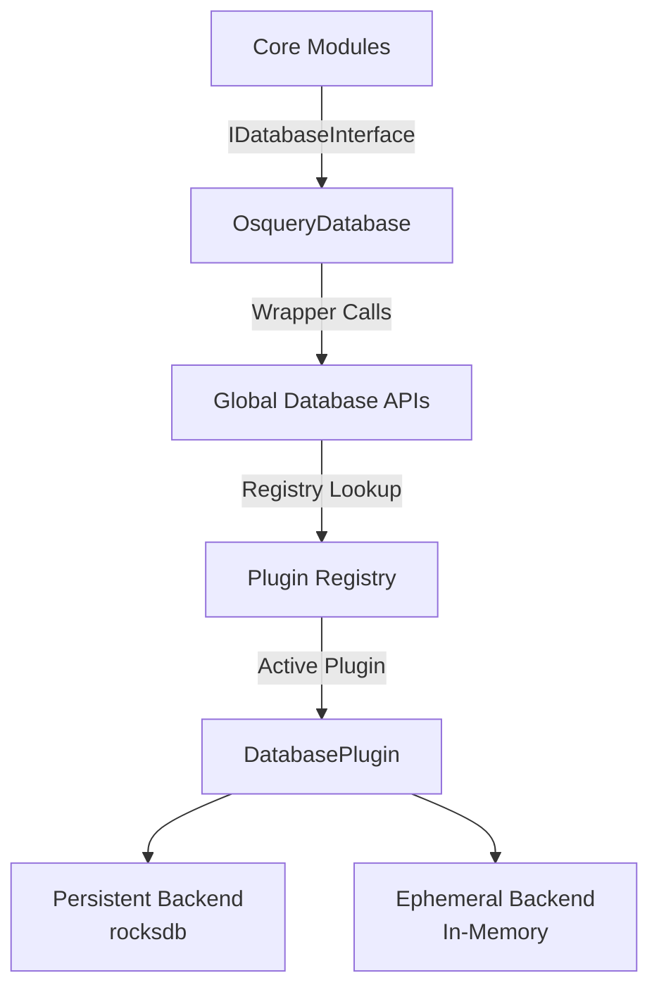
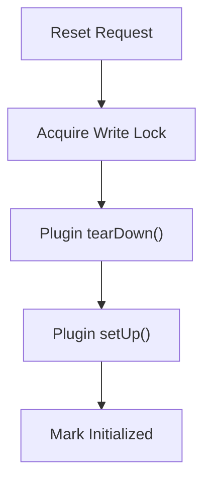
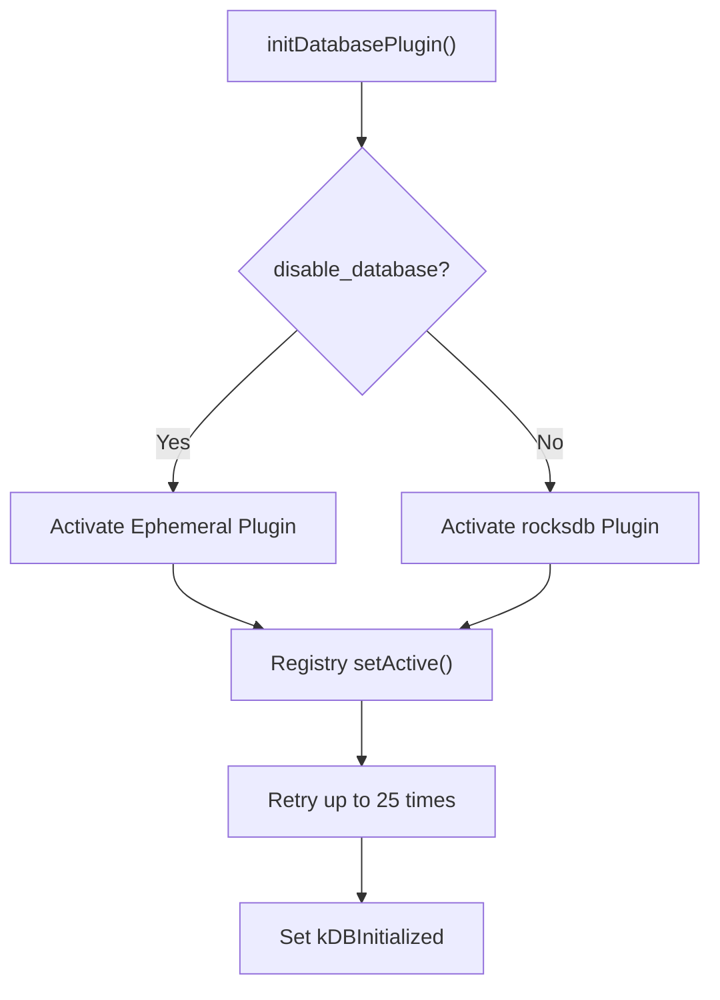

# Database

The **Database** module provides a pluggable, domain-scoped key–value storage abstraction for osquery. It is responsible for persisting internal state such as scheduled query results, configuration metadata, event indexes, distributed query state, and performance metrics.

The module exposes a unified interface (`IDatabaseInterface`) that hides the underlying storage implementation (e.g., RocksDB or in-memory ephemeral storage) and integrates with the osquery plugin registry.

---

## Purpose and Responsibilities

The Database module is designed to:

- Provide a **domain-based key–value store** abstraction.
- Support **pluggable storage backends** via the registry system.
- Offer **thread-safe access** with reset protection.
- Enable **batch writes and range operations**.
- Support **schema versioning and migrations**.
- Provide an **ephemeral fallback backend** for testing or when persistence is disabled.

It is a foundational service used by:

- Scheduled query execution (result storage and epochs)
- Eventing and subscriber state tracking
- Distributed query coordination
- Configuration and persistent settings
- Query performance recording

---

## Architecture Overview

The Database module follows a plugin-based architecture.



### Key Layers

1. **IDatabaseInterface**  
   Public abstraction used by core components.

2. **OsqueryDatabase**  
   Concrete implementation delegating to global helper functions.

3. **Global Database APIs**  
   Functions such as `getDatabaseValue`, `setDatabaseValue`, `scanDatabaseKeys`, and `deleteDatabaseValue`.

4. **DatabasePlugin (Registry-based)**  
   Abstract plugin defining operations like `get`, `put`, `putBatch`, `remove`, `removeRange`, and `scan`.

5. **Concrete Backends**  
   - `rocksdb` (persistent default backend)
   - `ephemeral` (in-memory fallback backend)

---

## Core Components

### OsqueryDatabase

**Component:** `osquery.osquery.database.database.OsqueryDatabase`

`OsqueryDatabase` implements `IDatabaseInterface` and acts as a thin wrapper over the global database functions.

Responsibilities:

- Forwarding calls to:
  - `getDatabaseValue`
  - `setDatabaseValue`
  - `setDatabaseBatch`
  - `deleteDatabaseValue`
  - `deleteDatabaseRange`
  - `scanDatabaseKeys`
- Providing a single static access point via `getOsqueryDatabase()`.

This ensures consistent database access across the entire codebase.

---

### EphemeralDatabasePlugin

**Component:** `osquery.osquery.database.ephemeral.EphemeralDatabasePlugin`

The Ephemeral backend is an in-memory implementation of `DatabasePlugin`.

Characteristics:

- Uses nested `std::map` containers:

```text
Domain -> (Key -> Value)
```

- Stores values as `boost::variant<int, std::string>`.
- Resets state on `setUp()`.
- Supports:
  - `get` (string and int)
  - `put`
  - `putBatch`
  - `remove`
  - `removeRange`
  - `scan`

Use cases:

- Testing (`initDatabasePluginForTesting()`)
- When `--disable_database` is enabled
- Fallback when persistent storage fails

---

## Domains and Logical Separation

The Database module uses **domains** to separate data categories.

Common domains include:

- `configurations`
- `queries`
- `events`
- `logs`
- `carves`
- `distributed`
- `distributed_running`
- `query_performance`

Each domain isolates a logical storage namespace to avoid key collisions and simplify scans.

---

## Thread Safety and Reset Protection

The module protects database access with:

- A global **reader/writer mutex** (`kDatabaseReset`).
- Atomic state flags:
  - `kDBInitialized`
  - `kDBAllowOpen`
  - `kDBChecking`

### Reset Flow



Read operations acquire a read lock; reset operations acquire a write lock.

This prevents race conditions during backend reinitialization.

---

## Initialization Workflow

Database initialization occurs via `initDatabasePlugin()`.



Features:

- Retry loop to handle persistent lock contention.
- Automatic fallback to ephemeral storage if reset fails.
- Explicit testing initialization via `initDatabasePluginForTesting()`.

---

## Database Operations

All operations route through the plugin registry.

### Get

```text
getDatabaseValue(domain, key, value)
```

- Validates domain.
- Acquires read lock.
- Delegates to active plugin.

### Put

```text
setDatabaseValue(domain, key, value)
```

- Uses `putBatch` internally.
- Supports string and integer overloads.

### Batch Put

```text
setDatabaseBatch(domain, data)
```

- Efficient multi-key write.
- Used for performance-sensitive workflows.

### Delete

```text
deleteDatabaseValue(domain, key)
```

### Range Delete

```text
deleteDatabaseRange(domain, low, high)
```

### Scan

```text
scanDatabaseKeys(domain, keys, prefix, max)
```

- Supports prefix filtering.
- Supports max key limit.

---

## Versioning and Migrations

The Database module supports schema upgrades through:

- `upgradeDatabase(int to_version)`
- Version key: `results_version` (stored in `configurations` domain)

Migration steps are incremental:

1. Read current version.
2. Execute migration function (e.g., `migrateV0V1`, `migrateV1V2`).
3. Persist incremented version.
4. Repeat until target version reached.

### Example Migration Patterns

- JSON format conversion.
- Key renaming for event publishers.
- Removal of legacy suffix-based entries.

This ensures forward compatibility while preserving stored state.

---

## External Registry Behavior

When running as an extension (external registry):

- Direct database access is disabled.
- Requests are forwarded through `Registry::call()`.
- Extensions cannot implement database plugins.

This enforces centralized control of persistent state.

---

## Dumping and Debugging

The `--database_dump` flag allows printing all domain/key/value pairs.

```text
<domain>[<key>]: <value>
```

This is useful for debugging state corruption or verifying migration behavior.

---

## Failure Handling and Fallbacks

If a database reset fails:

- The system switches to the `ephemeral` backend.
- A warning is logged.
- Execution continues without persistent storage.

This prioritizes system availability over persistence guarantees.

---

## Integration with Other Modules

The Database module underpins several subsystems in the module tree:

- Scheduled queries and performance tracking
- Eventing subscriber persistence
- Distributed query coordination
- Configuration caching
- Logging state management

It is intentionally minimal and focused on storage concerns, delegating domain-specific logic to higher-level modules.

---

## Summary

The **Database** module provides:

- A registry-based pluggable storage abstraction
- Domain-scoped key–value isolation
- Thread-safe operations with reset protection
- Persistent and ephemeral backend support
- Schema migration and versioning
- Extension-aware behavior

It is a core infrastructure component that enables durable state management across the osquery runtime while remaining modular, replaceable, and safe under concurrent access patterns.
