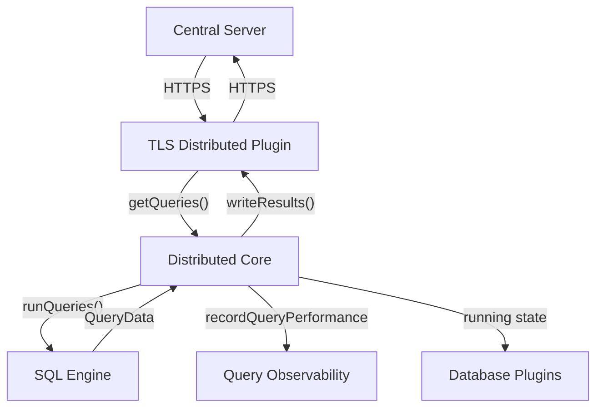
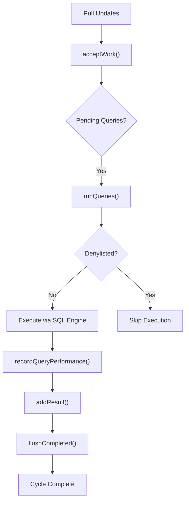
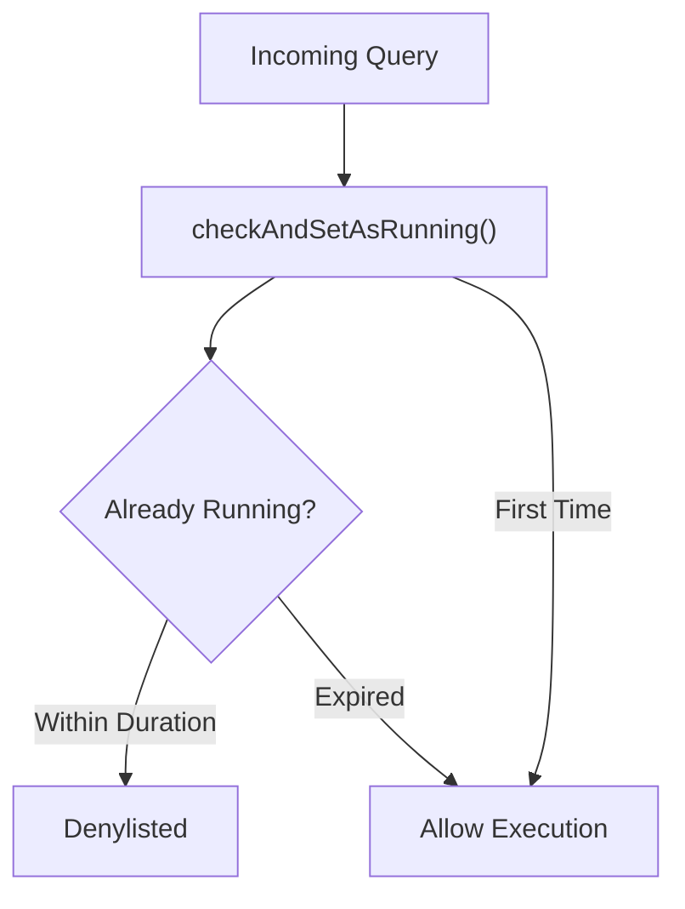
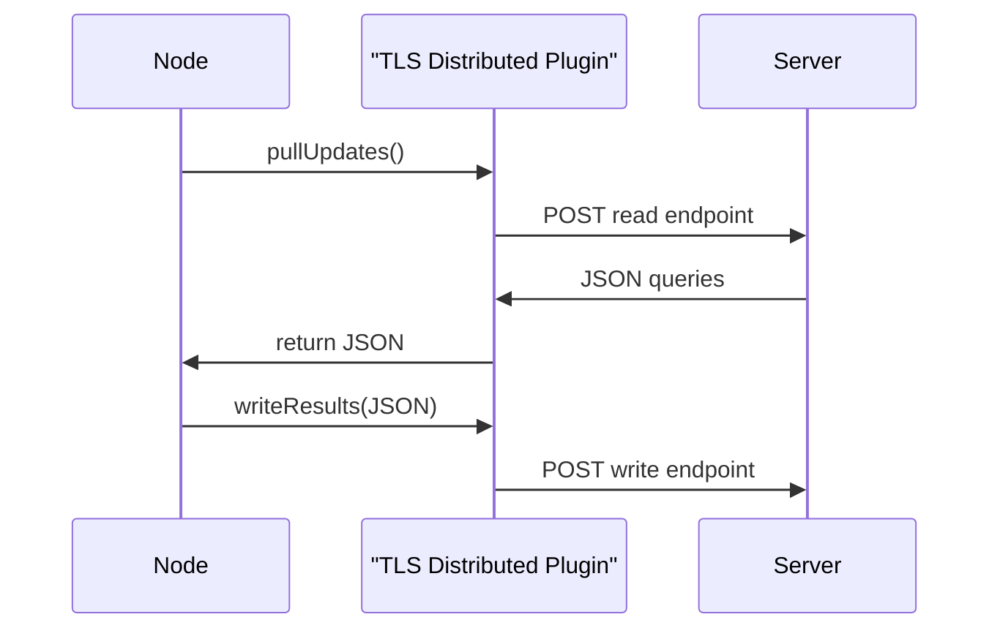

# Distributed Querying

The **Distributed Querying** module enables remote orchestration and execution of SQL queries across a fleet of osquery nodes. It allows a central server to:

- Push SQL queries to enrolled agents
- Collect query results asynchronously
- Monitor execution performance
- Denylist problematic or long-running queries

This module acts as the execution bridge between:

- The **SQL Engine and Virtual Tables** subsystem (local query execution)
- The **Database and Storage Plugins** subsystem (state management)
- The **Logging and Query Observability** subsystem (performance + result logging)
- Remote transport implementations such as the TLS-based plugin

At its core, Distributed Querying defines the request/response model, execution lifecycle, denylist logic, and plugin interface for retrieving and submitting distributed work.

---

## Architectural Overview



### Key Responsibilities

| Component | Responsibility |
|------------|----------------|
| Distributed Core | Lifecycle, queuing, denylisting, performance tracking |
| Distributed Plugin | Abstract interface for remote work retrieval and result submission |
| TLS Distributed Plugin | HTTPS implementation of Distributed Plugin |
| SQL Engine | Executes queries against virtual tables |
| Database Plugins | Persist running state and deduplication |
| Observability | Tracks performance and execution metrics |

---

# Core Data Structures

## DistributedQueryRequest

Represents a single unit of distributed work.

```text
Fields:
- id: Unique server-assigned identifier
- query: SQL string to execute
```

This structure is serialized/deserialized using:

- `serializeDistributedQueryRequest`
- `deserializeDistributedQueryRequest`
- JSON string helpers for transport safety

### Example Server Payload

```json
{
  "queries": {
    "id1": "select * from osquery_info",
    "id2": "select * from processes"
  }
}
```

Each key becomes a `DistributedQueryRequest` instance.

---

## DistributedQueryResult

Encapsulates execution output and metadata.

```text
Fields:
- request: Original DistributedQueryRequest
- results: QueryData (rows)
- columns: ColumnNames
- status: Execution Status
- message: Optional error or informational message
```

Serialized using:

- `serializeDistributedQueryResult`
- `deserializeDistributedQueryResult`

This object ensures transport-neutral packaging of results.

---

# Distributed Execution Lifecycle

The `Distributed` class orchestrates the runtime behavior.



---

## 1. Pull Phase

```cpp
Status pullUpdates();
```

- Calls the active `DistributedPlugin`
- Retrieves raw JSON work payload
- Delegates parsing to `acceptWork()`

---

## 2. Work Acceptance

```cpp
Status acceptWork(const std::string& work);
```

Behavior:

- Parses `queries` section
- Evaluates optional `discovery` queries
- Enqueues only valid work

### Discovery Query Logic

- If no discovery query exists → enqueue
- If discovery returns rows → enqueue
- If discovery returns zero rows → skip

This prevents unnecessary execution on nodes where the query is irrelevant.

---

## 3. Denylisting Protection

To prevent repeated execution of problematic queries, the module includes:

- `checkAndSetAsRunning()`
- `setAsNotRunning()`
- `denylistedQueryTimestampExpired()`
- `denylistDuration()`
- `hashQuery()`

### Denylist Mechanism



The denylist key is derived from:

```text
SHA256(query)
```

This ensures consistent identification across restarts and transports.

---

## 4. Query Execution

```cpp
Status runQueries();
```

For each pending request:

1. Pop request from internal storage
2. Execute via SQL engine
3. Measure execution time
4. Record performance
5. Store result
6. Clear running state

Execution uses:

```cpp
SQL monitorNonnumeric(const std::string& name, const std::string& query);
```

---

## 5. Performance Recording

Performance metrics are stored in:

```text
std::map<std::string, QueryPerformance> performance_
```

Tracked metrics include:

- Execution duration
- Row count
- Sample process table deltas

These integrate with the **Logging and Query Observability** module.

---

## 6. Result Flushing

```cpp
Status flushCompleted();
```

- Serializes accumulated `DistributedQueryResult` objects
- Sends them to the plugin via `writeResults()`
- Clears local result queue

---

# Plugin Interface

## DistributedPlugin (Abstract)

Defines the extension point for remote orchestration.

```cpp
virtual Status getQueries(std::string& json) = 0;
virtual Status writeResults(const std::string& json) = 0;
```

The `call()` method acts as the unified entry point for plugin requests.

Any transport (TLS, filesystem, custom RPC) can implement this interface.

---

# TLS Distributed Plugin

The **TLS Distributed Plugin** provides an HTTPS implementation of the plugin interface.

Registered as:

```text
REGISTER(TLSDistributedPlugin, "distributed", "tls")
```

## Configuration Flags

```text
--distributed_tls_read_endpoint
--distributed_tls_write_endpoint
--distributed_tls_max_attempts
```

## Setup Phase

```cpp
Status setUp();
```

- Builds read/write URIs
- Uses TLS request helper utilities

## Query Retrieval

```cpp
Status getQueries(std::string& json);
```

- Sends POST to read endpoint
- Returns JSON payload containing work

## Result Submission

```cpp
Status writeResults(const std::string& json);
```

- Parses JSON
- POSTs to write endpoint
- Ignores server response body

---

## TLS Data Flow



---

# State Management

Distributed Querying relies on persistent state to:

- Track running queries
- Store denylist timestamps
- Maintain queued work

This state is handled through the Database and Storage Plugins subsystem.

---

# Security Model

Key security properties:

1. Query integrity validated via SHA-256 hashing
2. HTTPS transport in TLS plugin
3. Configurable retry attempts
4. Denylist prevents execution storms

The denylist duration is configurable via runtime flags.

---

# Integration Points

Distributed Querying integrates with:

- SQL Engine and Virtual Tables (local execution)
- Database and Storage Plugins (persistent state)
- Logging and Query Observability (performance tracking)
- Extensions and IPC (optional distributed plugin implementations)
- Remote HTTP Client (transport layer headers and networking)

Sibling module reference:

- [Remote HTTP Client](../remote-http-client/remote-http-client.md)

---

# Summary

The **Distributed Querying** module provides:

- A structured request/response model
- Pluggable transport abstraction
- Controlled query lifecycle management
- Built-in denylisting and performance tracking
- Secure TLS-based remote orchestration

It transforms osquery from a local query engine into a centrally orchestrated distributed telemetry system while preserving execution safety and observability guarantees.
