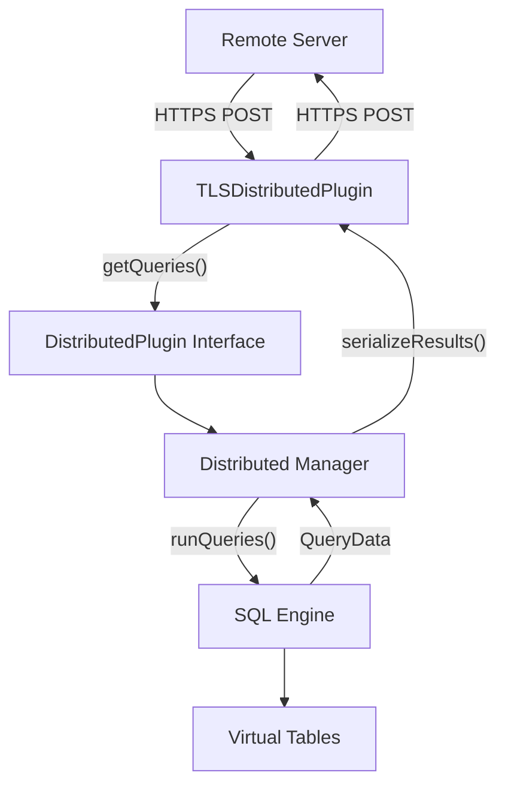
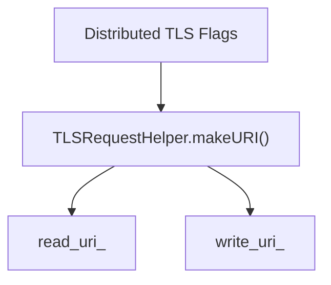
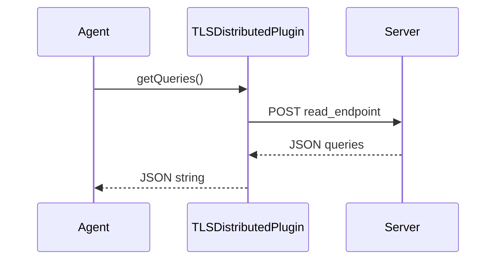
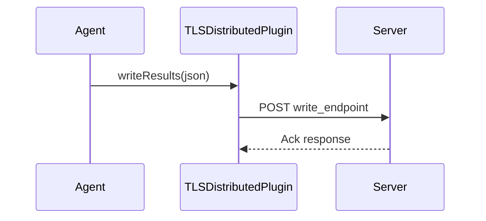
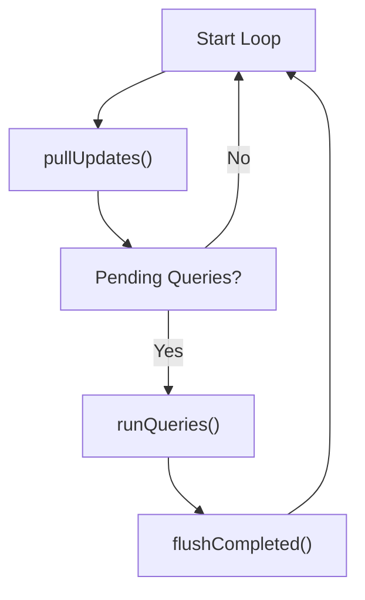
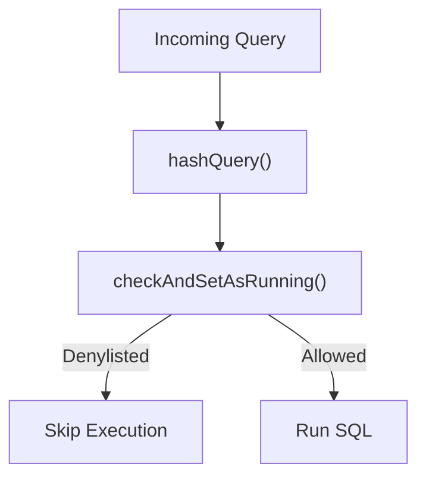
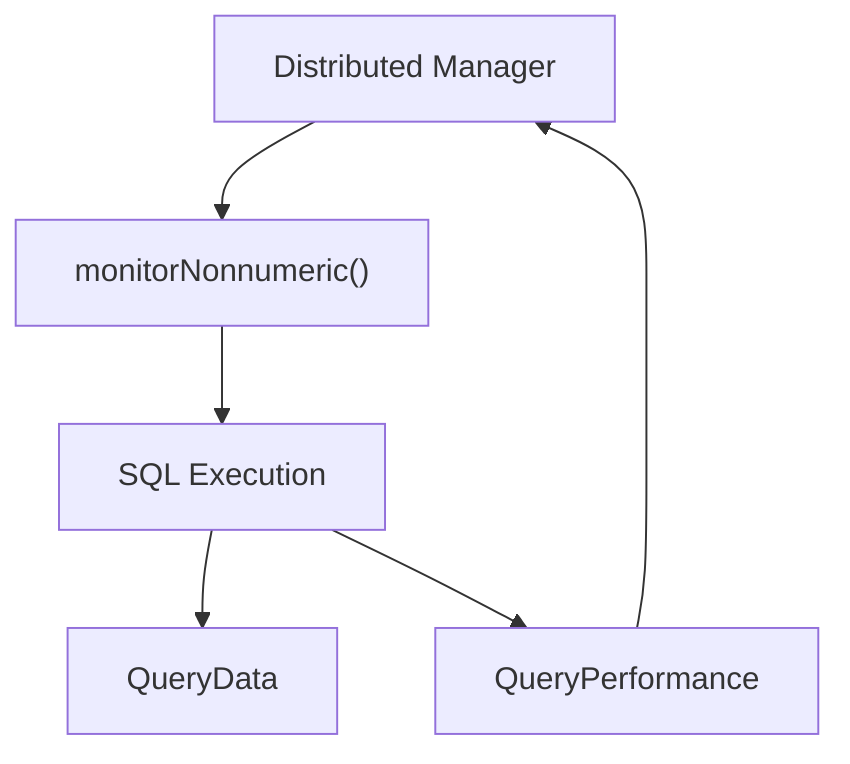
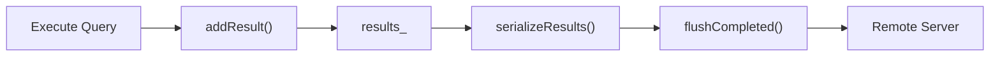
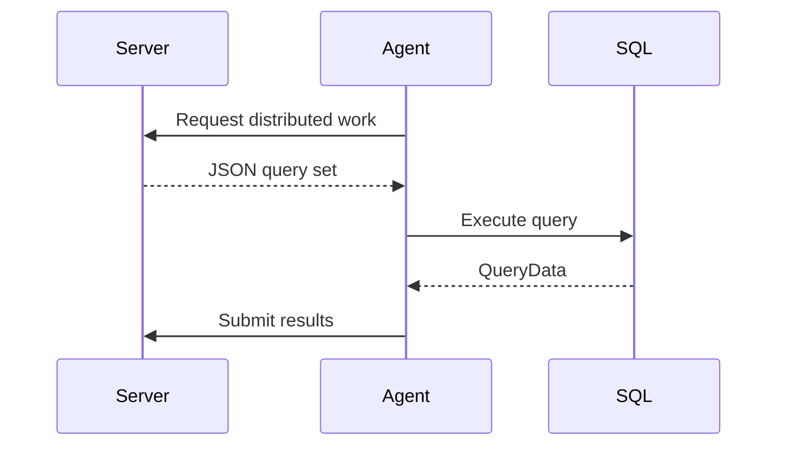

# Distributed Querying

## Overview

The **Distributed Querying** module enables remote orchestration of SQL queries across osquery agents. Instead of relying solely on locally scheduled queries, a central service can dynamically dispatch SQL statements to enrolled nodes and collect structured results over a secure transport.

This module provides:

- A transport-agnostic distributed query interface (`DistributedPlugin`)
- A runtime manager for query lifecycle and execution (`Distributed`)
- Data models for requests and results (`DistributedQueryRequest`, `DistributedQueryResult`)
- A production-ready TLS-based implementation (`TLSDistributedPlugin`)
- Query denylisting and execution safety controls
- Performance monitoring integration

Distributed Querying integrates tightly with the SQL engine, plugin framework, remote transport layer, and configuration/flag system.

---

## Architectural Overview

At a high level, Distributed Querying acts as a bridge between:

- A **remote control plane** (TLS or custom distributed plugin)
- The **local SQL execution engine**
- The **internal result buffering and performance tracking system**



### Core Responsibilities

| Component | Responsibility |
|------------|----------------|
| DistributedQueryRequest | Represents a remote query and identifier |
| DistributedQueryResult | Encapsulates execution results, columns, and status |
| DistributedPlugin | Abstract interface for distributed transports |
| TLSDistributedPlugin | HTTPS-based implementation |
| Distributed | Query lifecycle manager and execution coordinator |

---

## Core Data Structures

### DistributedQueryRequest

Represents a single remote query instruction.

```text
Fields:
- query (string)  -> SQL statement to execute
- id (string)     -> Server-provided unique identifier
```

The module provides full JSON serialization and deserialization helpers:

- serializeDistributedQueryRequest
- deserializeDistributedQueryRequest
- JSON string variants for network transmission

This enables transport-neutral encoding across distributed plugins.

---

### DistributedQueryResult

Represents the output of a distributed query execution.

```text
Fields:
- request   -> Original DistributedQueryRequest
- results   -> QueryData (row set)
- columns   -> ColumnNames
- status    -> Execution Status
- message   -> Optional error or informational message
```

Serialization helpers allow structured transport back to the server.

---

## Distributed Plugin Interface

The `DistributedPlugin` class extends the generic plugin framework and defines the contract for distributed communication.

### Required Methods

```text
getQueries(std::string& json)
writeResults(const std::string& json)
```

### getQueries()

Expected server format:

```json
{
  "queries": {
    "id1": "select * from osquery_info",
    "id2": "select * from osquery_schedule"
  }
}
```

The plugin retrieves work from the remote endpoint and returns serialized JSON.

### writeResults()

Expected submission format:

```json
{
  "queries": {
    "id1": [
      {"col1": "val1", "col2": "val2"}
    ],
    "id2": [
      {"col1": "val1", "col2": "val2"}
    ]
  }
}
```

The transport implementation determines how the JSON is transmitted (TLS, custom IPC, etc.).

---

## TLS Distributed Plugin

The `TLSDistributedPlugin` is the default production implementation.

### Configuration Flags

```text
--distributed_tls_read_endpoint
--distributed_tls_write_endpoint
--distributed_tls_max_attempts
```

### Setup Phase



During initialization:

- Read/write endpoints are constructed
- TLS transport is configured via the remote subsystem

### Query Retrieval



### Result Submission



The TLS layer leverages:

- TLSRequestHelper
- JSON serialization utilities
- Enrollment and node authentication

---

## Distributed Manager

The `Distributed` class orchestrates the full lifecycle of distributed queries.

### Execution Loop Model



### Key Responsibilities

#### 1. Pulling Work

- Calls `DistributedPlugin::getQueries()`
- Parses JSON
- Applies discovery logic
- Enqueues valid work

#### 2. Discovery Query Handling

Behavior:

- If no discovery query → enqueue immediately
- If discovery returns rows → enqueue
- If discovery returns no rows → skip

This allows server-controlled conditional execution.

---

## Denylisting and Concurrency Protection

To prevent runaway or repeatedly failing queries, Distributed Querying implements denylisting.

### Mechanism

- Queries are hashed using SHA-256 (`hashQuery()`)
- A running state is recorded
- Re-execution within denylist duration is blocked



### Expiration

- `denylistedQueryTimestampExpired()` determines expiration
- Duration controlled by configuration flag
- `cleanupExpiredRunningQueries()` removes stale locks

This ensures:

- No duplicate concurrent execution
- Backoff after repeated failure
- Protection against tight execution loops

---

## Query Execution and Performance Monitoring

Distributed queries are executed through the SQL subsystem.

### Execution Flow



### Performance Recording

`recordQueryPerformance()` captures:

- Execution latency
- Result size
- Process-level sampling rows

Performance metrics are stored in:

```text
std::map<std::string, QueryPerformance> performance_
```

This allows integration with logging and monitoring subsystems.

---

## Result Buffering and Flushing

Executed results are stored in memory:

```text
std::vector<DistributedQueryResult> results_
```

### Lifecycle

1. Query executed
2. Result wrapped in `DistributedQueryResult`
3. Added via `addResult()`
4. Serialized using `serializeResults()`
5. Flushed through plugin `writeResults()`
6. Buffer cleared



---

## Integration with Other Subsystems

Distributed Querying depends on several internal modules:

- SQL core and virtual tables (query execution)
- Remote HTTP and TLS transport (network layer)
- Hashing utilities (SHA-256 computation)
- Logging subsystem (status and result logging)
- Database subsystem (tracking running state)
- Core flags and configuration (endpoint and behavior tuning)

It acts as a coordination layer rather than a standalone engine.

---

## Error Handling and Status Propagation

All major operations return `Status` objects:

- Network failures
- JSON parsing errors
- SQL execution failures
- Serialization errors

`DistributedQueryResult` embeds both execution status and message for full round-trip transparency to the remote server.

---

## Security Model

Security in Distributed Querying relies on:

- TLS-secured endpoints
- Enrollment-based authentication
- SHA-256 query hashing
- Denylist execution guards
- Controlled configuration flags

Sensitive data is not persisted beyond necessary buffers, and results are serialized explicitly before transmission.

---

## End-to-End Workflow Summary



### Step-by-Step

1. Agent pulls distributed work
2. Queries are parsed and validated
3. Discovery logic applied
4. Denylist check performed
5. SQL executed
6. Performance metrics recorded
7. Results serialized
8. Results sent back to server
9. Running state cleared

---

## Conclusion

The **Distributed Querying** module transforms osquery from a purely scheduled local query engine into a centrally orchestrated distributed telemetry system.

It provides:

- A flexible plugin-based transport abstraction
- Safe, denylisted execution control
- Performance instrumentation
- Structured request/result serialization
- TLS-backed production transport

By separating transport (`DistributedPlugin`) from execution management (`Distributed`), the module enables extensibility while preserving execution safety and observability.