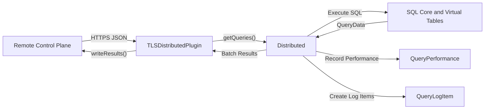
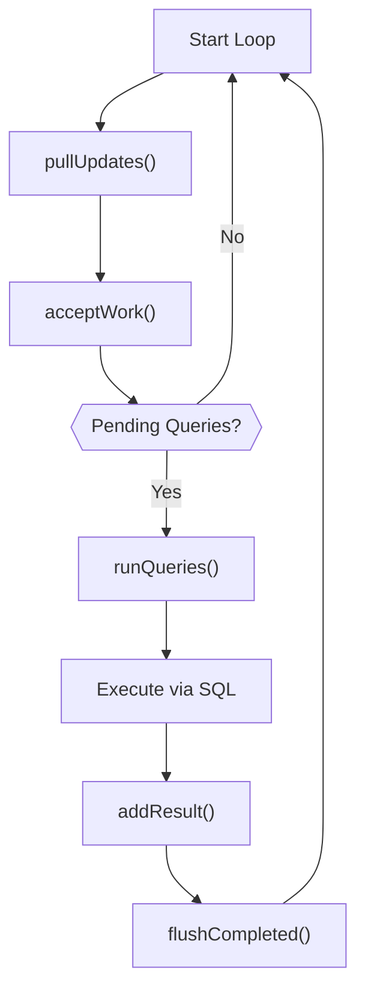
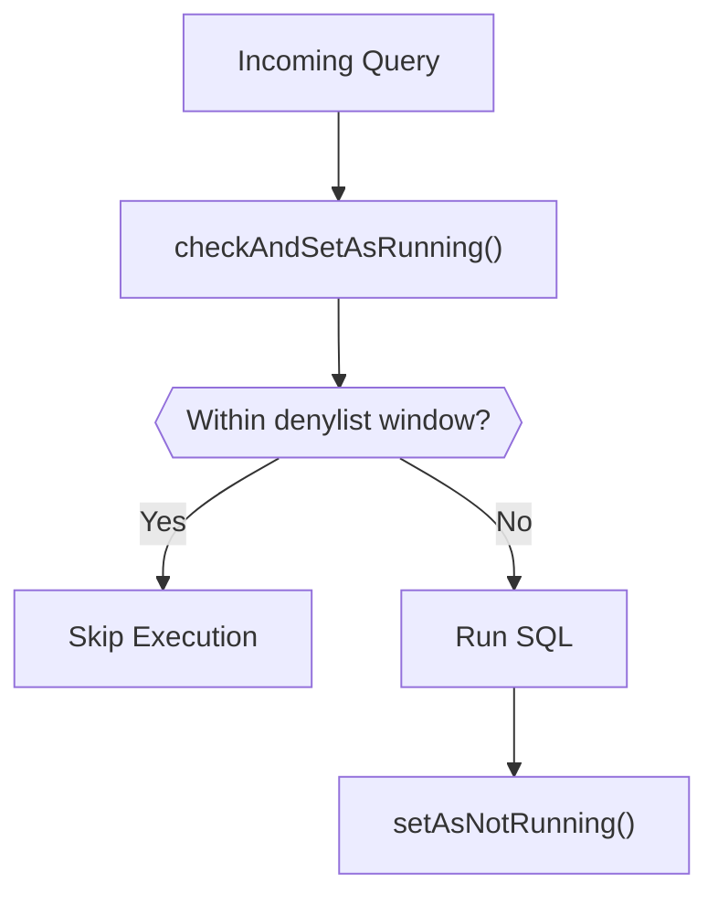
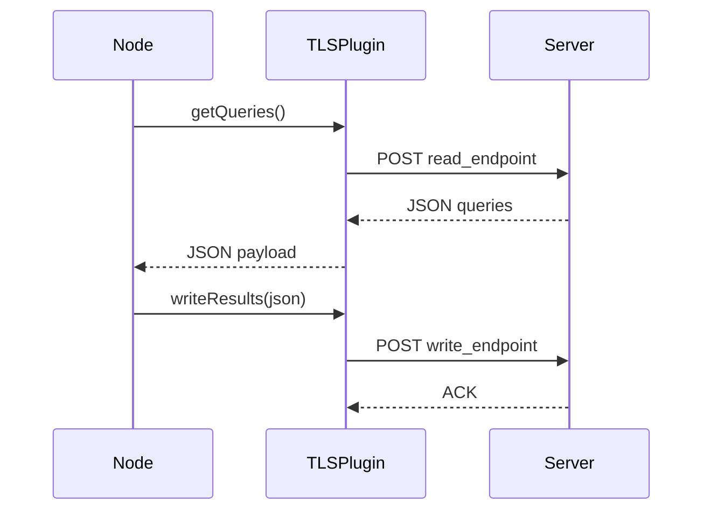

# Distributed Querying

The **Distributed Querying** module enables osquery nodes to receive SQL queries from a remote service, execute them locally, and return structured results over a pluggable transport (for example, TLS).

It acts as a bridge between:

- The remote query orchestration layer (fleet manager, control plane)
- The local SQL engine and virtual tables
- The plugin framework and remote transport stack
- The query logging and performance monitoring subsystems

This module is centered around three core concepts:

- **DistributedQueryRequest** – a unit of remote work
- **DistributedQueryResult** – structured execution output
- **Distributed** – the orchestration engine responsible for pulling, executing, and flushing queries

---

## Architecture Overview



At runtime, the flow is:

1. The plugin retrieves remote work (`getQueries`).
2. The **Distributed** engine parses and queues queries.
3. Each query is executed through the SQL layer.
4. Results are captured, serialized, and flushed.
5. Performance statistics and logging artifacts are recorded.

---

## Core Data Structures

### DistributedQueryRequest

**Component:** `osquery.osquery.distributed.distributed.DistributedQueryRequest`

Represents a single unit of remote work.

```text
Fields:
- query: string (SQL statement)
- id:    string (unique identifier from server)
```

Responsibilities:

- Holds the SQL statement and its server-issued identifier.
- Serialized/deserialized to and from JSON.
- Passed internally through execution and result pipelines.

Serialization helpers:

- `serializeDistributedQueryRequest`
- `serializeDistributedQueryRequestJSON`
- `deserializeDistributedQueryRequest`
- `deserializeDistributedQueryRequestJSON`

These functions ensure consistent transport format across plugins.

---

### DistributedQueryResult

**Component:** `osquery.osquery.distributed.distributed.DistributedQueryResult`

Represents the outcome of executing a distributed query.

```text
Fields:
- request:  DistributedQueryRequest
- results:  QueryData
- columns:  ColumnNames
- status:   Status
- message:  string
```

Responsibilities:

- Couples execution output with its originating request.
- Captures success/failure status.
- Supports JSON serialization for remote transport.
- Used for batching before flush.

Related concepts:

- `QueryData` and `ColumnNames` come from the SQL engine.
- `Status` encapsulates execution outcome.

---

## Distributed Execution Engine

### Distributed

**Component:** `osquery.osquery.distributed.distributed.Distributed`

This class orchestrates the full lifecycle of distributed queries.

### High-Level Workflow



### Key Responsibilities

#### 1. Pulling Work

- `pullUpdates()` invokes the active distributed plugin.
- Receives JSON payload containing queries.
- Delegates parsing to `acceptWork()`.

Expected remote format:

```json
{
  "queries": {
    "id1": "select * from osquery_info",
    "id2": "select * from osquery_schedule"
  }
}
```

---

#### 2. Discovery Query Handling

`acceptWork()` implements special logic for *discovery queries*:

- If a query has no discovery requirement → enqueue directly.
- If a discovery query returns rows → enqueue associated query.
- If discovery query returns no rows → skip execution.

This allows the control plane to conditionally execute work based on host state.

---

#### 3. Denylisting and Concurrency Control

To prevent repeated failures or runaway loops, Distributed uses a denylist mechanism.

Key functions:

- `checkAndSetAsRunning()`
- `setAsNotRunning()`
- `denylistedQueryTimestampExpired()`
- `denylistDuration()`
- `hashQuery()`

### Denylist Flow



Mechanism:

- Queries are hashed using SHA-256.
- Execution state is tracked in the database backend.
- Expired running queries are cleaned up with `cleanupExpiredRunningQueries()`.

This protects nodes from repeatedly executing problematic queries.

---

#### 4. SQL Execution and Monitoring

Execution is performed through:

- `monitorNonnumeric()` – wraps SQL execution.
- `recordQueryPerformance()` – stores timing and size metrics.

Performance data is stored in:

```text
std::map<std::string, QueryPerformance> performance_
```

See also: [SQL Core and Virtual Tables](../sql-core-and-virtual-tables/sql-core-and-virtual-tables.md)

---

#### 5. Result Collection and Flushing

Results are accumulated in:

```text
std::vector<DistributedQueryResult> results_
```

Key operations:

- `addResult()` – enqueue completed result
- `serializeResults()` – convert to JSON
- `flushCompleted()` – send to plugin
- `getCompletedCount()` – monitor batch size

Flushing delegates to the active DistributedPlugin implementation.

---

## Plugin Interface

### DistributedPlugin

**Component:** `osquery.osquery.distributed.distributed.DistributedPlugin`

Abstract plugin contract for distributed query transport.

```text
Virtual Methods:
- getQueries(std::string& json)
- writeResults(const std::string& json)
```

The plugin is responsible only for transport:

- Fetching remote queries
- Sending result payloads

It does not execute SQL or manage internal state.

---

## TLS Transport Implementation

### TLSDistributedPlugin

**Component:** `osquery.plugins.distributed.tls_distributed.TLSDistributedPlugin`

Registered as:

```text
Registry: "distributed"
Name:     "tls"
```

### Responsibilities

- Builds URIs from flags:
  - `distributed_tls_read_endpoint`
  - `distributed_tls_write_endpoint`
- Performs HTTPS POST requests via `TLSRequestHelper`.
- Retries requests up to `distributed_tls_max_attempts`.

### TLS Flow



The response from `writeResults()` is intentionally ignored; success/failure is determined by HTTP status.

---

## Integration with Other Modules

Distributed Querying interacts with multiple subsystems:

- **SQL Execution** – Executes queries and retrieves `QueryData`.
  - See: [SQL Core and Virtual Tables](../sql-core-and-virtual-tables/sql-core-and-virtual-tables.md)

- **Query Logging** – Converts execution output into `QueryLogItem`.
  - See: [Query Execution and Logging](../query-execution-and-logging/query-execution-and-logging.md)

- **Database Backends** – Stores running/denylisted state.
  - See: [Database Backends](../database-backends/database-backends.md)

- **Remote HTTP Client** – Provides TLS transport primitives.
  - See: [Remote HTTP Client](../remote-http-client/remote-http-client.md)

This layered separation ensures:

- Transport flexibility
- Safe execution semantics
- Clear separation between orchestration and SQL runtime

---

## Operational Model

Typical long-running loop:

```cpp
Distributed dist;

while (true) {
  dist.pullUpdates();
  if (!dist.getPendingQueries().empty()) {
    dist.runQueries();
  }
}
```

In production, scheduling and execution are integrated with the core runtime and event loop.

---

## Key Design Principles

### 1. Transport Agnostic

Execution logic is separated from transport via the plugin interface.

### 2. Safe Re-Execution Controls

Denylisting prevents runaway or repeatedly failing queries.

### 3. Structured Serialization

All requests and results are strongly typed and serialized via JSON helpers.

### 4. Performance Visibility

Each distributed query can record timing and size metrics through `QueryPerformance`.

---

## Summary

The **Distributed Querying** module enables remote orchestration of osquery nodes by:

- Receiving SQL tasks from a control plane
- Executing them through the local SQL engine
- Capturing structured results
- Enforcing safety via denylisting
- Sending results back over pluggable transports (e.g., TLS)

It is a critical component for fleet-wide visibility, remote investigations, and centralized query management across distributed systems.