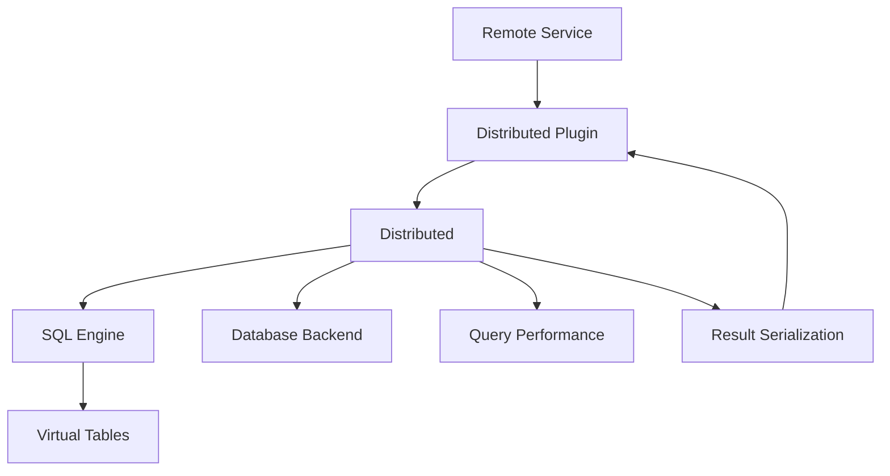
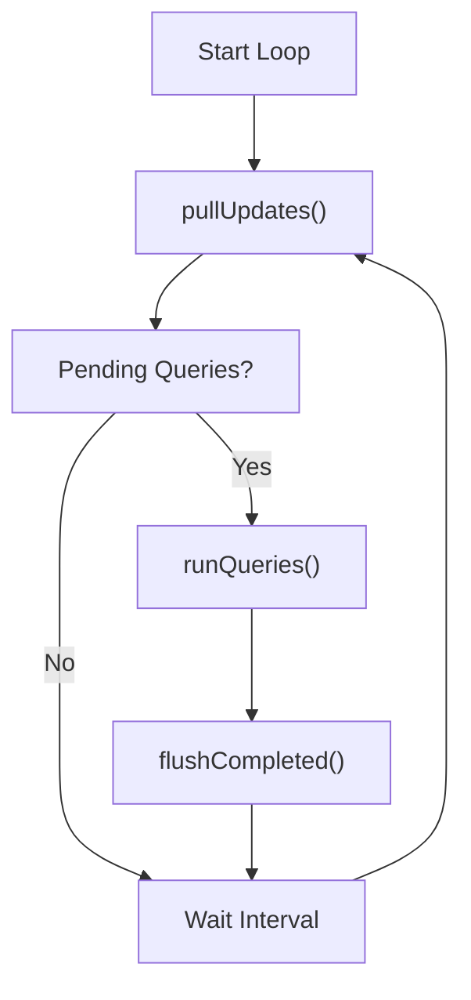
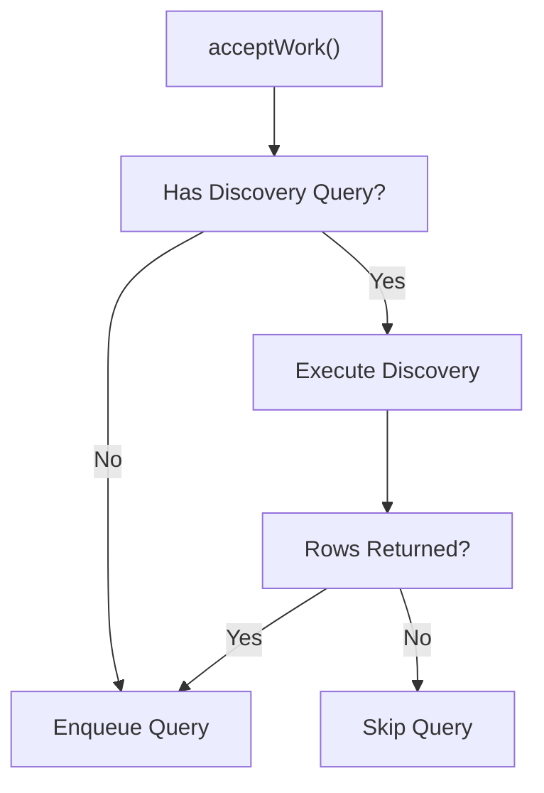
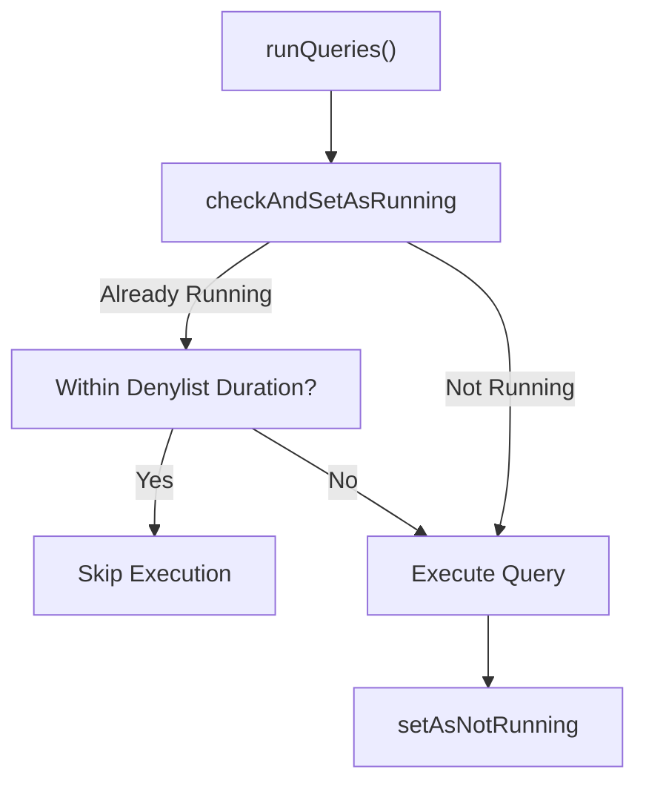
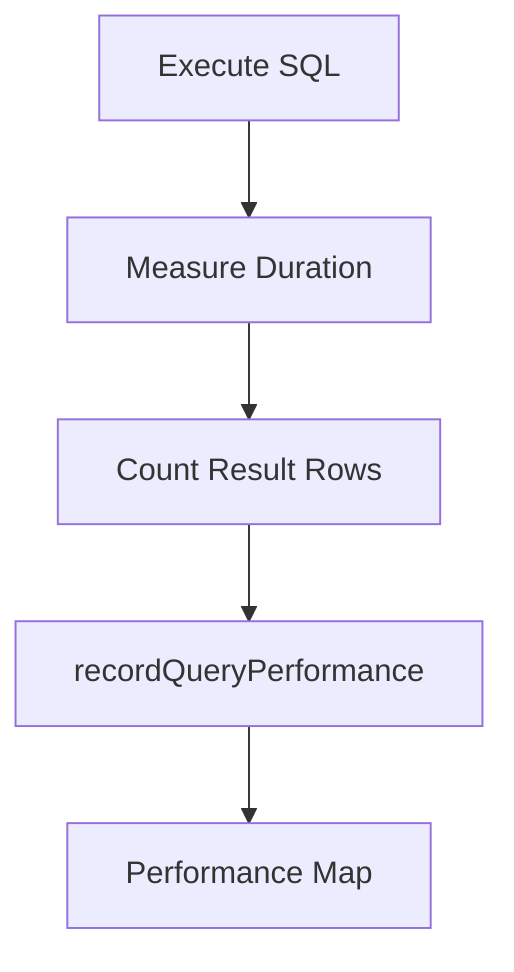
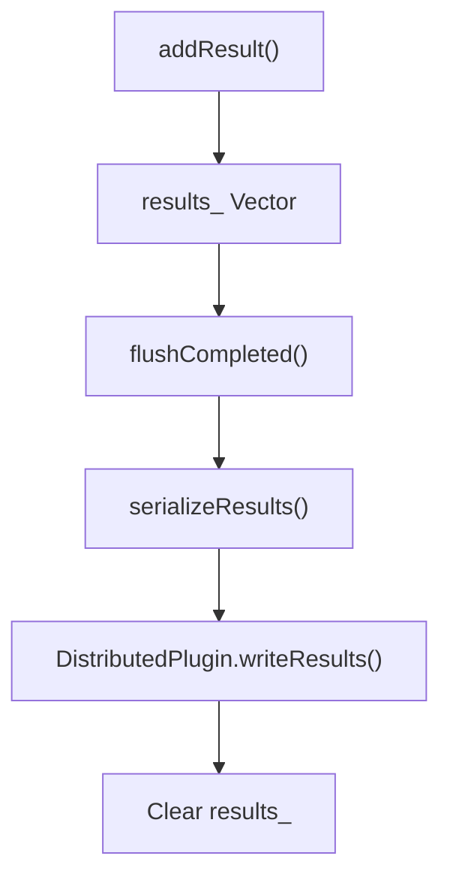
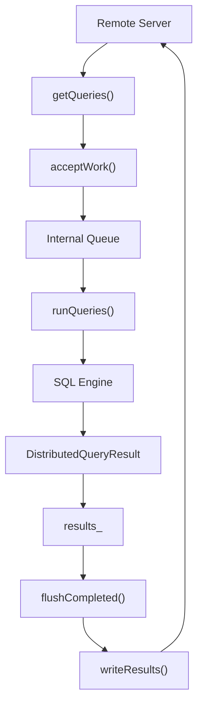

# Distributed Querying

The **Distributed Querying** module enables osquery nodes to receive SQL queries from a remote service, execute them locally, and return structured results back to the requester. It acts as the orchestration layer between remote query providers (via distributed plugins), the SQL engine, the database backend, and the logging and performance subsystems.

Unlike scheduled queries defined in configuration, distributed queries are dynamic and externally driven. This module manages their lifecycle, execution state, denylisting, performance tracking, and result serialization.

---

## 1. Purpose and Responsibilities

The Distributed Querying module is responsible for:

- Pulling pending queries from a remote distributed plugin
- Parsing and validating incoming work
- Enqueuing and executing queries through the SQL engine
- Preventing duplicate or runaway execution via denylisting
- Tracking performance metrics per query
- Serializing and batching results for remote delivery
- Cleaning up expired or stale running queries

It operates as a bridge between:

- The Extensions Framework (plugin abstraction)
- The SQL Engine and Virtual Tables
- The Database Backend (state tracking)
- Logging and Query Metadata (performance and result representation)

---

## 2. Core Data Structures

### 2.1 DistributedQueryRequest

Represents a single distributed query instruction.

```text
Fields:
- query   : SQL string to execute
- id      : Unique identifier assigned by remote service
```

This structure is:

- Deserialized from plugin JSON payloads
- Stored internally before execution
- Attached to results for traceability

Serialization and deserialization helpers:

- serializeDistributedQueryRequest
- serializeDistributedQueryRequestJSON
- deserializeDistributedQueryRequest
- deserializeDistributedQueryRequestJSON

These ensure consistent JSON transport between node and server.

---

### 2.2 DistributedQueryResult

Represents the outcome of executing a distributed query.

```text
Fields:
- request  : Original DistributedQueryRequest
- results  : QueryData (rows)
- columns  : ColumnNames
- status   : Execution Status
- message  : Additional status or error message
```

This structure:

- Captures execution output
- Includes metadata required by the remote server
- Is serialized before transmission

Serialization helpers mirror those for requests:

- serializeDistributedQueryResult
- serializeDistributedQueryResultJSON
- deserializeDistributedQueryResult
- deserializeDistributedQueryResultJSON

---

## 3. High-Level Architecture



### Components

- Distributed Plugin: Provides transport abstraction (TLS or custom plugin).
- Distributed: Core orchestration class.
- SQL Engine: Executes SQL against virtual tables.
- Database Backend: Tracks running and denylisted queries.
- Query Performance: Stores execution metrics.

---

## 4. DistributedPlugin Abstraction

`DistributedPlugin` extends the generic Plugin interface and defines two core operations:

### 4.1 getQueries

Returns JSON formatted work:

```text
{
  "queries": {
    "id1": "select * from osquery_info",
    "id2": "select * from processes"
  }
}
```

### 4.2 writeResults

Accepts JSON formatted results:

```text
{
  "queries": {
    "id1": [
      {"col1": "val1"}
    ]
  }
}
```

The plugin transport may use TLS, HTTP, or another extension-based mechanism. The Distributed Querying module is transport-agnostic.

---

## 5. Distributed Class Lifecycle

The `Distributed` class manages the full query lifecycle.

### 5.1 Continuous Execution Loop



Core public methods:

- pullUpdates
- getPendingQueries
- runQueries
- serializeResults
- getCompletedCount
- cleanupExpiredRunningQueries

---

## 6. Work Acceptance and Discovery Logic

Incoming work may include:

- Direct queries
- Discovery queries

Discovery queries determine whether a corresponding query should run.

### Discovery Behavior



Rules:

- No discovery query → enqueue directly
- Discovery returns rows → enqueue
- Discovery returns no rows → skip

This mechanism enables conditional execution across distributed fleets.

---

## 7. Execution and Denylisting

To prevent duplicate or runaway queries, Distributed Querying implements a denylisting mechanism.

### 7.1 Running State Tracking

Methods:

- checkAndSetAsRunning
- setAsNotRunning
- setKeyAsNotRunning
- cleanupExpiredRunningQueries

### 7.2 Denylist Flow



Supporting utilities:

- hashQuery: SHA256 of query string
- denylistedQueryTimestampExpired
- denylistDuration

The hash is used as a stable key to track running queries across restarts and flush cycles.

---

## 8. Query Execution and Performance Monitoring

Queries are executed through the SQL engine using:

- monitorNonnumeric
- recordQueryPerformance

Performance metrics stored per query include:

- Execution time in milliseconds
- Number of rows returned
- Differential row comparison (for sampled tables)



The performance data integrates with the broader query metadata subsystem and can influence operational visibility and diagnostics.

---

## 9. Result Collection and Flushing

Executed query results are appended to an internal vector:

```text
std::vector<DistributedQueryResult> results_
```

### Result Handling Flow



Key behavior:

- Results are batched
- JSON is constructed via serialization helpers
- Buffer is cleared after successful flush

---

## 10. Current Request Tracking

A static member tracks the ID of the currently executing distributed query:

```text
static std::string currentRequestId_
```

Accessors:

- getCurrentRequestId
- setCurrentRequestId

This enables:

- Correlation with logs
- Traceability in error handling
- Integration with logging and metadata subsystems

---

## 11. Interaction with Other Modules

Distributed Querying interacts closely with several major subsystems:

### SQL Engine and Virtual Tables

- Executes distributed SQL statements
- Retrieves rows from virtual tables
- Uses SQL abstraction for safe execution

### Database Backend

- Tracks running query keys
- Maintains denylist timestamps
- Persists state across iterations

### Logging and Query Metadata

- Records performance metrics
- Associates status and message fields with results
- Enables operational insight

### Extensions Framework

- Provides Plugin abstraction
- Allows pluggable distributed transports
- Supports external TLS-based or custom implementations

---

## 12. End-to-End Data Flow



This flow illustrates the complete lifecycle:

1. Remote server issues queries
2. Node pulls and parses work
3. Queries are conditionally enqueued
4. SQL execution occurs
5. Results are serialized
6. Results are flushed back to server

---

## 13. Design Characteristics

### Transport Agnostic

The module does not embed networking logic. All communication is delegated to DistributedPlugin implementations.

### Safe Execution

- Denylisting prevents duplicate execution storms
- Hash-based tracking ensures stable identity
- Expired running queries are cleaned automatically

### Observability-Oriented

- Query performance metrics are recorded
- Status and error messages are preserved
- Current request ID enables traceability

### Scalable by Design

- Pull-based model supports fleet scaling
- Batched result submission reduces overhead
- Discovery queries minimize unnecessary work

---

# Summary

The **Distributed Querying** module orchestrates remote query execution across osquery nodes. It abstracts transport through plugins, enforces safe execution with denylisting, integrates tightly with the SQL engine and database backend, and provides structured, serialized results enriched with performance metadata.

It is the core execution engine for dynamic, centrally managed queries in distributed deployments.