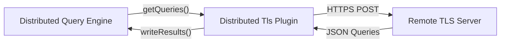
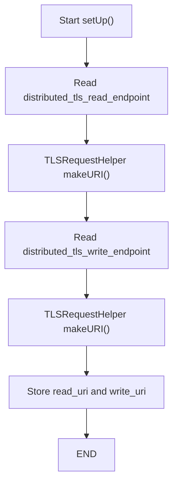
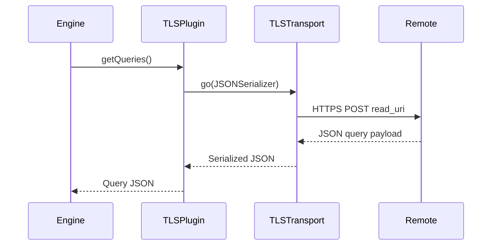
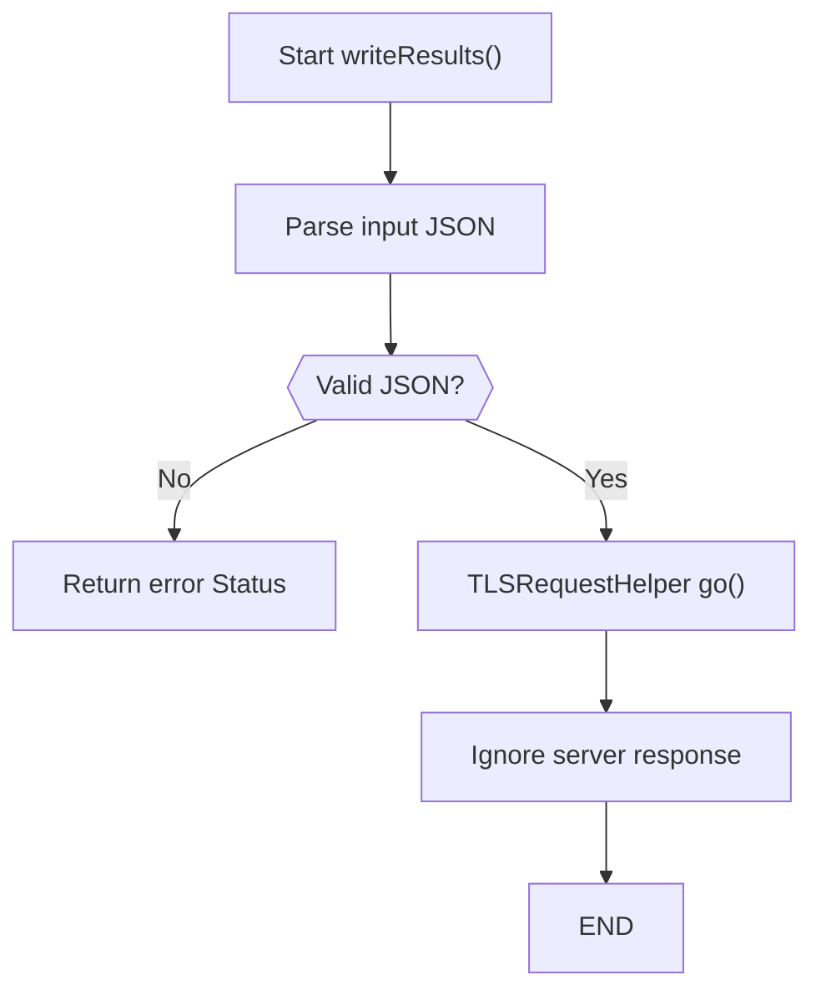
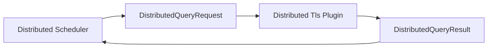
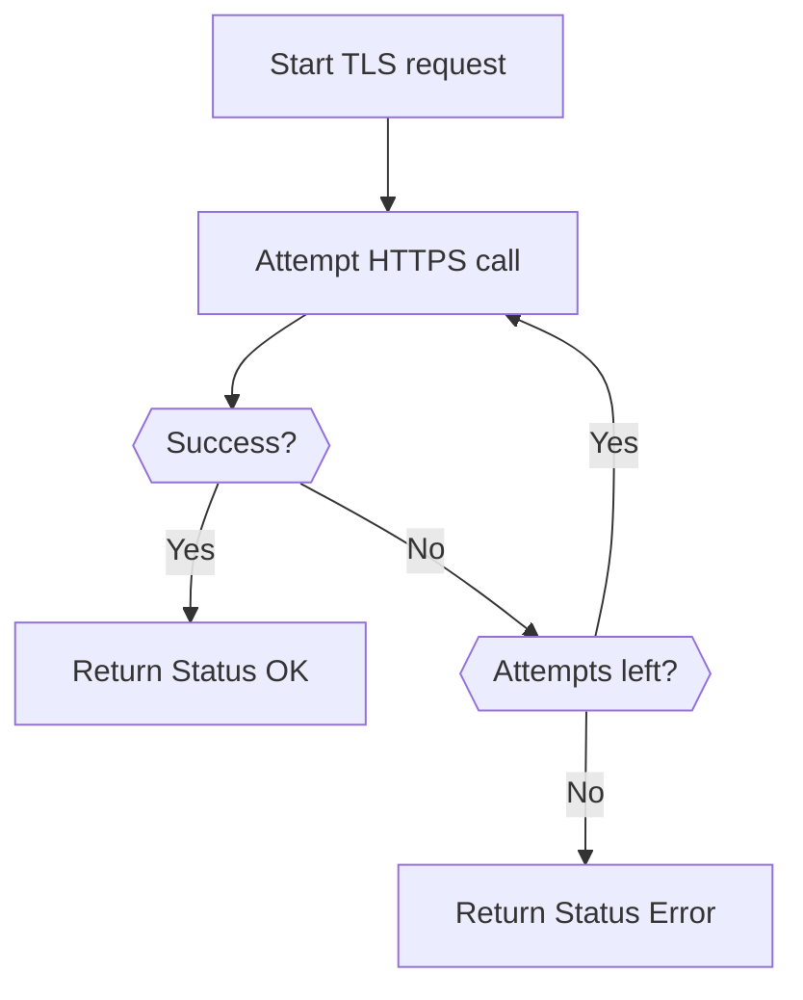

# Distributed Tls Plugin

The **Distributed Tls Plugin** module implements the TLS-based distributed query transport for osquery. It enables secure retrieval of distributed queries from a remote service and submission of query results back to that service over HTTPS.

This module provides a concrete implementation of the distributed plugin interface and acts as the secure bridge between the local distributed query engine and a remote TLS endpoint.

---

## Purpose and Responsibilities

The Distributed Tls Plugin is responsible for:

- Retrieving distributed queries from a remote HTTPS endpoint
- Submitting distributed query results back to a remote HTTPS endpoint
- Handling retry logic for network communication
- Serializing and deserializing JSON payloads
- Integrating with the enrollment and TLS transport stack

It extends the distributed query abstraction defined in the [Distributed Querying](distributed-querying/distributed-querying.md) module and relies on the TLS transport utilities provided by the remote HTTP layer.

---

## Core Component

### TLSDistributedPlugin

**Namespace:** `osquery.plugins.distributed.tls_distributed`

The `TLSDistributedPlugin` class derives from `DistributedPlugin` and is registered under the name:

- Registry type: `distributed`
- Plugin name: `tls`

This makes it selectable as the distributed backend when TLS-based communication is desired.

### Key Methods

- `setUp()` – Initializes TLS endpoints
- `getQueries(std::string& json)` – Fetches distributed queries from remote server
- `writeResults(const std::string& json)` – Submits query results to remote server

---

## Configuration Flags

The Distributed Tls Plugin is configured using runtime flags:

- `distributed_tls_read_endpoint` – HTTPS endpoint for retrieving queries
- `distributed_tls_write_endpoint` – HTTPS endpoint for submitting results
- `distributed_tls_max_attempts` – Maximum retry attempts for requests
- `tls_node_api` – Enables node-specific TLS behavior

These flags are part of the runtime configuration system described in the Core Runtime and Lifecycle module.

---

## Architectural Position

The Distributed Tls Plugin sits between the distributed query engine and the remote HTTPS service.

### Relationships

- **Upstream Dependency:** [Distributed Querying](distributed-querying/distributed-querying.md)
- **Transport Layer:** Remote HTTP client and TLS request utilities
- **Serialization:** JSON serializer
- **Enrollment:** Integrates with node identity and enrollment utilities

---

## Internal Flow

### Setup Phase

During initialization:

1. Read endpoint flags are retrieved
2. URIs are constructed using TLS helpers
3. Internal read and write URIs are stored

---

### Query Retrieval Flow

The `getQueries()` method performs a POST request to retrieve distributed queries.

### Key Characteristics

- Always uses HTTP POST
- Serializes parameters using JSON
- Retries up to configured maximum attempts
- Returns raw JSON payload to distributed engine

---

### Result Submission Flow

The `writeResults()` method submits distributed query results.

### Important Behavior

- Validates JSON before transmission
- Uses the write endpoint
- Ignores server response body
- Returns status of TLS request operation

---

## Interaction with Distributed Querying Module

The Distributed Tls Plugin implements the transport layer for the distributed query lifecycle:

The data structures used by this plugin originate from the [Distributed Querying](distributed-querying/distributed-querying.md) module:

- `DistributedQueryRequest`
- `DistributedQueryResult`

The plugin itself does not interpret SQL; it only transports JSON payloads.

---

## Retry and Error Handling

The plugin delegates network execution to `TLSRequestHelper::go()` which:

- Performs HTTPS communication
- Applies retry logic
- Uses the configured maximum attempt count
- Returns a `Status` object

This separation ensures:

- Clean transport abstraction
- Centralized TLS handling
- Consistent retry semantics across plugins

---

## Security Considerations

The Distributed Tls Plugin relies on:

- HTTPS transport
- TLS certificate validation
- Enrollment identity
- Secure JSON serialization

Security is enforced at the TLS transport layer rather than inside the plugin itself.

Key security characteristics:

- No plaintext query transport
- No local storage of distributed results
- No custom cryptographic implementation
- Delegation to hardened TLS transport utilities

---

## Registry Integration

The plugin is registered using the osquery registry system:

- Registry category: `distributed`
- Plugin name: `tls`

This allows dynamic selection of distributed backends at runtime.

The registry framework is defined in the broader core runtime and extension infrastructure.

---

## Data Contracts

The plugin communicates exclusively via JSON.

### Incoming (Query Retrieval)

- JSON payload containing distributed queries
- Delivered as raw JSON string to the distributed engine

### Outgoing (Result Submission)

- JSON representation of distributed query results
- Must parse successfully before transmission

No SQL parsing, validation, or transformation occurs inside this module.

---

## Integration with Other Modules

The Distributed Tls Plugin integrates with:

- [Distributed Querying](distributed-querying/distributed-querying.md) – Defines distributed query structures and lifecycle
- Remote HTTP client utilities – Provides TLS transport and request helpers
- Core runtime flags system – Supplies configuration values

It does not:

- Execute SQL (handled by SQL engine modules)
- Persist results (handled by database backend modules)
- Schedule queries (handled by distributed engine and scheduler)

---

## Design Principles

The Distributed Tls Plugin follows several architectural principles:

1. **Single Responsibility** – Only handles TLS-based distributed transport
2. **Transport Abstraction** – Delegates networking to TLS helpers
3. **Stateless Operation** – No persistent internal state beyond URIs
4. **Retry Delegation** – Centralized retry logic in transport layer
5. **JSON Boundary** – Uses JSON as strict interface contract

---

## Summary

The **Distributed Tls Plugin** is the secure transport implementation for distributed queries over HTTPS. It connects the distributed query engine to a remote control plane, handling retrieval and submission of query data through TLS-protected endpoints.

By isolating network communication from query execution and scheduling logic, it maintains a clean separation of concerns while enabling secure, scalable distributed query workflows.