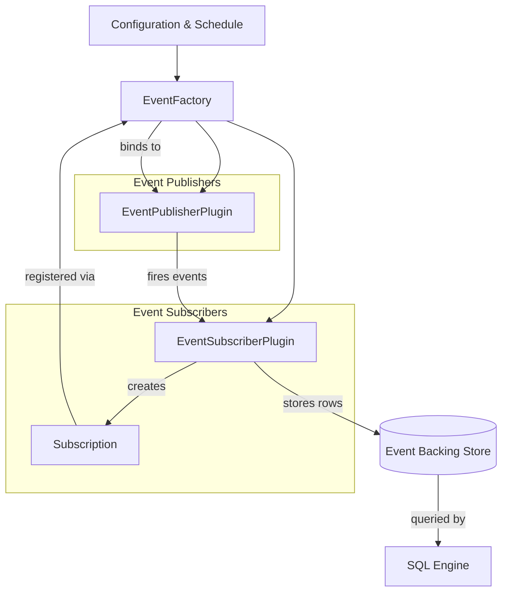
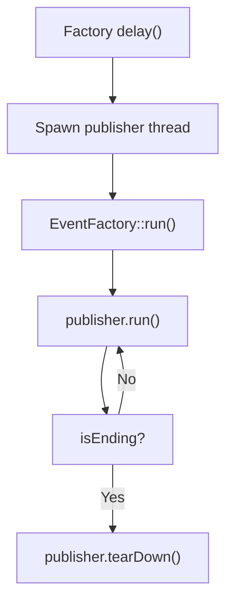
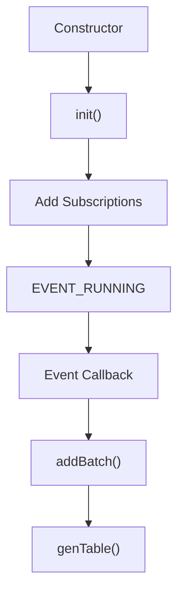
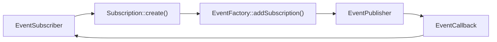
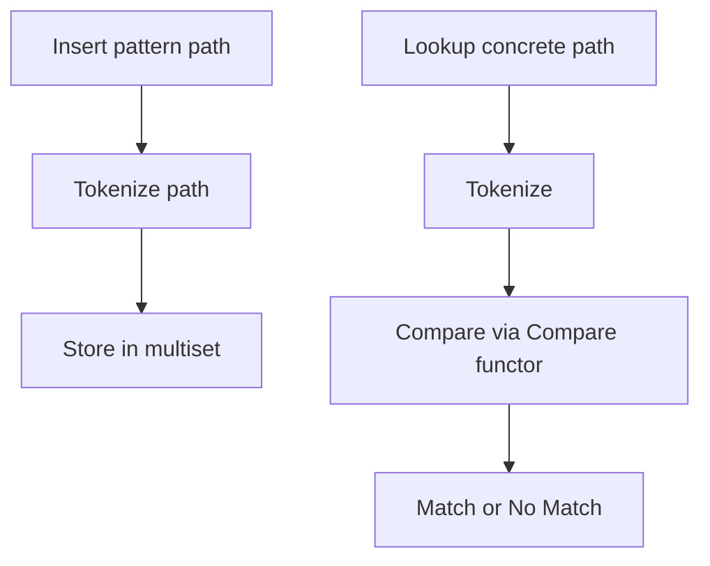
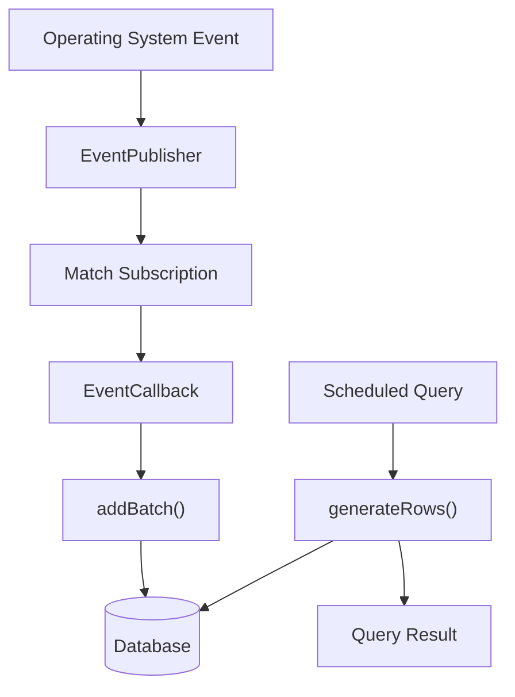

# Eventing Core

The **Eventing Core** module implements osquery’s publish–subscribe event framework. It enables real-time data collection by connecting **Event Publishers** (which observe system activity) with **Event Subscribers** (which transform events into queryable virtual tables).

This module provides:

- A centralized `EventFactory` for lifecycle management
- The `EventSubscriberPlugin` abstraction for building event-backed tables
- The `Subscription` model binding publishers to subscribers
- Path matching utilities for filesystem-style event filtering
- Expiration and optimization mechanisms for scalable event storage

Together, these components power osquery’s event-based tables such as file, process, socket, and other OS activity monitors.

---

## Architectural Overview

The Eventing Core follows a decoupled publisher–subscriber architecture:



### Flow Summary

1. Publishers are registered with the `EventFactory`.
2. Subscribers initialize and create `Subscription` objects.
3. Subscriptions bind callbacks to publisher-specific contexts.
4. Publishers generate events and invoke subscriber callbacks.
5. Subscribers persist event rows into the database.
6. Queries against event tables retrieve persisted rows.

---

# Core Components

## EventFactory

**Component:** `osquery.osquery.events.eventfactory.SubscriberExpirationDetails`

The `EventFactory` is the singleton responsible for managing:

- Publisher and subscriber registration
- Subscription routing
- Publisher thread lifecycle
- Event forwarding to logging plugins
- Schedule-aware event expiration

### Key Responsibilities

#### 1. Registration

- `registerEventPublisher()` validates publisher type and initializes it.
- `registerEventSubscriber()` validates subscriber type, applies configuration rules, and initializes subscriptions.

Subscribers can be explicitly enabled or disabled through configuration.

#### 2. Subscription Routing

Subscriptions are added through:

```text
EventFactory::addSubscription(type_id, subscription)
```

The factory forwards the subscription to the matching publisher.

#### 3. Publisher Thread Management

Each publisher runs inside its own managed thread:



The run loop:

- Starts only once per publisher
- Calls `publisher.run()` repeatedly
- Handles termination and cleanup

#### 4. Schedule-Aware Expiration

During configuration updates (`configUpdate()`), the factory:

1. Scans scheduled queries.
2. Identifies queries referencing `_events` tables.
3. Calculates a minimum expiration window.
4. Adjusts subscriber expiration thresholds.

This logic uses `SubscriberExpirationDetails` to track:

- Maximum interval among scheduled queries
- Number of queries using each subscriber

This prevents event data from expiring before scheduled queries execute.

---

## EventSubscriberPlugin

**Components:**
- `osquery.osquery.events.eventsubscriberplugin.Context`
- `osquery.osquery.events.eventsubscriberplugin.GenerateRowsResult`

The `EventSubscriberPlugin` is the base class for event-backed virtual tables.

It:

- Subscribes to a specific publisher type
- Receives event callbacks
- Converts events into `Row` objects
- Persists them in a backing database
- Serves query results through `genTable()`

### Lifecycle



### Backing Storage Model

Each subscriber maintains a `Context` containing:

- `database_namespace`
- Event index
- Last event ID
- Query tracking data

Events are stored in time-indexed batches to allow:

- Efficient time-window queries
- Expiration of old data
- Optimization using last query watermark

### Row Generation

At query time, `generateRows()`:

- Filters events by time window
- Applies optimization boundaries
- Streams rows via a callback
- Returns `GenerateRowsResult` metadata

This enables incremental querying without reprocessing historical events.

### Expiration Controls

Subscribers enforce:

- Maximum event batches
- Time-based expiration
- Minimum expiry window (derived from schedule)

These mechanisms ensure bounded storage growth.

---

## Subscription

**Component:** `osquery.osquery.events.subscription.Subscription`

A `Subscription` binds:

- Subscriber name
- Publisher-specific subscription context
- Event callback function



### Purpose

Subscriptions:

- Scope publisher monitoring work
- Reduce system overhead
- Allow fine-grained filtering (e.g., specific paths)
- Decouple publisher logic from subscriber storage logic

They are fundamental for scalability.

---

## PathSet and Pattern Matching

**Component:** `osquery.osquery.events.pathset.Compare`

The `PathSet` utility provides thread-safe multiset-based path matching.

It supports wildcard semantics:

- `*` matches a single path component
- `**` matches recursively

### Matching Model



The custom `Compare` functor implements wildcard-aware comparison logic while preserving ordered storage.

This structure is used by filesystem-related event publishers to efficiently determine whether a path should trigger a subscriber callback.

---

# Event Execution Model

The full execution pipeline looks like this:



### Key Properties

- Fully asynchronous event ingestion
- Thread-isolated publishers
- Persistent event backing store
- Query-time filtering and optimization
- Config-driven expiration policy

---

# Configuration Integration

The Eventing Core integrates tightly with configuration and scheduling:

- Scheduled queries determine minimum expiration windows.
- Subscribers can be explicitly enabled or disabled.
- Event expiration adapts dynamically after config updates.

If events are globally disabled via flag, publishers do not start and subscribers enter a paused state.

---

# Concurrency and Thread Safety

The module uses:

- Recursive locks in `EventFactory`
- Mutex-protected event indexes in subscribers
- Thread-managed publisher run loops

This ensures:

- Safe registration/deregistration
- Safe event storage updates
- Clean shutdown via `end()`

---

# Summary

The **Eventing Core** module provides the foundational infrastructure for real-time event collection in osquery.

It delivers:

- A scalable publisher–subscriber framework
- Thread-managed event publishers
- Database-backed event persistence
- Time-window query optimization
- Config-driven expiration tuning

By abstracting event ingestion, storage, and query exposure, the Eventing Core enables osquery to treat live operating system activity as structured, queryable data.
