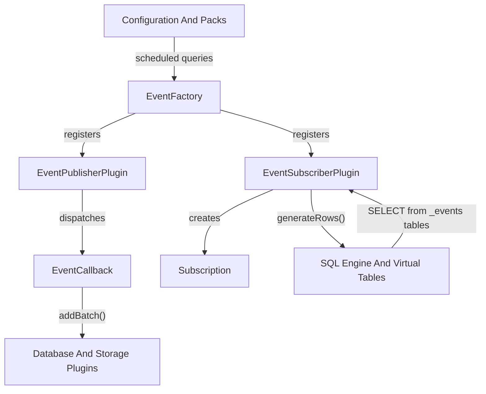
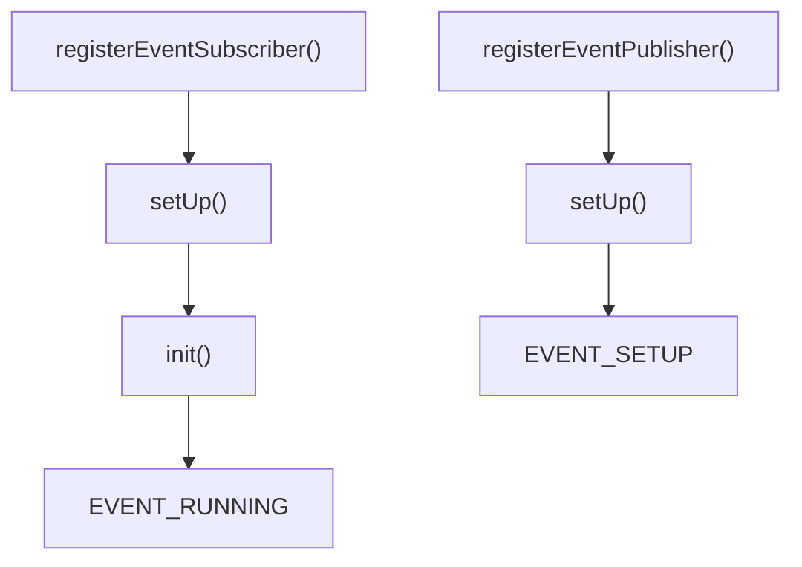
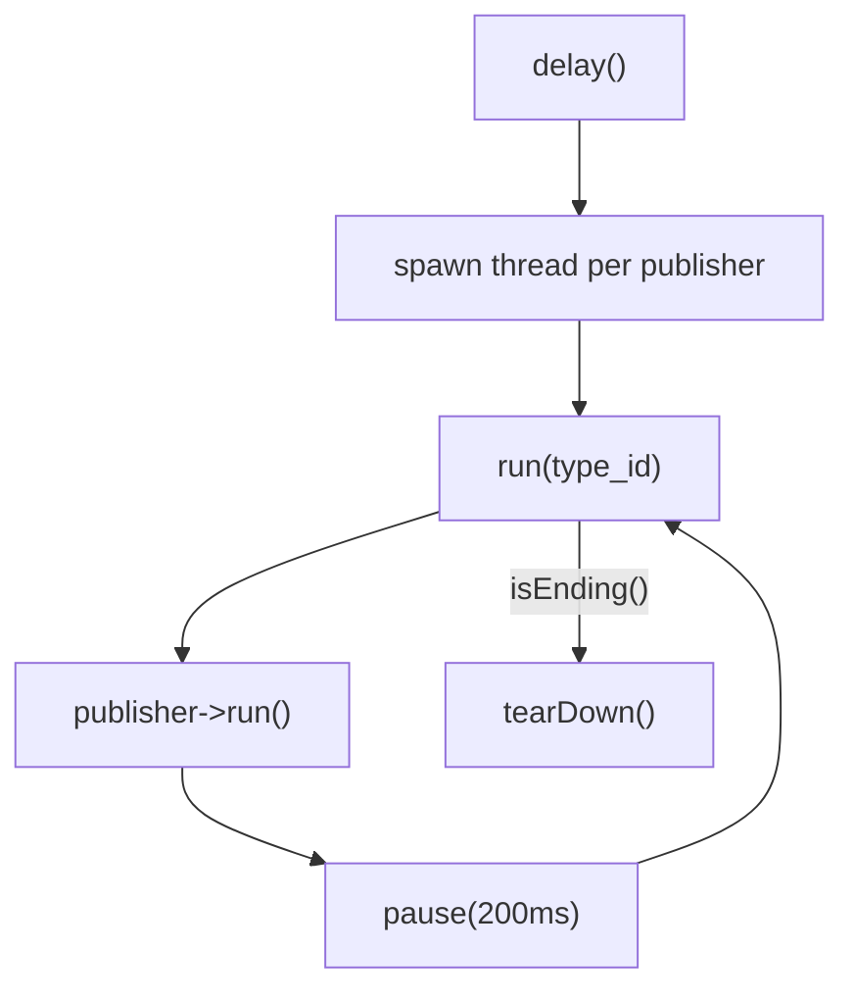
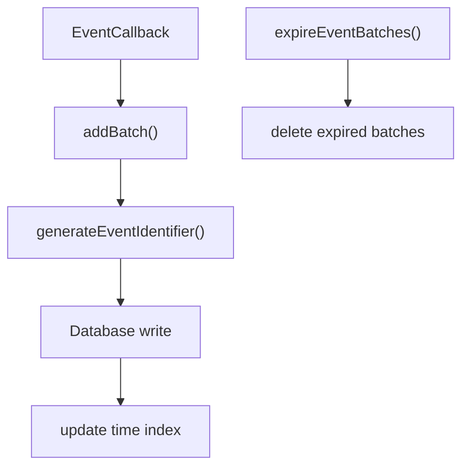
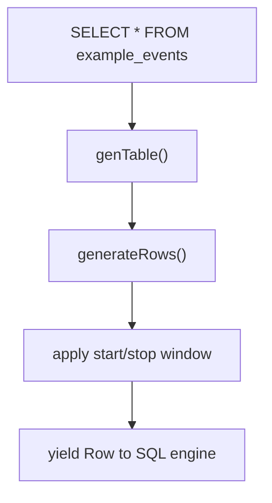
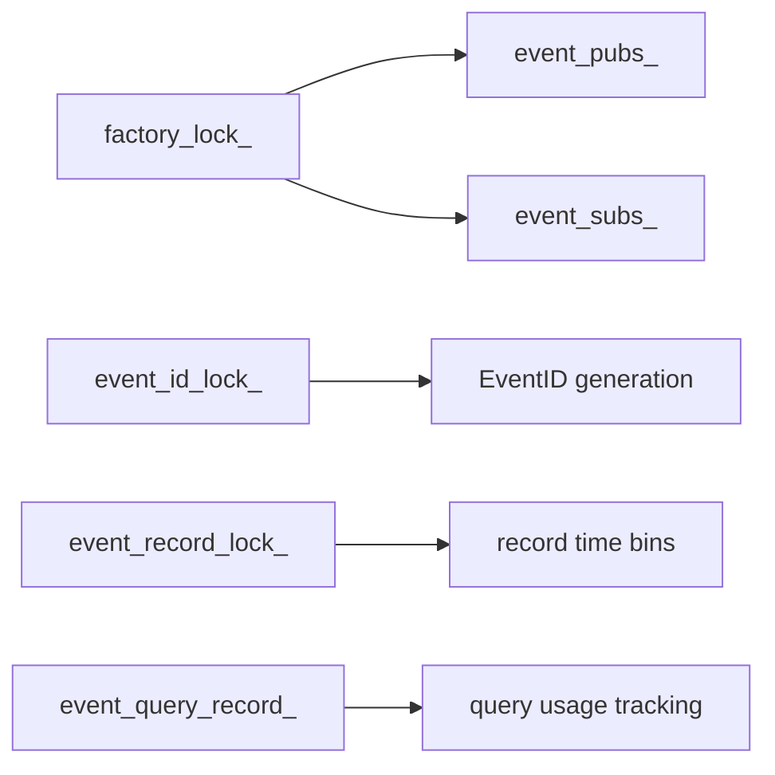
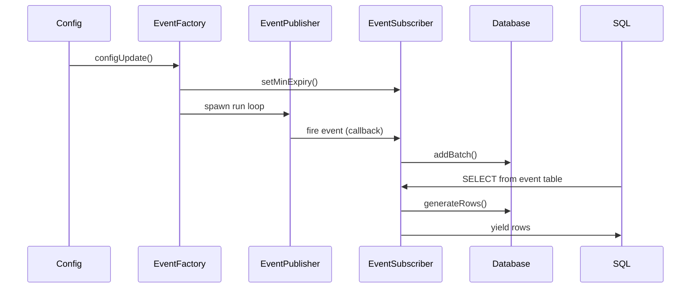

# Eventing Framework And Subscriptions

## Overview

The **Eventing Framework And Subscriptions** module provides the core publish/subscribe infrastructure for osquery’s event-driven data model. It enables:

- Event publishers to monitor operating system activity (e.g., file changes, process activity).
- Event subscribers to register interest in specific event types.
- Persistent storage of event data for later retrieval via virtual tables.
- Automatic lifecycle, expiration, and optimization of event data based on query schedules.

This module acts as the bridge between:

- The SQL Engine And Virtual Tables module (which exposes event tables to queries).
- The Database And Storage Plugins module (which persists event data).
- The Configuration And Packs module (which defines scheduled queries and event usage).

---

## High-Level Architecture



### Core Roles

- **EventFactory** – Central coordinator for publishers and subscribers.
- **EventPublisherPlugin** – Produces system events.
- **EventSubscriberPlugin** – Consumes events and exposes them as queryable tables.
- **Subscription** – Binds subscriber logic to publisher events.
- **PathSet utilities** – Optimized path pattern matching for filesystem-related subscriptions.

---

## EventFactory

The `EventFactory` is a singleton responsible for managing the lifecycle and coordination of all event publishers and subscribers.

### Responsibilities

- Registering and deregistering event publishers and subscribers.
- Creating and forwarding subscriptions.
- Spawning publisher run-loop threads.
- Coordinating shutdown and cleanup.
- Applying configuration updates (e.g., scheduled query analysis).

### Publisher and Subscriber Registration



During registration:

- Subscribers are optionally enabled/disabled via configuration (`events.enable_subscribers`, `events.disable_subscribers`).
- Publishers are validated by type and initialized if events are enabled.
- State transitions are enforced (`EVENT_NONE`, `EVENT_SETUP`, `EVENT_RUNNING`, `EVENT_PAUSED`, `EVENT_FAILED`).

### Publisher Execution Model

Each publisher runs in its own thread:



Key behaviors:

- The factory prevents publisher restarts once started.
- A default cool-off pause avoids CPU thrashing.
- Shutdown via `end()` gracefully deregisters publishers and joins threads.

---

## Subscription Model

The `Subscription` structure binds a subscriber to a publisher.

### Subscription Structure

```text
Subscription
 ├── subscriber_name
 ├── context (SubscriptionContextRef)
 └── callback (EventCallback)
```

Defined in:

- `osquery.osquery.events.subscription.Subscription`

### EventCallback

```text
Status(const EventContextRef&, const SubscriptionContextRef&)
```

When an event fires:

1. The publisher evaluates matching subscriptions.
2. The associated callback executes.
3. The subscriber stores structured rows using `addBatch()`.

Subscriptions are usually created via:

```cpp
EventFactory::addSubscription("PublisherType", subscription);
```

---

## EventSubscriberPlugin

Defined in:

- `osquery.osquery.events.eventsubscriberplugin.Context`
- `osquery.osquery.events.eventsubscriberplugin.GenerateRowsResult`

The `EventSubscriberPlugin` class encapsulates event storage, indexing, expiration, and query-time retrieval.

### Core Responsibilities

- Registering subscriptions in `init()`.
- Storing events using `addBatch()`.
- Managing time-based indexing and expiration.
- Exposing events as virtual tables via `genTable()`.

### Internal Context

```text
Context
 ├── database_namespace
 ├── event_index
 ├── last_query_time
 └── last_event_id
```

The context ensures:

- Namespace isolation between subscribers.
- Efficient indexing by time and event identifier.
- Thread-safe updates using mutexes.

### Event Storage and Expiration



Expiration behavior is governed by:

- `getEventsExpiry()` – Default from flags.
- `getEventBatchesMax()` – Max retained batches.
- `setMinExpiry()` – Adjusted dynamically based on scheduled query intervals.

### Query-Time Retrieval

When a query selects from an event table:



The `GenerateRowsResult` structure tracks:

- Whether the scan reached the end.
- The last processed timestamp.
- The last processed event identifier.

This enables optimized incremental queries.

---

## Configuration-Driven Expiration Logic

One of the most advanced responsibilities of this module is aligning event retention with scheduled queries.

### SubscriberExpirationDetails

Defined in:

- `osquery.osquery.events.eventfactory.SubscriberExpirationDetails`

Structure:

```text
SubscriberExpirationDetails
 ├── max_interval
 └── query_count
```

During `configUpdate()`:

1. The schedule is scanned for queries referencing `_events` tables.
2. For each subscriber table:
   - The maximum interval is recorded.
   - The number of queries referencing it is counted.
3. The minimum expiration window is set to:

```text
min_expiry = (max_interval * 3), rounded to next minute
```

This ensures:

- Events are retained long enough for scheduled queries to observe them.
- Storage is not retained unnecessarily.

---

## PathSet and Pattern Matching

Defined in:

- `osquery.osquery.events.pathset.Compare`

The `PathSet` template provides a thread-safe multiset implementation for path-based matching.

### Supported Patterns

- `*` – Match a single path component.
- `**` – Recursive wildcard.

Example equivalence:

```text
/This/Path/is
/This/Path/*
/This/Path/**
```

### Comparison Logic

The `Compare` functor:

- Compares path components lexicographically.
- Treats `*` as a wildcard.
- Treats `**` as recursive match.
- Maintains ordering semantics required by `std::multiset`.

This is especially important for filesystem event publishers that need efficient path matching across many subscriptions.

---

## Concurrency Model



Key thread-safety mechanisms:

- Recursive locks in `EventFactory`.
- Mutex-protected event indexing.
- Atomic counters for event identifiers and expiration windows.
- Dedicated threads per publisher.

---

## Integration With Other Modules

### SQL Engine And Virtual Tables

- Event subscribers expose data through `genTable()`.
- `_events` tables are queried like normal virtual tables.

### Database And Storage Plugins

- Event rows are persisted using `IDatabaseInterface`.
- Time-based indexing enables efficient windowed queries.

### Configuration And Packs

- Scheduled queries determine retention windows.
- Config parsers can enable/disable subscribers.

### Logging And Query Observability

- Events may be forwarded using `addForwarder()` and `forwardEvent()`.
- Logger plugins can receive structured event payloads.

---

## End-to-End Flow



---

## Design Principles

1. **Separation of Concerns** – Publishers generate, subscribers transform and persist, SQL retrieves.
2. **Config-Aware Retention** – Event expiration adapts to scheduled queries.
3. **Thread Isolation** – Each publisher runs independently.
4. **Optimized Query Windows** – Incremental scanning via time and ID indexes.
5. **Extensibility** – New publishers and subscribers can be registered dynamically.

---

## Summary

The **Eventing Framework And Subscriptions** module is the backbone of osquery’s event-driven capabilities. It provides:

- A robust publish/subscribe infrastructure.
- Persistent and optimized event storage.
- Config-driven lifecycle management.
- Tight integration with the SQL engine and scheduler.

Through careful coordination between `EventFactory`, `EventSubscriberPlugin`, `Subscription`, and `PathSet`, this module enables scalable, queryable system event monitoring across platforms.