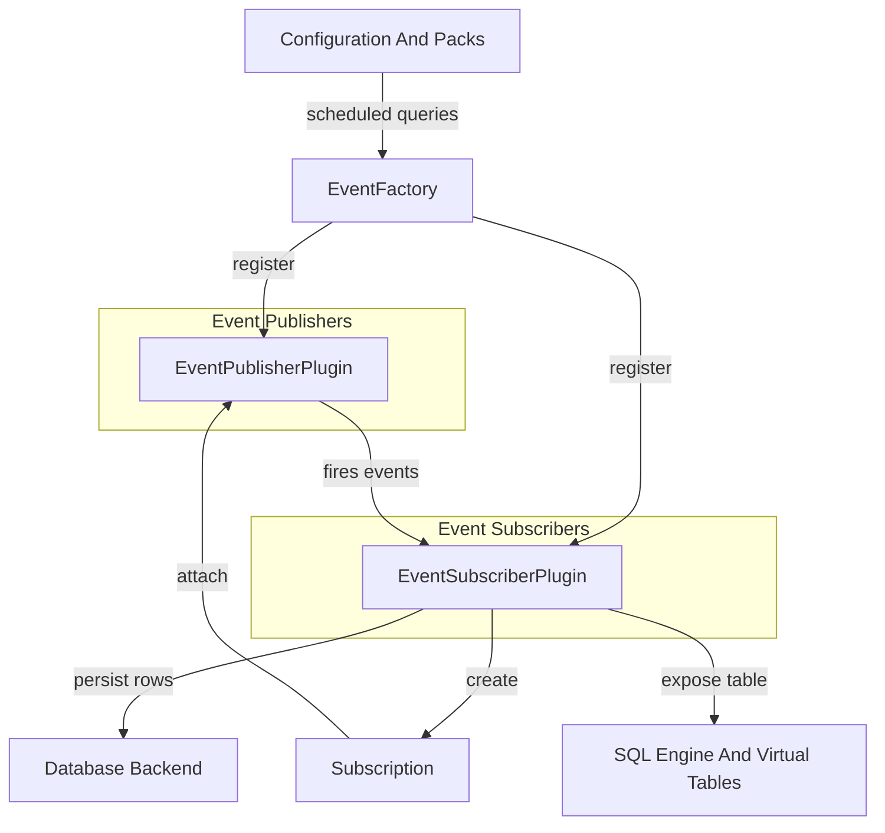
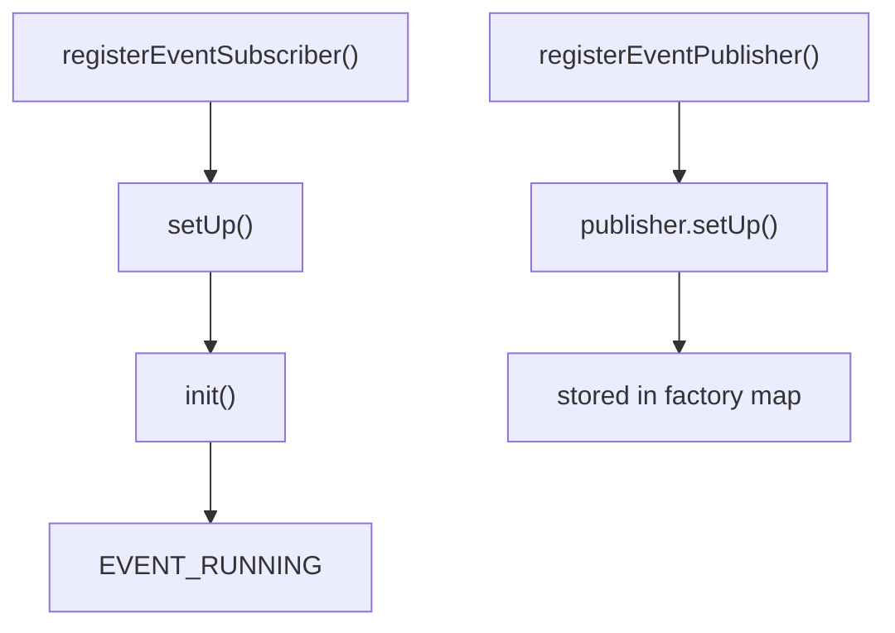
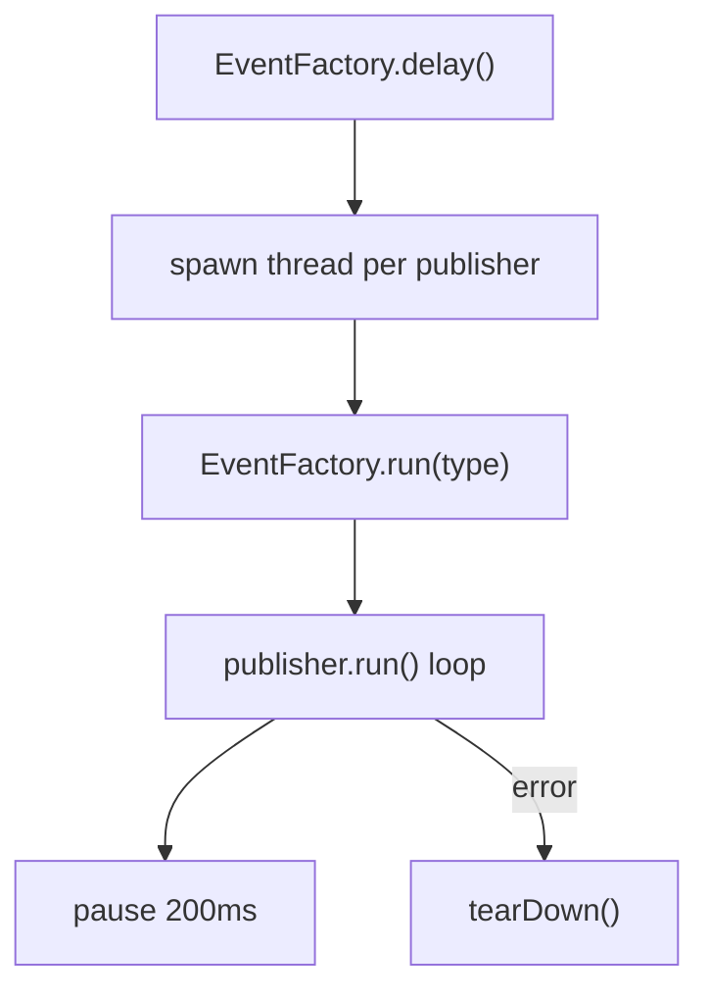
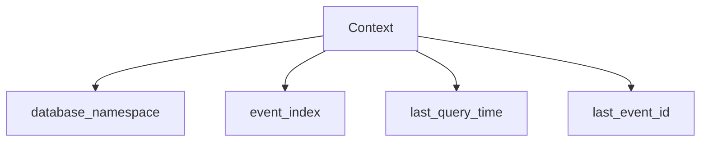
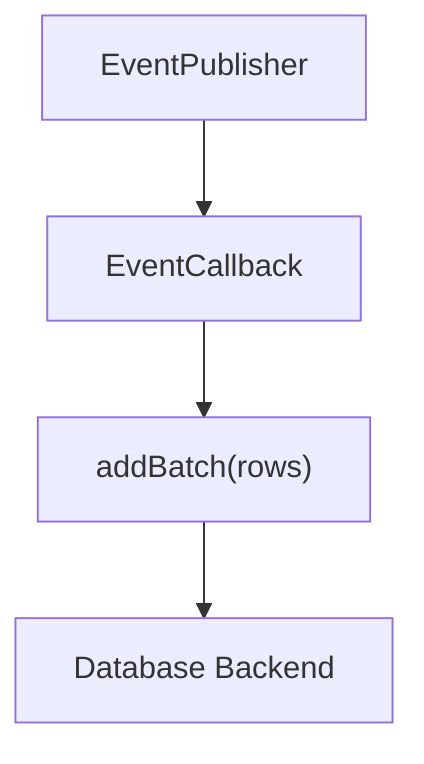
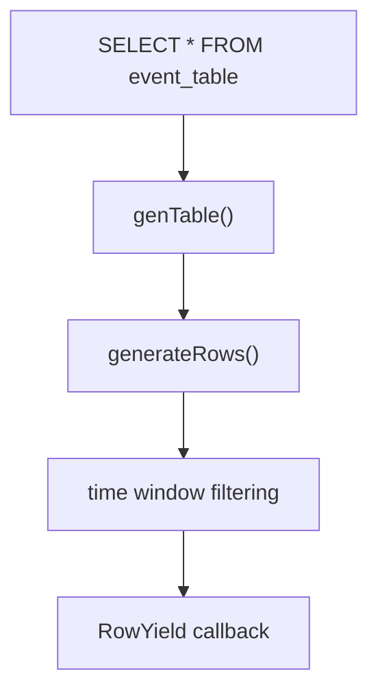
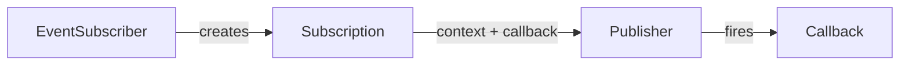
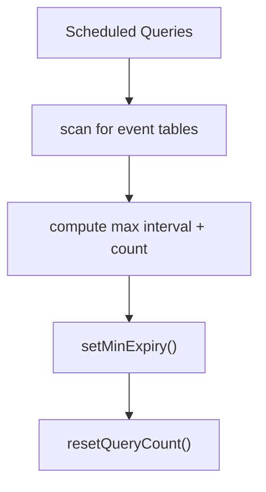
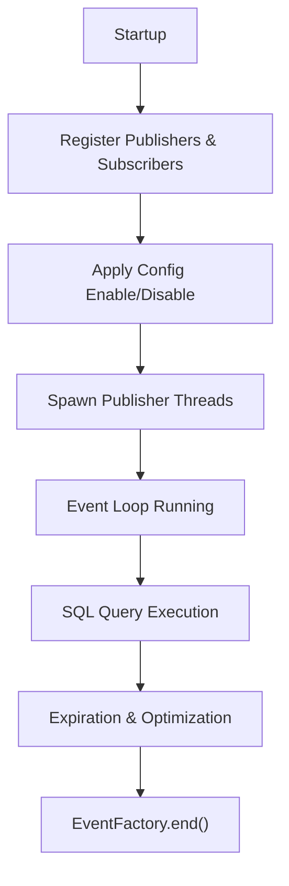

# Events Core And Subscriptions

The **Events Core And Subscriptions** module implements the publish/subscribe eventing infrastructure used by osquery to collect, persist, and expose real-time and near-real-time system events as virtual tables.

It connects:

- **Event publishers** (low-level OS or subsystem monitors)
- **Event subscribers** (table-oriented processors of events)
- **Subscriptions** (scoped event filters and callbacks)
- **Persistent storage and expiration logic**

This module is the backbone of event-based tables (e.g., file events, process events) and integrates tightly with:

- [Configuration And Packs](../configuration-and-packs/configuration-and-packs.md)
- [SQL Engine And Virtual Tables](../sql-engine-and-virtual-tables/sql-engine-and-virtual-tables.md)
- [Database Backend](../database-backend/database-backend.md)
- [Logging And Query Metadata](../logging-and-query-metadata/logging-and-query-metadata.md)

---

## 1. Architectural Overview

The module implements a centralized **EventFactory** that coordinates publishers and subscribers.

### Core Responsibilities

| Component | Responsibility |
|------------|---------------|
| EventFactory | Lifecycle and orchestration of publishers and subscribers |
| EventSubscriberPlugin | Consumes events and persists them as table rows |
| Subscription | Binds a subscriber callback to publisher-specific criteria |
| Context | Maintains indexing and namespace state |
| GenerateRowsResult | Supports optimized time-bounded table scans |

---

## 2. EventFactory

The **EventFactory** is a singleton that manages:

- Publisher registration
- Subscriber registration
- Subscription routing
- Thread lifecycle for publishers
- Schedule-driven expiration tuning

### 2.1 Registration Flow

Key behaviors:

- Validates plugin type
- Applies configuration-based enable/disable rules
- Transitions subscriber state (`EVENT_SETUP`, `EVENT_RUNNING`, `EVENT_PAUSED`, `EVENT_FAILED`)
- Prevents duplicate publisher types

### 2.2 Subscription Routing

Subscriptions are added via:

- `EventFactory::addSubscription(type_id, name_id, context, callback)`
- Routed to the appropriate publisher

If the publisher does not exist, the operation fails safely.

### 2.3 Publisher Execution Model

Each publisher runs inside its own thread.

Important behaviors:

- Publishers cannot be restarted once started
- Controlled shutdown via `isEnding()`
- Automatic teardown on loop exit
- Threads joined or detached via `end(join)`

---

## 3. EventSubscriberPlugin

`EventSubscriberPlugin` is the abstraction that:

- Registers subscriptions during `init()`
- Receives events via callbacks
- Converts them into `Row` objects
- Persists them in the backing database
- Serves them through `genTable()`

### 3.1 Internal Context

Each subscriber maintains a `Context`:

The context ensures:

- Namespace isolation between subscribers
- Unique event identifiers
- Optimized time-based indexing
- Safe concurrency via mutexes

### 3.2 Event Storage Flow

When an event fires:

Key concepts:

- `addBatch()` is preferred over deprecated `add()`
- Events are indexed by time and EventID
- Expiration and overflow enforcement applied

### 3.3 Query-Time Retrieval

At SQL execution time:

`GenerateRowsResult` provides:

- `isEnd` flag
- `last_time`
- `last_id`

This supports incremental and optimized scans.

---

## 4. Subscription

A **Subscription** binds:

- A subscriber name
- A publisher-specific context
- A callback

### Structure

| Field | Purpose |
|--------|--------|
| subscriber_name | Identifies subscriber |
| context | Publisher-specific filter configuration |
| callback | Event processing function |

Subscriptions:

- Scope publisher workload
- Allow fine-grained filtering
- Decouple publishers from subscriber logic

---

## 5. Schedule-Aware Expiration Logic

The module dynamically adjusts expiration windows based on scheduled queries.

During `configUpdate()`:

1. All scheduled queries are scanned.
2. Queries referencing `_events` tables are identified.
3. Per-subscriber metrics are computed:
   - Maximum interval
   - Query count
4. Minimum expiration is set to `max_interval * 3`, rounded to minute boundary.

This ensures:

- Data persists long enough for slow schedules
- Subscribers expire events safely
- Over-aggressive expiration is prevented

---

## 6. Forwarding and Logging Integration

EventFactory supports forwarding serialized events to logger plugins:

- `addForwarder(logger_name)`
- `forwardEvent(event_string)`

This integrates with:

- [Logging And Query Metadata](../logging-and-query-metadata/logging-and-query-metadata.md)

Allowing event streams to be:

- Logged
- Forwarded to remote systems
- Integrated with distributed pipelines

---

## 7. Lifecycle Summary

---

## 8. Relationship to Other Modules

| Module | Integration Role |
|---------|-----------------|
| Configuration And Packs | Drives scheduled queries and subscriber tuning |
| SQL Engine And Virtual Tables | Exposes event data as queryable tables |
| Database Backend | Persists indexed event rows |
| Logging And Query Metadata | Emits event logs and execution metadata |

The **Events Core And Subscriptions** module acts as the real-time data ingestion and event persistence layer between OS-level monitoring and SQL-based introspection.

---

## 9. Design Characteristics

- Thread-isolated publishers
- Subscriber-driven storage model
- Time-indexed database persistence
- Schedule-aware expiration tuning
- Plugin-based extensibility
- Configuration-driven enable/disable logic
- Safe teardown and deregistration

---

## Conclusion

The **Events Core And Subscriptions** module provides a scalable, extensible event processing framework built around:

- Publisher threads
- Subscription-based filtering
- Subscriber-managed persistence
- SQL-driven retrieval

It enables osquery to transform asynchronous OS signals into consistent, queryable relational data while maintaining performance, safety, and configurability across diverse platforms.