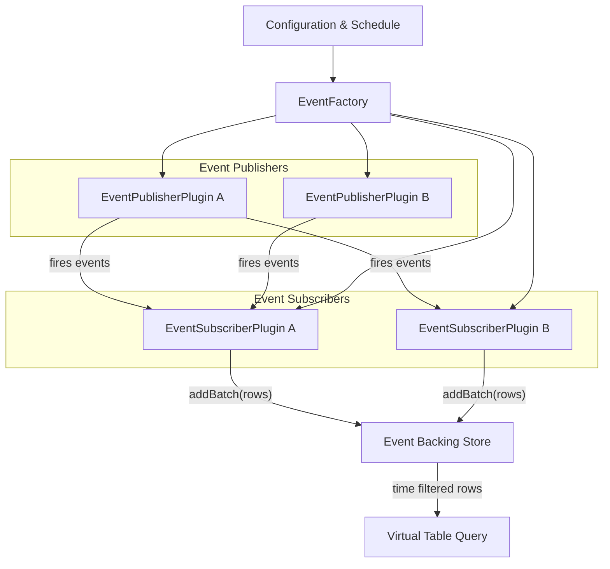
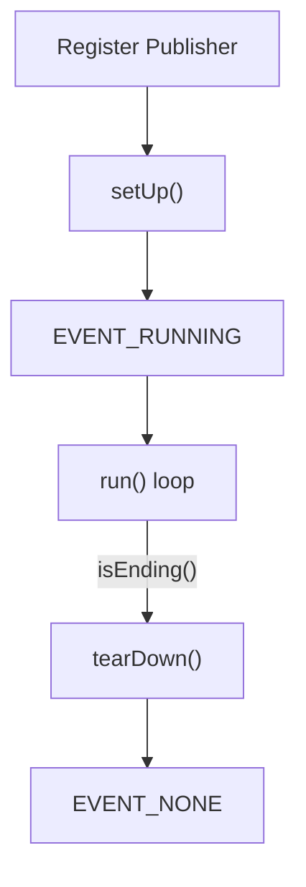
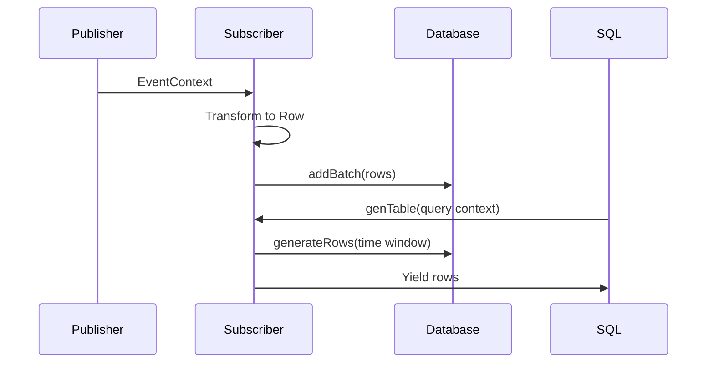
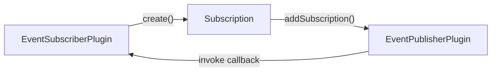
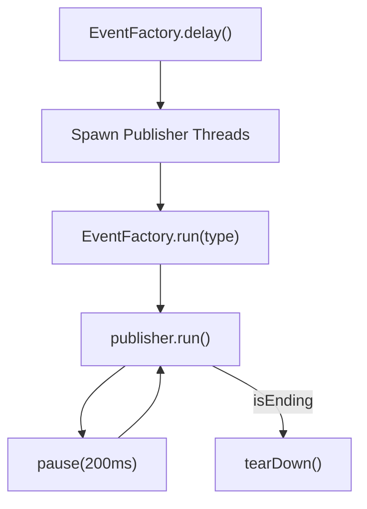
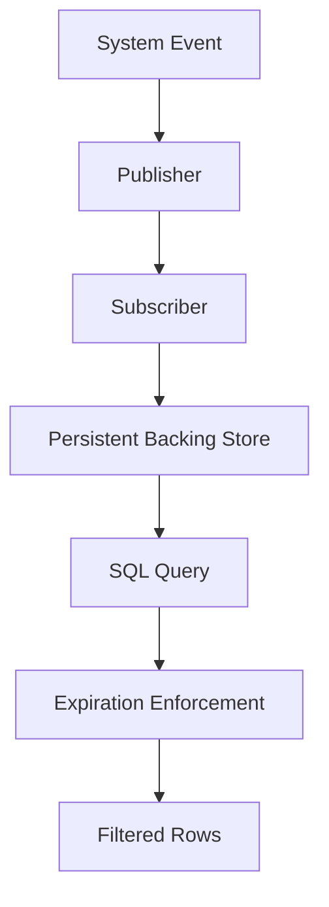

# Events Core

The **Events Core** module implements osquery’s publish/subscribe event framework. It provides the infrastructure required for:

- Registering event publishers and subscribers
- Managing event subscriptions
- Persisting event data in a time-indexed backing store
- Exposing event data as virtual tables
- Coordinating lifecycle, threading, and expiration policies

At its core, Events Core enables real-time system activity (file changes, process activity, kernel notifications, etc.) to be captured by publishers, filtered by subscribers, stored efficiently, and queried through SQL.

---

## Architectural Overview

Events Core follows a classic publish/subscribe architecture with persistent storage and SQL exposure layered on top.



### Key Responsibilities

- **EventFactory**: Central registry and lifecycle manager
- **EventPublisherPlugin**: Produces raw event contexts
- **EventSubscriberPlugin**: Filters and transforms events into rows
- **Subscription**: Binds a subscriber callback to a publisher
- **Backing Store**: Time-indexed storage for event rows
- **SQL Layer**: Exposes event data via virtual tables

---

## Core Components

### 1. EventFactory

Defined in `eventfactory.cpp`, EventFactory is a singleton responsible for:

- Registering and deregistering publishers and subscribers
- Managing subscriptions
- Running publisher threads
- Coordinating configuration updates
- Forwarding events to logger plugins

#### Lifecycle Management



Key methods:

- `registerEventPublisher`
- `registerEventSubscriber`
- `addSubscription`
- `run`
- `delay`
- `end`
- `configUpdate`

#### Configuration Awareness

During `configUpdate`, EventFactory:

1. Scans scheduled queries.
2. Detects queries touching event-backed tables.
3. Computes a minimum expiration window per subscriber.
4. Reconfigures publishers and subscribers.

This ensures expiration policies align with actual query intervals.

The internal structure `SubscriberExpirationDetails` tracks:

- `max_interval`: Longest scheduled query interval
- `query_count`: Number of queries using a subscriber

---

### 2. EventSubscriberPlugin

Defined in `eventsubscriberplugin.h`, EventSubscriberPlugin:

- Inherits from `Plugin` and `Eventer`
- Registers subscriptions in `init()`
- Receives event callbacks
- Converts event contexts into table rows
- Stores rows in a persistent backing store

#### Event Flow



#### Storage Model

Each subscriber maintains a `Context` structure:

- `database_namespace`: Unique storage namespace
- `event_index`: Time-indexed mapping of events
- `last_event_id`: Monotonic event identifier
- `last_query_time`: Optimization watermark

Events are stored using:

- EventID-based keys
- Time-based expiration
- Batch indexing

#### GenerateRowsResult

The `GenerateRowsResult` structure reports:

- `isEnd`: Whether iteration completed
- `last_time`: Last processed event time
- `last_id`: Last processed event identifier

This supports efficient incremental queries and optimization.

#### Expiration and Optimization

Subscribers implement:

- `getEventsExpiry()`
- `getEventBatchesMax()`
- `shouldOptimize()`
- `expireEventBatches()`
- `removeOverflowingEventBatches()`

Expiration is influenced by:

- Global flags
- Subscriber overrides
- Scheduled query intervals

---

### 3. Subscription

Defined in `subscription.h`, `Subscription` binds:

- A subscriber name
- A SubscriptionContext
- An EventCallback



The `EventCallback` signature:

```text
Status(const EventContextRef&, const SubscriptionContextRef&)
```

This allows publishers to:

- Filter events based on context
- Scope resource usage
- Dispatch events only to relevant subscribers

---

## Threading Model

Event publishers run in dedicated threads managed by EventFactory.



Key properties:

- Each publisher runs independently
- Restart prevention enforced
- Controlled shutdown via `end()`
- Graceful deregistration support

---

## Data Lifecycle



Stages:

1. Event generated by OS or subsystem
2. Publisher dispatches EventContext
3. Subscriber transforms into Row
4. Row stored with EventTime and EventID
5. Query retrieves rows within time bounds
6. Expiration trims old data

---

## Interaction with Other Modules

Events Core integrates closely with:

- **Config and Packs**: Scheduled queries determine expiration policies
- **SQL Core and Virtual Tables**: Exposes event data as tables
- **Database Backends**: Persists event rows and indexes
- **Plugin Interfaces and Logging**: Forwards event data to logger plugins

EventFactory also supports event forwarding via logger plugins using registry calls.

---

## Design Principles

### 1. Strict Separation of Concerns

- Publishers observe and emit
- Subscribers transform and store
- Factory orchestrates
- SQL layer queries

### 2. Time-Based Query Optimization

- Incremental queries use watermarks
- Expiration is schedule-aware
- Storage keyed by time and ID

### 3. Pluggable Architecture

- Publishers and subscribers are registry plugins
- Subscriptions dynamically configure publishers
- Event system can be globally disabled

### 4. Controlled Resource Usage

- Subscription scoping reduces publisher load
- Expiration prevents unbounded growth
- Max batch limits enforce memory control

---

## Summary

The **Events Core** module is the backbone of osquery’s real-time data collection system. It:

- Implements a robust publish/subscribe event framework
- Persists event data with time-aware indexing
- Aligns expiration with scheduled query usage
- Exposes event streams as queryable SQL tables
- Provides thread-safe lifecycle and shutdown management

Through EventFactory, EventSubscriberPlugin, and Subscription, Events Core enables scalable, extensible, and efficient event-driven data collection within the osquery runtime.