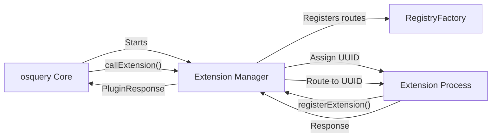
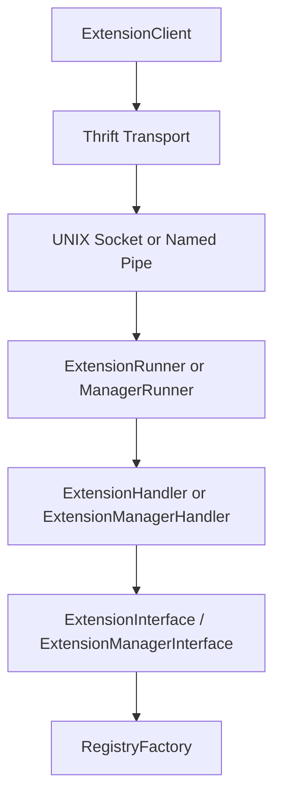
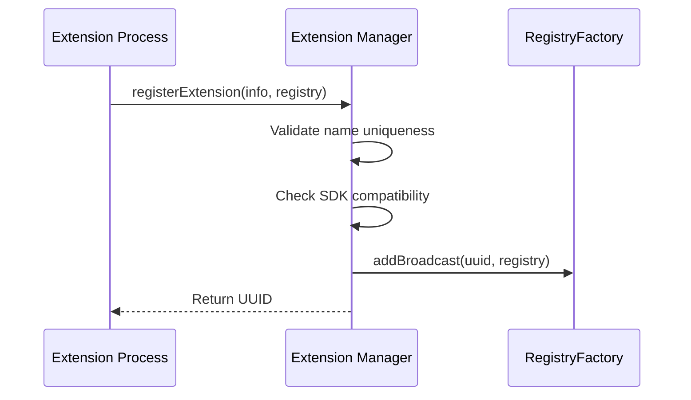
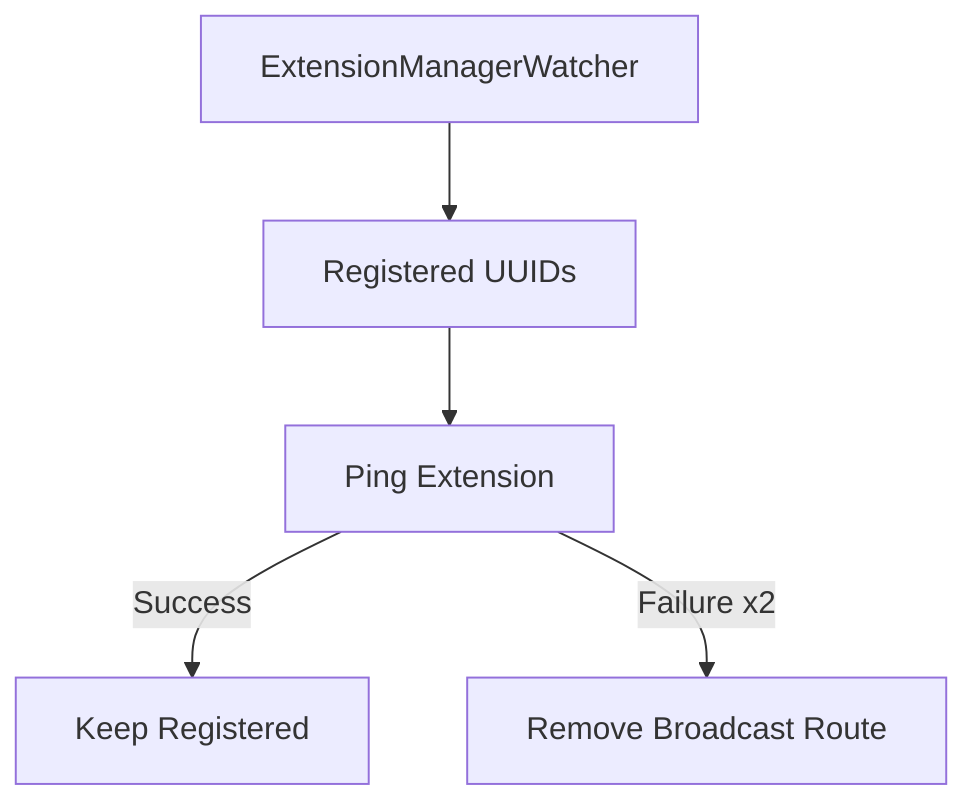
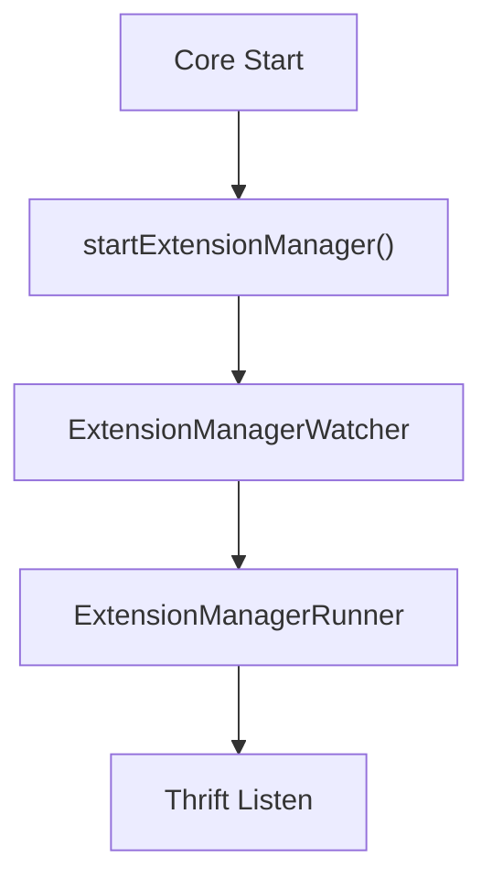
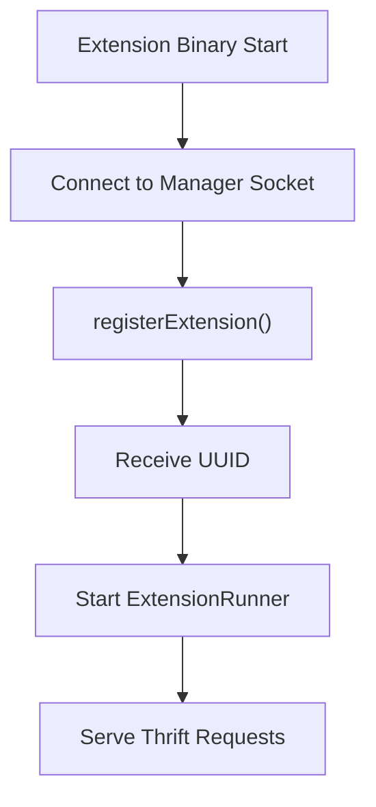

# Extensions And Ipc

The **Extensions And Ipc** module provides the inter-process communication (IPC) layer and extension framework that allows osquery to be extended at runtime. It enables external processes (extensions) to:

- Register new registry plugins (tables, config plugins, logger plugins, etc.)
- Execute SQL queries via the core engine
- Expose custom functionality to the osquery core
- Communicate securely over platform-specific IPC channels

This module is the foundation for osquery’s pluggable architecture, separating the core daemon from externally developed functionality while maintaining a controlled and versioned API boundary.

---

## 1. Purpose and Design Goals

The Extensions And Ipc module is designed to:

- ✅ Allow third-party or internal extensions to run as separate processes
- ✅ Provide a stable RPC interface using Apache Thrift
- ✅ Enforce SDK compatibility and version checks
- ✅ Isolate crashes or faults from the core daemon
- ✅ Support cross-platform IPC (UNIX domain sockets on POSIX, named pipes on Windows)

At a high level, it implements:

- An **Extension Manager** (running inside osquery core)
- One or more **Extension Processes** (external binaries)
- A **Thrift-based RPC layer**
- Health monitoring and watchdog services

---

## 2. High-Level Architecture

The Extensions And Ipc module sits between:

- The **Registry subsystem** (plugin routing)
- The **SQL engine** (query delegation)
- The **Dispatcher and runtime threads**
- External extension processes

### 2.1 Core–Extension Interaction Model

### 2.2 IPC and Thrift Layer

---

## 3. Core Components

### 3.1 Extension Metadata

**Component:** `ExtensionInfo`

Defined in `extensions.h`, this struct mirrors the Thrift `InternalExtensionInfo` type and contains:

- `name`
- `version`
- `sdk_version`
- `min_sdk_version`

This metadata is validated during registration and stored in an `ExtensionList` keyed by a transient `RouteUUID`.

---

### 3.2 Extension Manager (Core Side)

**Key Classes:**

- `ExtensionManagerInterface`
- `ExtensionManagerHandler`
- `ExtensionManagerRunner`
- `ExtensionManagerWatcher`

#### Responsibilities

1. Accept extension registrations
2. Assign unique `RouteUUID` values (via `UuidGenerator`)
3. Validate SDK compatibility
4. Maintain active extension metadata
5. Route plugin calls to registered extensions
6. Monitor extension health

#### Registration Flow

If duplicate names or incompatible SDK versions are detected, registration fails.

---

### 3.3 Extension Process (External Binary)

**Key Classes:**

- `ExtensionRunner`
- `ExtensionInterface`
- `ExtensionHandler`

An extension process:

1. Connects to the Extension Manager socket
2. Registers its broadcasted registry routes
3. Receives a `RouteUUID`
4. Starts a Thrift server loop
5. Waits for calls from the core

Each extension serves the `Extension` Thrift service defined in the generated files.

---

### 3.4 Thrift RPC Layer

**Key Files:**

- `impl_thrift.cpp`
- Generated files under `thrift/gen/`

The module uses Apache Thrift to define two services:

1. `Extension` – implemented by extension processes
2. `ExtensionManager` – implemented by osquery core

#### Server-Side Wrappers

- `ExtensionHandler` implements `ExtensionIf`
- `ExtensionManagerHandler` implements `ExtensionManagerIf`

These handlers:

- Translate Thrift structures into internal `PluginRequest`/`PluginResponse`
- Delegate logic to `ExtensionInterface` or `ExtensionManagerInterface`

#### Client-Side Wrappers

- `ExtensionClient`
- `ExtensionManagerClient`

They abstract:

- Transport creation
- Timeout configuration
- Method invocation
- Status translation

---

### 3.5 Extension API Contracts

The module defines abstract APIs:

- `ExtensionAPI`
- `ExtensionManagerAPI`

These interfaces enforce a separation between:

- Thrift transport concerns
- Business logic

This design allows alternative RPC backends in the future while preserving core logic.

---

### 3.6 UUID Management

**Component:** `UuidGenerator`

- Generates 16-bit UUID values
- Tracks active UUIDs in a thread-safe set
- Removes UUIDs on deregistration

UUIDs uniquely identify extension routes inside `RegistryFactory`.

---

### 3.7 External SQL Plugin

**Component:** `ExternalSQLPlugin`

This special plugin allows the core SQL registry to delegate SQL queries to extensions.

Used when tables or query logic are implemented outside the core.

---

### 3.8 Watchers and Health Monitoring

**Key Classes:**

- `ExtensionWatcher`
- `ExtensionManagerWatcher`

#### ExtensionWatcher

- Runs inside extension processes
- Periodically pings the manager
- Exits fatally if the manager disappears

#### ExtensionManagerWatcher

- Runs inside core
- Pings all registered extensions
- Removes routes if extensions become unreachable

---

### 3.9 Autoloading and Security

Extensions can be autoloaded using:

- `--extensions_autoload`
- `--extension` (shell-only)

Security checks include:

- File extension validation (`.ext`, `.exe` on Windows)
- Directory permission safety checks
- Ownership validation

Unsafe or improperly permissioned binaries are rejected.

---

### 3.10 IPC Channel Integration

On POSIX systems, IPC is primarily UNIX domain sockets. Additionally, worker IPC may use pipe-based channels.

**Component:** `GetChannelType<PipeChannelFactory>`

This specialization maps a `PipeChannelFactory` to its underlying `PipeChannel` type, integrating extension communication with the worker IPC framework.

This ensures consistent abstraction across:

- Extension IPC
- Worker-table IPC
- Internal task communication

---

## 4. Lifecycle Overview

### 4.1 Core Startup

### 4.2 Extension Startup

### 4.3 Shutdown Flow

- Extension calls `shutdown()` or receives manager failure
- Manager deregisters UUID
- `RegistryFactory::removeBroadcast()` is invoked
- Stale socket paths are cleaned via `removeStalePaths()`

---

## 5. Interaction with Other Subsystems

The Extensions And Ipc module interacts with:

- **RegistryFactory** – route registration and broadcast
- **SQL Engine** – delegated queries
- **Dispatcher** – background service threads
- **Flags subsystem** – option propagation
- **Filesystem utilities** – socket and permission checks

It acts as a boundary layer rather than a business-logic module.

---

## 6. Error Handling and Status Model

All RPC responses use:

- `ExtensionStatus`
- `ExtensionResponse`
- `ExtensionCode` (SUCCESS, FAILED, FATAL)

This ensures:

- Consistent status propagation across process boundaries
- Clear failure semantics for SDK mismatches and duplicate registrations

---

## 7. Security Considerations

The module enforces:

- SDK version compatibility checks
- Duplicate extension prevention
- File permission validation for autoload
- Socket path isolation per UUID
- Controlled shutdown behavior

On Windows, named pipes are secured using explicit security descriptors.

---

## 8. Summary

The **Extensions And Ipc** module is the runtime extension backbone of osquery. It:

- Implements a bidirectional Thrift RPC system
- Manages extension lifecycle and UUID assignment
- Routes registry plugin calls across process boundaries
- Monitors extension health
- Enforces compatibility and security constraints

Without this module, osquery would be a static binary. With it, osquery becomes a dynamic, pluggable platform capable of safely integrating externally developed functionality at runtime.
