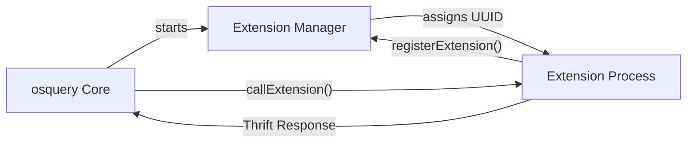
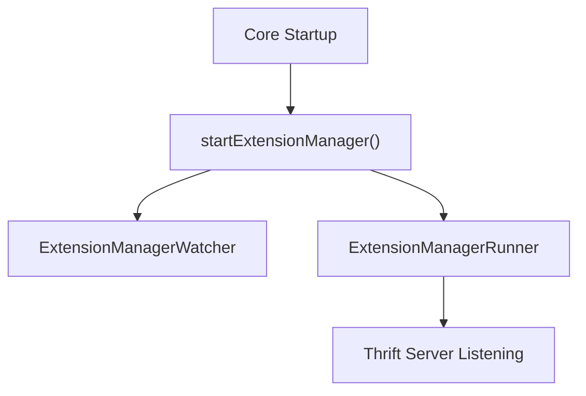
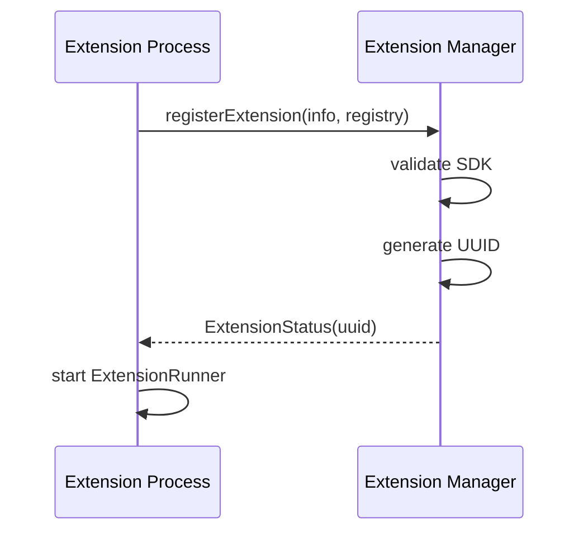
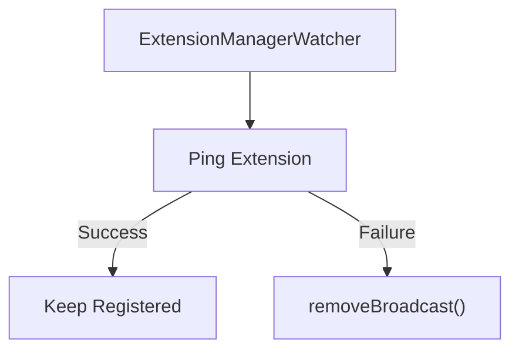
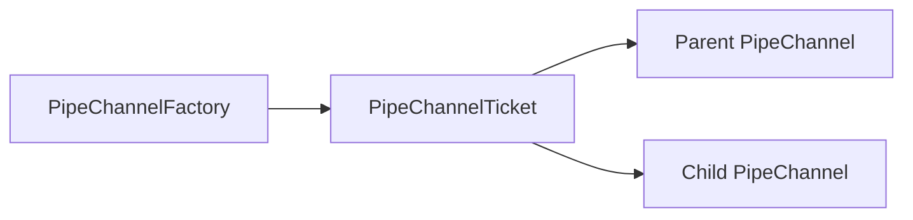

# Extensions And Ipc

The **Extensions And Ipc** module implements osquery’s external plugin system and its inter-process communication (IPC) layer. It enables osquery to dynamically load and communicate with external extension processes that provide additional tables, config plugins, logger plugins, and distributed query functionality.

This module is responsible for:

- Managing the Extension Manager lifecycle
- Registering and tracking extension processes
- Exposing and consuming Thrift-based APIs
- Routing registry calls across process boundaries
- Monitoring extension health
- Providing IPC primitives for worker/table isolation

Extensions allow osquery to be modular and extensible without modifying the core binary.

---

## Architectural Overview

At runtime, osquery core starts an **Extension Manager** (a Thrift server). External extension binaries connect to it, register their registry routes, and start their own Thrift servers.

Communication happens over:

- UNIX domain sockets (Linux/macOS)
- Named pipes (Windows)

### High-Level Flow

### Major Components

- **ExtensionInfo** – Metadata describing each extension
- **ExtensionManagerInterface** – Core-side manager API
- **ExtensionInterface** – Extension-side API implementation
- **ExtensionRunner / ExtensionManagerRunner** – Thrift server runners
- **ExtensionClient / ExtensionManagerClient** – Thrift clients
- **ExtensionManagerWatcher** – Health monitoring
- **ExternalSQLPlugin** – SQL proxy to extension-provided tables
- **PipeChannelFactory** – POSIX IPC channel factory for table workers

---

## Extension Lifecycle

### 1. Extension Manager Startup

The core process calls `startExtensionManager()`:

- Verifies socket path availability
- Starts `ExtensionManagerWatcher`
- Starts `ExtensionManagerRunner` (Thrift server)
- Optionally waits for required extensions (`extensions_require` flag)

---

### 2. Extension Registration

An extension binary calls:

- `startExtension()`
- `ExtensionManagerClient::registerExtension()`

The manager:

1. Validates SDK compatibility
2. Assigns a unique `RouteUUID` (via `UuidGenerator`)
3. Registers broadcasted registry routes
4. Stores `ExtensionInfo`

Core structures involved:

- `ExtensionInfo`
- `ExtensionManagerInterface::registerExtension`
- `UuidGenerator`
- `RegistryFactory::addBroadcast`

---

### 3. Serving Requests

Once registered:

- The extension starts `ExtensionRunner`
- The manager maintains route mappings
- Core resolves registry calls to extension routes

When a plugin call is routed externally:

1. Core invokes `callExtension()`
2. An `ExtensionClient` connects to the extension socket
3. Thrift `call()` is executed
4. Response is translated into `PluginResponse`

---

## Core APIs

### ExtensionAPI

Implemented by both core and extension sides.

Methods:

- `ping()` – Health check
- `call(registry, item, request, response)` – Execute registry plugin
- `shutdown()` – Graceful termination

### ExtensionManagerAPI

Implemented only by the manager.

Methods:

- `extensions()` – List active extensions
- `options()` – Return gflags snapshot
- `registerExtension()` – Register routes
- `deregisterExtension()` – Remove routes
- `query()` – Execute SQL in core
- `getQueryColumns()` – Return column metadata

These interfaces are implemented in:

- `ExtensionInterface`
- `ExtensionManagerInterface`

---

## Thrift Layer

The module uses Apache Thrift for RPC definitions.

Generated files include:

- `Extension.h`
- `ExtensionManager.h`
- `osquery_types.h`

### Transport Abstraction

Platform-dependent socket types:

- `TServerSocket` / `TSocket` (POSIX)
- `TPipeServer` / `TPipe` (Windows)

Encapsulated in:

- `ImplExtensionRunner`
- `ImplExtensionClient`

---

## Extension Monitoring

### ExtensionWatcher

Monitors:

- Manager socket availability
- Registration state
- Extension ping status

If a fatal condition occurs:

- Triggers `requestShutdown()`

### ExtensionManagerWatcher

Runs inside core and:

- Iterates over registered `RouteUUID`s
- Pings each extension
- Removes stale routes if unresponsive

---

## SQL Integration

The `ExternalSQLPlugin` allows SQL queries to be executed by extensions.

Used when:

- A virtual table is implemented externally
- Query routing requires extension execution

Flow:

1. SQL engine determines table is external
2. `ExternalSQLPlugin::query()` invoked
3. Manager forwards to extension

See also: [Sql Core And Virtual Tables](../sql-core-and-virtual-tables/sql-core-and-virtual-tables.md)

---

## Flags and Configuration

Key flags:

- `extensions_socket`
- `extensions_autoload`
- `extensions_timeout`
- `extensions_interval`
- `extensions_require`
- `disable_extensions`

Autoload flow:

1. Read `extensions_autoload` file
2. Validate binary safety (permissions + extension type)
3. Launch extension processes

Safety checks include:

- File existence
- Ownership validation
- Allowed file extensions per platform

---

## IPC: PipeChannelFactory

In addition to Thrift IPC, this module integrates with the worker IPC subsystem.

`PipeChannelFactory` provides:

- POSIX pipe-based channel creation
- Parent/child pipe setup
- Automatic descriptor cleanup via `PipeChannelTicket`

This is used by the worker table isolation framework.

Core abstraction:

- `GetChannelType<PipeChannelFactory>` maps to `PipeChannel`

---

## UUID Management

Each extension is assigned a transient `RouteUUID`.

Generated by:

- `UuidGenerator`

Characteristics:

- 16-bit random ID
- Uniqueness enforced via in-memory set
- Released on deregistration

UUID is used for:

- Socket naming (`extensions_socket.<uuid>`)
- Route mapping
- Health checks

---

## Failure Handling and Robustness

The module includes several defensive mechanisms:

- Timeout-based connection attempts (`applyExtensionDelay`)
- SDK compatibility enforcement
- Duplicate extension name rejection
- Stale socket cleanup (`removeStalePaths`)
- Watchdog-based removal of unresponsive extensions

Failure states propagate through:

- `ExtensionStatus`
- `ExtensionCode` (`EXT_SUCCESS`, `EXT_FAILED`, `EXT_FATAL`)

---

## Relationship to Other Modules

Extensions And Ipc integrates closely with:

- Registry system (plugin routing)
- SQL engine (external table support)
- Dispatcher (threaded services)
- Core flags system

Relevant modules:

- [Sql Core And Virtual Tables](../sql-core-and-virtual-tables/sql-core-and-virtual-tables.md)
- [Core Init Shutdown And Watcher](../core-init-shutdown-and-watcher/core-init-shutdown-and-watcher.md)

---

## Summary

The **Extensions And Ipc** module provides the foundation for osquery’s plugin extensibility model.

It combines:

- Thrift-based RPC
- Dynamic registry broadcasting
- Extension lifecycle management
- Health monitoring
- Cross-platform IPC abstraction

This design allows osquery to remain secure, modular, and adaptable while keeping core functionality stable and isolated from third-party or experimental components.
