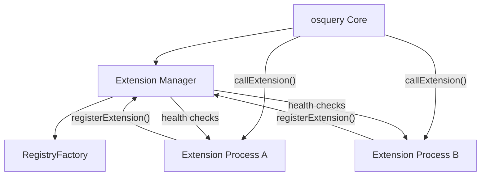
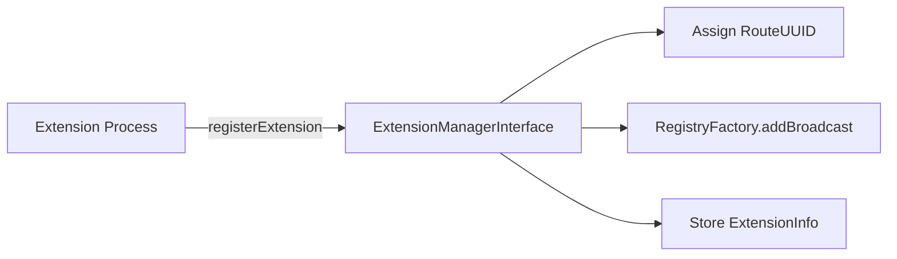
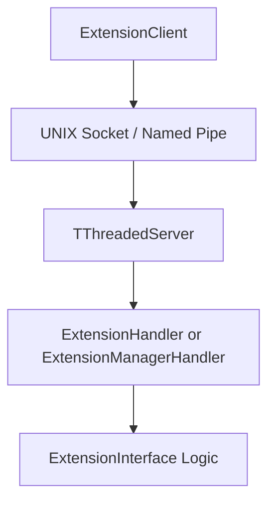
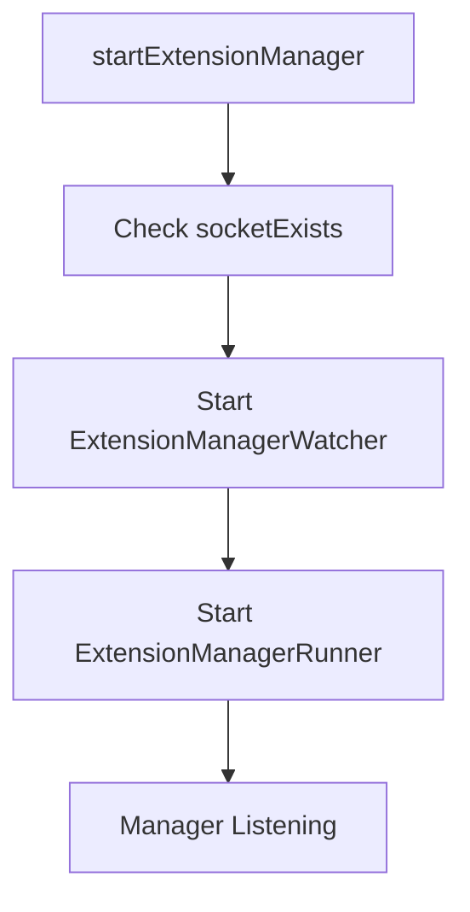
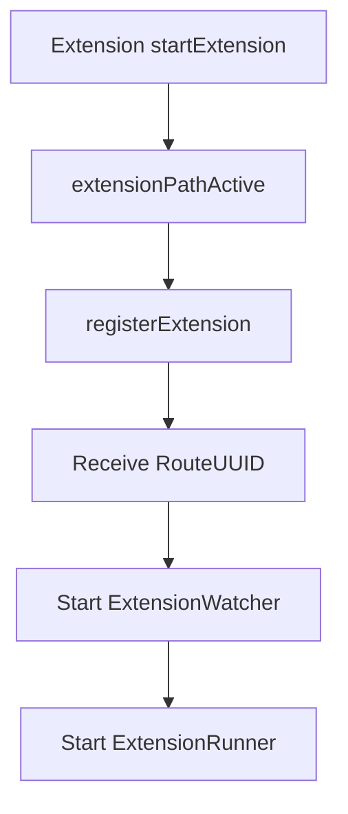
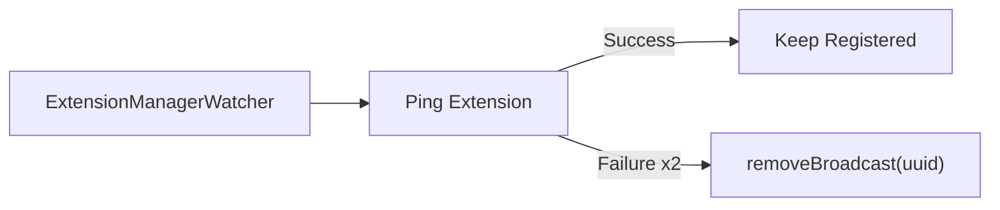
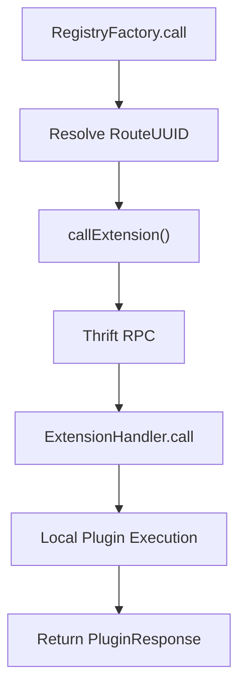

# Extensions Framework

The **Extensions Framework** enables osquery to be dynamically extended at runtime through external processes. It provides a secure, version-aware, and Thrift-based inter-process communication (IPC) layer that allows third-party or custom components to register new registry plugins, SQL tables, configuration providers, and loggers without modifying the core binary.

At its core, the Extensions Framework:

- Starts and manages an **Extension Manager** inside osquery core
- Allows external binaries (extensions) to **register registry routes**
- Provides a **Thrift IPC layer** for RPC-style communication
- Monitors extension health and lifecycle
- Enforces SDK compatibility and uniqueness constraints

---

## 1. Architectural Overview

The Extensions Framework is built around a manager–extension model using UNIX domain sockets (or Windows named pipes) and Apache Thrift.

### Key Roles

- **Extension Manager**: Runs inside osquery core and exposes the Thrift API for extension registration and coordination.
- **Extension Process**: External binary that registers registry routes and serves plugin calls.
- **RegistryFactory**: Maintains broadcast routes and resolves plugin calls between core and extensions.
- **Extension Watchers**: Monitor connectivity and liveness of the manager and registered extensions.

---

## 2. Core Components

### 2.1 ExtensionInfo

**Component:** `osquery.osquery.extensions.extensions.ExtensionInfo`

`ExtensionInfo` encapsulates metadata for each registered extension:

- `name`
- `version`
- `sdk_version`
- `min_sdk_version`

This metadata is validated during registration to:

- Prevent duplicate extension names
- Enforce minimum SDK compatibility
- Track active extensions by `RouteUUID`

Internally, extensions are tracked as:

- `ExtensionList = std::map<RouteUUID, ExtensionInfo>`

---

### 2.2 ExtensionManagerInterface

The `ExtensionManagerInterface` implements the core logic for managing extension lifecycle and registry broadcasts.

Key responsibilities:

- Registering extensions (`registerExtension`)
- Deregistering extensions (`deregisterExtension`)
- Tracking metadata (`extensions()`)
- Enforcing SDK compatibility
- Exposing osquery flags as `OptionList`
- Executing SQL on behalf of extensions

During registration:

1. Duplicate extension names are rejected.
2. SDK compatibility is validated.
3. A new `RouteUUID` is generated via `UuidGenerator`.
4. Registry routes are broadcast into `RegistryFactory`.
5. Metadata is stored for tracking and health monitoring.

---

### 2.3 UuidGenerator

**Component:** `osquery.osquery.extensions.interface.UuidGenerator`

The `UuidGenerator` assigns unique `RouteUUID` values to extensions at registration time.

Characteristics:

- Thread-safe via mutex protection
- Prevents UUID reuse
- Ensures uniqueness across active extensions
- Removes UUID on deregistration

This UUID is:

- Embedded in extension socket paths
- Used for routing registry calls
- Used by watchers for health checks

---

### 2.4 Thrift Layer

The Thrift layer provides the RPC mechanism between core and extensions.

Key components:

- `ExtensionManagerHandler`
- `ExtensionHandler`
- `ExtensionRunner`
- `ExtensionManagerRunner`
- `ImplExtensionClient`
- `ImplExtensionRunner`

### ExtensionManagerHandler

**Component:** `osquery.osquery.extensions.impl_thrift.ExtensionManagerHandler`

Implements Thrift endpoints for:

- `registerExtension`
- `deregisterExtension`
- `extensions`
- `options`
- `query`
- `getQueryColumns`

It translates Thrift-generated types into internal osquery structures and delegates to `ExtensionManagerInterface`.

### ImplExtensionClient and ImplExtensionRunner

These provide platform-specific Thrift transport implementations:

- UNIX sockets on Linux/macOS
- Named pipes on Windows
- Buffered transport
- Binary protocol
- Threaded server model

---

## 3. Lifecycle Management

### 3.1 Starting the Extension Manager

`startExtensionManager()`:

1. Validates socket path availability.
2. Starts `ExtensionManagerWatcher`.
3. Starts `ExtensionManagerRunner` (Thrift server).
4. Optionally enforces required extensions via `extensions_require`.

---

### 3.2 Starting an Extension

`startExtension()` performs:

1. Wait for manager availability
2. Broadcast registry routes
3. Register with manager
4. Receive assigned `RouteUUID`
5. Start `ExtensionWatcher`
6. Start `ExtensionRunner` (Thrift server)

---

### 3.3 Health Monitoring

#### ExtensionWatcher

Monitors:

- Manager socket availability
- Registration presence
- Ping response

If the manager disappears and `fatal` is true, the extension exits.

#### ExtensionManagerWatcher

Monitors:

- Each registered extension's socket
- Repeated ping failures
- Removes broadcast routes for dead extensions

This ensures that:

- Stale registry routes are cleaned up
- Dead extensions are removed from routing tables

---

## 4. Registry Routing and Plugin Calls

Extensions expose registry routes via broadcast during registration.

When a registry call occurs:

1. `RegistryFactory` resolves the active plugin
2. If routed to an extension, `callExtension()` is invoked
3. Thrift client sends request to extension socket
4. ExtensionHandler translates request and executes locally
5. Response is returned to core

This allows extensions to implement:

- SQL tables
- Config plugins
- Logger plugins
- Distributed plugins

Without linking into the core binary.

---

## 5. SQL Delegation

Extensions do not embed SQLite directly. Instead:

- Complex queries are forwarded to core
- Column metadata is retrieved via `getQueryColumns`
- Execution is performed via `ExtensionManagerInterface::query`

The `ExternalSQLPlugin` allows the core to delegate SQL execution to the manager when appropriate.

---

## 6. Option Synchronization

`ExtensionManagerInterface::options()` exports all osquery flags as:

- `OptionList = std::map<std::string, Option>`

This allows extensions to:

- Discover active config plugin
- Discover logger plugin
- Respect runtime configuration

Options are transferred using Thrift-generated structures.

---

## 7. Error and Status Model

The framework uses `ExtensionCode` to standardize status:

- `EXT_SUCCESS`
- `EXT_FAILED`
- `EXT_FATAL`

These are mirrored between:

- Internal C++ enums
- Thrift-generated enums

Each Thrift response includes:

- `code`
- `message`
- `uuid`

This ensures consistent cross-process error reporting.

---

## 8. Security Considerations

The Extensions Framework includes several safeguards:

- Safe permission checks for autoloaded extensions
- SDK version enforcement
- Duplicate extension name rejection
- Secure socket handling
- Windows named pipe ACL enforcement
- Removal of stale socket paths

Autoloaded extensions must:

- Have safe directory permissions
- Use allowed binary extensions (e.g., `.ext`, `.exe`)

---

## 9. Relationship to Other Modules

The Extensions Framework integrates with:

- Registry system for plugin routing
- SQL engine for query delegation
- Dispatcher for service threading
- Core runtime for shutdown handling
- Filesystem utilities for socket management

It acts as the boundary layer between:

- Internal osquery core
- External extension processes

---

# Summary

The **Extensions Framework** is a robust IPC and lifecycle orchestration layer that enables osquery to be modular and extensible at runtime.

It provides:

- Dynamic plugin injection
- Secure extension registration
- Thrift-based RPC communication
- Health monitoring and cleanup
- SQL and option delegation
- Cross-platform transport support

Through this design, osquery maintains a small, stable core while allowing flexible extension through isolated, independently deployable binaries.