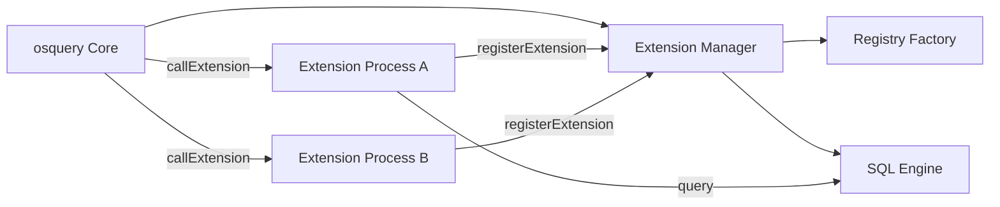
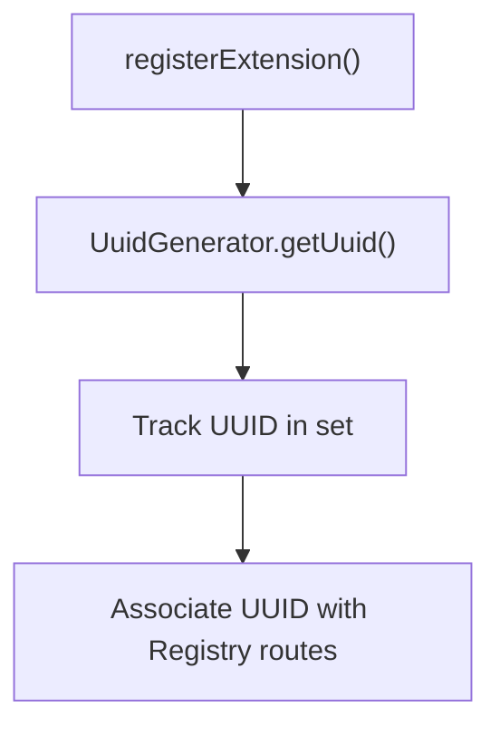
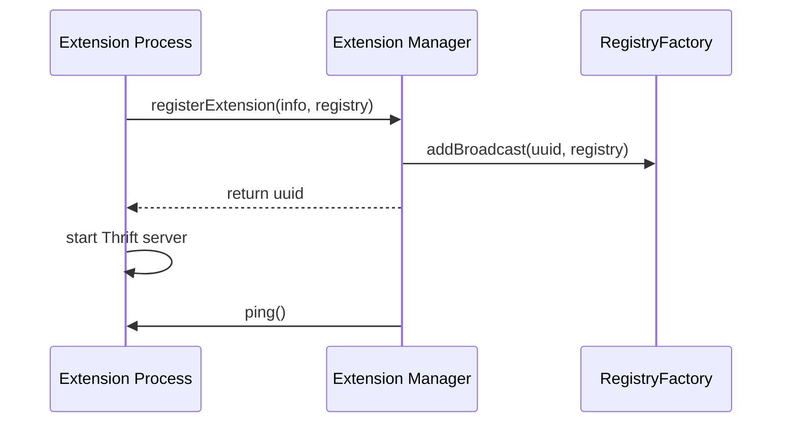
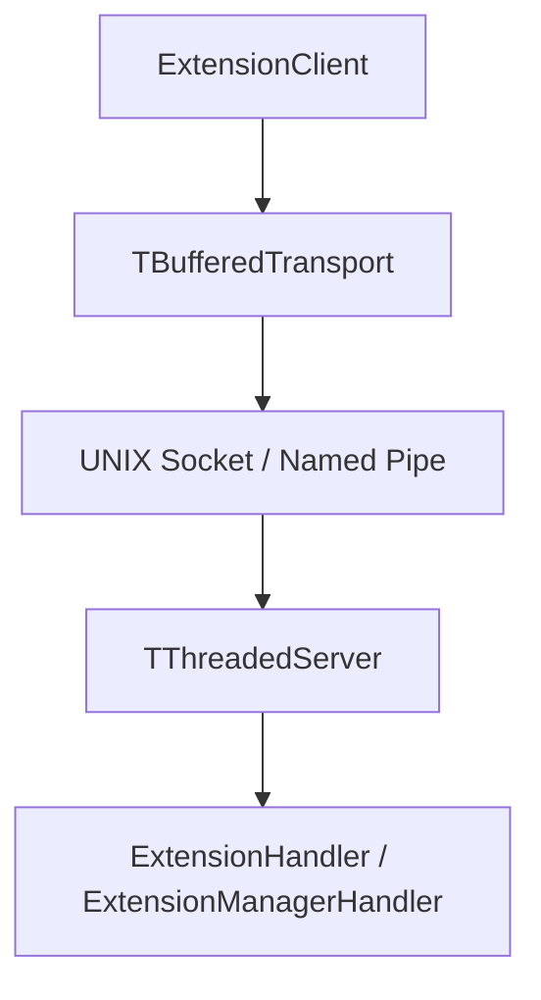
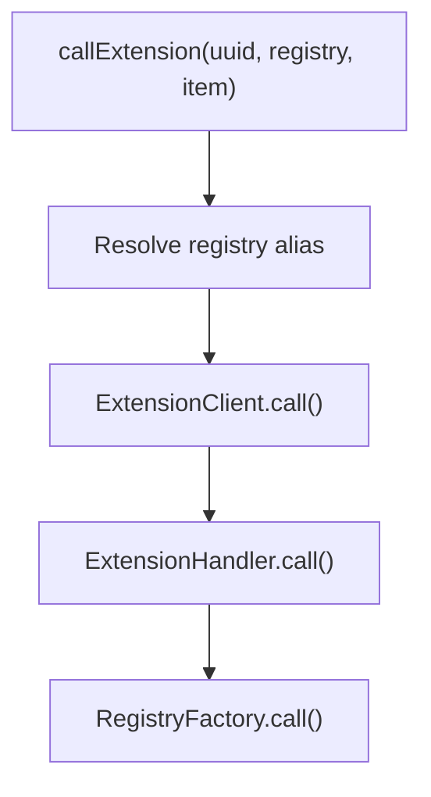
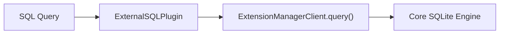
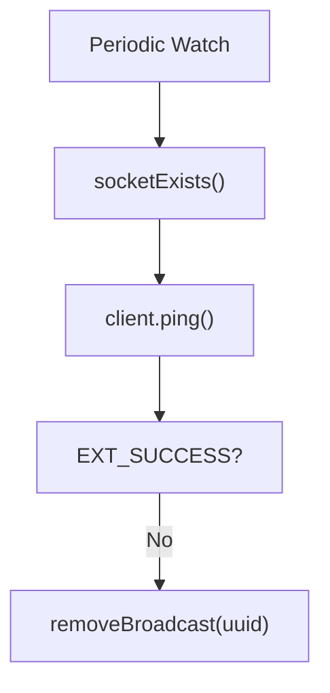
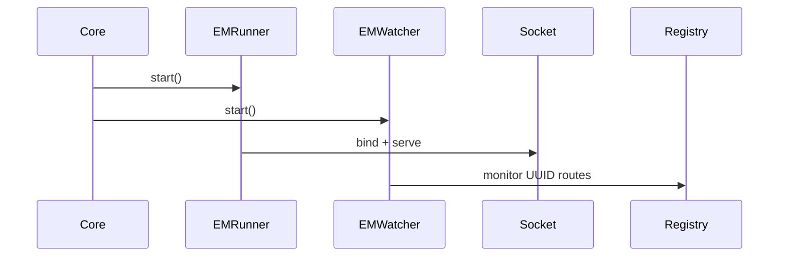

# Extensions Framework

The **Extensions Framework** enables osquery to be extended at runtime using external processes that register new plugins, virtual tables, loggers, and configuration providers.

Instead of statically linking all functionality into the core daemon, the Extensions Framework introduces a **manager–extension architecture** based on UNIX domain sockets (or Windows named pipes) and Apache Thrift RPC. This allows:

- Dynamic plugin registration
- Isolation of extension failures from core
- SDK compatibility enforcement
- Distributed development of custom tables and plugins

This module acts as the runtime bridge between:

- The core registry and SQL engine
- External extension processes
- Thrift-based IPC transport
- Plugin routing and health monitoring

---

## High-Level Architecture

At runtime, osquery operates with a single **Extension Manager** (in core) and zero or more **Extension processes**.



### Core Responsibilities

| Component | Responsibility |
|------------|---------------|
| Extension Manager | Accepts registrations and routes plugin calls |
| Extension Runner | Hosts Thrift server inside extension process |
| Extension Client | Performs RPC calls over socket |
| Watchers | Monitor health and enforce shutdown policies |
| RegistryFactory | Maps UUIDs to plugin routes |

---

## Key Concepts

### 1. ExtensionInfo

Defined in `extensions.h`.

```text
struct ExtensionInfo {
  std::string name;
  std::string version;
  std::string sdk_version;
  std::string min_sdk_version;
};
```

This metadata is exchanged during registration and used to:

- Enforce SDK compatibility
- Prevent duplicate extension names
- Track active UUIDs

Each extension is assigned a transient **RouteUUID** at registration time.

---

### 2. UUID Management

`UuidGenerator` ensures each extension receives a unique 16-bit identifier.



When deregistered, the UUID is removed and may be reused later.

---

### 3. Extension Registration Flow

The lifecycle of an extension:



Steps:

1. Extension connects to manager socket.
2. Sends metadata and registry routes.
3. Manager checks:
   - Duplicate names
   - SDK compatibility
   - Route conflicts
4. UUID assigned.
5. Registry broadcast stored.
6. Extension starts serving requests.

---

## Thrift Communication Layer

The Extensions Framework uses Apache Thrift for IPC.

### Server Components

- `ExtensionRunnerInterface`
- `ExtensionRunner`
- `ExtensionManagerRunner`
- `ImplExtensionRunner`

### Client Components

- `ExtensionClient`
- `ExtensionManagerClient`
- `ImplExtensionClient`



### RPC Methods

From the Thrift IDL (`osquery_types.h`):

- `ping()`
- `call(registry, item, request)`
- `registerExtension()`
- `deregisterExtension()`
- `query()`
- `getQueryColumns()`

Extension return codes are defined as:

```text
EXT_SUCCESS = 0
EXT_FAILED  = 1
EXT_FATAL   = 2
```

---

## Registry Integration

The Extensions Framework integrates directly with the internal Registry system.

When an extension registers:

- Its `ExtensionRegistry` (map of registry → routes) is added via `RegistryFactory::addBroadcast()`
- Routes are associated with its UUID

When a plugin is invoked:



This enables:

- Virtual tables defined in extensions
- Logger plugins in extensions
- Config plugins in extensions
- Distributed plugins

See related modules for deeper context:

- [SQL Core and Virtual Tables](../sql-core-and-virtual-tables/sql-core-and-virtual-tables.md)
- [Config Plugins](../config-plugins/config-plugins.md)
- [Distributed Querying](../distributed-querying/distributed-querying.md)

---

## External SQL Plugin

The `ExternalSQLPlugin` allows core SQL queries to be routed through the Extension Manager.

This enables:

- Extensions to expose virtual tables
- Remote query execution via extensions



Column metadata retrieval is also proxied via `getQueryColumns()`.

---

## Watchers and Health Monitoring

Two watcher types maintain system stability:

### 1. ExtensionWatcher

Used inside extensions to monitor core.

- Pings Extension Manager
- Optionally exits if manager disappears
- Ensures extension does not orphan itself

### 2. ExtensionManagerWatcher

Used inside core to monitor extensions.

- Iterates registered UUIDs
- Checks socket existence
- Pings extension
- Removes broadcast routes on failure



This guarantees stale or crashed extensions do not leave broken registry routes.

---

## Autoloading Extensions

Extensions can be automatically loaded using CLI flags:

- `--extensions_autoload`
- `--extensions_require`
- `--extensions_timeout`

Autoload behavior:

1. Read newline-delimited extension paths
2. Validate file permissions
3. Validate binary extension (.ext, .exe)
4. Spawn extension
5. Wait for registration

Safety checks include:

- Directory ownership validation
- File existence
- SDK compatibility

---

## Extension Manager Startup

The core starts the manager via:

- `startExtensionManager()`
- `ExtensionManagerRunner`
- `ExtensionManagerWatcher`

Startup sequence:



If `--disable_extensions` is set, the entire subsystem is bypassed.

---

## Failure Handling Model

The Extensions Framework isolates failures using:

- Separate processes
- Thrift transport boundaries
- Watcher-based teardown
- Registry broadcast removal

Failure scenarios:

| Scenario | Behavior |
|-----------|----------|
| Extension crash | Manager removes UUID routes |
| Manager crash | ExtensionWatcher triggers shutdown |
| Duplicate name | Registration rejected |
| SDK mismatch | Registration rejected |
| Socket removed | Extension terminated |

---

## Interaction With Other Modules

The Extensions Framework integrates tightly with:

- [Core Init and Runtime](../core-init-and-runtime/core-init-and-runtime.md)
- [SQL Core and Virtual Tables](../sql-core-and-virtual-tables/sql-core-and-virtual-tables.md)
- [Config Plugins](../config-plugins/config-plugins.md)
- [Distributed Querying](../distributed-querying/distributed-querying.md)

It provides the IPC and registration substrate that allows those systems to be extended dynamically.

---

## Design Characteristics

### ✅ Process Isolation
Extensions run as separate processes.

### ✅ Runtime Plugin Injection
Plugins can be added without recompiling core.

### ✅ SDK Version Enforcement
Ensures forward/backward compatibility boundaries.

### ✅ Health Monitoring
Bidirectional watchers prevent orphaned state.

### ✅ Transport Abstraction
Thrift implementation encapsulated via PIMPL (`ImplExtensionRunner`, `ImplExtensionClient`).

---

# Summary

The **Extensions Framework** transforms osquery from a statically compiled system into a dynamically extensible platform.

It introduces:

- Extension Manager
- Extension processes
- Thrift-based IPC
- UUID-based route isolation
- Registry broadcast integration
- Health watchers
- SQL and plugin routing

This module is foundational for enabling custom tables, loggers, config providers, and distributed query systems while preserving process isolation and runtime safety.