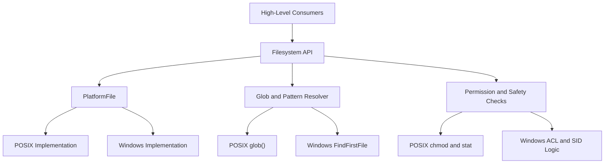
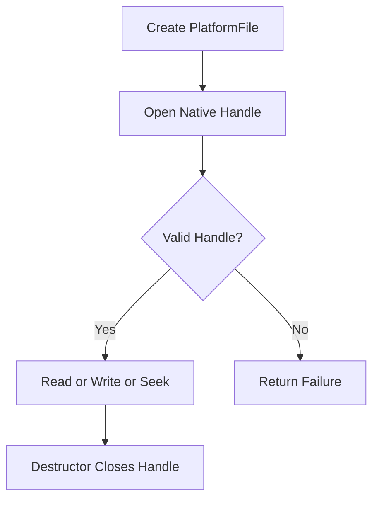
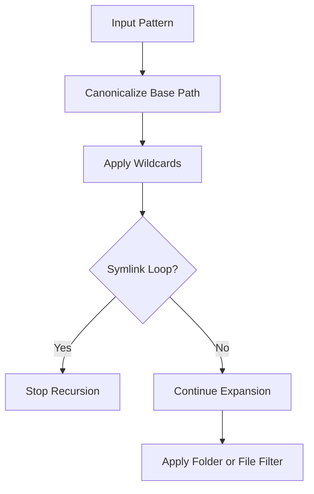
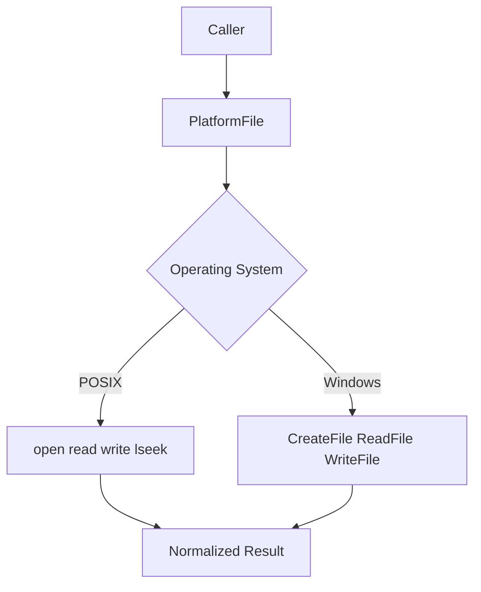

# Filesystem And Fileops Core

## Overview

The **Filesystem And Fileops Core** module provides the cross-platform abstraction layer for file system access, file metadata inspection, permissions handling, and glob-based path resolution within osquery.

It unifies POSIX and Windows behaviors behind a common interface so that higher-level components (SQL tables, extensions, configuration loaders, logging, and distributed features) can interact with files and directories in a platform-agnostic way.

At its heart is the `PlatformFile` abstraction, supported by platform-specific implementations and a set of helper utilities for:

- File open, read, write, seek, and size operations
- Permission and ownership validation
- Safe execution and module loading checks
- Globbing and recursive path resolution
- Cross-platform `stat`-like metadata retrieval
- Secure handling of sockets and temporary directories

---

## Architectural Overview

The module is structured around a portable interface with OS-specific backends.

### Design Principles

1. **Single Logical Interface** – `PlatformFile` and `platform*` helpers hide OS differences.
2. **Security First** – Explicit safe-permission validation before executing or loading files.
3. **Non-blocking Support** – Emulated asynchronous semantics across platforms.
4. **Controlled Resource Usage** – Read limits and block-based file reading.
5. **Globbing Compatibility** – Approximate POSIX glob behavior on Windows.

---

## Core Components

### 1. AsyncEvent

**Component:** `osquery.osquery.filesystem.fileops.AsyncEvent`

`AsyncEvent` encapsulates Windows asynchronous I/O state. It is used to simulate POSIX-style non-blocking file semantics on Windows using the overlapped I/O API.

Responsibilities:

- Maintain `OVERLAPPED` structure
- Track active asynchronous reads
- Manage temporary buffers
- Detect incomplete I/O operations

On POSIX systems, non-blocking behavior relies on `O_NONBLOCK` and `EAGAIN`.

---

### 2. PlatformTime

**Component:** `osquery.osquery.filesystem.fileops.PlatformTime`

`PlatformTime` abstracts access and modification timestamps across platforms:

- POSIX: `timeval`
- Windows: `FILETIME`

Used by `PlatformFile::getFileTimes()` to normalize time retrieval.

---

### 3. stat Implementations

Components:

- `osquery.osquery.filesystem.fileops.stat`
- `osquery.osquery.filesystem.filesystem.stat`
- `osquery.osquery.filesystem.posix.fileops.stat`

The module provides layered metadata access:

- POSIX: `lstat`, `fstat`, `struct stat`
- Windows: `platformStat` populating `WINDOWS_STAT`

Windows-specific metadata includes:

- File ID and inode mapping
- SID-based UID/GID translation
- NTFS attributes
- Version information
- Original filename from version resource

This allows higher-level SQL tables (e.g., file tables) to present consistent schemas.

---

### 4. WindowsFindFiles

**Component:** `osquery.osquery.filesystem.windows.fileops.WindowsFindFiles`

Encapsulates `FindFirstFileW` and `FindNextFileW` logic to enumerate directory contents.

Used internally by the Windows glob implementation to:

- Enumerate matching directories
- Apply brace and wildcard expansions
- Normalize returned paths

---

## PlatformFile Abstraction

`PlatformFile` is the central class for file I/O.

### Responsibilities

- Open files using portable mode flags
- Support read, write, seek, and size operations
- Detect special files
- Track pending non-blocking operations
- Validate ownership and permissions
- Provide access to native file handles

### Mode Abstraction

Portable flags are defined to emulate cross-platform open modes:

- `PF_READ`
- `PF_WRITE`
- `PF_CREATE_NEW`
- `PF_OPEN_EXISTING`
- `PF_NONBLOCK`
- `PF_APPEND`

These are translated internally into:

- POSIX: `open()` flags (`O_RDONLY`, `O_CREAT`, etc.)
- Windows: `CreateFileW()` access masks and disposition flags

### Lifecycle

---

## File Reading and Writing

### Controlled Reads

`readFile()` enforces a configurable maximum read size.

Key behaviors:

- Uses non-blocking mode when supported
- Reads in blocks when file size unknown
- Aborts if size exceeds configured limit
- Supports streaming via predicate callback

This prevents excessive memory usage and improves resilience.

### Writing

`writeTextFile()`:

- Opens file with requested permissions
- Applies `platformChmod()` to enforce mode
- Writes full content
- Verifies byte counts

---

## Globbing and Path Resolution

The module implements a portable glob engine.

### POSIX

- Uses native `glob()`
- Supports `GLOB_TILDE`, `GLOB_MARK`, `GLOB_BRACE`

### Windows

- Converts glob to regex when needed
- Uses `FindFirstFileW`
- Implements brace expansion heuristics
- Emulates tilde expansion via `USERPROFILE`

### Recursive Globs

Double-star patterns (`**`) are expanded iteratively with loop detection.

---

## Permission and Safety Model

Security-sensitive logic ensures that executables and modules are safe to load.

### Ownership Checks

- `isOwnerRoot()`
- `isOwnerCurrentUser()`

On Windows, this maps to SID comparisons for:

- Administrators
- Local System

### Executable and Safe Permissions

`hasSafePermissions()` verifies:

- No unsafe write permissions
- Parent directory is protected
- File not world-writable

On Windows, this involves:

- Parsing DACLs
- Detecting allow-write ACEs
- Ensuring deny precedence where required

### Safe Database Permissions

`platformSetSafeDbPerms()` enforces restricted access:

- POSIX: `0700`
- Windows: Full control to SYSTEM and Administrators only

---

## Directory and Path Utilities

The module provides portable utilities for:

- `pathExists()`
- `isDirectory()`
- `createDirectory()`
- `removePath()`
- `movePath()`
- `platformAccess()`
- `platformIsTmpDir()`
- `platformIsFileAccessible()`

These functions abstract:

- `boost::filesystem`
- POSIX `stat()` and `access()`
- Windows ACL-based access checks

---

## Socket Handling

`socketExists()` abstracts UNIX domain sockets and Windows named pipes.

Behavior differs:

- POSIX: filesystem path existence + writability
- Windows: `WaitNamedPipeW()` with timeout

This is critical for extension manager communication.

---

## Home and System Directory Resolution

`getHomeDirectory()` and `getSystemRoot()` normalize:

- POSIX: `$HOME`, `/`
- Windows: `USERPROFILE`, Windows directory

`osqueryHomeDirectory()` ensures a writable `.osquery` directory or falls back to a temporary directory.

---

## Cross-Platform I/O Flow

---

## Integration Within osquery

Filesystem And Fileops Core underpins:

- SQL virtual tables accessing files
- Configuration loaders reading JSON and packs
- Logging output targets
- Extension manager sockets
- Distributed query artifact access
- Safe executable and module loading

By isolating OS-specific complexity in this module, the rest of the system can rely on consistent file semantics and robust security checks.

---

## Summary

The **Filesystem And Fileops Core** module is the portability and safety backbone of osquery’s file interaction layer.

It provides:

- Unified file I/O abstraction
- Cross-platform metadata retrieval
- Robust permission validation
- Secure globbing and path expansion
- Defensive read limits and safe directory checks

Through careful emulation of POSIX semantics on Windows and strict permission enforcement, it ensures reliable and secure file operations across supported operating systems.
