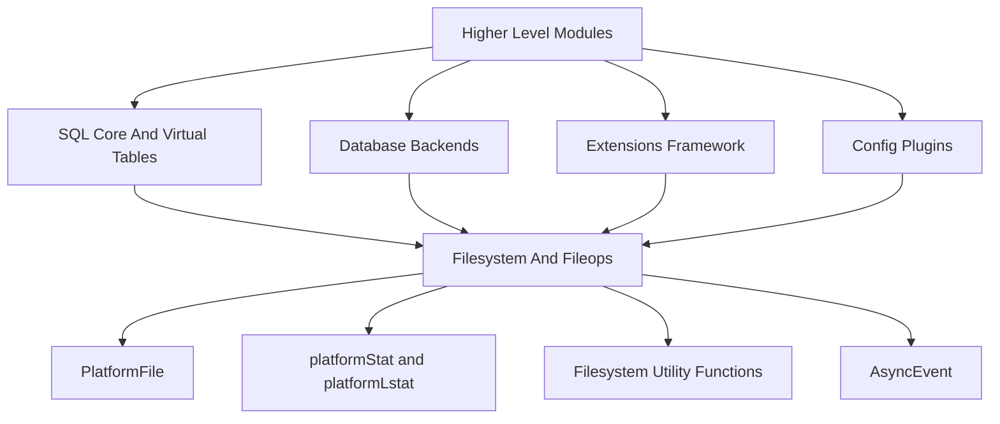
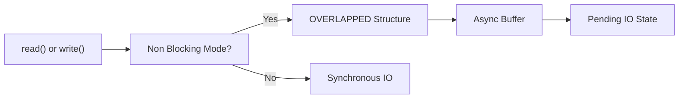
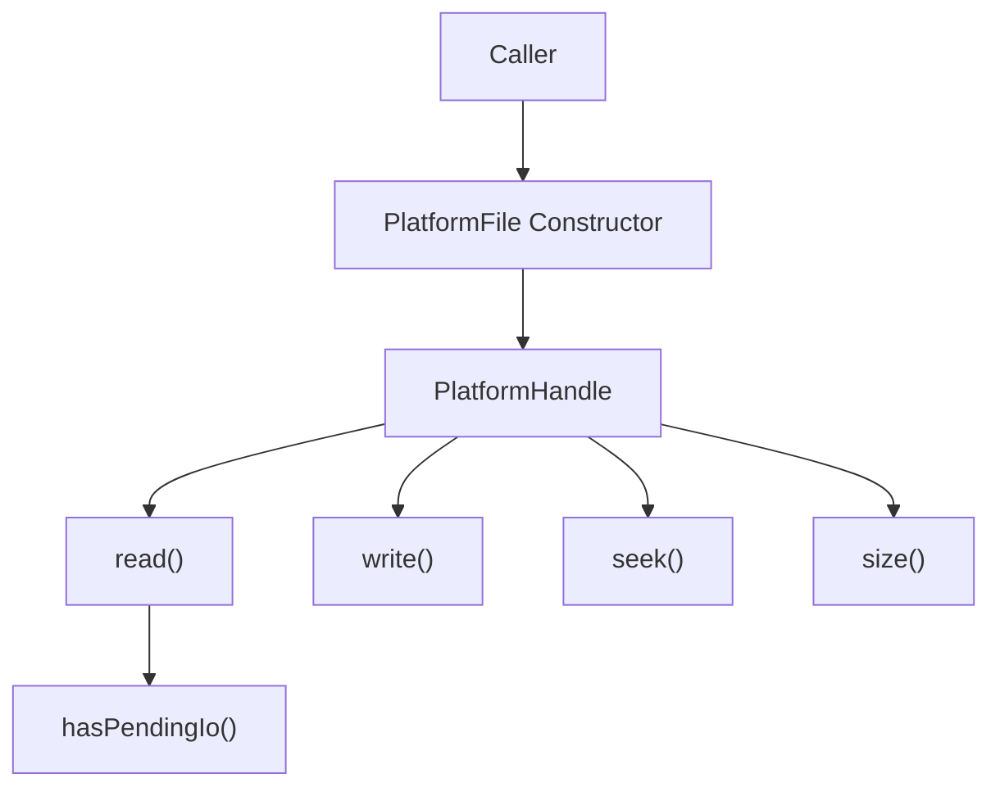
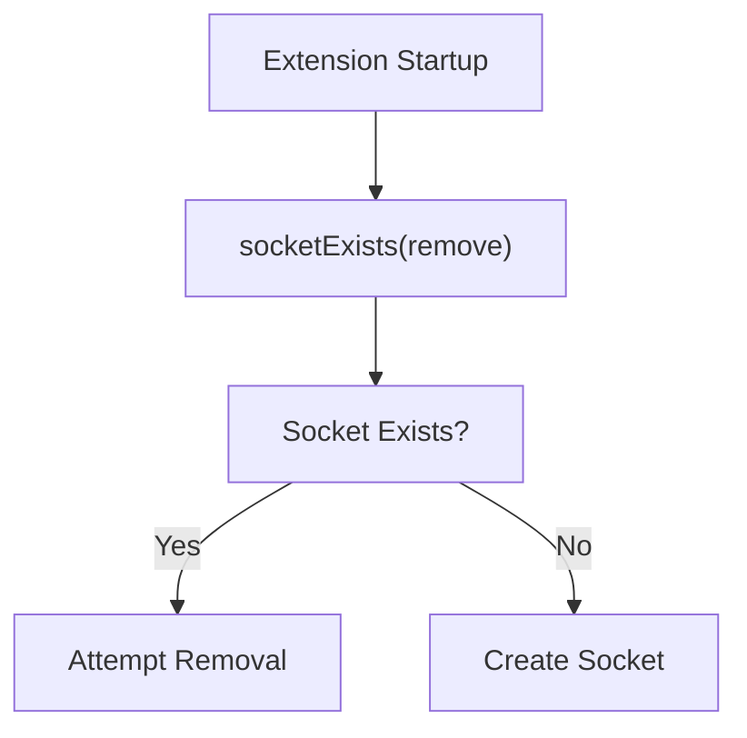
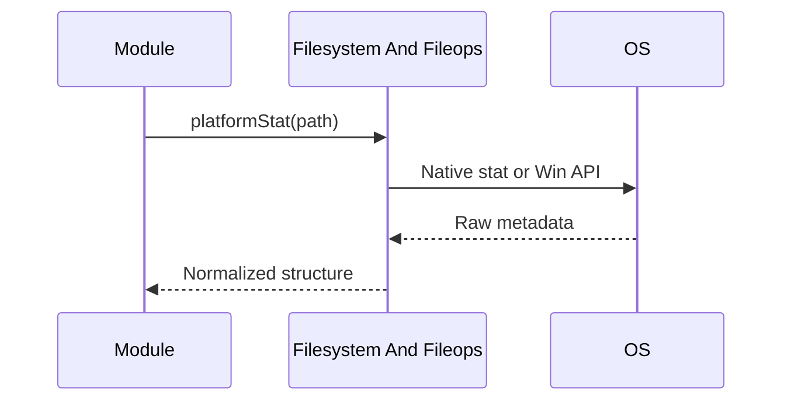
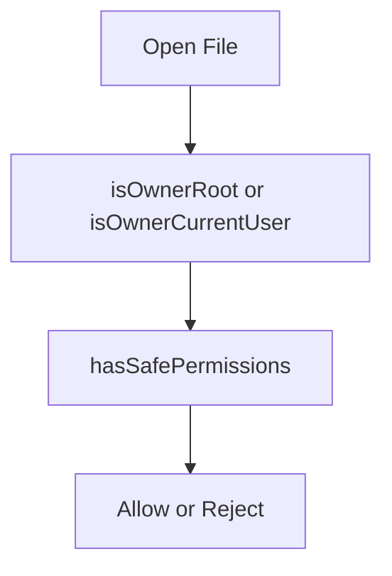

# Filesystem And Fileops

The **Filesystem And Fileops** module provides a cross-platform abstraction layer for file system interactions within the osquery runtime. It normalizes differences between POSIX and Windows APIs, offering consistent file metadata access, file I/O primitives, permission handling, globbing, and environment-based path resolution.

This module is foundational to multiple higher-level components such as:

- [SQL Core And Virtual Tables](../sql-core-and-virtual-tables/sql-core-and-virtual-tables.md) – for file-backed virtual tables and metadata inspection
- [Database Backends](../database-backends/database-backends.md) – for safe database file access and permission enforcement
- [Extensions Framework](../extensions-framework/extensions-framework.md) – for socket lifecycle management
- [Hashing](../hashing/hashing.md) – for file content hashing
- [Config Plugins](../config-plugins/config-plugins.md) – for filesystem-based configuration loading

It ensures that file operations behave consistently across platforms while respecting security constraints and OS-specific semantics.

---

## 1. Architectural Overview

The module is organized around three major responsibilities:

1. **Platform Abstraction** – Unified interfaces for file descriptors, time, permissions, and stat structures.
2. **File I/O Abstraction** – The `PlatformFile` class encapsulates safe file reading, writing, and seeking.
3. **Filesystem Utilities** – Cross-platform helpers such as globbing, permission validation, temporary directory detection, and socket checks.

The abstraction layer shields upper modules from platform-specific details such as:

- Windows `HANDLE` vs POSIX file descriptor
- `FILETIME` vs `timeval`
- ACL-based permissions vs POSIX mode bits
- Named pipes vs UNIX sockets

---

## 2. Core Components

### 2.1 Platform Types

The module defines normalized platform aliases:

- `PlatformHandle` – `HANDLE` on Windows, `int` on POSIX
- `PlatformTimeType` – `FILETIME` on Windows, `timeval` on POSIX
- `PlatformTime` – Wrapper storing access and modification timestamps

These abstractions are used throughout the runtime to avoid scattering conditional compilation across the codebase.

---

### 2.2 WINDOWS_STAT

`WINDOWS_STAT` is a Windows-specific structure that emulates the POSIX `stat` structure while adding richer Windows metadata.

It includes:

- File identifiers (`file_id`, `inode`)
- Ownership (`uid`, `gid`)
- Timestamps (`atime`, `mtime`, `ctime`, `btime`)
- Version metadata (`product_version`, `file_version`)
- NTFS attributes and volume information

This structure is populated through `platformStat()` and allows SQL tables and logging modules to expose file metadata consistently.

On POSIX systems, standard `stat` and `lstat` are used via `platformLstat()`.

---

### 2.3 AsyncEvent (Windows)

`AsyncEvent` simulates POSIX-style non-blocking I/O using Windows asynchronous APIs.

Key fields:

- `OVERLAPPED overlapped_`
- `std::unique_ptr<char[]> buffer_`
- `bool is_active_`

Limitations:

- Write cancellation may interrupt ongoing reads
- Emulates semantics but cannot fully replicate POSIX guarantees

This component is internal to `PlatformFile` on Windows.

---

## 3. PlatformFile Class

`PlatformFile` is the central abstraction for file I/O.

### Responsibilities

- Open files with unified flags
- Read and write bytes
- Seek operations
- Inspect size
- Validate ownership and permissions
- Detect executable status
- Provide file times

### File Mode Abstraction

Instead of exposing raw OS flags, the module defines:

- `PF_READ`
- `PF_WRITE`
- `PF_CREATE_NEW`
- `PF_CREATE_ALWAYS`
- `PF_OPEN_EXISTING`
- `PF_OPEN_ALWAYS`
- `PF_TRUNCATE`
- `PF_NONBLOCK`
- `PF_APPEND`

These are translated internally into the appropriate POSIX or Windows flags.

### Ownership and Security Checks

- `isOwnerRoot()` – Validates administrative ownership
- `isOwnerCurrentUser()` – Confirms ownership
- `hasSafePermissions()` – Ensures restrictive write semantics

These checks are critical for:

- Database file safety in [Database Backends](../database-backends/database-backends.md)
- Configuration integrity in [Config Plugins](../config-plugins/config-plugins.md)

---

## 4. Filesystem Utility Functions

Beyond file descriptors, the module provides higher-level filesystem helpers.

### 4.1 Permission Handling

- `platformChmod()` – Cross-platform chmod approximation
- `platformSetSafeDbPerms()` – Enforces restrictive DB permissions
- `platformAccess()` – Abstracted access check
- `describeBSDFileFlags()` – Human-readable BSD flags

Windows ACL ordering issues are handled explicitly to approximate POSIX semantics.

---

### 4.2 Path and Environment Utilities

- `getHomeDirectory()` – Multi-strategy resolution (environment variables first)
- `getSystemRoot()` – Returns root path (`/` on POSIX)
- `windowsShortPathToLongPath()` – Expands 8.3 paths
- `windowsGetVersionInfo()` – Retrieves version metadata

These are frequently used by configuration loading and extension management.

---

### 4.3 Globbing

`platformGlob()` approximates POSIX glob behavior on Windows.

Supported features:

- Tilde expansion (basic)
- Brace expansion (regex-backed)
- Marking behavior

This is essential for file-based table expansion in [SQL Core And Virtual Tables](../sql-core-and-virtual-tables/sql-core-and-virtual-tables.md).

---

### 4.4 Socket and Pipe Management

- `socketExists()` – Checks and optionally removes UNIX sockets or named pipes
- `platformIsTmpDir()` – Detects temporary directory
- `platformIsFileAccessible()` – Unified accessibility check

These are heavily used by the [Extensions Framework](../extensions-framework/extensions-framework.md) during startup and teardown.

---

## 5. Metadata Flow in the System

When a file is queried or inspected:

This normalized metadata may then:

- Be hashed via [Hashing](../hashing/hashing.md)
- Be emitted in logs via [Query Execution And Logging](../query-execution-and-logging/query-execution-and-logging.md)
- Be stored by [Database Backends](../database-backends/database-backends.md)

---

## 6. Security Model Integration

The module enforces security invariants across the runtime:

- Restrictive DB permissions
- Ownership verification
- Executable bit inspection
- ACL-aware Windows behavior

This prevents:

- Unauthorized modification of query packs
- Tampering with database files
- Unsafe extension socket exposure

---

## 7. Cross-Module Relationships

The Filesystem And Fileops module acts as infrastructure for:

- **Query evaluation** → file-backed virtual tables
- **Configuration loading** → filesystem-based config plugins
- **Extension IPC** → socket existence and cleanup
- **Database persistence** → safe file permissions
- **Hash computation** → raw file reads

It is intentionally dependency-light and focused strictly on OS abstraction and safe filesystem manipulation.

---

## 8. Summary

The **Filesystem And Fileops** module provides:

- Cross-platform file descriptor abstraction
- Normalized file metadata
- Permission and ACL emulation
- Globbing and path utilities
- Socket lifecycle management
- Safe database permission enforcement

It is a foundational infrastructure layer that ensures consistent, secure, and portable filesystem behavior across the entire osquery runtime.
